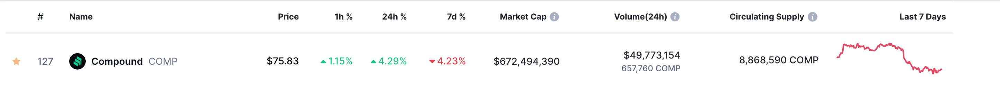
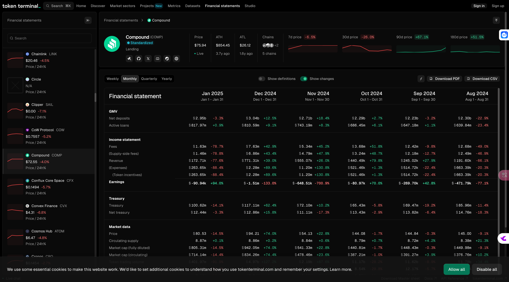

+++
title = "compound_study"
description = ""
date = 2025-01-10 14:13:38+08:00
[taxonomies]
categories = [""]
tags = [""]
+++

<!-- more -->

<https://defillama.com/protocol/compound-finance#information>

coinmarketcap

<https://coinmarketcap.com/currencies/compound/#About>



Compound是首个提出资金池借贷的DeFi协议，允许主流加密资产间相互借贷，但是V3版本则一改之前的通用借贷，根据基础资产的不同将各个资产池隔离开来，目的也是为了从架构层面隔离资金池风险，避免因单个资产的潜在风险而为协议造成不可挽回的损失。

具体来说就是，在Compound V2中，协议允许用户自由存入（抵押）或借出协议所支持的资产，抵押资产很好理解，基础资产就是用户借出的资产。Compound V3中每个池中将仅有唯一的基础资产，但是抵押资产不受限制。目前V3首个上线的基础资产池是USDC，即允许用户质押主流加密资产借出稳定币USDC。

<https://tokenterminal.com/explorer/financial-statements/compound>



在Token Terminal的计算中，协议收入（Revenue）=借款支付的费用（Fees）-存款利息（Supply-side fees），Earnings为协议收入-流动性激励。

以2014年12月为例：

Revenue = Fees - Supply-side fees

Revenue = 7.63m - 6.86m = 0.77m = 771.31k

**Earnings** = Revenue - Token incentives =  771.31k - 2.28m =  -**1.51m**

**目前协议收入远不能覆盖代币激励支出**。

Compound代币为COMP，于2020年6月正式上线，总量1,000万枚。

COMP作为Compound协议中的治理代币，主要用途就是**参与协议治理（提案投票）以及用作借贷市场的流动性激励**。

2022年4月之后，Compound更改代币激励模型，逐渐降低COMP奖励

在 **Compound** 协议中，利率模型的设计决定了借贷市场中存款利率和借款利率的计算方式。Compound 的利率模型主要分为 **直线型（Linear）** 和 **拐点型（Exponential）** 两种，目的是根据市场供需情况和风险调整利率。下面是这两种模型的详细说明：

### 1. **直线型利率模型（Linear Interest Rate Model）**

**直线型模型** 是一种较为简单的利率模型，通常在需求和供应的关系较为平稳时使用。

- **基本概念**：在这种模型中，利率随着借款和存款的数量（或供应量和需求量）按线性关系增长。也就是说，借款利率和存款利率的变化是逐步的、线性的，而不会有快速的激增或下降。

- **优点**：

  - 模型简单，容易理解和实现。
  - 适用于市场需求和供应较为平稳的情况。

- **缺点**：

  - 对于流动性需求大或者市场波动性较高的资产，可能会导致利率变化过于平缓，无法有效反映市场的急剧变化。

- **计算公式**：

  - 在 Compound v2 中，`supplyRate`（存款利率）和 `borrowRate`（借款利率）通过线性函数计算。公式类似于：

    ```
    supplyRate = baseRate + (utilizationRate * slope1)
    borrowRate = baseRate + (utilizationRate * slope2)
    ```

    其中，`utilizationRate`是市场的资产使用率，`baseRate` 是基准利率，`slope1`和 `slope2` 是根据市场情况设定的参数。

### 2. **拐点型利率模型（Exponential Interest Rate Model）**

**拐点型模型** 是一个更加复杂的模型，它采用指数型的关系来计算借款利率和存款利率。在这种模型中，利率变化是非线性的，并且在达到某个临界点后，利率会迅速增加。

- **基本概念**：在这种模型中，随着借款需求增加，利率会呈指数型增长。拐点通常出现在市场开始接近最大借贷能力时，这时的利率急剧上升，从而鼓励更多的供应者提供流动性。

- **优点**：

  - 更适应波动性较大的市场。随着借款需求的增加，利率能够迅速上涨，控制借款人对平台的需求。
  - 在市场过热时能够通过急剧提高利率来抑制过度借贷，保证平台的稳定。

- **缺点**：

  - 模型复杂，计算和调节相对较为困难。
  - 如果参数设置不当，可能会导致不稳定的利率波动。

- **计算公式**：

  - 在 Compound v3中，`supplyRate`和 `borrowRate`的计算涉及指数型的关系。公式可能类似于：

    ```
    supplyRate = baseRate + (exp(utilizationRate) * slope1)
    borrowRate = baseRate + (exp(utilizationRate) * slope2)
    ```

    这里，`exp(utilizationRate)`是指数函数，表示市场需求增加时，利率的增长速度会变得非常快。

### 对比总结

| 特性             | 直线型利率模型                   | 拐点型利率模型                                   |
| ---------------- | -------------------------------- | ------------------------------------------------ |
| **利率变化方式** | 线性增加                         | 指数型增加                                       |
| **适用场景**     | 市场需求和供应较为平稳，变化较小 | 市场波动较大，需求高峰时希望抑制借款需求         |
| **复杂度**       | 简单，易于理解和实现             | 较为复杂，计算难度大，调节较为困难               |
| **灵活性**       | 灵活性较差，适应性较弱           | 灵活性强，能够应对波动性大的市场                 |
| **优点**         | 实现简单，便于调节               | 能更好地应对需求激增时的市场压力，抑制借款人行为 |
| **缺点**         | 可能无法适应市场快速变化         | 需要谨慎调整参数，防止利率过快波动               |

### 总结

- **直线型模型** 更适用于稳定且需求较为均衡的市场，能够为存款人和借款人提供一个相对平稳的利率。
- **拐点型模型** 适用于市场波动性较大、需求和供应变化较快的市场，能够在市场需求增加时提供更加激进的利率调整机制，从而防止市场过热。

在 **Compound** 协议中，通常会根据不同的市场情况选择使用哪种利率模型。

## 参考

- <https://juejin.cn/post/6974005248947929124>
-
