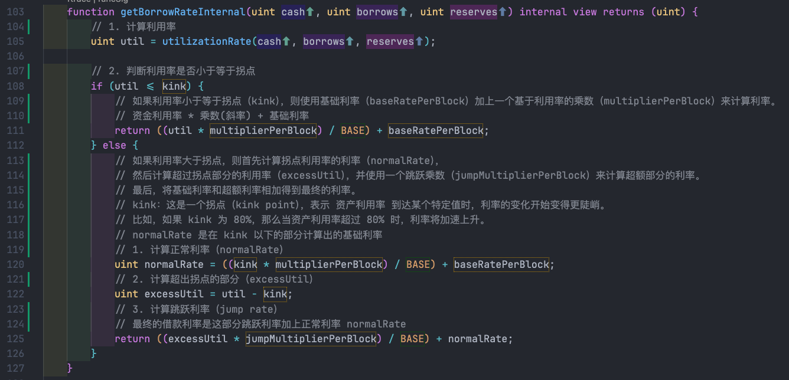

+++
title = "Compound 研究"
description = "Compound 研究"
date = 2025-01-10 14:13:38+08:00
[taxonomies]
categories = ["Web3", "DeFi"]
tags = ["Web3", "DeFi"]
+++

<!-- more -->
# Compound 研究

<https://defillama.com/protocol/compound-finance#information>

coinmarketcap

<https://coinmarketcap.com/currencies/compound/#About>

Compound是首个提出资金池借贷的DeFi协议，允许主流加密资产间相互借贷，但是V3版本则一改之前的通用借贷，根据基础资产的不同将各个资产池隔离开来，目的也是为了从架构层面隔离资金池风险，避免因单个资产的潜在风险而为协议造成不可挽回的损失。

具体来说就是，在Compound V2中，协议允许用户自由存入（抵押）或借出协议所支持的资产，抵押资产很好理解，基础资产就是用户借出的资产。Compound V3中每个池中将仅有唯一的基础资产，但是抵押资产不受限制。目前V3首个上线的基础资产池是USDC，即允许用户质押主流加密资产借出稳定币USDC。

<https://tokenterminal.com/explorer/financial-statements/compound>

在Token Terminal的计算中，协议收入（Revenue）=借款支付的费用（Fees）-存款利息（Supply-side fees），Earnings为协议收入-流动性激励。

以2014年12月为例：

Revenue = Fees - Supply-side fees

Revenue = 7.63m - 6.86m = 0.77m = 771.31k

**Earnings** = Revenue - Token incentives =  771.31k - 2.28m =  -**1.51m**

**目前协议收入远不能覆盖代币激励支出**。

Compound代币为COMP，于2020年6月正式上线，总量1,000万枚。

COMP作为Compound协议中的治理代币，主要用途就是**参与协议治理（提案投票）以及用作借贷市场的流动性激励**。

2022年4月之后，Compound更改代币激励模型，逐渐降低COMP奖励

在 **Compound** 协议中，利率模型的设计决定了借贷市场中存款利率和借款利率的计算方式。Compound 的利率模型主要分为 **直线型（Linear）** 和 **拐点型（Exponential）** 两种，目的是根据市场供需情况和风险调整利率。

$$
利息 = 本金 * 利率 \\

本息 = 本金 + 本金 * 利率 = 本金 * (1 + 利率) \\
$$
假设每年的利率不一样，是浮动的，怎么计算？ 复利
$$
最终要还的本息 = 本金 * (1 + R1) * (1 + R2) * (1 + R3) ...
$$
从第五年开始借款到第十年还款，支付的本息
$$
\begin{align}
本息 &= 本金 * (1 + R6) * ... * (1 + R10) \\
\\
&= \frac{(1 + R1) * ... * (1 + R5) * (1 + R6) * ... * (1 + R10)}{(1 + R1) * ... * (1 + R5)}
\end{align}
$$
在每次发生借贷业务时，利率 Ri 会发生变化，把每次的变化都累积记录
$$
\begin{align}
\text{本息} &= \text{本金} \cdot (1 + R6) \cdot \ldots \cdot (1 + R10) \\
&= \frac{(1 + R1) \cdot \ldots \cdot (1 + R5) \cdot (1 + R6) \cdot \ldots \cdot (1 + R10)}{(1 + R1) \cdot \ldots \cdot (1 + R5)}
\end{align}
$$

$$
R0..i = (1 + R1) \cdot \ldots \cdot (1 + R5) \cdot (1 + R6) \cdot \ldots \cdot (1 + R10) \\

R0..5 = (1 + R1) \cdot \ldots \cdot (1 + R5)
$$

故本息：
$$
本息 &= 本金 \cdot  \frac{R0..i}{ R0..5 } \\
&= 本金 * \frac{Ri}{R5}
$$

这个代码段通过对资产利用率进行分段处理，分别计算在拐点（**kink**）以下和以上的借款利率：

- **kink** 以下，使用 **multiplierPerBlock** 和 **baseRatePerBlock** 来平滑增长。
- **kink** 以上，借款利率变得更加陡峭，使用 **jumpMultiplierPerBlock** 来加速利率的上升。

这种分段式的利率模型帮助 Compound 协议根据市场需求的变化，动态调整借款利率，确保在不同的市场条件下都能提供合理的利率。

## 参考

- <https://juejin.cn/post/6974005248947929124>
-
