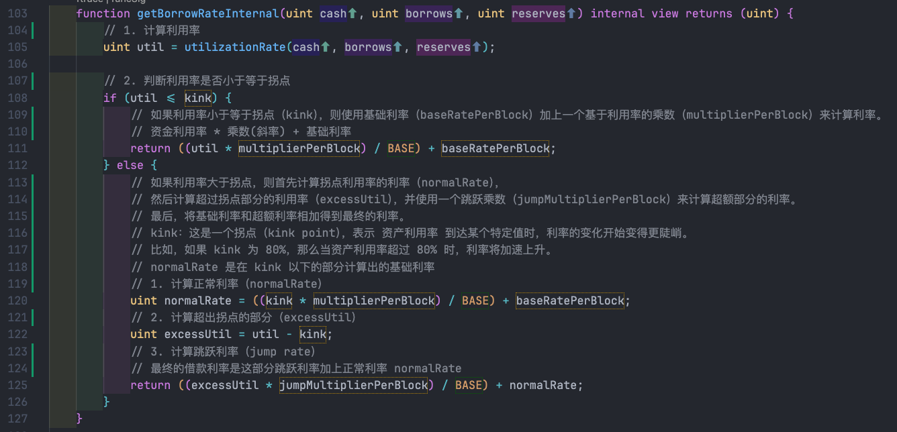

+++
title = "Compound 借款利率分析"
description = "借款利率分析"
date = 2025-01-17 17:39:41+08:00
[taxonomies]
categories = ["Web3", "DeFi", "Compound"]
tags = ["Web3", "DeFi", "Compound"]
+++

<!-- more -->
# Compound borrow rate

这个代码段通过对资产利用率进行分段处理，分别计算在拐点（**kink**）以下和以上的借款利率：

- **kink** 以下，使用 **multiplierPerBlock** 和 **baseRatePerBlock** 来平滑增长。
- **kink** 以上，借款利率变得更加陡峭，使用 **jumpMultiplierPerBlock** 来加速利率的上升。

这种分段式的利率模型帮助 Compound 协议根据市场需求的变化，动态调整借款利率，确保在不同的市场条件下都能提供合理的利率。
