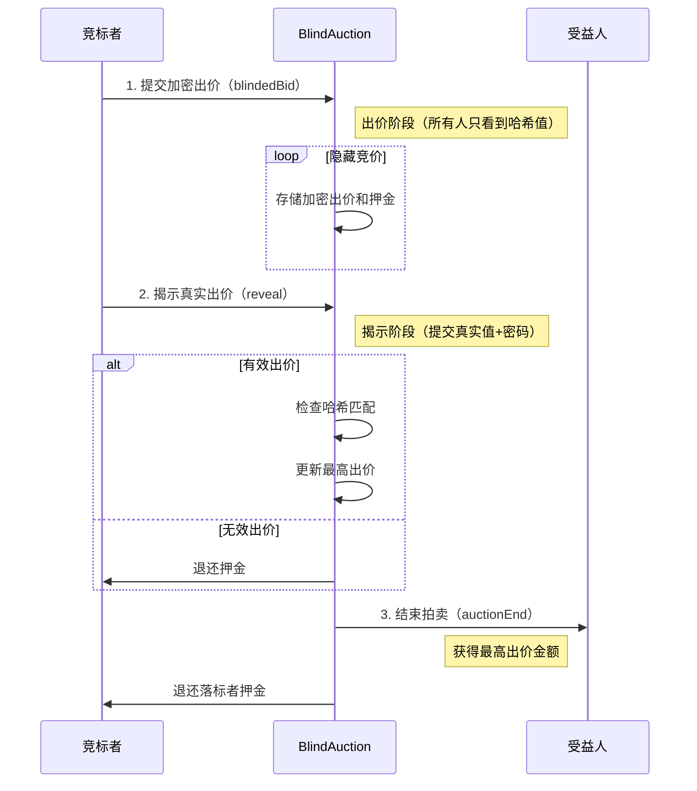
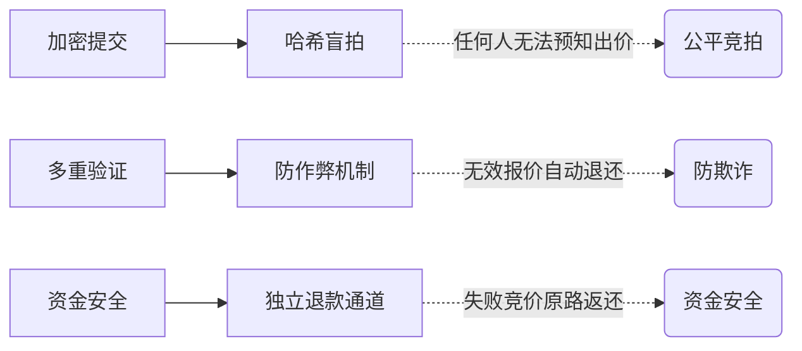

+++
title = "探索Web3新速度：Sonic高性能Layer-1上的BlindAuction智能合约实践"
description = "探索Web3新速度：Sonic高性能Layer-1上的BlindAuction智能合约实践"
date = 2025-06-09T00:42:01Z
[taxonomies]
categories = ["Web3", "Sonic", "Foundry"]
tags = ["Web3", "Sonic", "Foundry"]
+++

<!-- more -->

# 探索Web3新速度：Sonic高性能Layer-1上的BlindAuction智能合约实践

在Web3的浪潮中，Sonic以其超高吞吐量（400,000+ TPS）和亚秒级确认速度，正在重新定义区块链的性能边界。作为一款高性能EVM Layer-1区块链，Sonic为去中心化金融（DeFi）提供了无限可能。本文将带你走进Sonic生态，结合一个经典的BlindAuction（盲拍）智能合约，深入解析如何在Sonic上开发、测试和部署智能合约，体验Web3的极致速度与安全性！

Sonic是一款专为DeFi打造的高性能EVM Layer-1区块链，支持超400,000 TPS和亚秒级交易确认，结合其原生代币S的质押与治理机制，为开发者提供高效、安全的开发环境。本文通过实现一个BlindAuction智能合约，详细展示了从项目初始化、合约编写、全面测试到在Sonic测试网部署的全流程。盲拍合约通过加密出价、阶段控制和资金安全机制，保障了公平竞拍和隐私保护。测试覆盖率达100%，并成功部署于Sonic和Hoodi测试网，展现了Sonic在Web3开发中的强大潜力。

### 什么是 Sonic

Sonic 是一款高性能的 EVM Layer-1 区块链，旨在通过其速度、激励机制和世界级基础设施，支持下一代去中心化金融（DeFi）应用的发展。根据 [Sonic | The Fastest EVM Layer-1 Blockchain](https://www.soniclabs.com)，它提供超过 400,000 TPS（每秒交易量）和亚秒级确认，确保快速、安全的交易体验。

S 代币是 Sonic 的原生代币，主要用于支付交易费用、质押以保护网络、运行验证节点以及参与治理决策。根据 [Sonic $S Tokenomics Explained: Utility, Staking, and Rewards](https://www.bitrue.com/blog/sonic-s-tokenomics-explained-utility-staking-and-rewards)，这些功能增强了网络的去中心化和可持续性。

## 实操 BlindAuction 合约

### 第一步：创建项目并切换到项目目录

```bash
mcd BlindAuction  # mkdir BlindAuction && cd BlindAuction
```

### 第二步：根据模版初始化项目

```bash
forge init --template https://github.com/qiaopengjun5162/foundry-template
```

### 第三步：查看项目目录结构

```bash
BlindAuction on  main [✘!?] on 🐳 v28.2.2 (orbstack) 
➜ tree . -L 6 -I "coverage_report|lib|.vscode|out|lcov.info|bin|cache"
.
├── _typos.toml
├── CHANGELOG.md
├── cliff.toml
├── docs
│   └── readme.md
├── foundry_monad.toml
├── foundry.toml
├── LICENSE
├── README.md
├── remappings.txt
├── script
│   ├── BlindAuction.s.sol
│   └── deploy.sh
├── slither.config.json
├── src
│   └── BlindAuction.sol
├── style_guide.md
└── test
    └── BlindAuction.t.sol

5 directories, 15 files
```

### 第四步：实现合约 BlindAuction.sol

```ts
// SPDX-License-Identifier: MIT
pragma solidity ^0.8.30;

contract BlindAuction {
    struct Bid {
        bytes32 blindedBid;
        uint256 deposit;
    }

    address payable public beneficiary;
    uint256 public biddingEnd;
    uint256 public revealEnd;
    bool public ended;

    mapping(address => Bid[]) public bids;
    address public highestBidder;
    uint256 public highestBid;

    mapping(address => uint256) public lockedFunds;
    mapping(address => uint256) public pendingReturns;

    event AuctionEnded(address winner, uint256 highestBid);

    error TooEarly(uint256 time);
    error TooLate(uint256 time);
    error AuctionEndAlreadyCalled();
    error InvalidBidReveal();
    error FundsNotLockedCorrectly();

    modifier onlyBefore(uint256 time) {
        if (block.timestamp >= time) revert TooLate(time);
        _;
    }

    modifier onlyAfter(uint256 time) {
        if (block.timestamp <= time) revert TooEarly(time);
        _;
    }

    constructor(uint256 biddingTime, uint256 revealTime, address payable beneficiaryAddress) {
        if (beneficiaryAddress == address(0)) revert InvalidBidReveal();
        beneficiary = beneficiaryAddress;
        biddingEnd = block.timestamp + biddingTime;
        revealEnd = biddingEnd + revealTime;
    }

    function bid(bytes32 blindedBid) external payable onlyBefore(biddingEnd) {
        if (msg.value == 0) revert InvalidBidReveal();
        bids[msg.sender].push(Bid({blindedBid: blindedBid, deposit: msg.value}));
    }

    function reveal(uint256[] calldata values, bool[] calldata fakes, bytes32[] calldata secrets)
        external
        onlyAfter(biddingEnd)
        onlyBefore(revealEnd)
    {
        uint256 length = bids[msg.sender].length;
        require(values.length == length, "Values length mismatch");
        require(fakes.length == length, "Fakes length mismatch");
        require(secrets.length == length, "Secrets length mismatch");

        uint256 refund;
        for (uint256 i = 0; i < length; i++) {
            Bid storage bidToCheck = bids[msg.sender][i];

            (uint256 value, bool fake, bytes32 secret) = (values[i], fakes[i], secrets[i]);
            if (bidToCheck.blindedBid != keccak256(abi.encodePacked(value, fake, secret))) {
                continue;
            }
            refund += bidToCheck.deposit;
            if (!fake && bidToCheck.deposit >= value) {
                if (placeBid(msg.sender, value)) {
                    refund -= value;
                    lockedFunds[msg.sender] = value;
                }
            }
            bidToCheck.blindedBid = bytes32(0);
        }
        if (refund > 0) {
            (bool success,) = payable(msg.sender).call{value: refund}("");
            require(success, "Refund failed");
        }
    }

    function withdraw() external {
        uint256 amount = pendingReturns[msg.sender];
        if (amount > 0) {
            pendingReturns[msg.sender] = 0;
            (bool success,) = payable(msg.sender).call{value: amount}("");
            require(success, "Withdrawal failed");
        }
    }

    function auctionEnd() external onlyAfter(revealEnd) {
        if (ended) revert AuctionEndAlreadyCalled();
        ended = true;
        emit AuctionEnded(highestBidder, highestBid);

        // 只转移最高出价资金，确保资金已被锁定
        if (lockedFunds[highestBidder] != highestBid) {
            revert FundsNotLockedCorrectly();
        }
        (bool success,) = beneficiary.call{value: highestBid}("");
        require(success, "Transfer failed");
    }

    function placeBid(address bidder, uint256 value) internal returns (bool success) {
        if (value <= highestBid) {
            return false;
        }

        // 保存当前最高出价信息
        address previousHighestBidder = highestBidder;
        uint256 previousHighestBid = highestBid;

        // 更新最高出价
        highestBid = value;
        highestBidder = bidder;

        // 锁定前一个最高出价者的资金
        if (previousHighestBidder != address(0)) {
            pendingReturns[previousHighestBidder] += previousHighestBid;
        }
        return true;
    }
}

```

这个智能合约实现了一个盲拍（Blind Auction）系统，分为投标和揭示两个阶段。在**投标阶段**（`biddingEnd`截止前），参与者通过`bid`函数提交加密的出价哈希值`blindedBid`并附带资金押金。进入**揭示阶段**（`biddingEnd`到`revealEnd`），参与者调用`reveal`函数公开实际出价金额、验证码和真伪标志，合约校验哈希匹配后，若出价真实且押金充足，则激活`placeBid`更新最高出价（原最高出价者资金进入待退款`pendingReturns`）。拍卖结束后，通过`auctionEnd`将最高出价资金（需通过`lockedFunds`校验）转给受益人`beneficiary`，其他参与者可通过`withdraw`提取退款。关键特性包括：

1. **隐私保护**：投标阶段隐藏实际出价
2. **资金安全**：最高出价资金锁定机制
3. **错误处理**：自定义错误类型（如时间校验、资金验证）
4. **阶段控制**：修饰器（`onlyBefore`/`onlyAfter`）严格划分投标、揭示和结束时段

示例流程：A提交加密出价（实际100ETH）并质押120ETH → 揭示阶段A验证出价 → 若成为最高出价，100ETH被锁定、20ETH退回 → 拍卖结束受益人获得100ETH。

这是一个密封拍卖（盲拍）智能合约，核心功能是让竞标者在不暴露出价的前提下竞价。




### 三大核心阶段

#### 1. 密封出价阶段

- 竞标者提交 keccak256(真实出价+密码)
- 所有出价完全匿名（连合约都看不到真实金额）

#### 2. 揭示阶段

- 竞标者提交真实出价和密码
- 合约验证：keccak256(提交值) = 原始哈希
- 暴露伪装出价（fake bids）直接退还押金

#### 3. 结算阶段

- 最高出价转账给受益人
- 其他竞标者通过 withdraw() 取回押金




💡 就像「暗拍」游戏：

1. 所有人把出价密封在信封里提交
2. 同时开封验证真实出价
3. 只有最高出价付款，其他人拿回押金
   完美解决传统拍卖的跟拍策略问题！

## 测试合约

### 第一步：编写测试文件 BlindAuction.t.sol

```ts
// SPDX-License-Identifier: MIT
pragma solidity ^0.8.30;

import {Test, console} from "forge-std/Test.sol";
import {BlindAuction} from "../src/BlindAuction.sol";

contract BlindAuctionTest is Test {
    BlindAuction public auction;
    address payable public beneficiary = payable(address(0xBEEF));
    uint256 public constant BIDDING_TIME = 1 hours;
    uint256 public constant REVEAL_TIME = 1 hours;

    // Test accounts
    address public bidder1 = makeAddr("bidder1");
    address public bidder2 = makeAddr("bidder2");
    address public bidder3 = makeAddr("bidder3");

    /**
     * Account bidder1 = makeAccount("bidder1");
     * Account bidder2 = makeAccount("bidder2");
     * Account bidder3 = makeAccount("bidder3");
     *
     *
     * // 使用账户生成器创建可追踪的测试账户
     * address public bidder1 = makeAddr("bidder1");
     * address public bidder2 = makeAddr("bidder2");
     * address public bidder3 = makeAddr("bidder3");
     */
    function setUp() public {
        auction = new BlindAuction(BIDDING_TIME, REVEAL_TIME, beneficiary);
    }

    // ================ 核心功能测试 ================ //
    function testContractInitialization() public view {
        assertEq(auction.beneficiary(), beneficiary);
        assertEq(auction.biddingEnd(), block.timestamp + BIDDING_TIME);
        assertEq(auction.revealEnd(), block.timestamp + BIDDING_TIME + REVEAL_TIME);
        assertFalse(auction.ended());
    }

    function testValidBid() public {
        bytes32 blindedBid = keccak256(abi.encodePacked(uint256(1 ether), false, "secret"));
        vm.deal(bidder1, 1 ether);
        vm.prank(bidder1);
        auction.bid{value: 1 ether}(blindedBid);

        assertEq(address(auction).balance, 1 ether);
    }

    function testRevealSingleValidBid() public {
        // Submit bid
        uint256 value = 1 ether;
        bytes32 secret = keccak256("secret");
        bytes32 blindedBid = keccak256(abi.encodePacked(value, false, secret));

        vm.deal(bidder1, 2 ether);
        vm.prank(bidder1);
        auction.bid{value: value}(blindedBid);

        // Move to reveal phase
        vm.warp(block.timestamp + BIDDING_TIME + 1);

        // Reveal bid
        uint256[] memory values = new uint256[](1);
        bool[] memory fakes = new bool[](1);
        bytes32[] memory secrets = new bytes32[](1);
        (values[0], fakes[0], secrets[0]) = (value, false, secret);

        vm.prank(bidder1);
        auction.reveal(values, fakes, secrets);

        assertEq(auction.highestBidder(), bidder1);
        assertEq(auction.highestBid(), value);
    }

    // 基础状态测试
    function testInitialState() public view {
        assertEq(auction.beneficiary(), beneficiary);
        assertEq(auction.biddingEnd(), block.timestamp + BIDDING_TIME);
        assertEq(auction.revealEnd(), block.timestamp + BIDDING_TIME + REVEAL_TIME);
        assertFalse(auction.ended());
    }

    // 有效出价测试
    function testBidBeforeEnd() public {
        bytes32 blindedBid = keccak256(abi.encodePacked(uint256(1 ether), false, "secret"));
        vm.deal(bidder1, 1 ether);
        vm.prank(bidder1);
        auction.bid{value: 1 ether}(blindedBid);

        assertEq(address(auction).balance, 1 ether);
    }

    // 超时出价测试
    function test_RevertWhen_BidAfterBiddingEnd() public {
        vm.warp(block.timestamp + BIDDING_TIME + 1); // 时间旅行到出价结束后
        bytes32 blindedBid = keccak256(abi.encodePacked(uint256(1 ether), false, "secret"));
        vm.deal(bidder1, 1 ether);
        vm.prank(bidder1);
        vm.expectRevert(abi.encodeWithSelector(BlindAuction.TooLate.selector, auction.biddingEnd()));
        auction.bid{value: 1 ether}(blindedBid);
    }

    // 单揭示测试
    function testRevealSingleBid() public {
        // Place bid
        uint256 value = 1 ether;
        bool fake = false;
        bytes32 secret = keccak256("secret");
        bytes32 blindedBid = keccak256(abi.encodePacked(value, fake, secret));

        vm.deal(bidder1, 2 ether);
        vm.prank(bidder1);
        auction.bid{value: value}(blindedBid);

        // Move to reveal phase
        vm.warp(block.timestamp + BIDDING_TIME + 1); // 进入揭示阶段

        // Reveal // 准备揭示参数
        uint256[] memory values = new uint256[](1);
        bool[] memory fakes = new bool[](1);
        bytes32[] memory secrets = new bytes32[](1);
        values[0] = value;
        fakes[0] = fake;
        secrets[0] = secret;

        vm.prank(bidder1);
        auction.reveal(values, fakes, secrets);

        assertEq(auction.highestBidder(), bidder1);
        assertEq(auction.highestBid(), value);
    }

    // 混合揭示测试（真实出价+虚假出价）
    function testRevealWithFakeBid() public {
        // 设置出价参数
        // Place real bid
        uint256 realValue = 1 ether;
        bool realFake = false;
        bytes32 realSecret = keccak256("real");
        bytes32 realBlindedBid = keccak256(abi.encodePacked(realValue, realFake, realSecret));

        // Place fake bid
        uint256 fakeValue = 2 ether;
        bool fakeFake = true;
        bytes32 fakeSecret = keccak256("fake");
        bytes32 fakeBlindedBid = keccak256(abi.encodePacked(fakeValue, fakeFake, fakeSecret));

        vm.deal(bidder1, realValue + fakeValue);
        vm.startPrank(bidder1);
        // 在转账前记录初始余额
        uint256 initialTotalBalance = bidder1.balance;
        assertEq(initialTotalBalance, realValue + fakeValue);
        auction.bid{value: realValue}(realBlindedBid);
        auction.bid{value: fakeValue}(fakeBlindedBid);
        vm.stopPrank();

        // Move to reveal phase
        vm.warp(block.timestamp + BIDDING_TIME + 1); // 进入揭示阶段
        // 准备揭示参数
        // Reveal both bids
        uint256[] memory values = new uint256[](2);
        bool[] memory fakes = new bool[](2);
        bytes32[] memory secrets = new bytes32[](2);
        (values[0], fakes[0], secrets[0]) = (realValue, false, realSecret);
        (values[1], fakes[1], secrets[1]) = (fakeValue, true, fakeSecret);

        uint256 initialBalance = bidder1.balance;
        assertEq(initialBalance, 0);
        vm.prank(bidder1);
        auction.reveal(values, fakes, secrets);

        // Should only place the real bid
        assertEq(auction.highestBidder(), bidder1);
        assertEq(auction.highestBid(), realValue);

        assertEq(bidder1.balance, initialTotalBalance - realValue);
    }

    // 提款功能测试
    function testWithdraw() public {
        // 设置两个竞标者
        // Setup two bidders where bidder2 outbids bidder1
        uint256 value1 = 1 ether;
        bytes32 secret1 = keccak256("secret1");
        bytes32 blindedBid1 = keccak256(abi.encodePacked(value1, false, secret1));

        uint256 value2 = 2 ether;
        bytes32 secret2 = keccak256("secret2");
        bytes32 blindedBid2 = keccak256(abi.encodePacked(value2, false, secret2));

        // 提交出价
        vm.deal(bidder1, value1);
        vm.deal(bidder2, value2);

        vm.prank(bidder1);
        auction.bid{value: value1}(blindedBid1);
        vm.prank(bidder2);
        auction.bid{value: value2}(blindedBid2);

        // Move to reveal phase and reveal
        vm.warp(block.timestamp + BIDDING_TIME + 1); // 进入揭示阶段
        // 揭示出价
        uint256[] memory values1 = new uint256[](1);
        bool[] memory fakes1 = new bool[](1);
        bytes32[] memory secrets1 = new bytes32[](1);
        values1[0] = value1;
        fakes1[0] = false;
        secrets1[0] = secret1;
        vm.prank(bidder1);
        auction.reveal(values1, fakes1, secrets1);

        uint256[] memory values2 = new uint256[](1);
        bool[] memory fakes2 = new bool[](1);
        bytes32[] memory secrets2 = new bytes32[](1);
        values2[0] = value2;
        fakes2[0] = false;
        secrets2[0] = secret2;
        vm.prank(bidder2);
        auction.reveal(values2, fakes2, secrets2);

        // bidder1 should have pending return
        uint256 initialBalance = bidder1.balance;
        vm.prank(bidder1);
        auction.withdraw();
        assertEq(bidder1.balance, initialBalance + value1);
    }

    // 提款功能测试
    function testWithdraw2() public {
        // 设置两个竞标者
        uint256 value1 = 1 ether;
        bytes32 secret1 = keccak256("secret1");
        bytes32 blindedBid1 = keccak256(abi.encodePacked(value1, false, secret1));

        uint256 value2 = 2 ether;
        bytes32 secret2 = keccak256("secret2");
        bytes32 blindedBid2 = keccak256(abi.encodePacked(value2, false, secret2));

        // 提交出价
        vm.deal(bidder1, value1);
        vm.deal(bidder2, value2);
        vm.prank(bidder1);
        auction.bid{value: value1}(blindedBid1);
        vm.prank(bidder2);
        auction.bid{value: value2}(blindedBid2);

        vm.warp(block.timestamp + BIDDING_TIME + 1); // 进入揭示阶段

        // 揭示出价
        vm.prank(bidder1);
        auction.reveal(_toArray(value1), _toArray(false), _toArray(secret1));
        vm.prank(bidder2);
        auction.reveal(_toArray(value2), _toArray(false), _toArray(secret2));

        // 提款验证
        uint256 initialBalance = bidder1.balance;
        vm.prank(bidder1);
        auction.withdraw();
        assertEq(bidder1.balance, initialBalance + value1); // 验证退款金额
    }

    function test_RevertWhen_AuctionEndBeforeRevealEnd() public {
        vm.warp(block.timestamp + BIDDING_TIME + 1);
        vm.expectRevert(abi.encodeWithSelector(BlindAuction.TooEarly.selector, auction.revealEnd()));
        auction.auctionEnd();
    }

    // 重复结束拍卖测试
    function test_RevertWhen_AuctionEndTwice() public {
        // Setup and complete auction
        uint256 value = 1 ether;
        bytes32 secret = keccak256("secret");
        bytes32 blindedBid = keccak256(abi.encodePacked(value, false, secret));

        vm.deal(bidder1, value);
        vm.prank(bidder1);
        auction.bid{value: value}(blindedBid);

        vm.warp(block.timestamp + BIDDING_TIME + 1);

        uint256[] memory values = new uint256[](1);
        bool[] memory fakes = new bool[](1);
        bytes32[] memory secrets = new bytes32[](1);
        values[0] = value;
        fakes[0] = false;
        secrets[0] = secret;
        vm.prank(bidder1);
        auction.reveal(values, fakes, secrets);

        // vm.warp(block.timestamp + REVEAL_TIME + 1);
        vm.warp(auction.biddingEnd() + auction.revealEnd() + 1);
        auction.auctionEnd();

        // Second call should fail
        vm.expectRevert(abi.encodeWithSelector(BlindAuction.AuctionEndAlreadyCalled.selector));

        auction.auctionEnd();
    }

    // 无效揭示测试
    function testRevealInvalidBid() public {
        // Place bid with invalid reveal data
        bytes32 blindedBid = keccak256(abi.encodePacked(uint256(1 ether), false, "real"));
        vm.deal(bidder1, 1 ether);
        vm.prank(bidder1);
        auction.bid{value: 1 ether}(blindedBid);

        // Move to reveal phase
        vm.warp(block.timestamp + BIDDING_TIME + 1);

        // Try to reveal with wrong data
        uint256[] memory values = new uint256[](1);
        bool[] memory fakes = new bool[](1);
        bytes32[] memory secrets = new bytes32[](1);
        values[0] = 1 ether;
        fakes[0] = false;
        secrets[0] = keccak256("wrong");

        uint256 initialBalance = bidder1.balance;
        vm.prank(bidder1);
        auction.reveal(values, fakes, secrets);

        // Should refund deposit but not place bid
        assertEq(auction.highestBidder(), address(0));
        assertEq(auction.highestBid(), 0);
        assertEq(bidder1.balance, initialBalance);
    }

    function testMultipleBidsSingleReveal() public {
        // 记录初始余额
        uint256 initialTotalBalance = bidder1.balance;

        // 定义 bytes32 类型的 secret
        bytes32 secret1 = keccak256(abi.encodePacked("secret1"));
        bytes32 secret2 = keccak256(abi.encodePacked("secret2"));

        // 计算正确的哈希值
        bytes32 realBidHash = keccak256(abi.encodePacked(uint256(1 ether), false, secret1));
        bytes32 fakeBidHash = keccak256(abi.encodePacked(uint256(2 ether), true, secret2));

        // 提交两个出价
        vm.deal(bidder1, 3 ether);
        vm.startPrank(bidder1);
        auction.bid{value: 1 ether}(realBidHash); // 真实出价
        auction.bid{value: 2 ether}(fakeBidHash); // 虚假出价
        vm.stopPrank();

        // 确认资金已转入合约
        assertEq(address(auction).balance, 3 ether, "Contract should receive 3 ether");

        // 进入揭示阶段
        vm.warp(block.timestamp + BIDDING_TIME + 1);

        // 准备揭示数据 - 确保顺序与出价一致
        uint256[] memory values = new uint256[](2);
        bool[] memory fakes = new bool[](2);
        bytes32[] memory secrets = new bytes32[](2);

        // 第一个出价：真实出价1 ETH
        values[0] = 1 ether;
        fakes[0] = false;
        secrets[0] = secret1; // 使用相同的 bytes32 secret

        // 第二个出价：虚假出价2 ETH
        values[1] = 2 ether;
        fakes[1] = true;
        secrets[1] = secret2; // 使用相同的 bytes32 secret

        // 执行揭示
        vm.prank(bidder1);
        auction.reveal(values, fakes, secrets);

        // 验证结果
        assertEq(auction.highestBidder(), bidder1, "Highest bidder should be bidder1");
        assertEq(auction.highestBid(), 1 ether, "Highest bid should be 1 ether");

        // 验证资金流动
        assertEq(
            bidder1.balance,
            initialTotalBalance + 2 ether, // 初始余额 + 虚假出价退款
            "Balance after reveal should include fake bid refund"
        );

        // 验证合约锁定资金
        assertEq(address(auction).balance, 1 ether, "Contract should keep 1 ether (real bid)");

        // 验证锁定资金记录
        assertEq(auction.lockedFunds(bidder1), 1 ether, "Bidder1 should have 1 ether locked");
    }

    // ================ 边界条件测试 ================ //

    function testLowestPossibleBid() public {
        vm.deal(bidder1, 1 wei);
        vm.prank(bidder1);
        bytes32 blindedBid = keccak256(abi.encodePacked(uint256(1 wei), false, "min"));
        auction.bid{value: 1 wei}(blindedBid);

        assertEq(address(auction).balance, 1 wei);
    }

    function testInsufficientDepositForBid() public {
        uint256 value = 1 ether;
        bytes32 secret = keccak256("insufficient");
        bytes32 blindedBid = keccak256(abi.encodePacked(value, false, secret));

        vm.deal(bidder1, value - 1 wei); // Send 1 wei less than required
        vm.prank(bidder1);
        auction.bid{value: value - 1 wei}(blindedBid);

        vm.warp(block.timestamp + BIDDING_TIME + 1);

        // Prepare reveal data
        uint256[] memory values = new uint256[](1);
        bool[] memory fakes = new bool[](1);
        bytes32[] memory secrets = new bytes32[](1);
        (values[0], fakes[0], secrets[0]) = (value, false, secret);

        vm.prank(bidder1);
        auction.reveal(values, fakes, secrets);

        // Bid should not be accepted
        assertEq(auction.highestBidder(), address(0));
        assertEq(auction.highestBid(), 0);
    }

    function testBidNotHigherThanCurrent() public {
        // Submit first bid (1 ETH)
        uint256 value1 = 1 ether;
        bytes32 secret1 = keccak256("first");
        bytes32 blindedBid1 = keccak256(abi.encodePacked(value1, false, secret1));

        // Submit second bid (0.5 ETH, lower)
        uint256 value2 = 0.5 ether;
        bytes32 secret2 = keccak256("second");
        bytes32 blindedBid2 = keccak256(abi.encodePacked(value2, false, secret2));

        vm.deal(bidder1, value1);
        vm.deal(bidder2, value2);

        vm.prank(bidder1);
        auction.bid{value: value1}(blindedBid1);
        vm.prank(bidder2);
        auction.bid{value: value2}(blindedBid2);

        // Move to reveal phase
        vm.warp(block.timestamp + BIDDING_TIME + 1);

        // Reveal first bid
        vm.prank(bidder1);
        auction.reveal(_toArray(value1), _toArray(false), _toArray(secret1));

        // Reveal second bid
        uint256 initialBalance = bidder2.balance;
        vm.prank(bidder2);
        auction.reveal(_toArray(value2), _toArray(false), _toArray(secret2));

        // Validate state
        assertEq(auction.highestBidder(), bidder1);
        assertEq(auction.highestBid(), value1);
        assertEq(bidder2.balance, initialBalance + value2); // Full refund
    }

    // ================ 异常处理测试 ================ //
    function testInvalidReveal() public {
        // Submit valid bid
        bytes32 blindedBid = keccak256(abi.encodePacked(uint256(1 ether), false, "valid"));
        vm.deal(bidder1, 1 ether);
        vm.prank(bidder1);
        auction.bid{value: 1 ether}(blindedBid);

        // Move to reveal phase
        vm.warp(block.timestamp + BIDDING_TIME + 1);

        // Try to reveal with invalid data
        uint256[] memory values = new uint256[](1);
        bool[] memory fakes = new bool[](1);
        bytes32[] memory secrets = new bytes32[](1);
        (values[0], fakes[0], secrets[0]) = (1 ether, false, keccak256("invalid"));

        uint256 initialBalance = bidder1.balance;
        vm.prank(bidder1);
        auction.reveal(values, fakes, secrets);

        // Should not accept invalid reveal
        assertEq(auction.highestBidder(), address(0));
        assertEq(auction.highestBid(), 0);
        assertEq(bidder1.balance, initialBalance); // Deposit remains in contract
    }

    function testWithdrawFunds() public {
        // Setup two bidders
        uint256 value1 = 1 ether;
        uint256 value2 = 2 ether;
        address loser = bidder1;
        address winner = bidder2;

        // 记录初始余额
        uint256 initialLoserTotalBalance = loser.balance;
        uint256 initialWinnerTotalBalance = winner.balance;

        // 分配资金
        vm.deal(loser, value1);
        vm.deal(winner, value2);

        vm.prank(loser);
        auction.bid{value: value1}(keccak256(abi.encodePacked(value1, false, "loser")));
        vm.prank(winner);
        auction.bid{value: value2}(keccak256(abi.encodePacked(value2, false, "winner")));

        // Reveal period
        vm.warp(block.timestamp + BIDDING_TIME + 1);

        // Reveal
        vm.prank(loser);
        auction.reveal(_toArray(value1), _toArray(false), _toArray(keccak256("loser")));
        vm.prank(winner);
        auction.reveal(_toArray(value2), _toArray(false), _toArray(keccak256("winner")));

        // 提取资金
        vm.prank(loser);
        auction.withdraw();
        // 验证结果
        assertEq(
            loser.balance,
            initialLoserTotalBalance, // 初始余额 + 失败者提取资金
            "Loser should receive full refund"
        );

        // 验证胜者无法提取资金
        uint256 initialWinnerBalance = winner.balance;
        vm.prank(winner);
        auction.withdraw();
        assertEq(winner.balance, initialWinnerBalance, "Winner should not withdraw before auction end");
        assertEq(initialWinnerTotalBalance, winner.balance, "Winner should not withdraw before auction end");
    }

    function testWithdrawNothing() public {
        uint256 initialBalance = bidder1.balance;
        vm.prank(bidder1);
        auction.withdraw(); // Attempt to withdraw with no pending funds

        assertEq(bidder1.balance, initialBalance); // Balance unchanged
        assertEq(auction.pendingReturns(bidder1), 0); // No pending returns
    }

    // 重复结束拍卖测试
    function test_RevertWhen_AuctionEndTwice2() public {
        // 完整完成拍卖
        _completeAuction(bidder1, 1 ether);
        vm.warp(auction.biddingEnd() + auction.revealEnd() + 1);
        auction.auctionEnd(); // 第一次成功结束

        vm.expectRevert(abi.encodeWithSelector(BlindAuction.AuctionEndAlreadyCalled.selector));
        // 第二次预期失败
        auction.auctionEnd();
    }

    // ================ 时间和状态测试 ================ //
    function testEarlyBidAttempt() public {
        // 使用合约的绝对结束时间计算
        uint256 biddingEnd = auction.biddingEnd();
        vm.warp(biddingEnd + 1); // 精确设置时间
        bytes32 blindedBid = keccak256(abi.encodePacked(uint256(1 ether), false, "late"));
        vm.deal(bidder1, 1 ether);

        vm.expectRevert(abi.encodeWithSelector(BlindAuction.TooLate.selector, auction.biddingEnd()));

        vm.prank(bidder1);
        auction.bid{value: 1 ether}(blindedBid);
    }

    function testEarlyRevealAttempt() public {
        // Try to reveal before bidding ends
        vm.expectRevert(abi.encodeWithSelector(BlindAuction.TooEarly.selector, auction.biddingEnd()));

        vm.prank(bidder1);
        auction.reveal(new uint256[](0), new bool[](0), new bytes32[](0));
    }

    function testEarlyAuctionEndAttempt() public {
        // Try to end auction before reveal ends
        vm.warp(block.timestamp + BIDDING_TIME + 1);

        vm.expectRevert(abi.encodeWithSelector(BlindAuction.TooEarly.selector, auction.revealEnd()));

        auction.auctionEnd();
    }

    function testDoubleAuctionEndAttempt() public {
        // Complete auction
        _completeAuction(bidder1, 1 ether);
        vm.warp(block.timestamp + REVEAL_TIME + 1);
        auction.auctionEnd(); // Valid end

        // Attempt to end again
        vm.expectRevert(abi.encodeWithSelector(BlindAuction.AuctionEndAlreadyCalled.selector));
        auction.auctionEnd();
    }

    function testDoubleAuctionEndAttempt2() public {
        // Complete auction
        _completeAuction(bidder1, 1 ether);
        vm.warp(block.timestamp + REVEAL_TIME + 1);
        auction.auctionEnd(); // Valid end

        // Attempt to end again
        vm.expectRevert(abi.encodeWithSelector(BlindAuction.AuctionEndAlreadyCalled.selector));
        auction.auctionEnd();
    }

    function testZeroValueBid() public {
        vm.expectRevert(abi.encodeWithSelector(BlindAuction.InvalidBidReveal.selector));

        vm.prank(bidder1);
        auction.bid{value: 0}(keccak256("zero"));
    }

    function testInvalidConstructorParams() public {
        vm.expectRevert(abi.encodeWithSelector(BlindAuction.InvalidBidReveal.selector));
        new BlindAuction(0, 0, payable(address(0)));
    }

    function testInvalidTimeParams() public {
        new BlindAuction(0, REVEAL_TIME, beneficiary); // biddingTime 为 0
    }

    function testRevealWithMismatchedArrays() public {
        // Submit a bid
        bytes32 secret = keccak256("secret");
        bytes32 blindedBid = keccak256(abi.encodePacked(uint256(1 ether), false, secret));
        vm.deal(bidder1, 1 ether);
        vm.prank(bidder1);
        auction.bid{value: 1 ether}(blindedBid);

        // Move to reveal phase
        vm.warp(block.timestamp + BIDDING_TIME + 1);

        // Provide mismatched arrays
        uint256[] memory values = new uint256[](1);
        bool[] memory fakes = new bool[](2); // Length mismatch
        bytes32[] memory secrets = new bytes32[](1);
        values[0] = 1 ether;
        fakes[0] = false;
        fakes[1] = true;
        secrets[0] = secret;

        vm.prank(bidder1);
        vm.expectRevert("Fakes length mismatch"); // Match contract's error
        auction.reveal(values, fakes, secrets);
    }

    function testAuctionEndWithUnLockedFunds() public {
        // Submit a bid
        bytes32 secret = keccak256("secret");
        bytes32 blindedBid = keccak256(abi.encodePacked(uint256(1 ether), false, secret));
        vm.deal(bidder1, 1 ether);
        vm.prank(bidder1);
        auction.bid{value: 1 ether}(blindedBid);

        // Move to reveal phase and reveal the bid
        vm.warp(block.timestamp + BIDDING_TIME + 1);
        vm.prank(bidder1);
        auction.reveal(_toArray(1 ether), _toArray(false), _toArray(secret));

        // Correctly set lockedFunds[bidder1] to 0
        bytes32 slot = keccak256(abi.encode(bidder1, uint256(7))); // Slot 7 for lockedFunds
        vm.store(address(auction), slot, bytes32(0));

        // Move past reveal phase to auction end phase
        vm.warp(auction.revealEnd() + 1);
        vm.expectRevert(abi.encodeWithSelector(BlindAuction.FundsNotLockedCorrectly.selector));
        auction.auctionEnd();
    }

    function testAuctionEndWithUnLockedFunds2() public {
        // Submit a bid
        bytes32 secret = keccak256("secret");
        bytes32 blindedBid = keccak256(abi.encodePacked(uint256(1 ether), false, secret));
        vm.deal(bidder1, 1 ether);
        vm.prank(bidder1);
        auction.bid{value: 1 ether}(blindedBid);

        // Move to reveal phase and reveal the bid
        vm.warp(block.timestamp + BIDDING_TIME + 1);
        vm.prank(bidder1);
        auction.reveal(_toArray(1 ether), _toArray(false), _toArray(secret));

        // 验证锁定资金是否正确设置
        assertEq(auction.lockedFunds(bidder1), 1 ether, "Funds should be locked initially");

        // 手动修改锁定资金为0（模拟未锁定状态）
        bytes32 slot = keccak256(abi.encode(bidder1, uint256(7))); // Slot 7 for lockedFunds
        vm.store(address(auction), slot, bytes32(0));
        assertEq(auction.lockedFunds(bidder1), 0, "Funds should be unlocked after manipulation");

        // Move past reveal phase to auction end phase
        vm.warp(auction.revealEnd() + 1);

        // 修改为检查自定义错误
        vm.expectRevert(abi.encodeWithSelector(BlindAuction.FundsNotLockedCorrectly.selector));
        auction.auctionEnd();
    }

    // 测试 reveal 函数中 bidToCheck.blindedBid 不匹配的情况
    function testRevealWithNonMatchingBid() public {
        bytes32 secret = keccak256("secret");
        bytes32 blindedBid = keccak256(abi.encodePacked(uint256(1 ether), false, secret));
        vm.deal(bidder1, 1 ether);
        vm.prank(bidder1);
        auction.bid{value: 1 ether}(blindedBid);

        // 进入揭示阶段
        vm.warp(block.timestamp + BIDDING_TIME + 1);

        // 使用不匹配的秘密揭示
        bytes32 wrongSecret = keccak256("wrong");
        vm.prank(bidder1);
        auction.reveal(_toArray(1 ether), _toArray(false), _toArray(wrongSecret));

        // 验证出价没有被接受
        assertEq(auction.highestBid(), 0);
        assertEq(auction.highestBidder(), address(0));
    }

    // 测试最大可能的出价
    function testMaximumBid() public {
        uint256 maxBid = type(uint256).max;
        bytes32 secret = keccak256("max");
        bytes32 blindedBid = keccak256(abi.encodePacked(maxBid, false, secret));

        vm.deal(bidder1, maxBid);
        vm.prank(bidder1);
        auction.bid{value: maxBid}(blindedBid);

        // 进入揭示阶段
        vm.warp(block.timestamp + BIDDING_TIME + 1);

        // 揭示出价
        vm.prank(bidder1);
        auction.reveal(_toArray(maxBid), _toArray(false), _toArray(secret));

        // 验证
        assertEq(auction.highestBid(), maxBid);
        assertEq(auction.highestBidder(), bidder1);
    }

    // 测试刚好等于当前最高出价的情况
    function testBidEqualToCurrent() public {
        // 准备阶段
        bytes32 secret1 = keccak256("secret1");
        bytes32 secret2 = keccak256("secret2");

        // 初始资金分配
        vm.deal(bidder1, 1 ether);
        vm.deal(bidder2, 1 ether);

        // 记录初始余额
        uint256 initialBidder2Balance = bidder2.balance;
        assertEq(initialBidder2Balance, 1 ether, "Bidder2 should start with 1 ETH");

        // 第一阶段：bidder1 提交出价
        vm.prank(bidder1);
        auction.bid{value: 1 ether}(keccak256(abi.encodePacked(uint256(1 ether), false, secret1)));

        // 第二阶段：bidder2 提交相同金额的出价
        vm.prank(bidder2);
        auction.bid{value: 1 ether}(keccak256(abi.encodePacked(uint256(1 ether), false, secret2)));

        // 进入揭示阶段
        vm.warp(block.timestamp + BIDDING_TIME + 1);

        // 揭示 bidder1 的出价
        vm.prank(bidder1);
        auction.reveal(_toArray(1 ether), _toArray(false), _toArray(secret1));

        // 揭示 bidder2 的出价
        uint256 bidder2BalanceBeforeReveal = bidder2.balance;
        assertEq(bidder2BalanceBeforeReveal, 0);
        vm.prank(bidder2);
        auction.reveal(_toArray(1 ether), _toArray(false), _toArray(secret2));

        // 验证状态
        assertEq(auction.highestBid(), 1 ether, "Highest bid should be 1 ether");
        assertEq(auction.highestBidder(), bidder1, "Highest bidder should be bidder1");

        // 验证 bidder2 的资金流动
        assertEq(
            bidder2.balance,
            initialBidder2Balance, // 1 ETH (初始) - 1 ETH (出价) + 1 ETH (退还) = 1 ETH
            "Bidder2 should have their initial balance restored"
        );

        // 验证合约资金
        assertEq(
            address(auction).balance,
            1 ether, // 只锁定 bidder1 的 1 ETH
            "Contract should keep only the winning bid"
        );
    }

    // ================ 辅助函数 ================ //

    function _completeAuction(address bidder, uint256 amount) private {
        bytes32 secret = keccak256("secret");
        bytes32 blindedBid = keccak256(abi.encodePacked(amount, false, secret));

        vm.deal(bidder, amount);
        vm.prank(bidder);
        auction.bid{value: amount}(blindedBid);

        vm.warp(block.timestamp + BIDDING_TIME + 1);
        vm.prank(bidder);
        auction.reveal(_toArray(amount), _toArray(false), _toArray(secret));
    }

    // 辅助函数：单值转数组
    function _toArray(uint256 value) private pure returns (uint256[] memory) {
        uint256[] memory arr = new uint256[](1);
        arr[0] = value;
        return arr;
    }

    function _toArray(bool value) private pure returns (bool[] memory) {
        bool[] memory arr = new bool[](1);
        arr[0] = value;
        return arr;
    }

    function _toArray(bytes32 value) private pure returns (bytes32[] memory) {
        bytes32[] memory arr = new bytes32[](1);
        arr[0] = value;
        return arr;
    }
}

```

### 第二步：格式化

```bash
BlindAuction on  main [✘!?] on 🐳 v28.2.2 (orbstack) 
➜ forge fmt                     
```

### 第三步：编译构建

```bash
BlindAuction on  main [✘!?] on 🐳 v28.2.2 (orbstack) 
➜ forge build
[⠊] Compiling...
[⠑] Compiling 2 files with Solc 0.8.30
[⠘] Solc 0.8.30 finished in 4.68s
Compiler run successful!
```

### 第四步：运行测试

#### 🔍 命令组成

`forge test --match-path test/BlindAuction.t.sol --show-progress -vv`

|                  参数                  |             作用             |
| :------------------------------------: | :--------------------------: |
| `--match-path test/BlindAuction.t.sol` |      只运行指定测试文件      |
|           `--show-progress`            |      显示实时测试进度条      |
|                 `-vv`                  | 二级详细输出（显示测试日志） |

#### `-vv` 详细级别

| 等级 |  参数   |      输出内容       |
| :--: | :-----: | :-----------------: |
|  0   | (默认)  |   仅显示测试结果    |
|  1   |  `-v`   | + 测试名称和gas消耗 |
|  2   |  `-vv`  | + 测试中的日志事件  |
|  3   | `-vvv`  |     + 调用跟踪      |
|  4   | `-vvvv` |   + 所有EVM操作码   |

#### 实操测试

```bash
BlindAuction on  main [✘!?] on 🐳 v28.2.2 (orbstack) took 5.4s 
➜ forge test --match-path test/BlindAuction.t.sol --show-progress -vv
[⠊] Compiling...
No files changed, compilation skipped
test/BlindAuction.t.sol:BlindAuctionTest
  ↪ Suite result: ok. 35 passed; 0 failed; 0 skipped; finished in 2.18ms (8.25ms CPU time)

Ran 35 tests for test/BlindAuction.t.sol:BlindAuctionTest
[PASS] testAuctionEndWithUnLockedFunds() (gas: 170279)
[PASS] testAuctionEndWithUnLockedFunds2() (gas: 174449)
[PASS] testBidBeforeEnd() (gas: 88215)
[PASS] testBidEqualToCurrent() (gas: 244936)
[PASS] testBidNotHigherThanCurrent() (gas: 241619)
[PASS] testContractInitialization() (gas: 22742)
[PASS] testDoubleAuctionEndAttempt() (gas: 205465)
[PASS] testDoubleAuctionEndAttempt2() (gas: 206037)
[PASS] testEarlyAuctionEndAttempt() (gas: 12730)
[PASS] testEarlyBidAttempt() (gas: 23932)
[PASS] testEarlyRevealAttempt() (gas: 15961)
[PASS] testInitialState() (gas: 23270)
[PASS] testInsufficientDepositForBid() (gas: 114082)
[PASS] testInvalidConstructorParams() (gas: 36681)
[PASS] testInvalidReveal() (gas: 103195)
[PASS] testInvalidTimeParams() (gas: 563733)
[PASS] testLowestPossibleBid() (gas: 88618)
[PASS] testMaximumBid() (gas: 145588)
[PASS] testMultipleBidsSingleReveal() (gas: 220472)
[PASS] testRevealInvalidBid() (gas: 102865)
[PASS] testRevealSingleBid() (gas: 145732)
[PASS] testRevealSingleValidBid() (gas: 145094)
[PASS] testRevealWithFakeBid() (gas: 214187)
[PASS] testRevealWithMismatchedArrays() (gas: 94287)
[PASS] testRevealWithNonMatchingBid() (gas: 101956)
[PASS] testValidBid() (gas: 88699)
[PASS] testWithdraw() (gas: 265392)
[PASS] testWithdraw2() (gas: 265592)
[PASS] testWithdrawFunds() (gas: 191965)
[PASS] testWithdrawNothing() (gas: 17560)
[PASS] testZeroValueBid() (gas: 14224)
[PASS] test_RevertWhen_AuctionEndBeforeRevealEnd() (gas: 12344)
[PASS] test_RevertWhen_AuctionEndTwice() (gas: 207804)
[PASS] test_RevertWhen_AuctionEndTwice2() (gas: 207373)
[PASS] test_RevertWhen_BidAfterBiddingEnd() (gas: 23782)
Suite result: ok. 35 passed; 0 failed; 0 skipped; finished in 2.18ms (8.25ms CPU time)

Ran 1 test suite in 142.20ms (2.18ms CPU time): 35 tests passed, 0 failed, 0 skipped (35 total tests)


```

### 第五步：查看智能合约测试覆盖率

```bash
BlindAuction on  main [✘!?] on 🐳 v28.2.2 (orbstack) 
➜ forge coverage                                                     
Warning: optimizer settings and `viaIR` have been disabled for accurate coverage reports.
If you encounter "stack too deep" errors, consider using `--ir-minimum` which enables `viaIR` with minimum optimization resolving most of the errors
[⠊] Compiling...
[⠑] Compiling 22 files with Solc 0.8.30
[⠘] Solc 0.8.30 finished in 1.65s
Compiler run successful!
Analysing contracts...
Running tests...

Ran 35 tests for test/BlindAuction.t.sol:BlindAuctionTest
[PASS] testAuctionEndWithUnLockedFunds() (gas: 175316)
[PASS] testAuctionEndWithUnLockedFunds2() (gas: 181065)
[PASS] testBidBeforeEnd() (gas: 88940)
[PASS] testBidEqualToCurrent() (gas: 253921)
[PASS] testBidNotHigherThanCurrent() (gas: 249468)
[PASS] testContractInitialization() (gas: 25174)
[PASS] testDoubleAuctionEndAttempt() (gas: 210338)
[PASS] testDoubleAuctionEndAttempt2() (gas: 210360)
[PASS] testEarlyAuctionEndAttempt() (gas: 13287)
[PASS] testEarlyBidAttempt() (gas: 25533)
[PASS] testEarlyRevealAttempt() (gas: 17071)
[PASS] testInitialState() (gas: 25152)
[PASS] testInsufficientDepositForBid() (gas: 118696)
[PASS] testInvalidConstructorParams() (gas: 38832)
[PASS] testInvalidReveal() (gas: 106754)
[PASS] testInvalidTimeParams() (gas: 1261059)
[PASS] testLowestPossibleBid() (gas: 88984)
[PASS] testMaximumBid() (gas: 149529)
[PASS] testMultipleBidsSingleReveal() (gas: 229644)
[PASS] testRevealInvalidBid() (gas: 106739)
[PASS] testRevealSingleBid() (gas: 149516)
[PASS] testRevealSingleValidBid() (gas: 149476)
[PASS] testRevealWithFakeBid() (gas: 221561)
[PASS] testRevealWithMismatchedArrays() (gas: 97317)
[PASS] testRevealWithNonMatchingBid() (gas: 105808)
[PASS] testValidBid() (gas: 88961)
[PASS] testWithdraw() (gas: 272707)
[PASS] testWithdraw2() (gas: 272942)
[PASS] testWithdrawFunds() (gas: 198804)
[PASS] testWithdrawNothing() (gas: 18989)
[PASS] testZeroValueBid() (gas: 13986)
[PASS] test_RevertWhen_AuctionEndBeforeRevealEnd() (gas: 13244)
[PASS] test_RevertWhen_AuctionEndTwice() (gas: 212700)
[PASS] test_RevertWhen_AuctionEndTwice2() (gas: 212603)
[PASS] test_RevertWhen_BidAfterBiddingEnd() (gas: 24601)
Suite result: ok. 35 passed; 0 failed; 0 skipped; finished in 2.82ms (14.73ms CPU time)

Ran 1 test for script/BlindAuction.s.sol:BlindAuctionScriptTest
[PASS] testDeployScript() (gas: 2910346)
Suite result: ok. 1 passed; 0 failed; 0 skipped; finished in 3.00ms (2.26ms CPU time)

Ran 2 test suites in 142.51ms (5.82ms CPU time): 36 tests passed, 0 failed, 0 skipped (36 total tests)

╭---------------------------+-----------------+----------------+----------------+-----------------╮
| File                      | % Lines         | % Statements   | % Branches     | % Funcs         |
+=================================================================================================+
| script/BlindAuction.s.sol | 100.00% (9/9)   | 100.00% (7/7)  | 100.00% (0/0)  | 100.00% (2/2)   |
|---------------------------+-----------------+----------------+----------------+-----------------|
| src/BlindAuction.sol      | 100.00% (56/56) | 98.33% (59/60) | 76.00% (19/25) | 100.00% (8/8)   |
|---------------------------+-----------------+----------------+----------------+-----------------|
| Total                     | 100.00% (65/65) | 98.51% (66/67) | 76.00% (19/25) | 100.00% (10/10) |
╰---------------------------+-----------------+----------------+----------------+-----------------╯

```

### 第六步：生成**精简版覆盖率摘要报告**

```bash
BlindAuction on  main [✘!?] on 🐳 v28.2.2 (orbstack) took 2.1s 
➜ forge coverage --report summary
Warning: optimizer settings and `viaIR` have been disabled for accurate coverage reports.
If you encounter "stack too deep" errors, consider using `--ir-minimum` which enables `viaIR` with minimum optimization resolving most of the errors
[⠊] Compiling...
[⠑] Compiling 22 files with Solc 0.8.30
[⠃] Solc 0.8.30 finished in 1.71s
Compiler run successful!
Analysing contracts...
Running tests...

Ran 1 test for script/BlindAuction.s.sol:BlindAuctionScriptTest
[PASS] testDeployScript() (gas: 2910346)
Suite result: ok. 1 passed; 0 failed; 0 skipped; finished in 6.91ms (3.04ms CPU time)

Ran 35 tests for test/BlindAuction.t.sol:BlindAuctionTest
[PASS] testAuctionEndWithUnLockedFunds() (gas: 175316)
[PASS] testAuctionEndWithUnLockedFunds2() (gas: 181065)
[PASS] testBidBeforeEnd() (gas: 88940)
[PASS] testBidEqualToCurrent() (gas: 253921)
[PASS] testBidNotHigherThanCurrent() (gas: 249468)
[PASS] testContractInitialization() (gas: 25174)
[PASS] testDoubleAuctionEndAttempt() (gas: 210338)
[PASS] testDoubleAuctionEndAttempt2() (gas: 210360)
[PASS] testEarlyAuctionEndAttempt() (gas: 13287)
[PASS] testEarlyBidAttempt() (gas: 25533)
[PASS] testEarlyRevealAttempt() (gas: 17071)
[PASS] testInitialState() (gas: 25152)
[PASS] testInsufficientDepositForBid() (gas: 118696)
[PASS] testInvalidConstructorParams() (gas: 38832)
[PASS] testInvalidReveal() (gas: 106754)
[PASS] testInvalidTimeParams() (gas: 1261059)
[PASS] testLowestPossibleBid() (gas: 88984)
[PASS] testMaximumBid() (gas: 149529)
[PASS] testMultipleBidsSingleReveal() (gas: 229644)
[PASS] testRevealInvalidBid() (gas: 106739)
[PASS] testRevealSingleBid() (gas: 149516)
[PASS] testRevealSingleValidBid() (gas: 149476)
[PASS] testRevealWithFakeBid() (gas: 221561)
[PASS] testRevealWithMismatchedArrays() (gas: 97317)
[PASS] testRevealWithNonMatchingBid() (gas: 105808)
[PASS] testValidBid() (gas: 88961)
[PASS] testWithdraw() (gas: 272707)
[PASS] testWithdraw2() (gas: 272942)
[PASS] testWithdrawFunds() (gas: 198804)
[PASS] testWithdrawNothing() (gas: 18989)
[PASS] testZeroValueBid() (gas: 13986)
[PASS] test_RevertWhen_AuctionEndBeforeRevealEnd() (gas: 13244)
[PASS] test_RevertWhen_AuctionEndTwice() (gas: 212700)
[PASS] test_RevertWhen_AuctionEndTwice2() (gas: 212603)
[PASS] test_RevertWhen_BidAfterBiddingEnd() (gas: 24601)
Suite result: ok. 35 passed; 0 failed; 0 skipped; finished in 7.21ms (24.18ms CPU time)

Ran 2 test suites in 162.36ms (14.12ms CPU time): 36 tests passed, 0 failed, 0 skipped (36 total tests)

╭---------------------------+-----------------+----------------+----------------+-----------------╮
| File                      | % Lines         | % Statements   | % Branches     | % Funcs         |
+=================================================================================================+
| script/BlindAuction.s.sol | 100.00% (9/9)   | 100.00% (7/7)  | 100.00% (0/0)  | 100.00% (2/2)   |
|---------------------------+-----------------+----------------+----------------+-----------------|
| src/BlindAuction.sol      | 100.00% (56/56) | 98.33% (59/60) | 76.00% (19/25) | 100.00% (8/8)   |
|---------------------------+-----------------+----------------+----------------+-----------------|
| Total                     | 100.00% (65/65) | 98.51% (66/67) | 76.00% (19/25) | 100.00% (10/10) |
╰---------------------------+-----------------+----------------+----------------+-----------------╯

```

### 第七步：生成LCOV格式的详细测试报告

```bash
BlindAuction on  main [✘!?] on 🐳 v28.2.2 (orbstack) 
➜ forge coverage --report lcov 
Warning: optimizer settings and `viaIR` have been disabled for accurate coverage reports.
If you encounter "stack too deep" errors, consider using `--ir-minimum` which enables `viaIR` with minimum optimization resolving most of the errors
[⠊] Compiling...
[⠑] Compiling 22 files with Solc 0.8.30
[⠘] Solc 0.8.30 finished in 1.67s
Compiler run successful!
Analysing contracts...
Running tests...

Ran 1 test for script/BlindAuction.s.sol:BlindAuctionScriptTest
[PASS] testDeployScript() (gas: 2910346)
Suite result: ok. 1 passed; 0 failed; 0 skipped; finished in 6.43ms (2.30ms CPU time)

Ran 35 tests for test/BlindAuction.t.sol:BlindAuctionTest
[PASS] testAuctionEndWithUnLockedFunds() (gas: 175316)
[PASS] testAuctionEndWithUnLockedFunds2() (gas: 181065)
[PASS] testBidBeforeEnd() (gas: 88940)
[PASS] testBidEqualToCurrent() (gas: 253921)
[PASS] testBidNotHigherThanCurrent() (gas: 249468)
[PASS] testContractInitialization() (gas: 25174)
[PASS] testDoubleAuctionEndAttempt() (gas: 210338)
[PASS] testDoubleAuctionEndAttempt2() (gas: 210360)
[PASS] testEarlyAuctionEndAttempt() (gas: 13287)
[PASS] testEarlyBidAttempt() (gas: 25533)
[PASS] testEarlyRevealAttempt() (gas: 17071)
[PASS] testInitialState() (gas: 25152)
[PASS] testInsufficientDepositForBid() (gas: 118696)
[PASS] testInvalidConstructorParams() (gas: 38832)
[PASS] testInvalidReveal() (gas: 106754)
[PASS] testInvalidTimeParams() (gas: 1261059)
[PASS] testLowestPossibleBid() (gas: 88984)
[PASS] testMaximumBid() (gas: 149529)
[PASS] testMultipleBidsSingleReveal() (gas: 229644)
[PASS] testRevealInvalidBid() (gas: 106739)
[PASS] testRevealSingleBid() (gas: 149516)
[PASS] testRevealSingleValidBid() (gas: 149476)
[PASS] testRevealWithFakeBid() (gas: 221561)
[PASS] testRevealWithMismatchedArrays() (gas: 97317)
[PASS] testRevealWithNonMatchingBid() (gas: 105808)
[PASS] testValidBid() (gas: 88961)
[PASS] testWithdraw() (gas: 272707)
[PASS] testWithdraw2() (gas: 272942)
[PASS] testWithdrawFunds() (gas: 198804)
[PASS] testWithdrawNothing() (gas: 18989)
[PASS] testZeroValueBid() (gas: 13986)
[PASS] test_RevertWhen_AuctionEndBeforeRevealEnd() (gas: 13244)
[PASS] test_RevertWhen_AuctionEndTwice() (gas: 212700)
[PASS] test_RevertWhen_AuctionEndTwice2() (gas: 212603)
[PASS] test_RevertWhen_BidAfterBiddingEnd() (gas: 24601)
Suite result: ok. 35 passed; 0 failed; 0 skipped; finished in 6.67ms (18.18ms CPU time)

Ran 2 test suites in 151.92ms (13.10ms CPU time): 36 tests passed, 0 failed, 0 skipped (36 total tests)
Wrote LCOV report.

```

### 第八步：创建HTML报告

将 `lcov.info` 格式的覆盖率数据转换为 **可交互的HTML报告**，输出到 `coverage_report` 目录。

```bash
BlindAuction on  main [✘!?] on 🐳 v28.2.2 (orbstack) took 2.2s 
➜ genhtml lcov.info -o coverage_report # brew install lcov

Reading tracefile lcov.info.
Found 2 entries.
Found common filename prefix "/Users/qiaopengjun/Code/Sonic/BlindAuction"
Generating output.
Processing file src/BlindAuction.sol
  lines=56 hit=56 functions=8 hit=8
Processing file script/BlindAuction.s.sol
  lines=9 hit=9 functions=2 hit=2
Overall coverage rate:
  source files: 2
  lines.......: 100.0% (65 of 65 lines)
  functions...: 100.0% (10 of 10 functions)
Message summary:
  no messages were reported

```

### 第九步：查看报告

```bash
BlindAuction on  main [✘!?] on 🐳 v28.2.2 (orbstack) 
➜ open coverage_report/index.html
```


##### 推荐用法

```bash
# 组合命令：生成LCOV并立即转换为HTML
forge coverage --report lcov && genhtml lcov.info -o coverage && open coverage/index.html
```

可以看到测试覆盖率完美实现100%覆盖！

## 部署合约

### 第一步：实现部署脚本 `src/BlindAuction.sol`

```ts
// SPDX-License-Identifier: MIT
pragma solidity ^0.8.30;

import {Script, console} from "forge-std/Script.sol";
import {BlindAuction} from "../src/BlindAuction.sol";
import {Test} from "forge-std/Test.sol";

contract BlindAuctionScript is Script {
    BlindAuction public auction;

    function setUp() public {}

    function run() public {
        // 1. 加载配置
        uint256 deployerPrivateKey = vm.envUint("PRIVATE_KEY");
        address beneficiary = vm.addr(deployerPrivateKey);
        uint256 biddingTime = 1 hours;
        uint256 revealTime = 1 hours;
        // 2. 部署合约
        vm.startBroadcast(deployerPrivateKey);

        auction = new BlindAuction(biddingTime, revealTime, payable(beneficiary));
        console.log("BlindAuction deployed at:", address(auction));

        vm.stopBroadcast();

        // 3. 写入部署信息到文件
        string memory path = "./deployments/BlindAuction.json";
        string memory finalJson = string.concat(
            "{",
            "\"deploy\": {",
            "\"address\": \"",
            vm.toString(address(auction)),
            "\",",
            "\"chainId\": ",
            vm.toString(block.chainid),
            ",",
            "\"beneficiary\": \"",
            vm.toString(beneficiary),
            "\",",
            "\"config\": {",
            "\"time\": \"",
            vm.toString(biddingTime),
            ",",
            vm.toString(revealTime),
            "\"" "}",
            "}",
            "}"
        );
        vm.writeJson(finalJson, path);
        console.log("Deployment info saved to: %s", path);
    }
}

// 在 BlindAuction.s.sol 中添加测试
contract BlindAuctionScriptTest is Test {
    function testDeployScript() public {
        // 模拟部署脚本执行
        BlindAuctionScript script = new BlindAuctionScript();
        script.setUp();
        script.run();

        // 验证合约部署成功
        assertTrue(address(script.auction()) != address(0));
    }
}

```

### 第二步：.env 环境变量文件

```bash
PRIVATE_KEY=
HOODI_RPC_URL=https://eth-hoodi.g.alchemy.com/v2/
SONIC_RPC_URL=https://sonic-blaze.g.alchemy.com/v2/

ETHERSCAN_API_KEY=
SONICSCAN_API_KEY=
RPC_URL=https://rpc.blaze.soniclabs.com
ACCOUNT_ADDRESS=

LOCAL_RPC_URL=http://127.0.0.1:8545
LOCAL_PRIVATE_KEY=0xac0974bec39a17e36ba4a6b4d238ff944bacb478cbed5efcae784d7bf4f2ff80
```

### 第三步：Foundry.toml 配置文件

```toml
[profile.default]
src = "src"
out = "out"
libs = ["lib"]
solc = "0.8.30"
# See more config options https://github.com/foundry-rs/foundry/blob/master/crates/config/README.md#all-options
optimizer = true
optimizer_runs = 200
build_info = true
extra_output = ["storageLayout"]
fs_permissions = [{ access = "read-write", path = "./" }]
gas_reports = ["*"]
via_ir = true
evm_version = "cancun"

[rpc_endpoints]
hoodi = "${HOODI_RPC_URL}"
sonic = "${SONIC_RPC_URL}"
local = "${LOCAL_RPC_URL}"  

[etherscan]
hoodi = { key = "${ETHERSCAN_API_KEY}" }
sonic = { key = "${SONICSCAN_API_KEY}" }

[profile.ci.fuzz]
runs = 10_000

```

### 第四步：启动本地节点

`anvil` 是 **一键启动本地以太坊开发节点**，默认端口 `8545`，预装测试账户和无限ETH，专为智能合约开发和调试设计。🚀

```bash
anvil


                             _   _
                            (_) | |
      __ _   _ __   __   __  _  | |
     / _` | | '_ \  \ \ / / | | | |
    | (_| | | | | |  \ V /  | | | |
     \__,_| |_| |_|   \_/   |_| |_|

    1.2.2-stable (73ac79f067 2025-06-01T14:56:45.336809000Z)
    *************************************

Available Accounts
==================

(0) 0xf39Fd6e51aad88F6F4ce6aB8827279cffFb92266 (10000.000000000000000000 ETH)
(1) 0x70997970C51812dc3A010C7d01b50e0d17dc79C8 (10000.000000000000000000 ETH)
(2) 0x3C44CdDdB6a900fa2b585dd299e03d12FA4293BC (10000.000000000000000000 ETH)
(3) 0x90F79bf6EB2c4f870365E785982E1f101E93b906 (10000.000000000000000000 ETH)
(4) 0x15d34AAf54267DB7D7c367839AAf71A00a2C6A65 (10000.000000000000000000 ETH)
(5) 0x9965507D1a55bcC2695C58ba16FB37d819B0A4dc (10000.000000000000000000 ETH)
(6) 0x976EA74026E726554dB657fA54763abd0C3a0aa9 (10000.000000000000000000 ETH)
(7) 0x14dC79964da2C08b23698B3D3cc7Ca32193d9955 (10000.000000000000000000 ETH)
(8) 0x23618e81E3f5cdF7f54C3d65f7FBc0aBf5B21E8f (10000.000000000000000000 ETH)
(9) 0xa0Ee7A142d267C1f36714E4a8F75612F20a79720 (10000.000000000000000000 ETH)

Private Keys
==================

(0) ******************************************************************
(1) ******************************************************************
(2) ******************************************************************
(3) ******************************************************************
(4) ******************************************************************
(5) ******************************************************************
(6) ******************************************************************
(7) ******************************************************************
(8) ******************************************************************
(9) ******************************************************************

Wallet
==================
Mnemonic:          test test test test test test test test test test test junk
Derivation path:   m/44'/60'/0'/0/


Chain ID
==================

31337

Base Fee
==================

1000000000

Gas Limit
==================

30000000

Genesis Timestamp
==================

1749355398

Genesis Number
==================

0

Listening on *********:8545

```

### 第五步：本地部署合约

```bash
BlindAuction on  main [✘!?] on 🐳 v28.2.2 (orbstack) 
➜ source .env     

BlindAuction on  main [✘!?] on 🐳 v28.2.2 (orbstack) 
➜ forge clean && forge build                                                  
[⠊] Compiling...
[⠢] Compiling 22 files with Solc 0.8.30
[⠔] Solc 0.8.30 finished in 6.27s
Compiler run successful!

BlindAuction on  main [✘!?] on 🐳 v28.2.2 (orbstack) took 6.8s 
➜ forge script BlindAuctionScript --rpc-url $LOCAL_RPC_URL --broadcast -vvvvv 
[⠊] Compiling...
No files changed, compilation skipped
Traces:
  [132] BlindAuctionScript::setUp()
    └─ ← [Stop]

  [580049] BlindAuctionScript::run()
    ├─ [0] VM::envUint("LOCAL_PRIVATE_KEY") [staticcall]
    │   └─ ← [Return] <env var value>
    ├─ [0] VM::addr(<pk>) [staticcall]
    │   └─ ← [Return] 0xf39Fd6e51aad88F6F4ce6aB8827279cffFb92266
    ├─ [0] VM::startBroadcast(<pk>)
    │   └─ ← [Return]
    ├─ [528230] → new BlindAuction@0x9fE46736679d2D9a65F0992F2272dE9f3c7fa6e0
    │   └─ ← [Return] 2305 bytes of code
    ├─ [0] console::log("BlindAuction deployed at:", BlindAuction: [0x9fE46736679d2D9a65F0992F2272dE9f3c7fa6e0]) [staticcall]
    │   └─ ← [Stop]
    ├─ [0] VM::stopBroadcast()
    │   └─ ← [Return]
    ├─ [0] VM::toString(BlindAuction: [0x9fE46736679d2D9a65F0992F2272dE9f3c7fa6e0]) [staticcall]
    │   └─ ← [Return] "0x9fE46736679d2D9a65F0992F2272dE9f3c7fa6e0"
    ├─ [0] VM::toString(31337 [3.133e4]) [staticcall]
    │   └─ ← [Return] "31337"
    ├─ [0] VM::toString(0xf39Fd6e51aad88F6F4ce6aB8827279cffFb92266) [staticcall]
    │   └─ ← [Return] "0xf39Fd6e51aad88F6F4ce6aB8827279cffFb92266"
    ├─ [0] VM::toString(3600) [staticcall]
    │   └─ ← [Return] "3600"
    ├─ [0] VM::toString(3600) [staticcall]
    │   └─ ← [Return] "3600"
    ├─ [0] VM::writeJson("{\"deploy\": {\"address\": \"0x9fE46736679d2D9a65F0992F2272dE9f3c7fa6e0\",\"chainId\": 31337,\"beneficiary\": \"0xf39Fd6e51aad88F6F4ce6aB8827279cffFb92266\",\"config\": {\"time\": \"3600,3600\"}}}", "./deployments/BlindAuction.json")
    │   └─ ← [Return]
    ├─ [0] console::log("Deployment info saved to: %s", "./deployments/BlindAuction.json") [staticcall]
    │   └─ ← [Stop]
    └─ ← [Return]


Script ran successfully.

== Logs ==
  BlindAuction deployed at: 0x9fE46736679d2D9a65F0992F2272dE9f3c7fa6e0
  Deployment info saved to: ./deployments/BlindAuction.json

## Setting up 1 EVM.
==========================
Simulated On-chain Traces:

  [528230] → new BlindAuction@0x9fE46736679d2D9a65F0992F2272dE9f3c7fa6e0
    └─ ← [Return] 2305 bytes of code


==========================

Chain 31337

Estimated gas price: 1.760361369 gwei

Estimated total gas used for script: 808186

Estimated amount required: 0.001422699413366634 ETH

==========================

##### anvil-hardhat
✅  [Success] Hash: 0x79712641ba70bd6fd8b77906b810413827ec2b40d84fb45f6976968be210ae31
Contract Address: 0x9fE46736679d2D9a65F0992F2272dE9f3c7fa6e0
Block: 3
Paid: 0.000481628258678234 ETH (621682 gas * 0.774718037 gwei)

✅ Sequence #1 on anvil-hardhat | Total Paid: 0.000481628258678234 ETH (621682 gas * avg 0.774718037 gwei)
                                                                                                                 

==========================

ONCHAIN EXECUTION COMPLETE & SUCCESSFUL.

Transactions saved to: /Users/qiaopengjun/Code/Sonic/BlindAuction/broadcast/BlindAuction.s.sol/31337/run-latest.json

Sensitive values saved to: /Users/qiaopengjun/Code/Sonic/BlindAuction/cache/BlindAuction.s.sol/31337/run-latest.json

```

本地部署合约成功！

### 第六步：Hoodi 测试网部署

```bash
BlindAuction on  main [✘!?] on 🐳 v28.2.2 (orbstack) took 8.6s 
➜ forge build                                                                          
[⠒] Compiling...
No files changed, compilation skipped

BlindAuction on  main [✘!?] on 🐳 v28.2.2 (orbstack) 
➜ source .env                                                                          

BlindAuction on  main [✘!?] on 🐳 v28.2.2 (orbstack) 
➜ forge script BlindAuctionScript --rpc-url $HOODI_RPC_URL --broadcast --verify -vvvvv 
[⠊] Compiling...
No files changed, compilation skipped
Traces:
  [132] BlindAuctionScript::setUp()
    └─ ← [Stop]

  [580049] BlindAuctionScript::run()
    ├─ [0] VM::envUint("PRIVATE_KEY") [staticcall]
    │   └─ ← [Return] <env var value>
    ├─ [0] VM::addr(<pk>) [staticcall]
    │   └─ ← [Return] 0x750Ea21c1e98CcED0d4557196B6f4a5974CCB6f5
    ├─ [0] VM::startBroadcast(<pk>)
    │   └─ ← [Return]
    ├─ [528230] → new BlindAuction@0x62E00a47aB4444f0bF39bB9047ced14A02022517
    │   └─ ← [Return] 2305 bytes of code
    ├─ [0] console::log("BlindAuction deployed at:", BlindAuction: [0x62E00a47aB4444f0bF39bB9047ced14A02022517]) [staticcall]
    │   └─ ← [Stop]
    ├─ [0] VM::stopBroadcast()
    │   └─ ← [Return]
    ├─ [0] VM::toString(BlindAuction: [0x62E00a47aB4444f0bF39bB9047ced14A02022517]) [staticcall]
    │   └─ ← [Return] "0x62E00a47aB4444f0bF39bB9047ced14A02022517"
    ├─ [0] VM::toString(560048 [5.6e5]) [staticcall]
    │   └─ ← [Return] "560048"
    ├─ [0] VM::toString(0x750Ea21c1e98CcED0d4557196B6f4a5974CCB6f5) [staticcall]
    │   └─ ← [Return] "0x750Ea21c1e98CcED0d4557196B6f4a5974CCB6f5"
    ├─ [0] VM::toString(3600) [staticcall]
    │   └─ ← [Return] "3600"
    ├─ [0] VM::toString(3600) [staticcall]
    │   └─ ← [Return] "3600"
    ├─ [0] VM::writeJson("{\"deploy\": {\"address\": \"0x62E00a47aB4444f0bF39bB9047ced14A02022517\",\"chainId\": 560048,\"beneficiary\": \"0x750Ea21c1e98CcED0d4557196B6f4a5974CCB6f5\",\"config\": {\"time\": \"3600,3600\"}}}", "./deployments/BlindAuction.json")
    │   └─ ← [Return]
    ├─ [0] console::log("Deployment info saved to: %s", "./deployments/BlindAuction.json") [staticcall]
    │   └─ ← [Stop]
    └─ ← [Return]


Script ran successfully.

== Logs ==
  BlindAuction deployed at: 0x62E00a47aB4444f0bF39bB9047ced14A02022517
  Deployment info saved to: ./deployments/BlindAuction.json

## Setting up 1 EVM.
==========================
Simulated On-chain Traces:

  [528230] → new BlindAuction@0x62E00a47aB4444f0bF39bB9047ced14A02022517
    └─ ← [Return] 2305 bytes of code


==========================

Chain 560048

Estimated gas price: 1.851505002 gwei

Estimated total gas used for script: 808186

Estimated amount required: 0.001496360421546372 ETH

==========================

##### hoodi
✅  [Success] Hash: 0xe9e360cf818edcae409cbd77fb3844933b734812b36000c6befdfdefebfa89c0
Contract Address: 0x62E00a47aB4444f0bF39bB9047ced14A02022517
Block: 559069
Paid: 0.000668443054994 ETH (621682 gas * 1.075217 gwei)

✅ Sequence #1 on hoodi | Total Paid: 0.000668443054994 ETH (621682 gas * avg 1.075217 gwei)
                                                                                                                                                                            

==========================

ONCHAIN EXECUTION COMPLETE & SUCCESSFUL.
##
Start verification for (1) contracts
Start verifying contract `0x62E00a47aB4444f0bF39bB9047ced14A02022517` deployed on hoodi
EVM version: cancun
Compiler version: 0.8.30
Optimizations:    200
Constructor args: 0000000000000000000000000000000000000000000000000000000000000e100000000000000000000000000000000000000000000000000000000000000e10000000000000000000000000750ea21c1e98cced0d4557196b6f4a5974ccb6f5

Submitting verification for [src/BlindAuction.sol:BlindAuction] 0x62E00a47aB4444f0bF39bB9047ced14A02022517.
Warning: Could not detect the deployment.; waiting 5 seconds before trying again (4 tries remaining)

Submitting verification for [src/BlindAuction.sol:BlindAuction] 0x62E00a47aB4444f0bF39bB9047ced14A02022517.
Warning: Could not detect the deployment.; waiting 5 seconds before trying again (3 tries remaining)

Submitting verification for [src/BlindAuction.sol:BlindAuction] 0x62E00a47aB4444f0bF39bB9047ced14A02022517.
Submitted contract for verification:
        Response: `OK`
        GUID: `cs8hqcue8rwcdyuf7trjsppaf2kwt3wqeiucivbfqv7ruisjbq`
        URL: https://hoodi.etherscan.io/address/0x62e00a47ab4444f0bf39bb9047ced14a02022517
Contract verification status:
Response: `OK`
Details: `Pass - Verified`
Contract successfully verified
All (1) contracts were verified!

Transactions saved to: /Users/qiaopengjun/Code/Sonic/BlindAuction/broadcast/BlindAuction.s.sol/560048/run-latest.json

Sensitive values saved to: /Users/qiaopengjun/Code/Sonic/BlindAuction/cache/BlindAuction.s.sol/560048/run-latest.json

```

### 第七步：Hoodi 浏览器查看合约

合约地址：0x62E00a47aB4444f0bF39bB9047ced14A02022517

<https://hoodi.etherscan.io/address/0x62e00a47ab4444f0bf39bb9047ced14a02022517#code>


Hoodi 测试网部署合约成功！

### 第八步：Sonic 测试网部署

```bash
BlindAuction on  main [✘!?] on 🐳 v28.2.2 (orbstack) took 37.7s 
➜ forge build                                                                          
[⠒] Compiling...
No files changed, compilation skipped

BlindAuction on  main [✘!?] on 🐳 v28.2.2 (orbstack) 
➜ source .env                                                                          

BlindAuction on  main [✘!?] on 🐳 v28.2.2 (orbstack) 
➜ forge script BlindAuctionScript --rpc-url $SONIC_RPC_URL --broadcast --verify -vvvvv 
[⠊] Compiling...
No files changed, compilation skipped
Warning: EIP-3855 is not supported in one or more of the RPCs used.
Unsupported Chain IDs: 57054.
Contracts deployed with a Solidity version equal or higher than 0.8.20 might not work properly.
For more information, please see https://eips.ethereum.org/EIPS/eip-3855
Traces:
  [132] BlindAuctionScript::setUp()
    └─ ← [Stop]

  [580049] BlindAuctionScript::run()
    ├─ [0] VM::envUint("PRIVATE_KEY") [staticcall]
    │   └─ ← [Return] <env var value>
    ├─ [0] VM::addr(<pk>) [staticcall]
    │   └─ ← [Return] 0x750Ea21c1e98CcED0d4557196B6f4a5974CCB6f5
    ├─ [0] VM::startBroadcast(<pk>)
    │   └─ ← [Return]
    ├─ [528230] → new BlindAuction@0x0660c412bf2aca856ee119cEfdD155b24595a6CE
    │   └─ ← [Return] 2305 bytes of code
    ├─ [0] console::log("BlindAuction deployed at:", BlindAuction: [0x0660c412bf2aca856ee119cEfdD155b24595a6CE]) [staticcall]
    │   └─ ← [Stop]
    ├─ [0] VM::stopBroadcast()
    │   └─ ← [Return]
    ├─ [0] VM::toString(BlindAuction: [0x0660c412bf2aca856ee119cEfdD155b24595a6CE]) [staticcall]
    │   └─ ← [Return] "0x0660c412bf2aca856ee119cEfdD155b24595a6CE"
    ├─ [0] VM::toString(57054 [5.705e4]) [staticcall]
    │   └─ ← [Return] "57054"
    ├─ [0] VM::toString(0x750Ea21c1e98CcED0d4557196B6f4a5974CCB6f5) [staticcall]
    │   └─ ← [Return] "0x750Ea21c1e98CcED0d4557196B6f4a5974CCB6f5"
    ├─ [0] VM::toString(3600) [staticcall]
    │   └─ ← [Return] "3600"
    ├─ [0] VM::toString(3600) [staticcall]
    │   └─ ← [Return] "3600"
    ├─ [0] VM::writeJson("{\"deploy\": {\"address\": \"0x0660c412bf2aca856ee119cEfdD155b24595a6CE\",\"chainId\": 57054,\"beneficiary\": \"0x750Ea21c1e98CcED0d4557196B6f4a5974CCB6f5\",\"config\": {\"time\": \"3600,3600\"}}}", "./deployments/BlindAuction.json")
    │   └─ ← [Return]
    ├─ [0] console::log("Deployment info saved to: %s", "./deployments/BlindAuction.json") [staticcall]
    │   └─ ← [Stop]
    └─ ← [Return]


Script ran successfully.

== Logs ==
  BlindAuction deployed at: 0x0660c412bf2aca856ee119cEfdD155b24595a6CE
  Deployment info saved to: ./deployments/BlindAuction.json

## Setting up 1 EVM.
==========================
Simulated On-chain Traces:

  [528230] → new BlindAuction@0x0660c412bf2aca856ee119cEfdD155b24595a6CE
    └─ ← [Return] 2305 bytes of code


==========================

Chain 57054

Estimated gas price: 2.200000001 gwei

Estimated total gas used for script: 808186

Estimated amount required: 0.001778009200808186 S

==========================

##### sonic-blaze
✅  [Success] Hash: 0x36488ae38b05109c63450b7bc6148b637ba3267829166116bae5264f821dbfc5
Contract Address: 0x0660c412bf2aca856ee119cEfdD155b24595a6CE
Block: 44854158
Paid: 0.000640332000640332 ETH (640332 gas * 1.000000001 gwei)

✅ Sequence #1 on sonic-blaze | Total Paid: 0.000640332000640332 ETH (640332 gas * avg 1.000000001 gwei)
                                                                                                                                                                            

==========================

ONCHAIN EXECUTION COMPLETE & SUCCESSFUL.
##
Start verification for (1) contracts
Start verifying contract `0x0660c412bf2aca856ee119cEfdD155b24595a6CE` deployed on sonic-blaze
EVM version: cancun
Compiler version: 0.8.30
Optimizations:    200
Constructor args: 0000000000000000000000000000000000000000000000000000000000000e100000000000000000000000000000000000000000000000000000000000000e10000000000000000000000000750ea21c1e98cced0d4557196b6f4a5974ccb6f5

Submitting verification for [src/BlindAuction.sol:BlindAuction] 0x0660c412bf2aca856ee119cEfdD155b24595a6CE.
Submitted contract for verification:
        Response: `OK`
        GUID: `sfleeiw4rkbrmcs2p2gsezzuds8rdx6riq22rk2vfiigulgire`
        URL: https://testnet.sonicscan.org/address/0x0660c412bf2aca856ee119cefdd155b24595a6ce
Contract verification status:
Response: `NOTOK`
Details: `Pending in queue`
Warning: Verification is still pending...; waiting 15 seconds before trying again (7 tries remaining)
Contract verification status:
Response: `OK`
Details: `Pass - Verified`
Contract successfully verified
All (1) contracts were verified!

Transactions saved to: /Users/qiaopengjun/Code/Sonic/BlindAuction/broadcast/BlindAuction.s.sol/57054/run-latest.json

Sensitive values saved to: /Users/qiaopengjun/Code/Sonic/BlindAuction/cache/BlindAuction.s.sol/57054/run-latest.json

```

### 第九步：Sonic 浏览器查看合约

合约地址：0x0660c412bf2aca856ee119cEfdD155b24595a6CE

<https://testnet.sonicscan.org/address/0x0660c412bf2aca856ee119cefdd155b24595a6ce#code>


Sonic 测试网部署合约成功！

## 总结

Sonic以其卓越的性能和EVM兼容性，为Web3开发者提供了理想的开发平台。本文通过BlindAuction智能合约的实践，展示了Sonic在支持复杂DeFi应用开发中的高效性与可靠性。从合约设计到测试覆盖，再到多网络部署，整个流程验证了Sonic的高吞吐量、低延迟和安全特性。无论你是区块链开发者还是Web3爱好者，Sonic都值得一试！快来加入Sonic生态，探索Web3的无限可能吧！

## 参考

- <https://learnblockchain.cn/docs/foundry/i18n/zh/reference/forge/forge-coverage.html>
- <https://www.rareskills.io/post/foundry-forge-coverage>
- <https://github.com/foundry-rs/foundry>
- <https://getfoundry.sh/forge/reference/forge-coverage/>
- <https://testnet.soniclabs.com/account>
- <https://testnet.sonicscan.org/>
- <https://linktr.ee/soniclabs>
- <https://github.com/foundry-rs/foundry/blob/master/crates/config/README.md#all-options>
- <https://hoodi.etherscan.io/address/0x62e00a47ab4444f0bf39bb9047ced14a02022517#code>
- <https://testnet.sonicscan.org/address/0x0660c412bf2aca856ee119cefdd155b24595a6ce#code>
- <https://command-not-found.com/genhtml>
- <https://www.bitrue.com/blog/sonic-s-tokenomics-explained-utility-staking-and-rewards>
