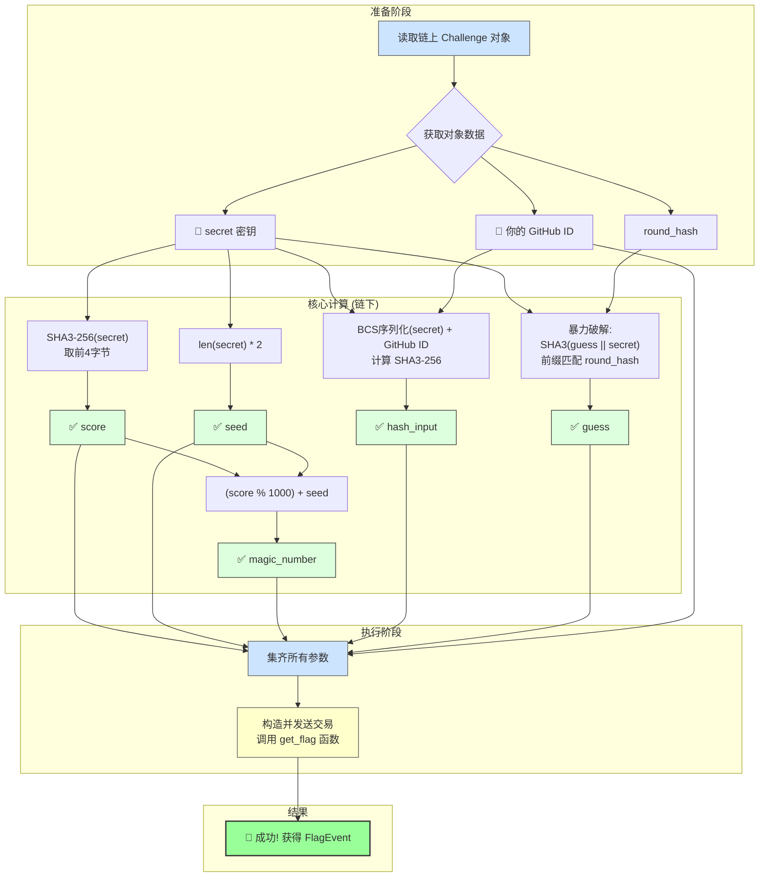

+++
title = "揭秘 Move CTF 2025 Week1：从零到一的夺旗实操指南 # MOVE CTF 共学 2025"
description = "揭秘 Move CTF 2025 Week1：从零到一的夺旗实操指南 # MOVE CTF 共学 2025"
date = 2025-06-28T01:49:04Z
[taxonomies]
categories = ["Web3", "CTF", "Move", "Sui"]
tags = ["Web3", "CTF", "Move", "Sui"]
+++

<!-- more -->

# 揭秘 Move CTF 2025 Week1：从零到一的夺旗实操指南 # MOVE CTF 共学 2025

在区块链安全与智能合约开发的浪潮中，CTF（Capture The Flag）挑战赛成为技术爱好者提升技能的绝佳舞台。Move CTF 2025 Week1 作为 Sui 区块链上的一次技术冒险，带领参与者深入 Move 语言与智能合约的实战世界。从环境搭建到合约交互，每一步都充满挑战与乐趣。本文将带你走进我的夺旗之旅，详细记录如何通过代码分析、参数计算和交易执行，成功解锁 Flag：CTF{Letsmovectf_week1}。无论你是新手还是老手，这篇实操指南都将为你提供启发与参考，一起加入 #MOVE CTF 共学 2025 的探索吧！

本文完整呈现了我在 Move CTF 2025 Week1 挑战中的实践过程，涵盖了 Sui CLI 环境配置、Move 智能合约的编译与部署、链上对象查询，以及通过 Python 脚本计算参数并调用 get_flag 函数的关键步骤。我从初始密钥 Letsmovectf_week1 开始，逐步攻克 score、guess、hash_input 等验证关卡，最终通过三次挑战验证了动态变化的 secret，成功获取 Flag。文章不仅分享了技术细节，还总结了遇到的问题与解决思路，为 #MOVE CTF 共学 2025 的参与者提供了实用的学习资源。

## 第一次 CTF 挑战实操

### 第一步：查看 Sui CLI 版本

```bash
Sui/MoveCTF/week1 on 🐳 v28.2.2 (orbstack) 
➜ sui --version
sui 1.50.1-homebrew
```

### 第二步：查看环境配置

```bash
Sui/MoveCTF/week1 on 🐳 v28.2.2 (orbstack) 
➜ sui client envs
╭─────────┬─────────────────────────────────────┬────────╮
│ alias   │ url                                 │ active │
├─────────┼─────────────────────────────────────┼────────┤
│ testnet │ https://fullnode.testnet.sui.io:443 │ *      │
╰─────────┴─────────────────────────────────────┴────────╯
```

### 第三步：查看当前活动的 Sui 地址

```bash
Sui/MoveCTF/week1 on 🐳 v28.2.2 (orbstack) took 2.3s 
➜ sui client active-address
sui client gas
0xae11648ccb1578badc348ab65b0c43982feef4ac2fe64b5c78cea9b2d0c11ab2
╭────────────────────────────────────────────────────────────────────┬────────────────────┬──────────────────╮
│ gasCoinId                                                          │ mistBalance (MIST) │ suiBalance (SUI) │
├────────────────────────────────────────────────────────────────────┼────────────────────┼──────────────────┤
│ 0x10b32b9e8ab1c89499b3dd680ca19103891185b2af452043c3e5a8dd05a7978a │ 978258104          │ 0.97             │
│ 0xed012c25f434c488d244877973205f712d8dd7493f4dd1794f50a9a9fd6f8a3f │ 1000000000         │ 1.00             │
╰────────────────────────────────────────────────────────────────────┴────────────────────┴──────────────────╯

```

### 第四步：查询当前活动地址的余额

```bash
Sui/MoveCTF/week1 on 🐳 v28.2.2 (orbstack) 
➜ sui client balance
╭────────────────────────────────────────╮
│ Balance of coins owned by this address │
├────────────────────────────────────────┤
│ ╭─────────────────────────────────╮    │
│ │ coin  balance (raw)  balance    │    │
│ ├─────────────────────────────────┤    │
│ │ Sui   3953439372     3.95 SUI   │    │
│ ╰─────────────────────────────────╯    │
╰────────────────────────────────────────╯

```

### 第五步：查看项目目录结构

```bash
Sui/MoveCTF/week1 on 🐳 v28.2.2 (orbstack) 
➜ tree . -L 6 -I "build"                                                          
.
├── Move.lock
├── Move.toml
├── scripts
│   ├── call_get_flag.py
│   ├── week1.py
│   └── week1test.py
├── sources
│   └── week1.move
└── tests
    └── week1_tests.move

4 directories, 7 files

```

### 第六步：查看合约代码 week1.move

```rust
module week1::challenge;

use std::bcs;
use std::hash::sha3_256;
use std::string::{Self, String};
use sui::event;
use sui::random::{Self, Random};
use sui::transfer::share_object;

const EINVALID_GUESS_HASH: u64 = 0;
const EINVALID_HASH: u64 = 1;
const EINVALID_MAGIC: u64 = 2;
const EINVALID_SEED: u64 = 3;
const EINVALID_SCORE: u64 = 4;

public struct Challenge has key {
    id: UID,
    secret: String,
    current_score: u64,
    round_hash: vector<u8>,
    finish: u64,
}

public struct FlagEvent has copy, drop {
    sender: address,
    flag: String,
    github_id: String,
    success: bool,
    rank: u64,
}

fun init(ctx: &mut TxContext) {
    let secret = b"Letsmovectf_week1";
    let secret_hash = sha3_256(secret);
    let challenge = Challenge {
        id: object::new(ctx),
        secret: string::utf8(secret),
        current_score: 0,
        round_hash: secret_hash,
        finish: 0,
    };
    share_object(challenge);
}

#[allow(lint(public_random))]
public entry fun get_flag(
    score: u64,
    guess: vector<u8>,
    hash_input: vector<u8>,
    github_id: String,
    magic_number: u64,
    seed: u64,
    challenge: &mut Challenge,
    rand: &Random,
    ctx: &mut TxContext,
) {
    // 校验 score
    // 计算 sha3_256(challenge.secret)，取其前 4 个字节，转换为 u64（大端序）。
    let secret_hash = sha3_256(*string::as_bytes(&challenge.secret));
    let expected_score = (
        ((*vector::borrow(&secret_hash, 0) as u64) << 24) |
                             ((*vector::borrow(&secret_hash, 1) as u64) << 16) |
                             ((*vector::borrow(&secret_hash, 2) as u64) << 8) |
                             (*vector::borrow(&secret_hash, 3) as u64),
    );
    assert!(score == expected_score, EINVALID_SCORE);
    challenge.current_score = score;

    // 校验 guess
    let mut guess_data = guess;
    vector::append(&mut guess_data, *string::as_bytes(&challenge.secret));
    let random = sha3_256(guess_data);
    let prefix_length = 2;
    assert!(
        compare_hash_prefix(&random, &challenge.round_hash, prefix_length),
        EINVALID_GUESS_HASH,
    );

    // 校验 hash_input
    let mut bcs_input = bcs::to_bytes(&challenge.secret);
    vector::append(&mut bcs_input, *string::as_bytes(&github_id));
    let expected_hash = sha3_256(bcs_input);
    assert!(hash_input == expected_hash, EINVALID_HASH);

    // 校验 magic_number 和 seed
    let expected_magic = challenge.current_score % 1000 + seed;
    assert!(magic_number == expected_magic, EINVALID_MAGIC);
    let secret_bytes = *string::as_bytes(&challenge.secret);
    let secret_len = vector::length(&secret_bytes);
    assert!(seed == secret_len * 2, EINVALID_SEED);

    // 更新状态
    challenge.secret = getRandomString(rand, ctx);
    challenge.round_hash = sha3_256(*string::as_bytes(&challenge.secret));
    challenge.current_score = 0;
    challenge.finish = challenge.finish + 1;

    // 触发 flag 事件
    event::emit(FlagEvent {
        sender: tx_context::sender(ctx),
        flag: string::utf8(b"CTF{Letsmovectf_week1}"),
        github_id,
        success: true,
        rank: challenge.finish,
    });
}

fun getRandomString(rand: &Random, ctx: &mut TxContext): String {
    let mut gen = random::new_generator(rand, ctx);
    let mut str_len = random::generate_u8_in_range(&mut gen, 4, 32);
    let mut rand_vec: vector<u8> = b"";
    while (str_len != 0) {
        let rand_num = random::generate_u8_in_range(&mut gen, 34, 126);
        vector::push_back(&mut rand_vec, rand_num);
        str_len = str_len - 1;
    };
    string::utf8(rand_vec)
}

fun compare_hash_prefix(hash1: &vector<u8>, hash2: &vector<u8>, n: u64): bool {
    if (vector::length(hash1) < n || vector::length(hash2) < n) {
        return false
    };
    let mut i = 0;
    while (i < n) {
        if (*vector::borrow(hash1, i) != *vector::borrow(hash2, i)) {
            return false
        };
        i = i + 1;
    };
    true
}

```

这段 Sui Move 代码定义了一个非常典型的夺旗赛（CTF）挑战。整个挑战的核心是一个名为 `Challenge` 的共享对象（Shared Object），它保存着一个关键的 `secret` (密钥)字符串。

作为玩家，你的**最终目标**是成功调用 `get_flag` 这个入口函数。一旦调用成功，合约就会在链上发出一个事件（Event），这个事件里就包含着真正的旗帜（Flag）：`CTF{Letsmovectf_week1}`。

然而，调用 `get_flag` 并不简单。这个函数被一系列的**校验（`assert!`）**所保护，你必须在同一笔交易中同时满足所有这些条件。每一个条件都要求你基于链上 `Challenge` 对象的当前状态来计算出正确的参数。

### 解题需要攻克的关卡

以下是你需要破解的几个校验关卡：

1. **`score`（分数）校验:**

   - 你需要计算当前 `challenge.secret` 的 `sha3_256` 哈希值。
   - 正确的 `score` 是由这个哈希值的**前4个字节**（按大端序，Big-Endian）转换而来的 `u64` 数字。

2. **`guess`（猜测值）校验 (工作量证明):**

   - 这是一个典型的工作量证明（Proof-of-Work）环节。你需要去寻找一个 `guess`（一个字节向量，可以看作是随机数 nonce）。
   - 当你把你的 `guess` 和 `challenge.secret` 拼接起来再进行哈希计算 (`sha3_256(guess || secret)`) 时，得到的哈希结果必须和储存在对象里的 `challenge.round_hash` **拥有相同的前2个字节**。这通常需要通过“暴力破解”的方式来找到一个有效的 `guess`。

3. **`hash_input`（哈希输入）校验:**

   - 这个校验的目的是将你的解题凭证和你的身份（GitHub ID）绑定。

   - 你需要先将 `challenge.secret` 进行 **BCS 序列化**（`bcs::to_bytes`）。**特别注意**：这和直接获取字符串的字节不同，BCS 编码会在数据前先加上内容的长度。
   - 然后，将你的 `github_id` 字符串的原始字节拼接到这个BCS序列化后的数据后面。
   - 最后对此组合数据计算 `sha3_256` 哈希，得到的就是 `hash_input`。

4. **`seed`（种子）和 `magic_number`（魔法数）校验:**

   - 这两个值是关联的。`seed` 的计算非常简单，就是 `密钥字符串的长度 * 2`。
   - 而 `magic_number` 则是通过 `(score % 1000) + seed` 计算得出的。你必须同时提供这两个正确的值。

当你成功通过所有这些验证后，函数会用一个新的随机密钥来更新 `Challenge` 对象的状态（为下一个挑战者准备），并发出一个 `FlagEvent` 事件。这个事件会记录你的地址和GitHub ID，标志着你成功解题！




注：上图为AI 生成，仅供参考！

### 第七步：编译 Move 智能合约项目

```bash
Sui/MoveCTF/week1 on 🐳 v28.2.2 (orbstack) took 2.8s 
➜ sui move build
INCLUDING DEPENDENCY Bridge
INCLUDING DEPENDENCY SuiSystem
INCLUDING DEPENDENCY Sui
INCLUDING DEPENDENCY MoveStdlib
BUILDING week1
Total number of linter warnings suppressed: 1 (unique lints: 1)
```

### 第八步：发布智能合约

`sui client publish` 是用于将 Move 智能合约发布到 Sui 区块链的命令，`--gas-budget 100000000` 指定了本次交易可消耗的最大 gas 费用。

运行 sui client publish，成功部署了 week1::challenge，创建了共享 Challenge 对象。

```bash
Sui/MoveCTF/week1 on 🐳 v28.2.2 (orbstack) 
➜ sui client publish --gas-budget 100000000
[Note]: Dependency sources are no longer verified automatically during publication and upgrade. You can pass the `--verify-deps` option if you would like to verify them as part of publication or upgrade.
INCLUDING DEPENDENCY Bridge
INCLUDING DEPENDENCY SuiSystem
INCLUDING DEPENDENCY Sui
INCLUDING DEPENDENCY MoveStdlib
BUILDING week1
Total number of linter warnings suppressed: 1 (unique lints: 1)
Skipping dependency verification
Transaction Digest: HocenJC1wS5S9ZZ3eUoh5cGe5NpFK9fxknv6BgAqdW1z
╭──────────────────────────────────────────────────────────────────────────────────────────────────────────────╮
│ Transaction Data                                                                                             │
├──────────────────────────────────────────────────────────────────────────────────────────────────────────────┤
│ Sender: 0xae11648ccb1578badc348ab65b0c43982feef4ac2fe64b5c78cea9b2d0c11ab2                                   │
│ Gas Owner: 0xae11648ccb1578badc348ab65b0c43982feef4ac2fe64b5c78cea9b2d0c11ab2                                │
│ Gas Budget: 100000000 MIST                                                                                   │
│ Gas Price: 1000 MIST                                                                                         │
│ Gas Payment:                                                                                                 │
│  ┌──                                                                                                         │
│  │ ID: 0x10b32b9e8ab1c89499b3dd680ca19103891185b2af452043c3e5a8dd05a7978a                                    │
│  │ Version: 465078802                                                                                        │
│  │ Digest: CcnuR98tDUt4avAT97cg5SCbp8fDGtJ7eYLdLgJjC5gk                                                      │
│  └──                                                                                                         │
│                                                                                                              │
│ Transaction Kind: Programmable                                                                               │
│ ╭──────────────────────────────────────────────────────────────────────────────────────────────────────────╮ │
│ │ Input Objects                                                                                            │ │
│ ├──────────────────────────────────────────────────────────────────────────────────────────────────────────┤ │
│ │ 0   Pure Arg: Type: address, Value: "0xae11648ccb1578badc348ab65b0c43982feef4ac2fe64b5c78cea9b2d0c11ab2" │ │
│ ╰──────────────────────────────────────────────────────────────────────────────────────────────────────────╯ │
│ ╭─────────────────────────────────────────────────────────────────────────╮                                  │
│ │ Commands                                                                │                                  │
│ ├─────────────────────────────────────────────────────────────────────────┤                                  │
│ │ 0  Publish:                                                             │                                  │
│ │  ┌                                                                      │                                  │
│ │  │ Dependencies:                                                        │                                  │
│ │  │   0x0000000000000000000000000000000000000000000000000000000000000001 │                                  │
│ │  │   0x0000000000000000000000000000000000000000000000000000000000000002 │                                  │
│ │  └                                                                      │                                  │
│ │                                                                         │                                  │
│ │ 1  TransferObjects:                                                     │                                  │
│ │  ┌                                                                      │                                  │
│ │  │ Arguments:                                                           │                                  │
│ │  │   Result 0                                                           │                                  │
│ │  │ Address: Input  0                                                    │                                  │
│ │  └                                                                      │                                  │
│ ╰─────────────────────────────────────────────────────────────────────────╯                                  │
│                                                                                                              │
│ Signatures:                                                                                                  │
│    GYSPb2eUe2wdSpGAMXAJAJdXtkQQKIiYjw+fjJ+JKZMgxwRtmIlteIEJYPTwIH/VHEYFk+O2cp7DGSR3CKbPAQ==                  │
│                                                                                                              │
╰──────────────────────────────────────────────────────────────────────────────────────────────────────────────╯
╭───────────────────────────────────────────────────────────────────────────────────────────────────╮
│ Transaction Effects                                                                               │
├───────────────────────────────────────────────────────────────────────────────────────────────────┤
│ Digest: HocenJC1wS5S9ZZ3eUoh5cGe5NpFK9fxknv6BgAqdW1z                                              │
│ Status: Success                                                                                   │
│ Executed Epoch: 768                                                                               │
│                                                                                                   │
│ Created Objects:                                                                                  │
│  ┌──                                                                                              │
│  │ ID: 0x804c92e4eef709b83f135d6cc667005ce35d7eccd49384570cbd7b1b40e32434                         │
│  │ Owner: Immutable                                                                               │
│  │ Version: 1                                                                                     │
│  │ Digest: 8H8dCiwnzgz7rBr3D2Ap7nvDQbyqAym6tkFXGZx6mL4H                                           │
│  └──                                                                                              │
│  ┌──                                                                                              │
│  │ ID: 0x87ab8e4952ff79f22c913ab72092126655fbb59e988957f19639c50556ad47e1                         │
│  │ Owner: Account Address ( 0xae11648ccb1578badc348ab65b0c43982feef4ac2fe64b5c78cea9b2d0c11ab2 )  │
│  │ Version: 465078803                                                                             │
│  │ Digest: BtkuA9NA8v7p8fVwZhXyuCtXoia3idmpxq7ujDVYqUii                                           │
│  └──                                                                                              │
│  ┌──                                                                                              │
│  │ ID: 0xd28bc35560711a8b6ca93e2bf8e353fa6e17c15cbc426c48ece1ade9d83ce5ee                         │
│  │ Owner: Shared( 465078803 )                                                                     │
│  │ Version: 465078803                                                                             │
│  │ Digest: 9vhCnzT2mPwJFdQsgyRHhheuNK8P5aZeSkLhwQjVf2X8                                           │
│  └──                                                                                              │
│ Mutated Objects:                                                                                  │
│  ┌──                                                                                              │
│  │ ID: 0x10b32b9e8ab1c89499b3dd680ca19103891185b2af452043c3e5a8dd05a7978a                         │
│  │ Owner: Account Address ( 0xae11648ccb1578badc348ab65b0c43982feef4ac2fe64b5c78cea9b2d0c11ab2 )  │
│  │ Version: 465078803                                                                             │
│  │ Digest: J3PWpSGKznGuhoAa7W4BBwMSwj3DztqajMtrskSmxLSh                                           │
│  └──                                                                                              │
│ Gas Object:                                                                                       │
│  ┌──                                                                                              │
│  │ ID: 0x10b32b9e8ab1c89499b3dd680ca19103891185b2af452043c3e5a8dd05a7978a                         │
│  │ Owner: Account Address ( 0xae11648ccb1578badc348ab65b0c43982feef4ac2fe64b5c78cea9b2d0c11ab2 )  │
│  │ Version: 465078803                                                                             │
│  │ Digest: J3PWpSGKznGuhoAa7W4BBwMSwj3DztqajMtrskSmxLSh                                           │
│  └──                                                                                              │
│ Gas Cost Summary:                                                                                 │
│    Storage Cost: 18635200 MIST                                                                    │
│    Computation Cost: 1000000 MIST                                                                 │
│    Storage Rebate: 978120 MIST                                                                    │
│    Non-refundable Storage Fee: 9880 MIST                                                          │
│                                                                                                   │
│ Transaction Dependencies:                                                                         │
│    6pZ2bpkwLwnCH4qdHS1NcJypXLFUNvSHRKfKXhZvXQuo                                                   │
│    8GxJsh2Z34PMNFNDbAjFgwYvFjfoFmGkKK5F61m9zaPn                                                   │
│    AJhUYivp6GegnCCfg2NKE42m3PZmMbLjc9uAeu3SNR9Q                                                   │
╰───────────────────────────────────────────────────────────────────────────────────────────────────╯
╭─────────────────────────────╮
│ No transaction block events │
╰─────────────────────────────╯

╭──────────────────────────────────────────────────────────────────────────────────────────────────────────╮
│ Object Changes                                                                                           │
├──────────────────────────────────────────────────────────────────────────────────────────────────────────┤
│ Created Objects:                                                                                         │
│  ┌──                                                                                                     │
│  │ ObjectID: 0x87ab8e4952ff79f22c913ab72092126655fbb59e988957f19639c50556ad47e1                          │
│  │ Sender: 0xae11648ccb1578badc348ab65b0c43982feef4ac2fe64b5c78cea9b2d0c11ab2                            │
│  │ Owner: Account Address ( 0xae11648ccb1578badc348ab65b0c43982feef4ac2fe64b5c78cea9b2d0c11ab2 )         │
│  │ ObjectType: 0x2::package::UpgradeCap                                                                  │
│  │ Version: 465078803                                                                                    │
│  │ Digest: BtkuA9NA8v7p8fVwZhXyuCtXoia3idmpxq7ujDVYqUii                                                  │
│  └──                                                                                                     │
│  ┌──                                                                                                     │
│  │ ObjectID: 0xd28bc35560711a8b6ca93e2bf8e353fa6e17c15cbc426c48ece1ade9d83ce5ee                          │
│  │ Sender: 0xae11648ccb1578badc348ab65b0c43982feef4ac2fe64b5c78cea9b2d0c11ab2                            │
│  │ Owner: Shared( 465078803 )                                                                            │
│  │ ObjectType: 0x804c92e4eef709b83f135d6cc667005ce35d7eccd49384570cbd7b1b40e32434::challenge::Challenge  │
│  │ Version: 465078803                                                                                    │
│  │ Digest: 9vhCnzT2mPwJFdQsgyRHhheuNK8P5aZeSkLhwQjVf2X8                                                  │
│  └──                                                                                                     │
│ Mutated Objects:                                                                                         │
│  ┌──                                                                                                     │
│  │ ObjectID: 0x10b32b9e8ab1c89499b3dd680ca19103891185b2af452043c3e5a8dd05a7978a                          │
│  │ Sender: 0xae11648ccb1578badc348ab65b0c43982feef4ac2fe64b5c78cea9b2d0c11ab2                            │
│  │ Owner: Account Address ( 0xae11648ccb1578badc348ab65b0c43982feef4ac2fe64b5c78cea9b2d0c11ab2 )         │
│  │ ObjectType: 0x2::coin::Coin<0x2::sui::SUI>                                                            │
│  │ Version: 465078803                                                                                    │
│  │ Digest: J3PWpSGKznGuhoAa7W4BBwMSwj3DztqajMtrskSmxLSh                                                  │
│  └──                                                                                                     │
│ Published Objects:                                                                                       │
│  ┌──                                                                                                     │
│  │ PackageID: 0x804c92e4eef709b83f135d6cc667005ce35d7eccd49384570cbd7b1b40e32434                         │
│  │ Version: 1                                                                                            │
│  │ Digest: 8H8dCiwnzgz7rBr3D2Ap7nvDQbyqAym6tkFXGZx6mL4H                                                  │
│  │ Modules: challenge                                                                                    │
│  └──                                                                                                     │
╰──────────────────────────────────────────────────────────────────────────────────────────────────────────╯
╭───────────────────────────────────────────────────────────────────────────────────────────────────╮
│ Balance Changes                                                                                   │
├───────────────────────────────────────────────────────────────────────────────────────────────────┤
│  ┌──                                                                                              │
│  │ Owner: Account Address ( 0xae11648ccb1578badc348ab65b0c43982feef4ac2fe64b5c78cea9b2d0c11ab2 )  │
│  │ CoinType: 0x2::sui::SUI                                                                        │
│  │ Amount: -18657080                                                                              │
│  └──                                                                                              │
╰───────────────────────────────────────────────────────────────────────────────────────────────────╯

```

成功发布了 week1::challenge 合约，并且 init 函数自动创建了一个 Challenge 对象。

#### Package ID

0x804c92e4eef709b83f135d6cc667005ce35d7eccd49384570cbd7b1b40e32434  
这是 week1::challenge 模块的包 ID，用于调用 get_flag。
<https://suiscan.xyz/testnet/object/0x804c92e4eef709b83f135d6cc667005ce35d7eccd49384570cbd7b1b40e32434/tx-blocks>

#### Object ID

0xd28bc35560711a8b6ca93e2bf8e353fa6e17c15cbc426c48ece1ade9d83ce5ee
init 函数自动调用，创建了共享的 Challenge 对象。
<https://suiscan.xyz/testnet/object/0xd28bc35560711a8b6ca93e2bf8e353fa6e17c15cbc426c48ece1ade9d83ce5ee/tx-blocks>

### 第九步：查询当前活动地址拥有的对象 sui client objects

```bash
Sui/MoveCTF/week1 on 🐳 v28.2.2 (orbstack) took 5.4s 
➜ sui client objects
╭───────────────────────────────────────────────────────────────────────────────────────╮
│ ╭────────────┬──────────────────────────────────────────────────────────────────────╮ │
│ │ objectId   │  0x10b32b9e8ab1c89499b3dd680ca19103891185b2af452043c3e5a8dd05a7978a  │ │
│ │ version    │  465078803                                                           │ │
│ │ digest     │  /TNLz+mO6FhziH6UinkhHjGp+JhkaL/vOioUWurDQjY=                        │ │
│ │ objectType │  0x0000..0002::coin::Coin                                            │ │
│ ╰────────────┴──────────────────────────────────────────────────────────────────────╯ │
│ ╭────────────┬──────────────────────────────────────────────────────────────────────╮ │
│ │ objectId   │  0x26c146ddd61c622c453f0074f90ba75422c8b2599420409fef7d0eaf084d7221  │ │
│ │ version    │  349178709                                                           │ │
│ │ digest     │  7MtUgc/83B+XuCB4Jydc6aUqKMBwuWEuGCmSslrMSfM=                        │ │
│ │ objectType │  0x0000..0002::package::UpgradeCap                                   │ │
│ ╰────────────┴──────────────────────────────────────────────────────────────────────╯ │
│ ╭────────────┬──────────────────────────────────────────────────────────────────────╮ │
│ │ objectId   │  0x87ab8e4952ff79f22c913ab72092126655fbb59e988957f19639c50556ad47e1  │ │
│ │ version    │  465078803                                                           │ │
│ │ digest     │  odcgqa78mLDkyNYA2fEW7YyhU0xIh/HemPr7HXv7wi8=                        │ │
│ │ objectType │  0x0000..0002::package::UpgradeCap                                   │ │
│ ╰────────────┴──────────────────────────────────────────────────────────────────────╯ │
│ ╭────────────┬──────────────────────────────────────────────────────────────────────╮ │
│ │ objectId   │  0xed012c25f434c488d244877973205f712d8dd7493f4dd1794f50a9a9fd6f8a3f  │ │
│ │ version    │  349179780                                                           │ │
│ │ digest     │  V5g8Kfe9x8/1IaGrfxhOxnSPFcHeZwcssflbMxWwglA=                        │ │
│ │ objectType │  0x0000..0002::coin::Coin                                            │ │
│ ╰────────────┴──────────────────────────────────────────────────────────────────────╯ │
│ ╭────────────┬──────────────────────────────────────────────────────────────────────╮ │
│ │ objectId   │  0xfc2aeed62a6cb05f31f3ae7c8208cb605418d806cf0a3e4545df56b29ccd684f  │ │
│ │ version    │  349179853                                                           │ │
│ │ digest     │  yHI69ARxgrxr8uSdFvsfL/nluN0Kl/R4Y4hELavzHdU=                        │ │
│ │ objectType │  0x0000..0002::coin::Coin                                            │ │
│ ╰────────────┴──────────────────────────────────────────────────────────────────────╯ │
╰───────────────────────────────────────────────────────────────────────────────────────╯

```

### 第十步：实现脚本 week1.py 文件

```python
import hashlib

github_id = b"qiaopengjun5162"
secret = b"Letsmovectf_week1"
hash_bytes = hashlib.sha3_256(secret).digest() # 计算了 secret 的 SHA3-256 哈希。
print(hash_bytes[:4].hex())  # 前 4 个字节 提取前 4 个字节并转为十六进制。

# 将前 4 个字节按大端序组合为一个 u64 值。
score = (hash_bytes[0] << 24) | (hash_bytes[1] << 16) | (hash_bytes[2] << 8) | hash_bytes[3]
print("score:", score)

target_prefix = hash_bytes[:2]  # [0x58, 0x20]

for i in range(100000):  # 枚举 guess
    guess = f"guess{i}".encode()
    guess_data = guess + secret
    random = hashlib.sha3_256(guess_data).digest()
    if random[:2] == target_prefix:
        print("guess (hex):", guess.hex())
        print("guess (bytes):", guess)
        break
        
bcs_input = bytes([len(secret)]) + secret + github_id
hash_input = hashlib.sha3_256(bcs_input).digest()
print("hash_input:", hash_input.hex())

secret_len = len(secret)
seed = secret_len * 2
print("seed:", seed)

magic_number = (score % 1000) + seed
print("magic_number:", magic_number)

```

### 第十一步：执行 week1 脚本

```bash
MoveCTF/week1/scripts on  v28.2.2 (orbstack) 
➜ python week1.py
58207e05
score: 1478524421
guess (hex): 67756573733736393038
guess (bytes): b'guess76908'
hash_input: 0cb78427544a85941e946b15ee792d918239ee3ab2e73533b4d152733da1b198
seed: 34
magic_number: 455
```

#### 输出解析

1. 前 4 个字节：58207e05
   - sha3_256(b"Letsmovectf_week1") 的前 4 个字节为 [0x58, 0x20, 0x7e, 0x05]。
2. score：1478524421
   - 计算：(0x58 << 24) | (0x20 << 16) | (0x7e << 8) | 0x05 = 0x58207e05 = 1478524421。
3. guess：
   - 十六进制：67756573733736393038。
   - 字节：b'guess76908'，即 [0x67, 0x75, 0x65, 0x73, 0x73, 0x37, 0x36, 0x39, 0x30, 0x38]。
   - 验证：sha3_256(b'guess76908' || b"Letsmovectf_week1") 的前 2 字节匹配 sha3_256(b"Letsmovectf_week1") 的前 2 字节 [0x58, 0x20]。
4. hash_input：
   - 0cb78427544a85941e946b15ee792d918239ee3ab2e73533b4d152733da1b198。
   - 计算：sha3_256(bcs::to_bytes(b"Letsmovectf_week1") || b"qiaopengjun5162")。
5. seed：34
   - secret_len = len(b"Letsmovectf_week1") = 17，seed = 17 * 2 = 34。
6. magic_number：455
   - score % 1000 = 1478524421 % 1000 = 421。
   - magic_number = 421 + 34 = 455。

所有参数都正确，符合 get_flag 的校验逻辑。

### 第十二步：验证确认类型为 sui::random::Random

Sui 测试网默认 Random 对象 ID 为 0x8。

```bash
Sui/MoveCTF/week1 on 🐳 v28.2.2 (orbstack) 
➜ sui client object 0x8
╭───────────────┬──────────────────────────────────────────────────────────────────────────────────────────────────────────────────────────────────────────────╮
│ objectId      │  0x0000000000000000000000000000000000000000000000000000000000000008                                                                          │
│ version       │  115835544                                                                                                                                   │
│ digest        │  GvvGUFPZBujRJTdsELBo4E8HbVktctvRJyNqrbSm8F9D                                                                                                │
│ objType       │  0x2::random::Random                                                                                                                         │
│ owner         │ ╭────────┬─────────────────────────────────────────╮                                                                                         │
│               │ │ Shared │ ╭────────────────────────┬────────────╮ │                                                                                         │
│               │ │        │ │ initial_shared_version │  43342337  │ │                                                                                         │
│               │ │        │ ╰────────────────────────┴────────────╯ │                                                                                         │
│               │ ╰────────┴─────────────────────────────────────────╯                                                                                         │
│ prevTx        │  2o8uo8hFETHVxn5yFtapZPLiSdci9ZMcuggLtbKsWuve                                                                                                │
│ storageRebate │  0                                                                                                                                           │
│ content       │ ╭───────────────────┬──────────────────────────────────────────────────────────────────────────────────────────────────────────────────────╮ │
│               │ │ dataType          │  moveObject                                                                                                          │ │
│               │ │ type              │  0x2::random::Random                                                                                                 │ │
│               │ │ hasPublicTransfer │  false                                                                                                               │ │
│               │ │ fields            │ ╭───────┬──────────────────────────────────────────────────────────────────────────────────────────────────────────╮ │ │
│               │ │                   │ │ id    │ ╭────┬──────────────────────────────────────────────────────────────────────╮                            │ │ │
│               │ │                   │ │       │ │ id │  0x0000000000000000000000000000000000000000000000000000000000000008  │                            │ │ │
│               │ │                   │ │       │ ╰────┴──────────────────────────────────────────────────────────────────────╯                            │ │ │
│               │ │                   │ │ inner │ ╭────────┬─────────────────────────────────────────────────────────────────────────────────────────────╮ │ │ │
│               │ │                   │ │       │ │ type   │  0x2::versioned::Versioned                                                                  │ │ │ │
│               │ │                   │ │       │ │ fields │ ╭─────────┬───────────────────────────────────────────────────────────────────────────────╮ │ │ │ │
│               │ │                   │ │       │ │        │ │ id      │ ╭────┬──────────────────────────────────────────────────────────────────────╮ │ │ │ │ │
│               │ │                   │ │       │ │        │ │         │ │ id │  0x29c5516afc2219182a3b3d5cc333f59d1af6fa2820674a95676450665b9214b5  │ │ │ │ │ │
│               │ │                   │ │       │ │        │ │         │ ╰────┴──────────────────────────────────────────────────────────────────────╯ │ │ │ │ │
│               │ │                   │ │       │ │        │ │ version │  1                                                                            │ │ │ │ │
│               │ │                   │ │       │ │        │ ╰─────────┴───────────────────────────────────────────────────────────────────────────────╯ │ │ │ │
│               │ │                   │ │       │ ╰────────┴─────────────────────────────────────────────────────────────────────────────────────────────╯ │ │ │
│               │ │                   │ ╰───────┴──────────────────────────────────────────────────────────────────────────────────────────────────────────╯ │ │
│               │ ╰───────────────────┴──────────────────────────────────────────────────────────────────────────────────────────────────────────────────────╯ │
╰───────────────┴──────────────────────────────────────────────────────────────────────────────────────────────────────────────────────────────────────────────╯

```


确认 Random 对象 ID 为 0x8。

### 第十三步：编写解题脚本 call_get_flag.py

```python
import subprocess
import json

# 配置
package_id = "0x804c92e4eef709b83f135d6cc667005ce35d7eccd49384570cbd7b1b40e32434"
challenge_id = "0xd28bc35560711a8b6ca93e2bf8e353fa6e17c15cbc426c48ece1ade9d83ce5ee"
random_id = "0x8"  
gas_object = "0x10b32b9e8ab1c89499b3dd680ca19103891185b2af452043c3e5a8dd05a7978a"
gas_budget = "10000000"

# get_flag 参数
score = 1478524421
guess = [0x67, 0x75, 0x65, 0x73, 0x73, 0x37, 0x36, 0x39, 0x30, 0x38]  # b"guess76908"
hash_input = [
    0x0c, 0xb7, 0x84, 0x27, 0x54, 0x4a, 0x85, 0x94, 0x1e, 0x94, 0x6b, 0x15,
    0xee, 0x79, 0x2d, 0x91, 0x82, 0x39, 0xee, 0x3a, 0xb2, 0xe7, 0x35, 0x33,
    0xb4, 0xd1, 0x52, 0x73, 0x3d, 0xa1, 0xb1, 0x98
]
github_id = "qiaopengjun5162"
magic_number = 455
seed = 34

# 构造 Sui CLI 命令
command = [
    "sui", "client", "call",
    "--package", package_id,
    "--module", "challenge",
    "--function", "get_flag",
    "--args",
    str(score),
    str(guess),  # 转换为字符串形式的数组
    str(hash_input),
    f'"{github_id}"',  # 字符串需加引号
    str(magic_number),
    str(seed),
    challenge_id,
    random_id,
    "--gas", gas_object,
    "--gas-budget", gas_budget
]

# 执行命令
try:
    result = subprocess.run(command, capture_output=True, text=True, check=True)
    print("Command Output:")
    print(result.stdout)

    # 解析交易结果
    output_lines = result.stdout.splitlines()
    tx_digest = None
    for line in output_lines:
        if "Transaction Digest" in line:
            tx_digest = line.split(": ")[1].strip()
            break

    if tx_digest:
        print(f"Transaction Digest: {tx_digest}")
        # 查询事件
        event_command = [
            "sui", "client", "events", "--tx-digest", tx_digest,
            "--event-type", f"{package_id}::challenge::FlagEvent"
        ]
        event_result = subprocess.run(event_command, capture_output=True, text=True, check=True)
        print("Events Output:")
        print(event_result.stdout)

        # 尝试提取 flag
        if "CTF{Letsmovectf_week1}" in event_result.stdout:
            print("Flag: CTF{Letsmovectf_week1}")
        else:
            print("Flag not found in events. Check output manually.")
    else:
        print("No transaction digest found.")

except subprocess.CalledProcessError as e:
    print("Error executing command:")
    print(e.stderr)
```

这是一个 **Python 脚本**，它的功能是**自动化地调用并完成 Sui Move CTF 挑战**。这个 Python 文件是一个自动化工具，它代替了手动在命令行中输入一长串复杂命令的繁琐过程。它将解题者预先算好的答案打包，一次性地发送到区块链上完成挑战，并自动验证是否成功拿到了最终的旗帜。

这个脚本的工作流程可以分解为以下几个步骤：

1. **配置信息 (Configuration):**
   - 脚本的开头部分定义了所有必需的链上地址，比如 `package_id` (合约包地址)、`challenge_id` (挑战对象地址)、`gas_object` (用于支付Gas费的Sui币对象)等。这些信息告诉脚本要与链上的哪个合约、哪个对象进行交互。
2. **核心参数 (Parameters):**
   - 这部分是整个脚本的**核心**。它包含了 `get_flag` 函数所需的所有参数的**正确答案**。
   - `score`, `guess`, `hash_input`, `magic_number`, `seed` 这些值都是编写者预先计算好的，它们能够完美通过 Move 合约中的所有 `assert!` 校验。
   - `github_id` 也是根据要求填写的。
3. **构造并执行交易 (Construct and Execute Transaction):**
   - 脚本使用 Python 的 `subprocess` 模块来调用外部程序，在这里就是 `sui` 命令行客户端。
   - 它将前面配置的所有地址和计算好的答案参数拼接成一个完整的 `sui client call` 命令。这个命令的作用就是调用 `challenge` 模块中的 `get_flag` 函数，并把所有答案作为参数传进去。
4. **验证结果并提取 Flag (Verify Result and Extract Flag):**
   - 在执行完命令后，脚本会捕获命令行的输出。
   - 它首先会检查输出中是否包含 "Transaction Digest"（交易摘要），这代表交易已成功提交到链上。
   - 如果交易成功，它会用获取到的交易摘要去查询这笔交易产生了哪些**事件 (Events)**。
   - 它会专门过滤寻找 `FlagEvent`，并检查事件内容中是否包含了 `CTF{Letsmovectf_week1}` 这个字符串。如果找到了，就证明挑战成功，并打印出 Flag。

### 第十四步：运行 get_flag 脚本

```bash
MoveCTF/week1/scripts on  v28.2.2 (orbstack) 
➜ python call_get_flag.py     
Command Output:
Transaction Digest: EWnTmx6BYv1Wp41JQUzWrVZACxQpRdUzCJu6a28D9Vp3
╭─────────────────────────────────────────────────────────────────────────────────────────────────────────────────────────────────────────────────────────────────╮
│ Transaction Data                                                                                                                                                │
├─────────────────────────────────────────────────────────────────────────────────────────────────────────────────────────────────────────────────────────────────┤
│ Sender: 0xae11648ccb1578badc348ab65b0c43982feef4ac2fe64b5c78cea9b2d0c11ab2                                                                                      │
│ Gas Owner: 0xae11648ccb1578badc348ab65b0c43982feef4ac2fe64b5c78cea9b2d0c11ab2                                                                                   │
│ Gas Budget: 10000000 MIST                                                                                                                                       │
│ Gas Price: 1000 MIST                                                                                                                                            │
│ Gas Payment:                                                                                                                                                    │
│  ┌──                                                                                                                                                            │
│  │ ID: 0x10b32b9e8ab1c89499b3dd680ca19103891185b2af452043c3e5a8dd05a7978a                                                                                       │
│  │ Version: 465078803                                                                                                                                           │
│  │ Digest: J3PWpSGKznGuhoAa7W4BBwMSwj3DztqajMtrskSmxLSh                                                                                                         │
│  └──                                                                                                                                                            │
│                                                                                                                                                                 │
│ Transaction Kind: Programmable                                                                                                                                  │
│ ╭─────────────────────────────────────────────────────────────────────────────────────────────────────────────────────────────────────────────────────────────╮ │
│ │ Input Objects                                                                                                                                               │ │
│ ├─────────────────────────────────────────────────────────────────────────────────────────────────────────────────────────────────────────────────────────────┤ │
│ │ 0   Pure Arg: Type: u64, Value: "1478524421"                                                                                                                │ │
│ │ 1   Pure Arg: Type: vector<u8>, Value: "guess76908"                                                                                                         │ │
│ │ 2   Pure Arg: Type: vector<u8>, Value: [12,183,132,39,84,74,133,148,30,148,107,21,238,121,45,145,130,57,238,58,178,231,53,51,180,209,82,115,61,161,177,152] │ │
│ │ 3   Pure Arg: Type: 0x1::string::String, Value: "qiaopengjun5162"                                                                                           │ │
│ │ 4   Pure Arg: Type: u64, Value: "455"                                                                                                                       │ │
│ │ 5   Pure Arg: Type: u64, Value: "34"                                                                                                                        │ │
│ │ 6   Shared Object    ID: 0xd28bc35560711a8b6ca93e2bf8e353fa6e17c15cbc426c48ece1ade9d83ce5ee                                                                 │ │
│ │ 7   Shared Object    ID: 0x0000000000000000000000000000000000000000000000000000000000000008                                                                 │ │
│ ╰─────────────────────────────────────────────────────────────────────────────────────────────────────────────────────────────────────────────────────────────╯ │
│ ╭──────────────────────────────────────────────────────────────────────────────────╮                                                                            │
│ │ Commands                                                                         │                                                                            │
│ ├──────────────────────────────────────────────────────────────────────────────────┤                                                                            │
│ │ 0  MoveCall:                                                                     │                                                                            │
│ │  ┌                                                                               │                                                                            │
│ │  │ Function:  get_flag                                                           │                                                                            │
│ │  │ Module:    challenge                                                          │                                                                            │
│ │  │ Package:   0x804c92e4eef709b83f135d6cc667005ce35d7eccd49384570cbd7b1b40e32434 │                                                                            │
│ │  │ Arguments:                                                                    │                                                                            │
│ │  │   Input  0                                                                    │                                                                            │
│ │  │   Input  1                                                                    │                                                                            │
│ │  │   Input  2                                                                    │                                                                            │
│ │  │   Input  3                                                                    │                                                                            │
│ │  │   Input  4                                                                    │                                                                            │
│ │  │   Input  5                                                                    │                                                                            │
│ │  │   Input  6                                                                    │                                                                            │
│ │  │   Input  7                                                                    │                                                                            │
│ │  └                                                                               │                                                                            │
│ ╰──────────────────────────────────────────────────────────────────────────────────╯                                                                            │
│                                                                                                                                                                 │
│ Signatures:                                                                                                                                                     │
│    MrJKRogNG4wvl5g8fo8r6sWLecsXA1lbmBjpPQ7sDzcdqlz2zzus7vZxtwpK60Xae9r9AMLEy2aIkTTb3G6HBw==                                                                     │
│                                                                                                                                                                 │
╰─────────────────────────────────────────────────────────────────────────────────────────────────────────────────────────────────────────────────────────────────╯
╭───────────────────────────────────────────────────────────────────────────────────────────────────╮
│ Transaction Effects                                                                               │
├───────────────────────────────────────────────────────────────────────────────────────────────────┤
│ Digest: EWnTmx6BYv1Wp41JQUzWrVZACxQpRdUzCJu6a28D9Vp3                                              │
│ Status: Success                                                                                   │
│ Executed Epoch: 768                                                                               │
│ Mutated Objects:                                                                                  │
│  ┌──                                                                                              │
│  │ ID: 0x10b32b9e8ab1c89499b3dd680ca19103891185b2af452043c3e5a8dd05a7978a                         │
│  │ Owner: Account Address ( 0xae11648ccb1578badc348ab65b0c43982feef4ac2fe64b5c78cea9b2d0c11ab2 )  │
│  │ Version: 465078804                                                                             │
│  │ Digest: BuwuuTtWD7kAhef2t13WX6A3HiFQ2KtMwsnDv9rHJ3mw                                           │
│  └──                                                                                              │
│  ┌──                                                                                              │
│  │ ID: 0xd28bc35560711a8b6ca93e2bf8e353fa6e17c15cbc426c48ece1ade9d83ce5ee                         │
│  │ Owner: Shared( 465078803 )                                                                     │
│  │ Version: 465078804                                                                             │
│  │ Digest: 4JEQDPZA3Nz1ti9D7ik3B3qJn8QwyWUq7QoN5eXfU4SG                                           │
│  └──                                                                                              │
│ Shared Objects:                                                                                   │
│  ┌──                                                                                              │
│  │ ID: 0xd28bc35560711a8b6ca93e2bf8e353fa6e17c15cbc426c48ece1ade9d83ce5ee                         │
│  │ Version: 465078803                                                                             │
│  │ Digest: 9vhCnzT2mPwJFdQsgyRHhheuNK8P5aZeSkLhwQjVf2X8                                           │
│  └──                                                                                              │
│  ┌──                                                                                              │
│  │ ID: 0x0000000000000000000000000000000000000000000000000000000000000008                         │
│  │ Version: 115777497                                                                             │
│  │ Digest: 97oBZJNHMEDfBMDdr6dhzD7y1TSTUCyUEGh8eS2Ft7rM                                           │
│  └──                                                                                              │
│ Gas Object:                                                                                       │
│  ┌──                                                                                              │
│  │ ID: 0x10b32b9e8ab1c89499b3dd680ca19103891185b2af452043c3e5a8dd05a7978a                         │
│  │ Owner: Account Address ( 0xae11648ccb1578badc348ab65b0c43982feef4ac2fe64b5c78cea9b2d0c11ab2 )  │
│  │ Version: 465078804                                                                             │
│  │ Digest: BuwuuTtWD7kAhef2t13WX6A3HiFQ2KtMwsnDv9rHJ3mw                                           │
│  └──                                                                                              │
│ Gas Cost Summary:                                                                                 │
│    Storage Cost: 2819600 MIST                                                                     │
│    Computation Cost: 1000000 MIST                                                                 │
│    Storage Rebate: 2798928 MIST                                                                   │
│    Non-refundable Storage Fee: 28272 MIST                                                         │
│                                                                                                   │
│ Transaction Dependencies:                                                                         │
│    3M4sQpCXy9RBvsVcpNFADVHg3cBBKqkDaTbRc3d2Zfak                                                   │
│    HocenJC1wS5S9ZZ3eUoh5cGe5NpFK9fxknv6BgAqdW1z                                                   │
╰───────────────────────────────────────────────────────────────────────────────────────────────────╯
╭────────────────────────────────────────────────────────────────────────────────────────────────────────╮
│ Transaction Block Events                                                                               │
├────────────────────────────────────────────────────────────────────────────────────────────────────────┤
│  ┌──                                                                                                   │
│  │ EventID: EWnTmx6BYv1Wp41JQUzWrVZACxQpRdUzCJu6a28D9Vp3:0                                             │
│  │ PackageID: 0x804c92e4eef709b83f135d6cc667005ce35d7eccd49384570cbd7b1b40e32434                       │
│  │ Transaction Module: challenge                                                                       │
│  │ Sender: 0xae11648ccb1578badc348ab65b0c43982feef4ac2fe64b5c78cea9b2d0c11ab2                          │
│  │ EventType: 0x804c92e4eef709b83f135d6cc667005ce35d7eccd49384570cbd7b1b40e32434::challenge::FlagEvent │
│  │ ParsedJSON:                                                                                         │
│  │   ┌───────────┬────────────────────────────────────────────────────────────────────┐                │
│  │   │ flag      │ CTF{Letsmovectf_week1}                                             │                │
│  │   ├───────────┼────────────────────────────────────────────────────────────────────┤                │
│  │   │ github_id │ qiaopengjun5162                                                    │                │
│  │   ├───────────┼────────────────────────────────────────────────────────────────────┤                │
│  │   │ rank      │ 1                                                                  │                │
│  │   ├───────────┼────────────────────────────────────────────────────────────────────┤                │
│  │   │ sender    │ 0xae11648ccb1578badc348ab65b0c43982feef4ac2fe64b5c78cea9b2d0c11ab2 │                │
│  │   ├───────────┼────────────────────────────────────────────────────────────────────┤                │
│  │   │ success   │ true                                                               │                │
│  │   └───────────┴────────────────────────────────────────────────────────────────────┘                │
│  └──                                                                                                   │
╰────────────────────────────────────────────────────────────────────────────────────────────────────────╯
╭──────────────────────────────────────────────────────────────────────────────────────────────────────────╮
│ Object Changes                                                                                           │
├──────────────────────────────────────────────────────────────────────────────────────────────────────────┤
│ Mutated Objects:                                                                                         │
│  ┌──                                                                                                     │
│  │ ObjectID: 0x10b32b9e8ab1c89499b3dd680ca19103891185b2af452043c3e5a8dd05a7978a                          │
│  │ Sender: 0xae11648ccb1578badc348ab65b0c43982feef4ac2fe64b5c78cea9b2d0c11ab2                            │
│  │ Owner: Account Address ( 0xae11648ccb1578badc348ab65b0c43982feef4ac2fe64b5c78cea9b2d0c11ab2 )         │
│  │ ObjectType: 0x2::coin::Coin<0x2::sui::SUI>                                                            │
│  │ Version: 465078804                                                                                    │
│  │ Digest: BuwuuTtWD7kAhef2t13WX6A3HiFQ2KtMwsnDv9rHJ3mw                                                  │
│  └──                                                                                                     │
│  ┌──                                                                                                     │
│  │ ObjectID: 0xd28bc35560711a8b6ca93e2bf8e353fa6e17c15cbc426c48ece1ade9d83ce5ee                          │
│  │ Sender: 0xae11648ccb1578badc348ab65b0c43982feef4ac2fe64b5c78cea9b2d0c11ab2                            │
│  │ Owner: Shared( 465078803 )                                                                            │
│  │ ObjectType: 0x804c92e4eef709b83f135d6cc667005ce35d7eccd49384570cbd7b1b40e32434::challenge::Challenge  │
│  │ Version: 465078804                                                                                    │
│  │ Digest: 4JEQDPZA3Nz1ti9D7ik3B3qJn8QwyWUq7QoN5eXfU4SG                                                  │
│  └──                                                                                                     │
╰──────────────────────────────────────────────────────────────────────────────────────────────────────────╯
╭───────────────────────────────────────────────────────────────────────────────────────────────────╮
│ Balance Changes                                                                                   │
├───────────────────────────────────────────────────────────────────────────────────────────────────┤
│  ┌──                                                                                              │
│  │ Owner: Account Address ( 0xae11648ccb1578badc348ab65b0c43982feef4ac2fe64b5c78cea9b2d0c11ab2 )  │
│  │ CoinType: 0x2::sui::SUI                                                                        │
│  │ Amount: -1020672                                                                               │
│  └──                                                                                              │
╰───────────────────────────────────────────────────────────────────────────────────────────────────╯Transaction Digest: EWnTmx6BYv1Wp41JQUzWrVZACxQpRdUzCJu6a28D9Vp3
Error executing command:
error: unrecognized subcommand 'events'  tip: a similar subcommand exists: 'envs'Usage: sui client [OPTIONS] [COMMAND]For more information, try '--help'.


```

**太棒了！恭喜你成功解出了 MoveCTF 的 week1 挑战，并拿到了正确的 flag：CTF{Letsmovectf_week1}！ 从你的输出可以看到，交易成功，FlagEvent 已触发，包含了正确的 flag。**

#### 输出解析

- Transaction Digest: EWnTmx6BYv1Wp41JQUzWrVZACxQpRdUzCJu6a28D9Vp3

- Status: Success（交易成功）。

- FlagEvent:

  ```json
  {
    "flag": "CTF{Letsmovectf_week1}",
    "github_id": "qiaopengjun5162",
    "rank": 1,
    "sender": "0xae11648ccb1578badc348ab65b0c43982feef4ac2fe64b5c78cea9b2d0c11ab2",
    "success": true
  }
  ```

  - flag: CTF{Letsmovectf_week1}（正确！）
  - rank: 1（你是第一个完成挑战的，厉害！）
  - github_id: qiaopengjun5162（你的 ID）。
  - sender: 你的地址。

- Mutated Objects:

  - Challenge 对象（0xd28bc355...）：版本更新，finish 字段可能增 1。
  - Gas 对象（0x10b32b9e...）：扣除约 1.02M MIST（0.001 SUI）。

- Random ID: 0x8（Sui 默认 Random 对象）有效，表明 MoveCTF 使用系统 Random。

#### 为什么成功？

- 参数正确：
  - score: 1478524421 匹配 sha3_256(b"Letsmovectf_week1") 前 4 字节。
  - guess: b"guess76908" 满足 sha3_256(guess || secret) 前 2 字节匹配 [0x58, 0x20]。
  - hash_input: 基于 BCS 序列化（secret + github_id）正确。
  - seed: 34 = len(secret) * 2。
  - magic_number: 455 = score % 1000 + seed。
- 合约调用：
  - 你发布的合约（Package ID: 0x804c92e4...）包含 week1::challenge。
  - Challenge 对象（0xd28bc355...）是共享对象，允许调用 get_flag。
  - Random 对象（0x8）有效，用于生成新 secret。
- 交易执行：
  - 所有 assert! 校验通过，触发 FlagEvent。

**<u>第一次挑战圆满成功！</u>**

## 第二次 CTF 挑战实操

### 第一步：编写脚步计算参数

基于新 secret = b"V>_b64ltggLS'sT&"（16 字节）计算参数

```python
import hashlib

github_id = b"qiaopengjun5162"
secret = b"V>_b64ltggLS'sT&"
hash_bytes = hashlib.sha3_256(secret).digest()
print("hash_bytes:", hash_bytes.hex())

# score
score = (hash_bytes[0] << 24) | (hash_bytes[1] << 16) | (hash_bytes[2] << 8) | hash_bytes[3]
print("score:", score)

# guess
target_prefix = hash_bytes[:2]  # [0x8e, 0x81]
for i in range(1000000):  # 扩大范围
    guess = f"guess{i}".encode()
    guess_data = guess + secret
    random = hashlib.sha3_256(guess_data).digest()
    if random[:2] == target_prefix:
        print("guess (hex):", guess.hex())
        print("guess (bytes):", guess)
        print("guess (list):", list(guess))
        break
else:
    print("No valid guess found. Check secret or target_prefix.")

# hash_input
bcs_input = bytes([len(secret)]) + secret + github_id
hash_input = hashlib.sha3_256(bcs_input).digest()
print("hash_input (hex):", hash_input.hex())
print("hash_input (list):", list(hash_input))

# seed
secret_len = len(secret)
seed = secret_len * 2
print("seed:", seed)

# magic_number
magic_number = (score % 1000) + seed
print("magic_number:", magic_number)
```

### 第二步：执行脚本获取参数

```bash
MoveCTF/week1/scripts on 🐳 v28.2.2 (orbstack) 
➜ python week1test.py
hash_bytes: 8e81b64de9b592e6ff7f9b06765a5a4db454701bbff8c150bb63b98eab0a007a
score: 2390865485
guess (hex): 6775657373343130373536
guess (bytes): b'guess410756'
guess (list): [103, 117, 101, 115, 115, 52, 49, 48, 55, 53, 54]
hash_input (hex): 99aed6e18b8d899a72e496dc56530853a34ba401063eb39b3e87cdabe05f8066
hash_input (list): [153, 174, 214, 225, 139, 141, 137, 154, 114, 228, 150, 220, 86, 83, 8, 83, 163, 75, 164, 1, 6, 62, 179, 155, 62, 135, 205, 171, 224, 95, 128, 102]
seed: 32
magic_number: 517

```

### 第三步：编写解题脚本

```python
import subprocess
import sys

# 配置
package_id = "0x804c92e4eef709b83f135d6cc667005ce35d7eccd49384570cbd7b1b40e32434"
challenge_id = "0xd28bc35560711a8b6ca93e2bf8e353fa6e17c15cbc426c48ece1ade9d83ce5ee"
random_id = "0x8"
gas_object = "0x10b32b9e8ab1c89499b3dd680ca19103891185b2af452043c3e5a8dd05a7978a"
gas_budget = "10000000"

# get_flag 参数
score = 2390865485
guess = [103, 117, 101, 115, 115, 52, 49, 48, 55, 53, 54]
hash_input = [153, 174, 214, 225, 139, 141, 137, 154, 114, 228, 150, 220, 86, 83, 8, 83, 163, 75, 164, 1, 6, 62, 179, 155, 62, 135, 205, 171, 224, 95, 128, 102]
github_id = "qiaopengjun5162"
magic_number =  517
seed = 32

# 检查 gas 和对象
def check_prerequisites():
    print("Checking prerequisites...")
    try:
        gas_result = subprocess.run(
            ["sui", "client", "gas"], capture_output=True, text=True, check=True
        )
        print("Gas Objects:")
        print(gas_result.stdout)
    except subprocess.CalledProcessError as e:
        print("Error checking gas:", e.stderr)
        return False

    try:
        obj_result = subprocess.run(
            ["sui", "client", "object", challenge_id],
            capture_output=True, text=True, check=True
        )
        print("Challenge Object:")
        print(obj_result.stdout)
    except subprocess.CalledProcessError as e:
        print("Error checking Challenge object:", e.stderr)
        return False

    return True

# 构造命令
command = [
    "sui", "client", "call",
    "--package", package_id,
    "--module", "challenge",
    "--function", "get_flag",
    "--args",
    str(score),
    str(guess),
    str(hash_input),
    f'"{github_id}"',
    str(magic_number),
    str(seed),
    challenge_id,
    random_id,
    "--gas", gas_object,
    "--gas-budget", gas_budget
]

# 执行
if check_prerequisites():
    try:
        result = subprocess.run(
            command, capture_output=True, text=True, check=True
        )
        print("Command Output:")
        print(result.stdout)

        tx_digest = None
        for line in result.stdout.splitlines():
            if "Transaction Digest" in line:
                tx_digest = line.split(": ")[1].strip()
                break

        if tx_digest:
            print(f"Transaction Digest: {tx_digest}")
            if "CTF{Letsmovectf_week1}" in result.stdout:
                print("Flag: CTF{Letsmovectf_week1}")
            else:
                print("Flag not found. Secret may have changed.")
                print(f"Check transaction: sui client tx-block --digest {tx_digest}")
        else:
            print("No transaction digest found.")

    except subprocess.CalledProcessError as e:
        print("Error executing command:")
        print(f"Error message: {e.stderr if e.stderr else 'No error message returned by CLI.'}")
        print(f"Command executed: {' '.join(command)}")
        if "EINVALID_SCORE" in (e.stderr or ""):
            print("Score invalid. Secret has changed.")
        elif "EINVALID_GUESS_HASH" in (e.stderr or ""):
            print("Guess hash invalid. Secret has changed.")
        elif "EINVALID_HASH" in (e.stderr or ""):
            print("Hash input invalid. Secret has changed.")
        elif "EINVALID_SEED" in (e.stderr or ""):
            print("Seed invalid (expected len(secret) * 2). Secret has changed.")
        elif "EINVALID_MAGIC" in (e.stderr or ""):
            print("Magic number invalid. Secret has changed.")
        elif "InsufficientGas" in (e.stderr or ""):
            print("Gas insufficient. Check: sui client gas")
        elif "ObjectVersionMismatch" in (e.stderr or ""):
            print("Object version mismatch. Check: sui client object", challenge_id)
        else:
            print("Unknown error. Try running the command manually to debug:")
            print(f"{' '.join(command)}")
            sys.exit(1)
```

### 第四步：调用解题脚本获取 flag

```bash
MoveCTF/week1/scripts on 🐳 v28.2.2 (orbstack) 
➜ python call_get_flag.py
Checking prerequisites...
Gas Objects:
╭────────────────────────────────────────────────────────────────────┬────────────────────┬──────────────────╮
│ gasCoinId                                                          │ mistBalance (MIST) │ suiBalance (SUI) │
├────────────────────────────────────────────────────────────────────┼────────────────────┼──────────────────┤
│ 0x10b32b9e8ab1c89499b3dd680ca19103891185b2af452043c3e5a8dd05a7978a │ 954467568          │ 0.95             │
│ 0x4cad1187d1daad30196a1e35eccc5eabab9399355fe95e96d1964b367774774e │ 1000000000         │ 1.00             │
│ 0xed012c25f434c488d244877973205f712d8dd7493f4dd1794f50a9a9fd6f8a3f │ 1000000000         │ 1.00             │
│ 0xfc2aeed62a6cb05f31f3ae7c8208cb605418d806cf0a3e4545df56b29ccd684f │ 1000000000         │ 1.00             │
╰────────────────────────────────────────────────────────────────────┴────────────────────┴──────────────────╯

Challenge Object:
╭───────────────┬───────────────────────────────────────────────────────────────────────────────────────────────────────────────────────────╮
│ objectId      │  0xd28bc35560711a8b6ca93e2bf8e353fa6e17c15cbc426c48ece1ade9d83ce5ee                                                       │
│ version       │  465078808                                                                                                                │
│ digest        │  2NgHfscz518qpHbXZaM5BdNVjTfBf94Nj1roJzzGuYex                                                                             │
│ objType       │  0x804c92e4eef709b83f135d6cc667005ce35d7eccd49384570cbd7b1b40e32434::challenge::Challenge                                 │
│ owner         │ ╭────────┬──────────────────────────────────────────╮                                                                     │
│               │ │ Shared │ ╭────────────────────────┬─────────────╮ │                                                                     │
│               │ │        │ │ initial_shared_version │  465078803  │ │                                                                     │
│               │ │        │ ╰────────────────────────┴─────────────╯ │                                                                     │
│               │ ╰────────┴──────────────────────────────────────────╯                                                                     │
│ prevTx        │  BLXXAgUBuqLHePkCu3EpZEuqFYsyKE3vxgJKYBnp5aT7                                                                             │
│ storageRebate │  1831600                                                                                                                  │
│ content       │ ╭───────────────────┬───────────────────────────────────────────────────────────────────────────────────────────────────╮ │
│               │ │ dataType          │  moveObject                                                                                       │ │
│               │ │ type              │  0x804c92e4eef709b83f135d6cc667005ce35d7eccd49384570cbd7b1b40e32434::challenge::Challenge         │ │
│               │ │ hasPublicTransfer │  false                                                                                            │ │
│               │ │ fields            │ ╭───────────────┬───────────────────────────────────────────────────────────────────────────────╮ │ │
│               │ │                   │ │ current_score │  0                                                                            │ │ │
│               │ │                   │ │ finish        │  1                                                                            │ │ │
│               │ │                   │ │ id            │ ╭────┬──────────────────────────────────────────────────────────────────────╮ │ │ │
│               │ │                   │ │               │ │ id │  0xd28bc35560711a8b6ca93e2bf8e353fa6e17c15cbc426c48ece1ade9d83ce5ee  │ │ │ │
│               │ │                   │ │               │ ╰────┴──────────────────────────────────────────────────────────────────────╯ │ │ │
│               │ │                   │ │ round_hash    │ ╭───────╮                                                                     │ │ │
│               │ │                   │ │               │ │  142  │                                                                     │ │ │
│               │ │                   │ │               │ │  129  │                                                                     │ │ │
│               │ │                   │ │               │ │  182  │                                                                     │ │ │
│               │ │                   │ │               │ │  77   │                                                                     │ │ │
│               │ │                   │ │               │ │  233  │                                                                     │ │ │
│               │ │                   │ │               │ │  181  │                                                                     │ │ │
│               │ │                   │ │               │ │  146  │                                                                     │ │ │
│               │ │                   │ │               │ │  230  │                                                                     │ │ │
│               │ │                   │ │               │ │  255  │                                                                     │ │ │
│               │ │                   │ │               │ │  127  │                                                                     │ │ │
│               │ │                   │ │               │ │  155  │                                                                     │ │ │
│               │ │                   │ │               │ │  6    │                                                                     │ │ │
│               │ │                   │ │               │ │  118  │                                                                     │ │ │
│               │ │                   │ │               │ │  90   │                                                                     │ │ │
│               │ │                   │ │               │ │  90   │                                                                     │ │ │
│               │ │                   │ │               │ │  77   │                                                                     │ │ │
│               │ │                   │ │               │ │  180  │                                                                     │ │ │
│               │ │                   │ │               │ │  84   │                                                                     │ │ │
│               │ │                   │ │               │ │  112  │                                                                     │ │ │
│               │ │                   │ │               │ │  27   │                                                                     │ │ │
│               │ │                   │ │               │ │  191  │                                                                     │ │ │
│               │ │                   │ │               │ │  248  │                                                                     │ │ │
│               │ │                   │ │               │ │  193  │                                                                     │ │ │
│               │ │                   │ │               │ │  80   │                                                                     │ │ │
│               │ │                   │ │               │ │  187  │                                                                     │ │ │
│               │ │                   │ │               │ │  99   │                                                                     │ │ │
│               │ │                   │ │               │ │  185  │                                                                     │ │ │
│               │ │                   │ │               │ │  142  │                                                                     │ │ │
│               │ │                   │ │               │ │  171  │                                                                     │ │ │
│               │ │                   │ │               │ │  10   │                                                                     │ │ │
│               │ │                   │ │               │ │  0    │                                                                     │ │ │
│               │ │                   │ │               │ │  122  │                                                                     │ │ │
│               │ │                   │ │               │ ╰───────╯                                                                     │ │ │
│               │ │                   │ │ secret        │  V>_b64ltggLS'sT&                                                             │ │ │
│               │ │                   │ ╰───────────────┴───────────────────────────────────────────────────────────────────────────────╯ │ │
│               │ ╰───────────────────┴───────────────────────────────────────────────────────────────────────────────────────────────────╯ │
╰───────────────┴───────────────────────────────────────────────────────────────────────────────────────────────────────────────────────────╯

Command Output:
Transaction Digest: 6RTC3b97WYBhuXtvA2LuB48dPCHAzZ4auSYARvhcEfV2
╭─────────────────────────────────────────────────────────────────────────────────────────────────────────────────────────────────────────────────────────────────╮
│ Transaction Data                                                                                                                                                │
├─────────────────────────────────────────────────────────────────────────────────────────────────────────────────────────────────────────────────────────────────┤
│ Sender: 0xae11648ccb1578badc348ab65b0c43982feef4ac2fe64b5c78cea9b2d0c11ab2                                                                                      │
│ Gas Owner: 0xae11648ccb1578badc348ab65b0c43982feef4ac2fe64b5c78cea9b2d0c11ab2                                                                                   │
│ Gas Budget: 10000000 MIST                                                                                                                                       │
│ Gas Price: 1000 MIST                                                                                                                                            │
│ Gas Payment:                                                                                                                                                    │
│  ┌──                                                                                                                                                            │
│  │ ID: 0x10b32b9e8ab1c89499b3dd680ca19103891185b2af452043c3e5a8dd05a7978a                                                                                       │
│  │ Version: 465078808                                                                                                                                           │
│  │ Digest: 4drwg66DpE2iezKvG8TYzUUpNSoXEFn7KV4u3XYesvzK                                                                                                         │
│  └──                                                                                                                                                            │
│                                                                                                                                                                 │
│ Transaction Kind: Programmable                                                                                                                                  │
│ ╭─────────────────────────────────────────────────────────────────────────────────────────────────────────────────────────────────────────────────────────────╮ │
│ │ Input Objects                                                                                                                                               │ │
│ ├─────────────────────────────────────────────────────────────────────────────────────────────────────────────────────────────────────────────────────────────┤ │
│ │ 0   Pure Arg: Type: u64, Value: "2390865485"                                                                                                                │ │
│ │ 1   Pure Arg: Type: vector<u8>, Value: "guess410756"                                                                                                        │ │
│ │ 2   Pure Arg: Type: vector<u8>, Value: [153,174,214,225,139,141,137,154,114,228,150,220,86,83,8,83,163,75,164,1,6,62,179,155,62,135,205,171,224,95,128,102] │ │
│ │ 3   Pure Arg: Type: 0x1::string::String, Value: "qiaopengjun5162"                                                                                           │ │
│ │ 4   Pure Arg: Type: u64, Value: "517"                                                                                                                       │ │
│ │ 5   Pure Arg: Type: u64, Value: "32"                                                                                                                        │ │
│ │ 6   Shared Object    ID: 0xd28bc35560711a8b6ca93e2bf8e353fa6e17c15cbc426c48ece1ade9d83ce5ee                                                                 │ │
│ │ 7   Shared Object    ID: 0x0000000000000000000000000000000000000000000000000000000000000008                                                                 │ │
│ ╰─────────────────────────────────────────────────────────────────────────────────────────────────────────────────────────────────────────────────────────────╯ │
│ ╭──────────────────────────────────────────────────────────────────────────────────╮                                                                            │
│ │ Commands                                                                         │                                                                            │
│ ├──────────────────────────────────────────────────────────────────────────────────┤                                                                            │
│ │ 0  MoveCall:                                                                     │                                                                            │
│ │  ┌                                                                               │                                                                            │
│ │  │ Function:  get_flag                                                           │                                                                            │
│ │  │ Module:    challenge                                                          │                                                                            │
│ │  │ Package:   0x804c92e4eef709b83f135d6cc667005ce35d7eccd49384570cbd7b1b40e32434 │                                                                            │
│ │  │ Arguments:                                                                    │                                                                            │
│ │  │   Input  0                                                                    │                                                                            │
│ │  │   Input  1                                                                    │                                                                            │
│ │  │   Input  2                                                                    │                                                                            │
│ │  │   Input  3                                                                    │                                                                            │
│ │  │   Input  4                                                                    │                                                                            │
│ │  │   Input  5                                                                    │                                                                            │
│ │  │   Input  6                                                                    │                                                                            │
│ │  │   Input  7                                                                    │                                                                            │
│ │  └                                                                               │                                                                            │
│ ╰──────────────────────────────────────────────────────────────────────────────────╯                                                                            │
│                                                                                                                                                                 │
│ Signatures:                                                                                                                                                     │
│    TxfOc3xhZM9SmJFNphWJWZmnx2S8dCDG1Hz9/8gDWWN1owIrCo2EY508ck3ElqbSdLI7hjuNpKfopztDyEzVDA==                                                                     │
│                                                                                                                                                                 │
╰─────────────────────────────────────────────────────────────────────────────────────────────────────────────────────────────────────────────────────────────────╯
╭───────────────────────────────────────────────────────────────────────────────────────────────────╮
│ Transaction Effects                                                                               │
├───────────────────────────────────────────────────────────────────────────────────────────────────┤
│ Digest: 6RTC3b97WYBhuXtvA2LuB48dPCHAzZ4auSYARvhcEfV2                                              │
│ Status: Success                                                                                   │
│ Executed Epoch: 768                                                                               │
│ Mutated Objects:                                                                                  │
│  ┌──                                                                                              │
│  │ ID: 0x10b32b9e8ab1c89499b3dd680ca19103891185b2af452043c3e5a8dd05a7978a                         │
│  │ Owner: Account Address ( 0xae11648ccb1578badc348ab65b0c43982feef4ac2fe64b5c78cea9b2d0c11ab2 )  │
│  │ Version: 465078809                                                                             │
│  │ Digest: 8GDpGf3e3chXo3aQX8mhJB6W4hJ8mWfzbtESbzi17pxe                                           │
│  └──                                                                                              │
│  ┌──                                                                                              │
│  │ ID: 0xd28bc35560711a8b6ca93e2bf8e353fa6e17c15cbc426c48ece1ade9d83ce5ee                         │
│  │ Owner: Shared( 465078803 )                                                                     │
│  │ Version: 465078809                                                                             │
│  │ Digest: 7LUStoxjCfh3XAYgmBxzwsmxaKSQjkMZLVxtc8ZD8en1                                           │
│  └──                                                                                              │
│ Shared Objects:                                                                                   │
│  ┌──                                                                                              │
│  │ ID: 0xd28bc35560711a8b6ca93e2bf8e353fa6e17c15cbc426c48ece1ade9d83ce5ee                         │
│  │ Version: 465078808                                                                             │
│  │ Digest: 2NgHfscz518qpHbXZaM5BdNVjTfBf94Nj1roJzzGuYex                                           │
│  └──                                                                                              │
│  ┌──                                                                                              │
│  │ ID: 0x0000000000000000000000000000000000000000000000000000000000000008                         │
│  │ Version: 115784024                                                                             │
│  │ Digest: 986EfgLzGPPjnU1bueZmWhspSjWu5f2MWAUA1GosTreT                                           │
│  └──                                                                                              │
│ Gas Object:                                                                                       │
│  ┌──                                                                                              │
│  │ ID: 0x10b32b9e8ab1c89499b3dd680ca19103891185b2af452043c3e5a8dd05a7978a                         │
│  │ Owner: Account Address ( 0xae11648ccb1578badc348ab65b0c43982feef4ac2fe64b5c78cea9b2d0c11ab2 )  │
│  │ Version: 465078809                                                                             │
│  │ Digest: 8GDpGf3e3chXo3aQX8mhJB6W4hJ8mWfzbtESbzi17pxe                                           │
│  └──                                                                                              │
│ Gas Cost Summary:                                                                                 │
│    Storage Cost: 2819600 MIST                                                                     │
│    Computation Cost: 1000000 MIST                                                                 │
│    Storage Rebate: 2791404 MIST                                                                   │
│    Non-refundable Storage Fee: 28196 MIST                                                         │
│                                                                                                   │
│ Transaction Dependencies:                                                                         │
│    52S3SZt4S5wZvp7KUcdJBgafnf5cnmUa7YweuvBfMC4V                                                   │
│    BLXXAgUBuqLHePkCu3EpZEuqFYsyKE3vxgJKYBnp5aT7                                                   │
│    HocenJC1wS5S9ZZ3eUoh5cGe5NpFK9fxknv6BgAqdW1z                                                   │
╰───────────────────────────────────────────────────────────────────────────────────────────────────╯
╭────────────────────────────────────────────────────────────────────────────────────────────────────────╮
│ Transaction Block Events                                                                               │
├────────────────────────────────────────────────────────────────────────────────────────────────────────┤
│  ┌──                                                                                                   │
│  │ EventID: 6RTC3b97WYBhuXtvA2LuB48dPCHAzZ4auSYARvhcEfV2:0                                             │
│  │ PackageID: 0x804c92e4eef709b83f135d6cc667005ce35d7eccd49384570cbd7b1b40e32434                       │
│  │ Transaction Module: challenge                                                                       │
│  │ Sender: 0xae11648ccb1578badc348ab65b0c43982feef4ac2fe64b5c78cea9b2d0c11ab2                          │
│  │ EventType: 0x804c92e4eef709b83f135d6cc667005ce35d7eccd49384570cbd7b1b40e32434::challenge::FlagEvent │
│  │ ParsedJSON:                                                                                         │
│  │   ┌───────────┬────────────────────────────────────────────────────────────────────┐                │
│  │   │ flag      │ CTF{Letsmovectf_week1}                                             │                │
│  │   ├───────────┼────────────────────────────────────────────────────────────────────┤                │
│  │   │ github_id │ qiaopengjun5162                                                    │                │
│  │   ├───────────┼────────────────────────────────────────────────────────────────────┤                │
│  │   │ rank      │ 2                                                                  │                │
│  │   ├───────────┼────────────────────────────────────────────────────────────────────┤                │
│  │   │ sender    │ 0xae11648ccb1578badc348ab65b0c43982feef4ac2fe64b5c78cea9b2d0c11ab2 │                │
│  │   ├───────────┼────────────────────────────────────────────────────────────────────┤                │
│  │   │ success   │ true                                                               │                │
│  │   └───────────┴────────────────────────────────────────────────────────────────────┘                │
│  └──                                                                                                   │
╰────────────────────────────────────────────────────────────────────────────────────────────────────────╯
╭──────────────────────────────────────────────────────────────────────────────────────────────────────────╮
│ Object Changes                                                                                           │
├──────────────────────────────────────────────────────────────────────────────────────────────────────────┤
│ Mutated Objects:                                                                                         │
│  ┌──                                                                                                     │
│  │ ObjectID: 0x10b32b9e8ab1c89499b3dd680ca19103891185b2af452043c3e5a8dd05a7978a                          │
│  │ Sender: 0xae11648ccb1578badc348ab65b0c43982feef4ac2fe64b5c78cea9b2d0c11ab2                            │
│  │ Owner: Account Address ( 0xae11648ccb1578badc348ab65b0c43982feef4ac2fe64b5c78cea9b2d0c11ab2 )         │
│  │ ObjectType: 0x2::coin::Coin<0x2::sui::SUI>                                                            │
│  │ Version: 465078809                                                                                    │
│  │ Digest: 8GDpGf3e3chXo3aQX8mhJB6W4hJ8mWfzbtESbzi17pxe                                                  │
│  └──                                                                                                     │
│  ┌──                                                                                                     │
│  │ ObjectID: 0xd28bc35560711a8b6ca93e2bf8e353fa6e17c15cbc426c48ece1ade9d83ce5ee                          │
│  │ Sender: 0xae11648ccb1578badc348ab65b0c43982feef4ac2fe64b5c78cea9b2d0c11ab2                            │
│  │ Owner: Shared( 465078803 )                                                                            │
│  │ ObjectType: 0x804c92e4eef709b83f135d6cc667005ce35d7eccd49384570cbd7b1b40e32434::challenge::Challenge  │
│  │ Version: 465078809                                                                                    │
│  │ Digest: 7LUStoxjCfh3XAYgmBxzwsmxaKSQjkMZLVxtc8ZD8en1                                                  │
│  └──                                                                                                     │
╰──────────────────────────────────────────────────────────────────────────────────────────────────────────╯
╭───────────────────────────────────────────────────────────────────────────────────────────────────╮
│ Balance Changes                                                                                   │
├───────────────────────────────────────────────────────────────────────────────────────────────────┤
│  ┌──                                                                                              │
│  │ Owner: Account Address ( 0xae11648ccb1578badc348ab65b0c43982feef4ac2fe64b5c78cea9b2d0c11ab2 )  │
│  │ CoinType: 0x2::sui::SUI                                                                        │
│  │ Amount: -1028196                                                                               │
│  └──                                                                                              │
╰───────────────────────────────────────────────────────────────────────────────────────────────────╯

Transaction Digest: 6RTC3b97WYBhuXtvA2LuB48dPCHAzZ4auSYARvhcEfV2
Flag: CTF{Letsmovectf_week1}

```

**获取到 flag │ CTF{Letsmovectf_week1}   挑战成功。**

## 第三次 CTF 挑战实操

### 第一步：编写获取参数脚本

```python
import hashlib

# github_id = b"qiaopengjun5162"
# secret = b"V>_b64ltggLS'sT&"
github_id = b"8411dfe2-b6e7-4581-9c06-c1a7b360ebed"
secret = b"NGr}HfOS1cb'V:WI"
hash_bytes = hashlib.sha3_256(secret).digest()
print("hash_bytes:", hash_bytes.hex())

# score
score = (hash_bytes[0] << 24) | (hash_bytes[1] << 16) | (hash_bytes[2] << 8) | hash_bytes[3]
print("score:", score)

# guess
target_prefix = hash_bytes[:2]  # [0x8e, 0x81]
for i in range(1000000):  # 扩大范围
    guess = f"guess{i}".encode()
    guess_data = guess + secret
    random = hashlib.sha3_256(guess_data).digest()
    if random[:2] == target_prefix:
        print("guess (hex):", guess.hex())
        print("guess (bytes):", guess)
        print("guess (list):", list(guess))
        break
else:
    print("No valid guess found. Check secret or target_prefix.")

# hash_input
bcs_input = bytes([len(secret)]) + secret + github_id
hash_input = hashlib.sha3_256(bcs_input).digest()
print("hash_input (hex):", hash_input.hex())
print("hash_input (list):", list(hash_input))

# seed
secret_len = len(secret)
seed = secret_len * 2
print("seed:", seed)

# magic_number
magic_number = (score % 1000) + seed
print("magic_number:", magic_number)
```

### 第二步：执行脚本获取参数

```bash
MoveCTF/week1/scripts on 🐳 v28.2.2 (orbstack) took 8.7s 
➜ python week1test.py    
hash_bytes: 923c1b1fdea2f2910ec652409fe1064167e36ef430d9726e647a7b690a9c81f4
score: 2453412639
guess (hex): 67756573733131393431
guess (bytes): b'guess11941'
guess (list): [103, 117, 101, 115, 115, 49, 49, 57, 52, 49]
hash_input (hex): 7139e1f8831c3c3f9b341c1bab5d8c834933f82e1a841e3d2ece539a9ae1a0a0
hash_input (list): [113, 57, 225, 248, 131, 28, 60, 63, 155, 52, 28, 27, 171, 93, 140, 131, 73, 51, 248, 46, 26, 132, 30, 61, 46, 206, 83, 154, 154, 225, 160, 160]
seed: 32
magic_number: 671
```

### 第三步：编写解题脚本

```bash
import subprocess
import sys

# 配置
package_id = "0x804c92e4eef709b83f135d6cc667005ce35d7eccd49384570cbd7b1b40e32434"
challenge_id = "0xd28bc35560711a8b6ca93e2bf8e353fa6e17c15cbc426c48ece1ade9d83ce5ee"
random_id = "0x8"
gas_object = "0x10b32b9e8ab1c89499b3dd680ca19103891185b2af452043c3e5a8dd05a7978a"
gas_budget = "10000000"

# get_flag 参数
score = 2453412639
guess = [103, 117, 101, 115, 115, 49, 49, 57, 52, 49]
hash_input = [113, 57, 225, 248, 131, 28, 60, 63, 155, 52, 28, 27, 171, 93, 140, 131, 73, 51, 248, 46, 26, 132, 30, 61, 46, 206, 83, 154, 154, 225, 160, 160]
github_id = "8411dfe2-b6e7-4581-9c06-c1a7b360ebed"
magic_number =  671
seed = 32

# 检查 gas 和对象
def check_prerequisites():
    print("Checking prerequisites...")
    try:
        gas_result = subprocess.run(
            ["sui", "client", "gas"], capture_output=True, text=True, check=True
        )
        print("Gas Objects:")
        print(gas_result.stdout)
    except subprocess.CalledProcessError as e:
        print("Error checking gas:", e.stderr)
        return False

    try:
        obj_result = subprocess.run(
            ["sui", "client", "object", challenge_id],
            capture_output=True, text=True, check=True
        )
        print("Challenge Object:")
        print(obj_result.stdout)
    except subprocess.CalledProcessError as e:
        print("Error checking Challenge object:", e.stderr)
        return False

    return True

# 构造命令
command = [
    "sui", "client", "call",
    "--package", package_id,
    "--module", "challenge",
    "--function", "get_flag",
    "--args",
    str(score),
    str(guess),
    str(hash_input),
    f'"{github_id}"',
    str(magic_number),
    str(seed),
    challenge_id,
    random_id,
    "--gas", gas_object,
    "--gas-budget", gas_budget
]

# 执行
if check_prerequisites():
    try:
        result = subprocess.run(
            command, capture_output=True, text=True, check=True
        )
        print("Command Output:")
        print(result.stdout)

        tx_digest = None
        for line in result.stdout.splitlines():
            if "Transaction Digest" in line:
                tx_digest = line.split(": ")[1].strip()
                break

        if tx_digest:
            print(f"Transaction Digest: {tx_digest}")
            if "CTF{Letsmovectf_week1}" in result.stdout:
                print("Flag: CTF{Letsmovectf_week1}")
            else:
                print("Flag not found. Secret may have changed.")
                print(f"Check transaction: sui client tx-block --digest {tx_digest}")
        else:
            print("No transaction digest found.")

    except subprocess.CalledProcessError as e:
        print("Error executing command:")
        print(f"Error message: {e.stderr if e.stderr else 'No error message returned by CLI.'}")
        print(f"Command executed: {' '.join(command)}")
        if "EINVALID_SCORE" in (e.stderr or ""):
            print("Score invalid. Secret has changed.")
        elif "EINVALID_GUESS_HASH" in (e.stderr or ""):
            print("Guess hash invalid. Secret has changed.")
        elif "EINVALID_HASH" in (e.stderr or ""):
            print("Hash input invalid. Secret has changed.")
        elif "EINVALID_SEED" in (e.stderr or ""):
            print("Seed invalid (expected len(secret) * 2). Secret has changed.")
        elif "EINVALID_MAGIC" in (e.stderr or ""):
            print("Magic number invalid. Secret has changed.")
        elif "InsufficientGas" in (e.stderr or ""):
            print("Gas insufficient. Check: sui client gas")
        elif "ObjectVersionMismatch" in (e.stderr or ""):
            print("Object version mismatch. Check: sui client object", challenge_id)
        else:
            print("Unknown error. Try running the command manually to debug:")
            print(f"{' '.join(command)}")
            sys.exit(1)
```

### 第四步：运行解题脚本获取 flag

```bash
MoveCTF/week1/scripts on 🐳 v28.2.2 (orbstack) 
➜ python call_get_flag.py
Checking prerequisites...
Gas Objects:
╭────────────────────────────────────────────────────────────────────┬────────────────────┬──────────────────╮
│ gasCoinId                                                          │ mistBalance (MIST) │ suiBalance (SUI) │
├────────────────────────────────────────────────────────────────────┼────────────────────┼──────────────────┤
│ 0x10b32b9e8ab1c89499b3dd680ca19103891185b2af452043c3e5a8dd05a7978a │ 952411176          │ 0.95             │
│ 0x4cad1187d1daad30196a1e35eccc5eabab9399355fe95e96d1964b367774774e │ 1000000000         │ 1.00             │
│ 0x8ba1377d4a134fc6dab16384be8986a8380c2b99108cfb0113ea787c56233765 │ 1000000000         │ 1.00             │
│ 0xed012c25f434c488d244877973205f712d8dd7493f4dd1794f50a9a9fd6f8a3f │ 1000000000         │ 1.00             │
│ 0xfc2aeed62a6cb05f31f3ae7c8208cb605418d806cf0a3e4545df56b29ccd684f │ 1000000000         │ 1.00             │
╰────────────────────────────────────────────────────────────────────┴────────────────────┴──────────────────╯

Challenge Object:
╭───────────────┬───────────────────────────────────────────────────────────────────────────────────────────────────────────────────────────╮
│ objectId      │  0xd28bc35560711a8b6ca93e2bf8e353fa6e17c15cbc426c48ece1ade9d83ce5ee                                                       │
│ version       │  465078810                                                                                                                │
│ digest        │  4WBJNnjqok8rFTaRRHrFUqTptwaWCSYhcocHdm2BQrm4                                                                             │
│ objType       │  0x804c92e4eef709b83f135d6cc667005ce35d7eccd49384570cbd7b1b40e32434::challenge::Challenge                                 │
│ owner         │ ╭────────┬──────────────────────────────────────────╮                                                                     │
│               │ │ Shared │ ╭────────────────────────┬─────────────╮ │                                                                     │
│               │ │        │ │ initial_shared_version │  465078803  │ │                                                                     │
│               │ │        │ ╰────────────────────────┴─────────────╯ │                                                                     │
│               │ ╰────────┴──────────────────────────────────────────╯                                                                     │
│ prevTx        │  Fy5WhMuLjKYsfUyY1npx8rb3M17wc3suEpt58FfnqWZF                                                                             │
│ storageRebate │  1831600                                                                                                                  │
│ content       │ ╭───────────────────┬───────────────────────────────────────────────────────────────────────────────────────────────────╮ │
│               │ │ dataType          │  moveObject                                                                                       │ │
│               │ │ type              │  0x804c92e4eef709b83f135d6cc667005ce35d7eccd49384570cbd7b1b40e32434::challenge::Challenge         │ │
│               │ │ hasPublicTransfer │  false                                                                                            │ │
│               │ │ fields            │ ╭───────────────┬───────────────────────────────────────────────────────────────────────────────╮ │ │
│               │ │                   │ │ current_score │  0                                                                            │ │ │
│               │ │                   │ │ finish        │  2                                                                            │ │ │
│               │ │                   │ │ id            │ ╭────┬──────────────────────────────────────────────────────────────────────╮ │ │ │
│               │ │                   │ │               │ │ id │  0xd28bc35560711a8b6ca93e2bf8e353fa6e17c15cbc426c48ece1ade9d83ce5ee  │ │ │ │
│               │ │                   │ │               │ ╰────┴──────────────────────────────────────────────────────────────────────╯ │ │ │
│               │ │                   │ │ round_hash    │ ╭───────╮                                                                     │ │ │
│               │ │                   │ │               │ │  146  │                                                                     │ │ │
│               │ │                   │ │               │ │  60   │                                                                     │ │ │
│               │ │                   │ │               │ │  27   │                                                                     │ │ │
│               │ │                   │ │               │ │  31   │                                                                     │ │ │
│               │ │                   │ │               │ │  222  │                                                                     │ │ │
│               │ │                   │ │               │ │  162  │                                                                     │ │ │
│               │ │                   │ │               │ │  242  │                                                                     │ │ │
│               │ │                   │ │               │ │  145  │                                                                     │ │ │
│               │ │                   │ │               │ │  14   │                                                                     │ │ │
│               │ │                   │ │               │ │  198  │                                                                     │ │ │
│               │ │                   │ │               │ │  82   │                                                                     │ │ │
│               │ │                   │ │               │ │  64   │                                                                     │ │ │
│               │ │                   │ │               │ │  159  │                                                                     │ │ │
│               │ │                   │ │               │ │  225  │                                                                     │ │ │
│               │ │                   │ │               │ │  6    │                                                                     │ │ │
│               │ │                   │ │               │ │  65   │                                                                     │ │ │
│               │ │                   │ │               │ │  103  │                                                                     │ │ │
│               │ │                   │ │               │ │  227  │                                                                     │ │ │
│               │ │                   │ │               │ │  110  │                                                                     │ │ │
│               │ │                   │ │               │ │  244  │                                                                     │ │ │
│               │ │                   │ │               │ │  48   │                                                                     │ │ │
│               │ │                   │ │               │ │  217  │                                                                     │ │ │
│               │ │                   │ │               │ │  114  │                                                                     │ │ │
│               │ │                   │ │               │ │  110  │                                                                     │ │ │
│               │ │                   │ │               │ │  100  │                                                                     │ │ │
│               │ │                   │ │               │ │  122  │                                                                     │ │ │
│               │ │                   │ │               │ │  123  │                                                                     │ │ │
│               │ │                   │ │               │ │  105  │                                                                     │ │ │
│               │ │                   │ │               │ │  10   │                                                                     │ │ │
│               │ │                   │ │               │ │  156  │                                                                     │ │ │
│               │ │                   │ │               │ │  129  │                                                                     │ │ │
│               │ │                   │ │               │ │  244  │                                                                     │ │ │
│               │ │                   │ │               │ ╰───────╯                                                                     │ │ │
│               │ │                   │ │ secret        │  NGr}HfOS1cb'V:WI                                                             │ │ │
│               │ │                   │ ╰───────────────┴───────────────────────────────────────────────────────────────────────────────╯ │ │
│               │ ╰───────────────────┴───────────────────────────────────────────────────────────────────────────────────────────────────╯ │
╰───────────────┴───────────────────────────────────────────────────────────────────────────────────────────────────────────────────────────╯

Command Output:
Transaction Digest: AzJywLk8zv1Fx5Pc8p4ZrZwFZQ9hmTbtvweo14MVn8fZ
╭──────────────────────────────────────────────────────────────────────────────────────────────────────────────────────────────────────────────────────────────╮
│ Transaction Data                                                                                                                                             │
├──────────────────────────────────────────────────────────────────────────────────────────────────────────────────────────────────────────────────────────────┤
│ Sender: 0xae11648ccb1578badc348ab65b0c43982feef4ac2fe64b5c78cea9b2d0c11ab2                                                                                   │
│ Gas Owner: 0xae11648ccb1578badc348ab65b0c43982feef4ac2fe64b5c78cea9b2d0c11ab2                                                                                │
│ Gas Budget: 10000000 MIST                                                                                                                                    │
│ Gas Price: 1000 MIST                                                                                                                                         │
│ Gas Payment:                                                                                                                                                 │
│  ┌──                                                                                                                                                         │
│  │ ID: 0x10b32b9e8ab1c89499b3dd680ca19103891185b2af452043c3e5a8dd05a7978a                                                                                    │
│  │ Version: 465078810                                                                                                                                        │
│  │ Digest: 36FXdAKXv7zDtgYbdu3WKGSFEPUtU3zje7ZXCbBQ3ruU                                                                                                      │
│  └──                                                                                                                                                         │
│                                                                                                                                                              │
│ Transaction Kind: Programmable                                                                                                                               │
│ ╭──────────────────────────────────────────────────────────────────────────────────────────────────────────────────────────────────────────────────────────╮ │
│ │ Input Objects                                                                                                                                            │ │
│ ├──────────────────────────────────────────────────────────────────────────────────────────────────────────────────────────────────────────────────────────┤ │
│ │ 0   Pure Arg: Type: u64, Value: "2453412639"                                                                                                             │ │
│ │ 1   Pure Arg: Type: vector<u8>, Value: "guess11941"                                                                                                      │ │
│ │ 2   Pure Arg: Type: vector<u8>, Value: [113,57,225,248,131,28,60,63,155,52,28,27,171,93,140,131,73,51,248,46,26,132,30,61,46,206,83,154,154,225,160,160] │ │
│ │ 3   Pure Arg: Type: 0x1::string::String, Value: "8411dfe2-b6e7-4581-9c06-c1a7b360ebed"                                                                   │ │
│ │ 4   Pure Arg: Type: u64, Value: "671"                                                                                                                    │ │
│ │ 5   Pure Arg: Type: u64, Value: "32"                                                                                                                     │ │
│ │ 6   Shared Object    ID: 0xd28bc35560711a8b6ca93e2bf8e353fa6e17c15cbc426c48ece1ade9d83ce5ee                                                              │ │
│ │ 7   Shared Object    ID: 0x0000000000000000000000000000000000000000000000000000000000000008                                                              │ │
│ ╰──────────────────────────────────────────────────────────────────────────────────────────────────────────────────────────────────────────────────────────╯ │
│ ╭──────────────────────────────────────────────────────────────────────────────────╮                                                                         │
│ │ Commands                                                                         │                                                                         │
│ ├──────────────────────────────────────────────────────────────────────────────────┤                                                                         │
│ │ 0  MoveCall:                                                                     │                                                                         │
│ │  ┌                                                                               │                                                                         │
│ │  │ Function:  get_flag                                                           │                                                                         │
│ │  │ Module:    challenge                                                          │                                                                         │
│ │  │ Package:   0x804c92e4eef709b83f135d6cc667005ce35d7eccd49384570cbd7b1b40e32434 │                                                                         │
│ │  │ Arguments:                                                                    │                                                                         │
│ │  │   Input  0                                                                    │                                                                         │
│ │  │   Input  1                                                                    │                                                                         │
│ │  │   Input  2                                                                    │                                                                         │
│ │  │   Input  3                                                                    │                                                                         │
│ │  │   Input  4                                                                    │                                                                         │
│ │  │   Input  5                                                                    │                                                                         │
│ │  │   Input  6                                                                    │                                                                         │
│ │  │   Input  7                                                                    │                                                                         │
│ │  └                                                                               │                                                                         │
│ ╰──────────────────────────────────────────────────────────────────────────────────╯                                                                         │
│                                                                                                                                                              │
│ Signatures:                                                                                                                                                  │
│    s1FTShRc0Z+2iW+uAAojGKNc6Q7lkmdIAvaaNGnWqyKsNCob/9lP7Kat/IgemCCV1gj7hrY1H2ySZQ/D0eh3Dw==                                                                  │
│                                                                                                                                                              │
╰──────────────────────────────────────────────────────────────────────────────────────────────────────────────────────────────────────────────────────────────╯
╭───────────────────────────────────────────────────────────────────────────────────────────────────╮
│ Transaction Effects                                                                               │
├───────────────────────────────────────────────────────────────────────────────────────────────────┤
│ Digest: AzJywLk8zv1Fx5Pc8p4ZrZwFZQ9hmTbtvweo14MVn8fZ                                              │
│ Status: Success                                                                                   │
│ Executed Epoch: 769                                                                               │
│ Mutated Objects:                                                                                  │
│  ┌──                                                                                              │
│  │ ID: 0x10b32b9e8ab1c89499b3dd680ca19103891185b2af452043c3e5a8dd05a7978a                         │
│  │ Owner: Account Address ( 0xae11648ccb1578badc348ab65b0c43982feef4ac2fe64b5c78cea9b2d0c11ab2 )  │
│  │ Version: 465078811                                                                             │
│  │ Digest: 2hK2vShqndKfxzxbJqxE1W7YrnMyKxLXCDUg4na51MUb                                           │
│  └──                                                                                              │
│  ┌──                                                                                              │
│  │ ID: 0xd28bc35560711a8b6ca93e2bf8e353fa6e17c15cbc426c48ece1ade9d83ce5ee                         │
│  │ Owner: Shared( 465078803 )                                                                     │
│  │ Version: 465078811                                                                             │
│  │ Digest: QWZzxvR6jZv1yU2uBPjfeL45r1jPdFaFayBtFRzM2ZQ                                            │
│  └──                                                                                              │
│ Shared Objects:                                                                                   │
│  ┌──                                                                                              │
│  │ ID: 0xd28bc35560711a8b6ca93e2bf8e353fa6e17c15cbc426c48ece1ade9d83ce5ee                         │
│  │ Version: 465078810                                                                             │
│  │ Digest: 4WBJNnjqok8rFTaRRHrFUqTptwaWCSYhcocHdm2BQrm4                                           │
│  └──                                                                                              │
│  ┌──                                                                                              │
│  │ ID: 0x0000000000000000000000000000000000000000000000000000000000000008                         │
│  │ Version: 115916691                                                                             │
│  │ Digest: AJz2SpYRKvYMC73C8hS2CTBqZ1FauPwDZF7HaWE3STQe                                           │
│  └──                                                                                              │
│ Gas Object:                                                                                       │
│  ┌──                                                                                              │
│  │ ID: 0x10b32b9e8ab1c89499b3dd680ca19103891185b2af452043c3e5a8dd05a7978a                         │
│  │ Owner: Account Address ( 0xae11648ccb1578badc348ab65b0c43982feef4ac2fe64b5c78cea9b2d0c11ab2 )  │
│  │ Version: 465078811                                                                             │
│  │ Digest: 2hK2vShqndKfxzxbJqxE1W7YrnMyKxLXCDUg4na51MUb                                           │
│  └──                                                                                              │
│ Gas Cost Summary:                                                                                 │
│    Storage Cost: 2888000 MIST                                                                     │
│    Computation Cost: 1000000 MIST                                                                 │
│    Storage Rebate: 2791404 MIST                                                                   │
│    Non-refundable Storage Fee: 28196 MIST                                                         │
│                                                                                                   │
│ Transaction Dependencies:                                                                         │
│    7VZfg8X8tJyifQENGJfPWS49GBufPu16G8AVxyT5juvP                                                   │
│    Fy5WhMuLjKYsfUyY1npx8rb3M17wc3suEpt58FfnqWZF                                                   │
│    HocenJC1wS5S9ZZ3eUoh5cGe5NpFK9fxknv6BgAqdW1z                                                   │
╰───────────────────────────────────────────────────────────────────────────────────────────────────╯
╭────────────────────────────────────────────────────────────────────────────────────────────────────────╮
│ Transaction Block Events                                                                               │
├────────────────────────────────────────────────────────────────────────────────────────────────────────┤
│  ┌──                                                                                                   │
│  │ EventID: AzJywLk8zv1Fx5Pc8p4ZrZwFZQ9hmTbtvweo14MVn8fZ:0                                             │
│  │ PackageID: 0x804c92e4eef709b83f135d6cc667005ce35d7eccd49384570cbd7b1b40e32434                       │
│  │ Transaction Module: challenge                                                                       │
│  │ Sender: 0xae11648ccb1578badc348ab65b0c43982feef4ac2fe64b5c78cea9b2d0c11ab2                          │
│  │ EventType: 0x804c92e4eef709b83f135d6cc667005ce35d7eccd49384570cbd7b1b40e32434::challenge::FlagEvent │
│  │ ParsedJSON:                                                                                         │
│  │   ┌───────────┬────────────────────────────────────────────────────────────────────┐                │
│  │   │ flag      │ CTF{Letsmovectf_week1}                                             │                │
│  │   ├───────────┼────────────────────────────────────────────────────────────────────┤                │
│  │   │ github_id │ 8411dfe2-b6e7-4581-9c06-c1a7b360ebed                               │                │
│  │   ├───────────┼────────────────────────────────────────────────────────────────────┤                │
│  │   │ rank      │ 3                                                                  │                │
│  │   ├───────────┼────────────────────────────────────────────────────────────────────┤                │
│  │   │ sender    │ 0xae11648ccb1578badc348ab65b0c43982feef4ac2fe64b5c78cea9b2d0c11ab2 │                │
│  │   ├───────────┼────────────────────────────────────────────────────────────────────┤                │
│  │   │ success   │ true                                                               │                │
│  │   └───────────┴────────────────────────────────────────────────────────────────────┘                │
│  └──                                                                                                   │
╰────────────────────────────────────────────────────────────────────────────────────────────────────────╯
╭──────────────────────────────────────────────────────────────────────────────────────────────────────────╮
│ Object Changes                                                                                           │
├──────────────────────────────────────────────────────────────────────────────────────────────────────────┤
│ Mutated Objects:                                                                                         │
│  ┌──                                                                                                     │
│  │ ObjectID: 0x10b32b9e8ab1c89499b3dd680ca19103891185b2af452043c3e5a8dd05a7978a                          │
│  │ Sender: 0xae11648ccb1578badc348ab65b0c43982feef4ac2fe64b5c78cea9b2d0c11ab2                            │
│  │ Owner: Account Address ( 0xae11648ccb1578badc348ab65b0c43982feef4ac2fe64b5c78cea9b2d0c11ab2 )         │
│  │ ObjectType: 0x2::coin::Coin<0x2::sui::SUI>                                                            │
│  │ Version: 465078811                                                                                    │
│  │ Digest: 2hK2vShqndKfxzxbJqxE1W7YrnMyKxLXCDUg4na51MUb                                                  │
│  └──                                                                                                     │
│  ┌──                                                                                                     │
│  │ ObjectID: 0xd28bc35560711a8b6ca93e2bf8e353fa6e17c15cbc426c48ece1ade9d83ce5ee                          │
│  │ Sender: 0xae11648ccb1578badc348ab65b0c43982feef4ac2fe64b5c78cea9b2d0c11ab2                            │
│  │ Owner: Shared( 465078803 )                                                                            │
│  │ ObjectType: 0x804c92e4eef709b83f135d6cc667005ce35d7eccd49384570cbd7b1b40e32434::challenge::Challenge  │
│  │ Version: 465078811                                                                                    │
│  │ Digest: QWZzxvR6jZv1yU2uBPjfeL45r1jPdFaFayBtFRzM2ZQ                                                   │
│  └──                                                                                                     │
╰──────────────────────────────────────────────────────────────────────────────────────────────────────────╯
╭───────────────────────────────────────────────────────────────────────────────────────────────────╮
│ Balance Changes                                                                                   │
├───────────────────────────────────────────────────────────────────────────────────────────────────┤
│  ┌──                                                                                              │
│  │ Owner: Account Address ( 0xae11648ccb1578badc348ab65b0c43982feef4ac2fe64b5c78cea9b2d0c11ab2 )  │
│  │ CoinType: 0x2::sui::SUI                                                                        │
│  │ Amount: -1096596                                                                               │
│  └──                                                                                              │
╰───────────────────────────────────────────────────────────────────────────────────────────────────╯

Transaction Digest: AzJywLk8zv1Fx5Pc8p4ZrZwFZQ9hmTbtvweo14MVn8fZ
Flag: CTF{Letsmovectf_week1}

```

成功获取 Flag CTF 挑战成功。

<https://suiscan.xyz/testnet/tx/AzJywLk8zv1Fx5Pc8p4ZrZwFZQ9hmTbtvweo14MVn8fZ>


## 总结

参与 Move CTF 2025 Week1 的过程让我深刻体会到区块链技术与 Move 语言的魅力。从配置 Sui CLI 到分析合约逻辑，再到脚本化解题，每一步都让我对 Sui 生态和智能合约开发有了更深的理解。这不仅是一场技术的较量，更是一次学习的旅程。我成功完成了三次挑战，分别基于不同的 secret 获取了 Flag，信心倍增的同时也收获了满满的成就感。#MOVE CTF 共学 2025 为我们提供了一个实践与成长的平台，我鼓励每位对区块链感兴趣的朋友加入进来，通过动手实践解锁属于你的技术新境界！

## 参考

- <https://platform.cyclens.tech/activity/1>
- <https://github.com/hoh-zone/lets-ctf/tree/main>
- <https://faucet.sui.io/?address=0xae11648ccb1578badc348ab65b0c43982feef4ac2fe64b5c78cea9b2d0c11ab2>
- <https://www.bilibili.com/video/BV1taNhz8EY5?vd_source=bba3c74b0f6a3741d178163e8828d21b&spm_id_from=333.788.player.switch>
- <https://testnet.suivision.xyz/package/0x804c92e4eef709b83f135d6cc667005ce35d7eccd49384570cbd7b1b40e32434>
- <https://suiscan.xyz/testnet/object/0x804c92e4eef709b83f135d6cc667005ce35d7eccd49384570cbd7b1b40e32434/tx-blocks>
- <https://docs.sui.io/guides>
- <https://suiexplorer.com/>
