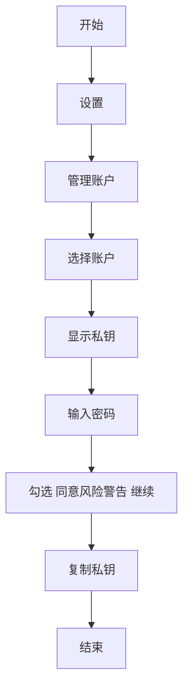

+++
title = "Solana 智能合约终极部署指南：从入门到主网，定制你的专属靓号 Program ID"
description = "Solana 智能合约终极部署指南：从入门到主网，定制你的专属靓号 Program ID"
date = 2025-06-29T10:17:15Z
[taxonomies]
categories = ["Web3", "Solana"]
tags = ["Solana", "Anchor", "Web3"]
+++

<!-- more -->

# **Solana 智能合约终极部署指南：从入门到主网，定制你的专属靓号 Program ID**

> **保姆级教程：基于 Anchor 框架，带你丝滑完成密钥管理、多环境部署与实战避坑**

还在为 Solana 合约部署的繁琐流程而头疼吗？还在羡慕别人的项目拥有一个以项目名开头、炫酷又易记的合约地址（Program ID）吗？

本篇文章将为你揭开 Solana 开发的神秘面纱，通过强大的 Anchor 框架，手把手带你从零开始，不仅能轻松部署你的第一个智能合约，更能掌握定制专属靓号地址的独家秘笈！无论你是 Solana 开发新手，还是希望优化部署流程的资深玩家，这篇“保姆级”实操教程都将是你不可错过的宝典。让我们一起告别随机生成的无序地址，让你的项目从一个优雅的 Program ID 开始！

本文是一篇面向 Solana 开发者的全流程实战指南，详细介绍了如何使用 Anchor 框架部署智能合约，并重点讲解了如何为合约设置一个自定义的“靓号”地址（Program ID）。

文章内容覆盖了从生成一个具有特定前缀（如 `Red...`）的靓号密钥对，到如何将其正确配置到 Anchor 项目的 `lib.rs` 和 `Anchor.toml` 文件中的每一步。此外，教程还深入探讨了开发者必备的密钥管理技巧，包括如何从 Phantom 等钱包导出私钥，并生成与 `solana-cli` 兼容的 `.json` 密钥文件，同时清晰地辨析了 `solana-keygen` 和 `solana address` 命令的差异与适用场景。

最后，文章通过本地网络（Localnet）和开发网络（Devnet）的真实部署案例，演示了完整的部署流程，并指出了在本地环境中可能遇到的权限问题及其解决方案，确保读者能够顺利地将自己的合约发布到 Solana 的公共网络上。

## 自定义地址（靓号地址）设置成项目合约地址（Program ID）实操 （可省略）

### 第一步：创建一个以 `Red` 开头的、易于识别的程序ID (Program ID)

```bash
➜ solana-keygen grind --starts-with Red:1
Searching with 12 threads for:
        1 pubkey that starts with 'Red' and ends with ''
Searched 1000000 keypairs in 1s. 0 matches found.
Searched 2000000 keypairs in 2s. 0 matches found.
Searched 3000000 keypairs in 4s. 0 matches found.
Searched 4000000 keypairs in 6s. 0 matches found.
Searched 5000000 keypairs in 7s. 0 matches found.
Wrote keypair to RedGJbeNejUtP6vMEPDkG55yRf7oAbkMFGeDjXaNfe1.json

```

**使用 `solana-keygen grind` 命令生成以特定前缀开头的 Solana 密钥对**

`solana-keygen new` 和 `solana-keygen grind` 生成的都是通用的密钥对。这个密钥对既可以被当成钱包来接收资产，也可以被用来部署合约而成为合约地址。它到底是什么，完全取决于你如何去使用它。

### 第二步：替换文件

将您用 `grind` 生成的靓号密钥对文件，复制并重命名，覆盖掉 `target/deploy/` 目录下的那个临时文件。

```bash
cp -a RedGJbeNejUtP6vMEPDkG55yRf7oAbkMFGeDjXaNfe1.json ../target/deploy/red_packet-keypair.json
```

### 第三步：查询程序ID

```bash
➜ solana address -k ./target/deploy/red_packet-keypair.json 
RedGJbeNejUtP6vMEPDkG55yRf7oAbkMFGeDjXaNfe1

```

### 第四步： **更新 `lib.rs` 文件**

从你的靓号密钥对中复制出**公钥（地址）**，然后粘贴到 `src/lib.rs` 文件顶部的 `declare_id!` 宏里面。

```rust
use anchor_lang::prelude::*;

declare_id!("RedGJbeNejUtP6vMEPDkG55yRf7oAbkMFGeDjXaNfe1");
```

### 第五步：更新 `Anchor.toml` 文件

将新地址更新到项目配置文件中。这能确保你的测试和客户端代码能正确找到程序。

```toml
# Anchor.toml

[programs.Mainnet]
red_packet = "RedGJbeNejUtP6vMEPDkG55yRf7oAbkMFGeDjXaNfe1"

[programs.devnet]
red_packet = "RedGJbeNejUtP6vMEPDkG55yRf7oAbkMFGeDjXaNfe1"

[programs.localnet]
red_packet = "RedGJbeNejUtP6vMEPDkG55yRf7oAbkMFGeDjXaNfe1"
```

## 使用脚本生成 Solana 密钥文件

默认情况下，`anchor` 和 `solana` 的命令行工具会使用您系统默认的钱包地址，通常位于 `~/.config/solana/id.json`。这个钱包地址主要用于**支付部署和交易的 Gas 费**，并且会成为您部署的程序的**升级权限管理者** (Upgrade Authority)。

### 第一步：从 Phantom 钱包导出私钥





### 第二步：使用脚本生成密钥文件（如有可忽略）

从已有的私钥生成 Solana 和 Anchor 工具所需要的 `.json` 密钥文件。

#### 创建项目并初始化

```bash
mkdir solana-wallet-demo && cd solanan-wallet-demo
pnpm init
```

#### 安装依赖

```bash
pnpm add @solana/web3.js bs58
```

#### create-wallet.ts 文件

```ts
import { Keypair } from "@solana/web3.js";
import bs58 from "bs58";
import fs from "fs";

// --- 步骤 1: 在这里粘贴你的 Base58 格式私钥 ---
const privateKeyBase58 =
  "5xcxxxxxxxxxxxxxxxxxxxxxxxx";

try {
  // 步骤 2: 将 Base58 私钥解码为字节数组 (Uint8Array)
  const secretKeyBytes = bs58.decode(privateKeyBase58);

  // 步骤 3: 从解码后的密钥创建 Keypair 对象
  // Keypair.fromSecretKey 会自动处理，无论输入是32字节的纯私钥还是64字节的密钥对
  const keypair = Keypair.fromSecretKey(secretKeyBytes);

  // 步骤 4: 将完整的密钥对（64字节）转换为数组格式
  const keypairArray = Array.from(keypair.secretKey);

  // 步骤 5: 将数组写入 .json 文件
  const fileName = "6SWBzQWZndeaCKg3AzbY3zkvapCu9bHFZv12iiRoGvCD.json";
  fs.writeFileSync(fileName, JSON.stringify(keypairArray));

  console.log(`✅ 文件 ${fileName} 已成功生成!`);
  console.log(`🔑 你的钱包地址 (公钥) 是: ${keypair.publicKey.toBase58()}`);
  console.log("请验证这个地址是否与您预期的地址一致。");
} catch (error) {
  if (error instanceof Error) {
    console.error("❌ 生成失败，请检查你的私钥格式是否正确。", error.message);
  } else {
    console.error("❌ 生成失败，请检查你的私钥格式是否正确。", error);
  }
}

```

#### 执行脚本生成密钥文件

```bash
Code/Solana/solana-wallet-demo is 📦 1.0.0 via ⬢ v23.11.0 on 🐳 v28.2.2 (orbstack) 
➜ ts-node src/create-wallet.ts 
✅ 文件 6SWBzQWZndeaCKg3AzbY3zkvapCu9bHFZv12iiRoGvCD.json 已成功生成!
🔑 你的钱包地址 (公钥) 是: 6SWBzQWZndeaCKg3AzbY3zkvapCu9bHFZv12iiRoGvCD
请验证这个地址是否与您预期的地址一致。

```

脚本执行后，同样会生成一个 `.json` 文件，并且会打印出对应的钱包地址（公钥），您可以用来核对是否正确。

### 第三步：查看确认钱包地址

```bash
Code/Solana/solana-wallet-demo is 📦 1.0.0 via ⬢ v23.11.0 on 🐳 v28.2.2 (orbstack) 
➜ solana-keygen pubkey 6SWBzQWZndeaCKg3AzbY3zkvapCu9bHFZv12iiRoGvCD.json
6SWBzQWZndeaCKg3AzbY3zkvapCu9bHFZv12iiRoGvCD

Code/Solana/solana-wallet-demo is 📦 1.0.0 via ⬢ v23.11.0 on 🐳 v28.2.2 (orbstack) 
➜ solana address -k 6SWBzQWZndeaCKg3AzbY3zkvapCu9bHFZv12iiRoGvCD.json   
6SWBzQWZndeaCKg3AzbY3zkvapCu9bHFZv12iiRoGvCD

```

简单来说：`solana-keygen` 是一个**专科医生**，只负责处理密钥对；而 `solana` 是一个**全科医生**，负责所有与链上交互的事情，查询地址只是它众多功能中的一项。

下面我们用一个表格来详细对比：

| 特性         | `solana-keygen pubkey ...`                                   | `solana address -k ...`                                      |
| ------------ | ------------------------------------------------------------ | ------------------------------------------------------------ |
| **工具归属** | `solana-keygen`                                              | `solana` (主命令行工具)                                      |
| **核心职责** | **密钥对管理工具** 纯粹的密码学操作                          | **全功能网络交互客户端** 与链上状态和配置打交道              |
| **核心功能** | 从一个密钥对文件中**提取并显示公钥**。它只关心文件本身，不关心任何外部配置。 | **显示钱包地址**。它的主要工作是显示你**当前配置的默认钱包**的地址。 |
| **灵活性**   | **不灵活**。 必须显式提供一个密钥对文件的路径作为参数。      | **非常灵活**。 1. **不带 `-k`**：直接运行 `solana address`，会显示你默认钱包的地址。<br>2. **带 `-k`**：使用 `-k` 参数可以**临时覆盖**默认设置，查询指定文件的地址。 |

### 深入解析

#### `solana-keygen pubkey`：密码学专家

您可以把 `solana-keygen` 看作一个独立的、专注于密码学的工具箱。它的所有功能都围绕着**密钥对（Keypair）**的创建、恢复、查看和签名等本地操作。

- **它的世界里只有“密钥对”**：当您运行 `solana-keygen pubkey` 时，它做的事情非常纯粹：
  1. 读取您提供的 `.json` 文件。
  2. 从文件中的 64 字节数据里，解析出后 32 字节的公钥。
  3. 将公钥进行 Base58 编码后打印出来。
- 它完全不关心您的 Solana CLI 配置，也不知道哪个是您的“默认钱包”。它就像一个只会开锁和验锁的锁匠，你给它一把钥匙（私钥文件），它就告诉你这把钥匙对应的锁头（公钥）长什么样。

#### `solana address`：全能的钱包管家

您可以把 `solana` 看作是您与 Solana 网络交互的“瑞士军刀”。它的所有操作都默认与您**当前设置的钱包**相关联。

- **它的世界里有“默认钱包”的概念**：
  - 当您直接运行 `solana address` 时，它会去查找您的 Solana 配置文件，找到您设置的默认钱包路径（通常是 `~/.config/solana/id.json`），然后显示那个钱包的地址。这是它最主要的用法。
  - 当您使用 `-k` 或 `--keypair` 参数时，您是在对它说：“**先别管我的默认钱包，请临时帮我看一下这个特定文件的地址是什么**”。所以，`-k` 是一个临时的“覆盖”选项。

#### 使用场景总结

- **什么时候用 `solana-keygen pubkey`？**
  - 当你在编写脚本，需要一个简单、无依赖、纯粹的方式从文件中获取公钥时。
  - 当你只想进行本地密钥操作，不想与任何 Solana 配置或网络状态扯上关系时。
- **什么时候用 `solana address`？**
  - 当你想快速查看**自己当前默认钱包的地址**时（直接运行 `solana address`）。
  - 当你想在一个“钱包管理”的语境下，临时查看另一个密钥文件的地址时（使用 `-k`）。这是日常开发和查询中最常用的命令。

#### 结论

虽然殊途同归，但 solana-keygen pubkey 是一个更底层、更纯粹的密码学工具，而 solana address 是一个更高层、面向用户钱包配置的便捷工具。您这次的用法正好命中了它们功能的交集，所以得到了相同的结果。

## **通过助记词生成 Solana 密钥文件**

#### **通过助记词生成 Solana 密钥对**

```bash
solana-keygen recover -o custom-wallet.json
[recover] seed phrase: 
[recover] If this seed phrase has an associated passphrase, enter it now. Otherwise, press ENTER to continue: 
Recovered pubkey `"6SWBzQWZndeaCKg3AzbY3zkvapCu9bHFZv12iiRoGvCD"`. Continue? (y/n): 
y
Wrote recovered keypair to custom-wallet.json
```

按提示输入助记词。

#### 根据您的 `ls -l` 输出，`custom-wallet.json` 文件权限和属性显示如下

```bash
ls -l custom-wallet.json 
-rw-------@ 1 qiaopengjun  staff  226 Jun 29 13:46 custom-wallet.json
```

#### 查看文件内容

```bash
cat custom-wallet.json
[4,70,183,17, ... 230,246]%                                                                                   
```

### 验证密钥对

```bash
solana-keygen verify 6SWBzQWZndeaCKg3AzbY3zkvapCu9bHFZv12iiRoGvCD custom-wallet.json
Verification for public key: 6SWBzQWZndeaCKg3AzbY3zkvapCu9bHFZv12iiRoGvCD: Success
```

根据您的验证结果，`custom-wallet.json` 文件中的密钥对已成功通过验证，对应的公钥为 `6SWBzQWZndeaCKg3AzbY3zkvapCu9bHFZv12iiRoGvCD`。

#### **从密钥文件 `custom-wallet.json` 中提取并显示对应的 Solana 公钥地址**

```bash
solana address -k custom-wallet.json 
6SWBzQWZndeaCKg3AzbY3zkvapCu9bHFZv12iiRoGvCD
```

#### **查询指定密钥文件对应的 Solana 区块链账户信息**

```bash
solana account custom-wallet.json

Public Key: 6SWBzQWZndeaCKg3AzbY3zkvapCu9bHFZv12iiRoGvCD
Balance: 102.70584242 SOL
Owner: 11111111111111111111111111111111
Executable: false
Rent Epoch: 18446744073709551615

```

## 指定钱包地址部署 Solana 合约

### 修改配置文件

直接修改项目根目录下的 `Anchor.toml` 文件。

在文件末尾找到或添加 `[provider]` 部分，并指定 `wallet` 的路径。

```toml
[provider]
cluster = "localnet"
# wallet = "~/.config/solana/id.json"
wallet = "/Users/qiaopengjun/Code/Solana/solana-wallet-demo/6SWBzQWZndeaCKg3AzbY3zkvapCu9bHFZv12iiRoGvCD.json"

```

## 本地部署

### 第一步：启动本地节点

```bash
➜ anchor localnet 
    Finished `release` profile [optimized] target(s) in 0.12s
    Finished `test` profile [unoptimized + debuginfo] target(s) in 0.12s
     Running unittests src/lib.rs (/Users/.../target/debug/deps/red_packet-5c51beafed6b9bf6)
Ledger location: .anchor/test-ledger
Log: .anchor/test-ledger/validator.log
⠤ Initializing...                                                                                                                           Waiting for fees to stabilize 1...
Identity: HMfJQKak1CZc23oSnJbdNC7UjF4RoHDLuP3k2J5QLxW5
Genesis Hash: 4Rw2D9RRqHrv1zagY8GgsLSfJDNSFdoWsBuEMoJny3Zo
Version: 2.2.19
Shred Version: 38176
Gossip Address: 127.0.0.1:1024
TPU Address: 127.0.0.1:1027
JSON RPC URL: http://127.0.0.1:8899
WebSocket PubSub URL: ws://127.0.0.1:8900
⠤ 00:00:17 | Processed Slot: 37 | Confirmed Slot: 37 | Finalized Slot: 6 | Full Snapshot Slot: - | Incremental Snapshot Slot: - | Transactions                       
```

### 第二步： 部署合约

```bash
# 本地部署报错
➜ anchor deploy --provider.cluster localnet 
Deploying cluster: http://127.0.0.1:8899
Upgrade authority: /Users/qiaopengjun/Code/Solana/solana-wallet-demo/6SWBzQWZndeaCKg3AzbY3zkvapCu9bHFZv12iiRoGvCD.json
Deploying program "red_packet"...
Program path: /Users/.../target/deploy/red_packet.so...
Error: Program's authority Some(11111111111111111111111111111111) does not match authority provided 6SWBzQWZndeaCKg3AzbY3zkvapCu9bHFZv12iiRoGvCD
There was a problem deploying: Output { status: ExitStatus(unix_wait_status(256)), stdout: "", stderr: "" }.

# 删除
➜ rm -f target/deploy/red_packet-keypair.json            

# 查看
➜ anchor keys list                         
red_packet: h5cjZ2zEE64kvwMahe1u4PEKy8pZJ9qHmqD7z1VvZz3

# 同步
➜ anchor keys sync
Found incorrect program id declaration in "/Users/.../programs/red_packet/src/lib.rs"
Updated to h5cjZ2zEE64kvwMahe1u4PEKy8pZJ9qHmqD7z1VvZz3

Found incorrect program id declaration in Anchor.toml for the program `red_packet`
Updated to h5cjZ2zEE64kvwMahe1u4PEKy8pZJ9qHmqD7z1VvZz3

All program id declarations are synced.
Please rebuild the program to update the generated artifacts.

# 部署成功
➜ anchor deploy                              
Deploying cluster: http://127.0.0.1:8899
Upgrade authority: /Users/qiaopengjun/Code/Solana/solana-wallet-demo/6SWBzQWZndeaCKg3AzbY3zkvapCu9bHFZv12iiRoGvCD.json
Deploying program "red_packet"...
Program path: /Users/.../target/deploy/red_packet.so...
Program Id: h5cjZ2zEE64kvwMahe1u4PEKy8pZJ9qHmqD7z1VvZz3

Signature: FEPLTofdZEcjQ6jpaQQ25BTQT9VDeTTqAWF6VeDCdnB6qpgH62KvoQgDuxvm7RUd6Nr6EAaDmK2WWGdZCgTKakV

Deploy success
```

**注意**：在本地测试网络 (`localnet`) 中，使用自定义（靓号）程序地址进行部署时，可能会因罕见的本地验证器环境冲突，而导致权限不匹配的部署失败。

**为规避本地环境冲突，本地开发使用随机地址，仅在部署到 Devnet/Mainnet 时替换为自定义地址。**

## 开发测试网 Devnet 部署

### 第一步：修改配置文件 cluster = "devnet"

```bash
[toolchain]
package_manager = "yarn"

[features]
resolution = true
skip-lint = false

[programs.devnet]
red_packet = "Red9fb6BSry45DQfDFzwpp55JVV22VAZJtMofStXHBF"

[programs.localnet]
red_packet = "Red9fb6BSry45DQfDFzwpp55JVV22VAZJtMofStXHBF"

[programs.mainnet]
red_packet = "Red9fb6BSry45DQfDFzwpp55JVV22VAZJtMofStXHBF"

[registry]
url = "https://api.apr.dev"

[provider]
cluster = "devnet"
wallet = "~/Code/Solana/solana-wallet-demo/6SWBzQWZndeaCKg3AzbY3zkvapCu9bHFZv12iiRoGvCD.json"

[scripts]
test = "yarn run ts-mocha -p ./tsconfig.json -t 1000000 tests/**/*.ts"

```

### 第二步：部署实操

```bash
# 以下操作在项目根目录下执行
➜ anchor keys sync
All program id declarations are synced.

➜ anchor keys list
red_packet: Red9fb6BSry45DQfDFzwpp55JVV22VAZJtMofStXHBF

➜ anchor build                             
    Finished `release` profile [optimized] target(s) in 0.44s
    Finished `test` profile [unoptimized + debuginfo] target(s) in 0.39s
     Running unittests src/lib.rs (/Users/qiaopengjun/.../target/debug/deps/red_packet-5c51beafed6b9bf6)

➜ source .env                              

➜ anchor deploy --provider.cluster $RPC_URL
Deploying cluster: https://devnet.helius-rpc.com/?api-key=...
Upgrade authority: /Users/qiaopengjun/Code/Solana/solana-wallet-demo/6SWBzQWZndeaCKg3AzbY3zkvapCu9bHFZv12iiRoGvCD.json
Deploying program "red_packet"...
Program path: /Users/.../target/deploy/red_packet.so...
Program Id: Red9fb6BSry45DQfDFzwpp55JVV22VAZJtMofStXHBF

Signature: 2NGxuVMaBzrsbePk37PniEJWzqTF19qrngeL7xNZXhRCRSYEprqr5hNLXgvaJDBGed8DBpp94rKurV7vJPcKBT4Y

Deploy success
```

终于成功地将合约部署到了公开开发网（Devnet），而且还成功地使用了您想要的**自定义靓号地址** (`Red9fb...`)！

<https://solscan.io/account/Red9fb6BSry45DQfDFzwpp55JVV22VAZJtMofStXHBF?cluster=devnet>

主网 (Mainnet) 部署和 Devnet 一样，只需修改配置文件Anchor.toml 中 `cluster = "mainnet"`即可。

## 总结

经过本文的逐步引导，相信您已经成功掌握了在 Solana 生态中使用 Anchor 框架部署智能合约的全套流程。

我们从一个炫酷的实战技巧——**生成并配置自定义靓号 Program ID**——开始，让您的项目在链上拥有独一无二的身份标识。接着，我们深入探讨了**钱包密钥的管理与使用**，确保您能灵活地将现有钱包作为部署和升级权限的管理方。

在部署实操部分，我们不仅走通了**本地（Localnet）和开发网（Devnet）的部署**，更重要的是，我们点出了本地部署中可能遇到的 `authority` 权限不匹配问题，并给出了 `anchor keys sync` 等命令的解决方案。这正是新手在实践中最容易卡住的环节。

总而言之，一个成功的 Solana 合约部署 = **清晰的项目配置 + 正确的密钥管理 + 熟悉的环境部署命令**。现在，您不仅拥有了将项目发布到 Devnet 的能力，更可以充满信心地将 `cluster` 修改为 `mainnet`，向着主网的星辰大海迈出坚实的一步！

## 参考

- <https://solana.com/zh/docs/programs/rust>
- <https://www.anchor-lang.com/docs/quickstart/local>
- <https://solscan.io/account/Red9fb6BSry45DQfDFzwpp55JVV22VAZJtMofStXHBF?cluster=devnet>
