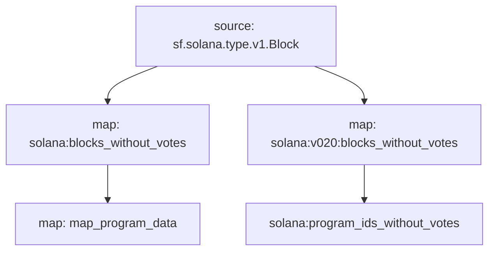

+++
title = "Solana 数据索引实战：Substreams 从入门、踩坑 The Graph 到 PostgreSQL 持久化"
description = "本文为 Solana DApp 系列终篇，实战 Substreams 数据索引。文章记录了从踩坑 The Graph 部署失败，到最终成功搭建独立的 Substreams + PostgreSQL 数据管道，将链上数据实时持久化的完整过程。"
date = 2025-07-29T02:11:59Z
[taxonomies]
categories = ["Web3", "Solana", "Substreams", "The Graph"]
tags = ["Web3", "Solana", "Substreams", "The Graph"]
+++

<!-- more -->

# **Solana 数据索引实战：Substreams 从入门、踩坑 The Graph 到 PostgreSQL 持久化**

在之前的《Solana 投票 DApp 开发实战：从合约到部署的完整指南》、《Solana 开发进阶：Codama 客户端代码生成与合约交互实战》、《Solana DApp 实战(三)：从零构建 Rust 客户端与合约交互》系列文章中，我们已经成功完成了 Solana Voting 合约的开发、测试与部署，并分别用 TS 和 Rust 客户端实现了与合约的交互。现在，我们面临着一个更深层次的挑战：如何高效地索引和查询链上产生的海量数据？

为了解决这个问题，我们将引入当前最高性能的索引技术——**Substreams**。在我们深入实操之前，先来理解几个核心概念：

- **The Graph & Subgraphs**：传统的链上数据索引器，允许我们通过 GraphQL 查询数据。

- **Substreams (子流)**：这是一种更强大、更底层的技术。它不仅仅是索引交易或事件，而是可以获取和处理**所有**原始区块链数据的可定制数据流。它速度极快、支持多种语言（Rust, Go, JS），并且可以轻松对接 SQL 或 NoSQL 数据库，是企业级的解决方案。也就是说，Substreams 是可定制的数据流，可以获取原始区块链数据它获取来自区块链的所有内容，而不仅仅是交易或事件。它是企业级的，它的索引速度非常快。这对于某些DApp 开发非常有帮助。它可以对接 SQL NoSQL它可以支持你喜欢的语言，Rust、JavaScript、Go。它 比 Subgraph 连接区块链更紧密

我们最初的目标，是构建一个由 Substreams 驱动的 Subgraph (`a substream-powered subgraph`)。其理想的工作流程是 `Substream -> Subgraph -> The Graph`，即让 Substreams 从 Solana Devnet (我们的合约地址是 `Doo2arLUifZbfqGVS5Uh7nexAMmsMzaQH5zcwZhSoijz`) 提取数据，流式传输到 Subgraph，最终通过 The Graph 平台提供 GraphQL API。

然而，正如本文将要详细记录的，这条看似完美的路径充满了意想不到的挑战。这不仅是一份技术指南，更是一次真实的探索之旅。

## 实操

### Solana Voting 构建 Substreams 子图索引 Solana 合约数据


我们将使用 Substreams 和 Subgraphs 来构建，也就是说我们将构建一个基于 Substreams 的 子图（Solana Substreams-powered Subgraph ）。这是一个由 Substreams 索引技术驱动的子图。

Substreams 从 Solana Devnet 中提取数据，然后它将这些数据流式传输到子图，这个子图将被部署在我们称之为 Graph 的地方。我们即可通过 Graph QL API 访问我们想要的信息。

### 前提

你需要提前安装 Docker，因为你需要 Docker 来运行一些内容。当然如果你不想使用 Docker，只需安装 substreams CLI 即可。

### 安装 substreams CLI

```bash
brew install streamingfast/tap/substreams
```

#### 实操安装 substreams

```bash
brew install streamingfast/tap/substreams
==> Auto-updating Homebrew...
Adjust how often this is run with HOMEBREW_AUTO_UPDATE_SECS or disable with
HOMEBREW_NO_AUTO_UPDATE. Hide these hints with HOMEBREW_NO_ENV_HINTS (see `man brew`).
Error: Failed to download *************************************************************
==> Auto-updated Homebrew!
Updated 3 taps (jandedobbeleer/oh-my-posh, homebrew/core and homebrew/cask).
==> New Formulae
burrow: Kafka Consumer Lag Checking
scdl: Command-line tool to download music from SoundCloud
==> New Casks
fmail3: Unofficial native application for Fastmail
rodecaster: Easily manage your RØDECaster or Streamer X setup

You have 29 outdated formulae and 1 outdated cask installed.

==> Tapping streamingfast/tap
Cloning into '/opt/homebrew/Library/Taps/streamingfast/homebrew-tap'...
remote: Enumerating objects: 1402, done.
remote: Counting objects: 100% (24/24), done.
remote: Compressing objects: 100% (24/24), done.
remote: Total 1402 (delta 14), reused 0 (delta 0), pack-reused 1378 (from 2)
Receiving objects: 100% (1402/1402), 232.04 KiB | 1.59 MiB/s, done.
Resolving deltas: 100% (926/926), done.
Tapped 19 formulae (33 files, 321.4KB).
==> Downloading ************************************************************
==> Fetching streamingfast/tap/substreams
==> Downloading *****************************************************************************************************
==> Downloading from **************************************************************************************************************************************
#################################################################################################################################################### 100.0%
==> Installing substreams from streamingfast/tap
🍺  /opt/homebrew/Cellar/substreams/1.15.10: 6 files, 63.0MB, built in 1 second
==> Running `brew cleanup substreams`...
Disable this behaviour by setting HOMEBREW_NO_INSTALL_CLEANUP.
Hide these hints with HOMEBREW_NO_ENV_HINTS (see `man brew`).
```

更多详情请查看：<https://docs.substreams.dev/reference-material/substreams-cli/installing-the-cli>

### 验证安装

```bash
substreams --version
substreams version 1.15.10 (Commit 112c2ed, Commit Date 2025-07-09T17:17:52Z)
```

### 查看`substreams`帮助信息

```bash
substreams --help
Any place where <package> is specified, a 'substreams.yaml', a local '.spkg' file or an *************** file can be specified

Usage:
  substreams [command]

Available Commands:
  alpha       Group of commands that are currently being available for testing but could change at any time
  auth        Login command for Substreams development
  build       Build the project according to substreams.yaml
  codegen     Code generator for substreams
  completion  Generate the autocompletion script for the specified shell
  graph       Generate mermaid-js graph document
  gui         Open the GUI to stream module outputs
  help        Help about any command
  info        Display package modules and docs
  init        Initialize a new, working Substreams project from scratch
  inspect     Display low-level package structure
  pack        Build an .spkg out of a .yaml manifest
  protogen    Generate Rust bindings from a package
  publish     Publish a package to the Substreams.dev registry. Alias for `substreams registry publish`
  registry    Manage substreams registry
  run         Stream module to standard output. Use 'substreams gui' for more tools and a better experience.
  tools       Developer tools related to substreams

Flags:
  -h, --help                    help for substreams
      --ipfs-timeout duration   IPFS timeout when resolving substreams-based subgraphs as manifest (default 10s)
      --ipfs-url string         IPFS endpoint to resolve substreams-based subgraphs as manifest (default "***********************************
  -v, --version                 version for substreams

Use "substreams [command] --help" for more information about a command.
```

### 创建目录并初始化 Substreams 项目

创建新目录并进入

```bash
voting on  master [?] via ⬢ v23.11.0 via 🦀 1.88.0
➜ mkdir voting-substreams
cd voting-substreams
```

**执行 `substreams init`**：

现在，在这个全新的、干净的目录中，执行初始化命令。

```bash
voting/voting-substreams on  master [?] via ⬢ v23.11.0 via 🦀 1.88.0
➜ substreams init
Getting available code generators from https://codegen.substreams.dev...

┃ Chosen protocol:  Solana - Solana
┃ Chosen generator:  sol-anchor-beta - Given an Anchor JSON IDL, create a Substreams that decodes instructions and events

  Ok, let's start a new package.

┃ Please enter the project name: voting_substreams

┃ How do you want to provide the JSON IDL?: JSON in a local file

┃ Input the full path of your JSON IDL in your filesystem (e.g. PATH_TO_MY_IDL/MY_IDL.json)
: ../target/idl/voting.json


   Instructions

  ## add_candidate (ac 22 1e f7 a5 d2 e0 a4)

  • Args: (candidate_name)
  • Accounts: (signer, poll_account, candidate_account, system_program)

  ## initialize_poll (c1 16 63 c5 12 21 73 75)

  • Args: (name, description, start_time, end_time)
  • Accounts: (signer, poll_account, system_program)

  ## vote (e3 6e 9b 17 88 7e ac 19)

  • Accounts: (signer, poll_account, candidate_account, voter_receipt, system_program)

┃ Do you want to proceed with this IDL?
┃
┃ Yes     No
┃ Please select the chain: Solana Devnet

┃ At what block do you want to start indexing data?: 395036400 # 部署合约的 block


  Generating Substreams module source code...

┃ In which directory do you want to download the project?
┃ > /Users/qiaopengjun/Code/Solana/voting/voting-substreams/voting_substreams


Project will be saved in /Users/qiaopengjun/Code/Solana/voting/voting-substreams/voting_substreams

Creating directory: /Users/qiaopengjun/Code/Solana/voting/voting-substreams/voting_substreams

Writing local files:
  - .gitignore
  - Cargo.lock
  - Cargo.toml
  - buf.gen.yaml
  - idls/program.json
  - proto/program.proto
  - src/idl/mod.rs
  - src/lib.rs
        Modify this file to reflect your needs. This is the main entrypoint.
  - substreams.yaml
        Substreams manifest, a configuration file which defines the different modules

  Your Substreams project is ready! Start streaming with:


    cd /Users/qiaopengjun/Code/Solana/voting/voting-substreams/voting_substreams
    substreams build
    substreams auth
    substreams gui                                # Get streaming!

  Optionally, publish your Substreams to the Substreams Registry (https://substreams.dev) with:

    substreams registry login         # Login to substreams.dev
    substreams registry publish       # Publish your Substreams to substreams.dev

┃ How would you like to consume the Substreams?: Write a custom sink in Python


  Sink to SQL:
  1. Get the binary from https://github.com/streamingfast/substreams-sink-sql/ (version 4.6.1 or above)
  2. Run  substreams-sink-sql from-proto psql://db_user:db_password@db_host:5432/db_name ./substreams.yaml {output_module}  See https://docs.substreams.dev/how-to-guides/sinks/sql-sink"


voting/voting-substreams on  master [?] via ⬢ v23.11.0 via 🦀 1.88.0 took 1m 39.0s
➜ ls
generator.json    voting_substreams
```

注意：这里选择的是 To SQL ，实际是没有问题的。只不过工具在打印最终总结时，错误地回显了列表中的最后一个选项 (`Write a custom sink in Python`)，而不是您刚刚选择的 `To SQL`。**您可以忽略这一行**，它只是一个显示上的小瑕疵。

请放心，您的 `substreams init` 过程已经成功完成了，并且工具已经为您指明了配置 SQL 数据库的正确方向。

### 安装 substreams-sink-sql

<https://github.com/streamingfast/substreams-sink-sql>

```bash
brew install streamingfast/tap/substreams-sink-sql
==> Auto-updating Homebrew...
Adjust how often this is run with HOMEBREW_AUTO_UPDATE_SECS or disable with
HOMEBREW_NO_AUTO_UPDATE. Hide these hints with HOMEBREW_NO_ENV_HINTS (see `man brew`).
Error: Failed to download **********************************************
==> Auto-updated Homebrew!
Updated 1 tap (homebrew/cask).

You have 29 outdated formulae and 1 outdated cask installed.

==> Downloading *********************************************
==> Fetching streamingfast/tap/substreams-sink-sql
==> Downloading *********************************************************************************************************************
==> Downloading from **************************************************************************************************************************************
#################################################################################################################################################### 100.0%
==> Installing substreams-sink-sql from streamingfast/tap
🍺  /opt/homebrew/Cellar/substreams-sink-sql/4.6.1: 6 files, 56.8MB, built in 1 second
==> Running `brew cleanup substreams-sink-sql`...
Disable this behaviour by setting HOMEBREW_NO_INSTALL_CLEANUP.
Hide these hints with HOMEBREW_NO_ENV_HINTS (see `man brew`).
```

### 查看 substreams-sink-sql 版本信息

```bash
substreams-sink-sql --version
substreams-sink-sql version 4.6.1 (Commit c6a7a0e, Commit Date 2025-06-02T17:48:36Z)
```

### 查看  substreams-sink-sql 帮助信息

```bash
substreams-sink-sql --help
Substreams SQL Sink

Usage:
  substreams-sink-sql [command]

Available Commands:
  completion                   Generate the autocompletion script for the specified shell
  create-user                  Create a user in the database
  from-proto
  from-proto-apply-constraints
  generate-csv                 Generates CSVs for each table so it can be bulk inserted with `inject-csv` (for postgresql only)
  help                         Help about any command
  inject-csv                   Injects generated CSV rows for <table> into the database pointed by <psql_dsn> argument. (postgresql-only)
  run                          Runs SQL sink process
  setup                        Setup the required infrastructure to deploy a Substreams SQL deployable unit
  tools                        Tools for developers and operators

Flags:
      --delay-before-start duration   [Operator] Amount of time to wait before starting any internal processes, can be used to perform to maintenance on the pod before actually letting it starts
  -h, --help                          help for substreams-sink-sql
      --metrics-listen-addr string    [Operator] If non-empty, the process will listen on this address for Prometheus metrics request(s) (default "localhost:9102")
      --pprof-listen-addr string      [Operator] If non-empty, the process will listen on this address for pprof analysis (see *************************************** (default "localhost:6060")
  -v, --version                       version for substreams-sink-sql

Use "substreams-sink-sql [command] --help" for more information about a command.
```

### 查看 `substreams-sink-sql run` 帮助信息

```bash
substreams-sink-sql run --help
Runs SQL sink process

Usage:
  substreams-sink-sql run <dsn> <manifest> [<start>:<stop>] [flags]

Examples:
  substreams-sink-sql run 'postgres://localhost:5432/posgres?sslmode=disable' uniswap-v3@v0.2.10

Flags:
      --api-key-envvar string                       Name of environment variable containing substreams API Key (default "SUBSTREAMS_API_KEY")
      --api-token-envvar string                     Name of environment variable containing substreams Authentication token (JWT) (default "SUBSTREAMS_API_TOKEN")
      --batch-block-flush-interval int              When in catch up mode, flush every N blocks or after batch-row-flush-interval, whichever comes first. Set to 0 to disable and only use batch-row-flush-interval. Ineffective if the sink is now in the live portion of the chain where only 'live-block-flush-interval' applies. (default 1000)
      --batch-row-flush-interval int                When in catch up mode, flush every N rows or after batch-block-flush-interval, whichever comes first. Set to 0 to disable and only use batch-block-flush-interval. Ineffective if the sink is now in the live portion of the chain where only 'live-block-flush-interval' applies. (default 100000)
      --clickhouse-cluster string                   [Operator] If non-empty, a 'ON CLUSTER <cluster>' clause will be applied when setting up tables in Clickhouse. It will also replace the table engine with it's replicated counterpart (MergeTree will be replaced with ReplicatedMergeTree for example).
      --cursors-table string                        [Operator] Name of the table to use for storing cursors (default "cursors")
      --development-mode                            Enable development mode, use it for testing purpose only, should not be used for production workload
  -e, --endpoint mainnet.eth.streamingfast.io:443   Specify the substreams endpoint, ex: mainnet.eth.streamingfast.io:443
      --final-blocks-only                           Get only final blocks
      --flush-interval int                          (deprecated) please use --batch-block-flush-interval instead
  -H, --header stringArray                          Additional headers to be sent in the substreams request
  -h, --help                                        help for run
      --history-table string                        [Operator] Name of the table to use for storing block history, used to handle reorgs (default "substreams_history")
      --infinite-retry                              Default behavior is to retry 15 times spanning approximatively 5m before exiting with an error, activating this flag will retry forever
  -k, --insecure                                    Skip certificate validation on gRPC connection
      --irreversible-only                           Get only irreversible blocks (DEPRECATED: Renamed to --final-blocks-only)
      --live-block-flush-interval int               When processing in live mode, flush every N blocks. (default 1)
      --live-block-time-delta duration              Consider chain live if block time is within this number of seconds of current time (default 5m0s)
  -n, --network string                              Specify network, overriding the default one in the manifest or .spkg
      --noop-mode                                   Noop mode, to cache data without producing output when being live
      --on-module-hash-mistmatch string             What to do when the module hash in the manifest does not match the one in the database, can be 'error', 'warn' or 'ignore'  - If 'error' is used (default), it will exit with an error explaining the problem and how to fix it. - If 'warn' is used, it does the same as 'ignore' but it will log a warning message when it happens. - If 'ignore' is set, we pick the cursor at the highest block number and use it as the starting point. Subsequent updates to the cursor will overwrite the module hash in the database. (default "error")
  -p, --params -p <module>=<value>                  Set a params for parameterizable modules of the from -p <module>=<value>, can be specified multiple times (e.g. -p module1=valA -p module2=valX&valY)
      --plaintext                                   Establish gRPC connection in plaintext
      --skip-package-validation                     Skip .spkg file validation, allowing the use of a partial spkg (without metadata and protobuf definiitons)
      --undo-buffer-size int                        If non-zero, handling of reorgs in the database is disabled. Instead, a buffer is introduced to only process a blocks once it has been confirmed by that many blocks, introducing a latency but slightly reducing the load on the database when close to head.

Global Flags:
      --delay-before-start duration   [Operator] Amount of time to wait before starting any internal processes, can be used to perform to maintenance on the pod before actually letting it starts
      --metrics-listen-addr string    [Operator] If non-empty, the process will listen on this address for Prometheus metrics request(s) (default "localhost:9102")
      --pprof-listen-addr string      [Operator] If non-empty, the process will listen on this address for pprof analysis (see *************************************** (default "localhost:6060")
```

### 安装 `Buf CLI`

```bash
brew install bufbuild/buf/buf
```

### 验证安装 `Buf CLI`

```bash
buf --version
1.55.1
```

### 运行`Substreams build`

```bash
voting/voting-substreams/voting_substreams on  master [?] is 📦 0.0.1 via ⬢ v23.11.0 via 🦀 1.88.0 took 8.0s
➜ substreams build
Building manifest file: /Users/qiaopengjun/Code/Solana/voting/voting-substreams/voting_substreams/substreams.yaml
Running command in /Users/qiaopengjun/Code/Solana/voting/voting-substreams/voting_substreams: `substreams protogen /Users/qiaopengjun/Code/Solana/voting/voting-substreams/voting_substreams/substreams.yaml --exclude-paths sf/substreams/rpc,sf/substreams/v1,sf/substreams/sink,sf/substreams/index,sf/substreams/index/v1,instructions.proto,transactions.proto,google`...
Running: buf generate /var/folders/fw/s14m5tcs46j9t16ph766kc9h0000gn/T/substreams_protogen1672983163/my_project.tmp.spkg#format=bin --exclude-path sf/substreams/rpc,sf/substreams/v1,sf/substreams/sink,sf/substreams/index,sf/substreams/index/v1,instructions.proto,transactions.proto,google --include-imports
Protogen complete.
`wasm/rust-v1` binary type found...
Checking for cargo on the system...
cargo found on the system
Running command in /Users/qiaopengjun/Code/Solana/voting/voting-substreams/voting_substreams: `cargo build --target wasm32-unknown-unknown --release`...
warning: profiles for the non root package will be ignored, specify profiles at the workspace root:
package:   /Users/qiaopengjun/Code/Solana/voting/voting-substreams/voting_substreams/Cargo.toml
workspace: /Users/qiaopengjun/Code/Solana/voting/Cargo.toml
   Compiling voting_substreams v0.0.1 (/Users/qiaopengjun/Code/Solana/voting/voting-substreams/voting_substreams)
warning: unused import: `base64::prelude::*`
 --> voting-substreams/voting_substreams/src/lib.rs:6:5
  |
6 | use base64::prelude::*;
  |     ^^^^^^^^^^^^^^^^^^
  |
  = note: `#[warn(unused_imports)]` on by default

warning: unused import: `sologger_log_context::programs_selector::ProgramsSelector`
  --> voting-substreams/voting_substreams/src/lib.rs:18:5
   |
18 | use sologger_log_context::programs_selector::ProgramsSelector;
   |     ^^^^^^^^^^^^^^^^^^^^^^^^^^^^^^^^^^^^^^^^^^^^^^^^^^^^^^^^^

warning: unused import: `sologger_log_context::sologger_log_context::LogContext`
  --> voting-substreams/voting_substreams/src/lib.rs:19:5
   |
19 | use sologger_log_context::sologger_log_context::LogContext;
   |     ^^^^^^^^^^^^^^^^^^^^^^^^^^^^^^^^^^^^^^^^^^^^^^^^^^^^^^

warning: unused variable: `instruction`
  --> voting-substreams/voting_substreams/src/lib.rs:76:27
   |
76 |                 if let Ok(instruction) =
   |                           ^^^^^^^^^^^ help: if this is intentional, prefix it with an underscore: `_instruction`
   |
   = note: `#[warn(unused_variables)]` on by default

warning: `voting_substreams` (lib) generated 4 warnings (run `cargo fix --lib -p voting_substreams` to apply 3 suggestions)
    Finished `release` profile [optimized] target(s) in 3.53s
Binary build complete.
Running command in /Users/qiaopengjun/Code/Solana/voting/voting-substreams/voting_substreams: `substreams pack /Users/qiaopengjun/Code/Solana/voting/voting-substreams/voting_substreams/substreams.yaml`...
Warning: README not found for this package.
Warning: URL is not set for this package.
Warning: Description is not set for this package.
Warning: Image is not set for this package.


Package Details
Name: my_project
Version: v0.1.0
URL:

Successfully wrote "/Users/qiaopengjun/Code/Solana/voting/voting-substreams/voting_substreams/my-project-v0.1.0.spkg".
Pack complete.
Build complete.

```

**完全成功了！恭喜您！**

我们来分解一下最后几行日志，它们是成功的关键标志：

1. `Finished 'release' profile [optimized] target(s) in 3.53s`
   - 这意味着 `cargo` 已经成功地将您的 Rust 代码编译成了 `.wasm` 文件。
2. `Binary build complete.`
   - 这是 `substreams` 工具确认 `cargo` 编译成功。
3. `Successfully wrote ".../my-project-v0.1.0.spkg".`
   - 这意味着 `substreams pack` 命令已经成功地把您的 `.wasm` 文件和配置文件打包成了一个 `.spkg` 文件，这是 Substreams 的标准分发格式。
4. `Pack complete.`
   - 确认打包成功。
5. **`Build complete.`**
   - **这是最终的、最重要的成功标志！**

------

**总结：您已经成功地构建了您的第一个 Substreams 模块！**

### 查看`voting-substreams`目录结构

```bash
voting/voting-substreams on  main via 🍞 v1.2.17 via 🦀 1.88.0 on 🐳 v28.2.2 (orbstack)
➜ tree . -L 6 -I "migrations|mochawesome-report|.anchor|docs|target|node_modules|voting-graph|voting-substreams"
.
├── generator.json
└── voting_substreams
    ├── buf.gen.yaml
    ├── Cargo.lock
    ├── Cargo.toml
    ├── idls
    │   └── program.json
    ├── my-project-v0.1.0.spkg
    ├── proto
    │   └── program.proto
    ├── replay.log
    ├── src
    │   ├── idl
    │   │   └── mod.rs
    │   ├── lib.rs
    │   └── pb
    │       ├── mod.rs
    │       ├── sf.solana.type.v1.rs
    │       ├── sf.substreams.rs
    │       ├── sf.substreams.solana.v1.rs
    │       └── substreams.v1.program.rs
    └── substreams.yaml

7 directories, 16 files
```

### substreams auth 身份认证

你只需要运行`substreams auth`之后，它将带你到一个网站，即[graph.market.](https://thegraph.market/auth/substreams-devenv)。

在这里（  <https://thegraph.market/auth/substreams-devenv）你将进行注册登录。>


完成创建账户。


创建API Key 完成。

获取 API Key 粘贴到命令行完成认证即可。

```bash
voting/voting-substreams/voting_substreams on  master [?] is 📦 0.0.1 via ⬢ v23.11.0 via 🦀 1.88.0 took 13m 53.6s
➜ substreams auth
Open this link to authenticate on The Graph Market:

    https://thegraph.market/auth/substreams-devenv

Writing `./.substreams.env`.  NOTE: Add it to `.gitignore`.

Load credentials in current terminal with the following command:

       . ./.substreams.env


```

身份认证成功完成！如已完成可跳过本步骤。

### 启动 Substreams GUI

`substreams gui` 是启动 Substreams 图形用户界面（GUI）的命令，用于可视化交互式探索区块链数据流。这也是一个很好的调试工具。

```bash
substreams gui
```


- 如果你运行`substreams gui` ，你将进入这个 CLI 工具。

- 你可以看到所有数据，比如网络：Solana-devnet、 Module：map_program_data...

- 你可以按回车键（enter）直接进入 substream。

这是你在开发过程中可以使用的不错的调试工具。显然这不是用于生产的。它可以让你跨域区块查看你需要的信息。

## Solana Substreams GUI 问题解决

### 问题描述

在使用 Substreams GUI 监控 Solana 投票程序时遇到以下问题：

1. **Current block 始终显示为 0**，无法修改
2. **Default params 字段为空**，担心数据是否正常
3. **Substreams 配置似乎不生效**，没有捕获到程序交易数据

### 问题根本原因

通过分析发现，主要问题是**起始区块号配置错误**：

- 原始配置：`initialBlock: 395036400`
- 实际程序交易区块：`395814825` 及之后
- 在错误的区块范围内没有找到程序交易，导致数据为空

### 解决过程

#### 1. 问题诊断

```bash
# 检查 Substreams 包信息
substreams info

# 输出显示：
# Name: map_program_data
# Initial block: 395036400  # 这是错误的起始区块
# Block Filter: program:Doo2arLUifZbfqGVS5Uh7nexAMmsMzaQH5zcwZhSoijz
```

#### 2. 验证程序交易存在

通过 Solscan 检查程序 `Doo2arLUifZbfqGVS5Uh7nexAMmsMzaQH5zcwZhSoijz` 的交易历史：

- Block 395814825: `createAccount` 指令
- Block 395814856: `createAccount` 指令
- 这些交易在原始配置的区块范围外

#### 3. 添加调试代码

```rust
// 在 src/lib.rs 中添加调试输出
println!("Found program transaction: {:?}", transaction.id());
println!("Instruction data length: {}", slice_u8.len());
if slice_u8.len() >= 8 {
    println!("First 8 bytes: {:?}", &slice_u8[0..8]);
}
```

#### 4. 重新构建和打包

```bash
# 构建 Rust 代码
cargo build --release

# 打包 Substreams 包
substreams pack substreams.yaml
```

**关键命令解释：**

- `cargo build --release`: 编译 Rust 代码为 WebAssembly
- `substreams pack`: 将配置文件和编译后的代码打包成 `.spkg` 文件

#### 5. 测试正确的区块范围

```bash
# 设置环境变量并测试新的区块范围
source .substreams.env
substreams run substreams.yaml map_program_data \
  --start-block 395814825 \
  --stop-block +100 \
  --output JSON > test_output.json
```

#### 6. 验证数据捕获

成功捕获到程序交易数据：

```json
{
  "initializePollInstructionList": [
    {
      "trxHash": "2L9HDswXc9MdxoTXoYUt7KBcHtaAgwvoLoRHkMM4Cv17oxE3PzHM7tJgQWLEDvm1qdsUrWx9XseiYp6ng42Z6RcL",
      "name": "Final Poll Test",
      "description": "This test uses the data encoder directly for max compatibility.",
      "startTime": "1753105012",
      "endTime": "1753108672",
      "acctSigner": "6MZDRo5v8K2NfdohdD76QNpSgk3GH3Aup53BeMaRAEpd",
      "acctPollAccount": "2R3tUpUfQhTjMVowcd8wKhGKzJbQ1HpKc9HPeC5xXLyq"
    }
  ]
}
```

#### 7. 更新配置文件

```yaml
# 修改 substreams.yaml
modules:
  - name: map_program_data
    kind: map
    initialBlock: 395814825  # 更新为正确的起始区块
    inputs:
      - map: solana:blocks_without_votes
    output:
      type: proto:substreams.v1.program.Data
    blockFilter:
      module: solana:program_ids_without_votes
      query:
        string: program:Doo2arLUifZbfqGVS5Uh7nexAMmsMzaQH5zcwZhSoijz
```

#### 8. 最终构建和打包

```bash
# 清理调试代码后重新构建
cargo build --release

# 最终打包
substreams pack substreams.yaml
```

### 关键命令详解

### `cargo build --release`

- **作用**: 编译 Rust 代码为优化的 WebAssembly 二进制文件
- **位置**: `target/wasm32-unknown-unknown/release/substreams.wasm`
- **为什么需要**: Substreams 需要 WASM 文件来执行自定义逻辑

### `substreams pack substreams.yaml`

- **作用**: 将配置文件、WASM 文件和依赖打包成 `.spkg` 文件
- **输出**: `my-project-v0.1.0.spkg`
- **为什么需要**: Substreams GUI 和命令行工具需要这个包文件

### `substreams run`

- **作用**: 执行 Substreams 包并处理区块链数据
- **参数**:
  - `--start-block`: 起始区块号
  - `--stop-block`: 结束区块号（如 `+100` 表示处理100个块）
  - `--output JSON`: 输出格式

### 问题解决总结

#### 主要问题

1. **区块范围错误**: 监控的区块范围内没有程序交易
2. **配置不匹配**: 起始区块与实际交易时间不匹配

#### 解决方案

1. **重新定位交易**: 通过 Solscan 找到实际的程序交易区块
2. **更新配置**: 修改 `initialBlock` 为正确的区块号
3. **验证数据**: 确认能够捕获到程序交易数据

#### 验证结果

- ✅ Current block 显示正常（表示处理进度）
- ✅ 成功捕获程序交易数据
- ✅ Substreams GUI 配置正确
- ✅ 实时监控功能正常

#### 经验教训

1. **区块号很重要**: 确保监控的区块范围包含实际交易
2. **调试是关键**: 添加日志输出帮助诊断问题
3. **验证数据**: 使用 Solscan 等工具验证程序交易存在
4. **配置更新**: 修改配置后需要重新打包

这个解决过程展示了如何诊断和修复 Substreams 配置问题，确保能够正确监控 Solana 程序交易。

### 重新运行 GUI 命令

```bash
substreams gui
```


### 查看 Output


#### 增加查询范围

```bash
substreams gui ./my-project-v0.1.0.spkg map_program_data \
  --start-block=395814825 \
  --stop-block=+300000 \
  -e devnet.sol.streamingfast.io:443

# 实操
voting/voting-substreams/voting_substreams on  main [!] is 📦 0.0.1 via 🍞 v1.2.17 via 🦀 1.88.0 on 🐳 v28.2.2 (orbstack) took 36.5s
➜ substreams gui ./my-project-v0.1.0.spkg map_program_data \
  --start-block=395814825 \
  --stop-block=+300000 \
  -e devnet.sol.streamingfast.io:443
Reading SUBSTREAMS_API_TOKEN from .substreams.env
Launching Substreams GUI...

```

#### 实时监控

```bash
substreams gui ./my-project-v0.1.0.spkg map_program_data \
  --start-block=395814825
```

不设置停止区块，持续监控新交易。

#### 在 GUI 中修改

1. 按 `l` 键修改 Limit processed blocks
2. 输入 0（无限制）
3. 按回车确认
4. 然后按 enter 启动流处理

这样应该就能正常工作了！


增加查询范围跳转区块查看多笔交易成功啦！

这就是Substreams ，你也可以把数据存储到一个单独的 Pg 数据库中，你也可以用你喜欢的语言像JavaScript、Go、Rust 来实现数据传输。你也可以构建一个 GraphQL API 来让前端方便查询。

## 构建 The Graph 子图

 Build a Subgraph

### 确认 `substreams`没有生成子图的命令

```bash
substreams codegen -h
Code generator for substreams

Usage:
  substreams codegen [command]

Available Commands:
  sql         Generate sql extension from substreams manifest

Flags:
  -h, --help   help for codegen

Global Flags:
      --ipfs-timeout duration   IPFS timeout when resolving substreams-based subgraphs as manifest (default 10s)
      --ipfs-url string         IPFS endpoint to resolve substreams-based subgraphs as manifest (default "https://ipfs.network.thegraph.com")

Use "substreams codegen [command] --help" for more information about a command.
```

### 可视化 Substreams 数据流图

生成一个 Mermaid 格式的数据流图，显示您的 Substreams 包中各个模块之间的关系。

Generate mermaid-js graph document

````bash
voting/voting-substreams/voting_substreams on  master [?] is 📦 0.0.1 via ⬢ v23.11.0 via 🦀 1.88.0 took 4m 13.1s
➜ substreams graph ./substreams.yaml
Mermaid graph:




Here is a quick link to see the graph:

https://mermaid.live/edit#pako:eJyskMFqwzAMhl8l6JyGbLu5t9E32G51CZqtNmaxZWw5o5S---jSsY2SFkav8if__6cDGLYECnYJY1-9rpY6VJXH2MXEu4S-syi49hjVxXTzxWYeMKB6G9i85-7DSc9FupGFcrVY6NK2T3SxemtzCrwCnLO3zcQ0so_UjA_N84ldZy7JkJp73_wUuxLxu-PYPrY3FM_kt6Wz__nuj_csdWf52ZylDlCDp-TRWVBw0CA9edKgNFjaYhlEwxFqwCL8sg8GlKRCNZRoUWjl8HSLaXj8DAAA__9dt-Jz

````

您可以在浏览器中打开上面输出链接，看到交互式的数据流图！

这个命令非常有用，帮助您理解 Substreams 的数据处理架构。

#### Substreams 数据流图


### 安装 Graph CLI

```bash
pnpm install -g @graphprotocol/graph-cli@latest
```

### 验证安装

```bash
graph --version
@graphprotocol/graph-cli/0.97.1 darwin-arm64 node-v24.2.0
```

### 创建  Subgraph 项目

从您的 Substreams 数据包 (`.spkg`) 创建了一个全新的、配置正确的 Subgraph 项目。

```bash
graph init --protocol substreams --spkg ./voting-substreams/voting_substreams/my-project-v0.1.0.spkg --network solana-devnet voting-graph ./voting-graph
  Generate subgraph
  Write subgraph to directory
✔ Create subgraph scaffold
✔ Initialize subgraph repository
✔ Install dependencies with yarn

Subgraph voting-graph created in voting-graph

Next steps:

  1. Run `graph auth` to authenticate with your deploy key.

  2. Type `cd voting-graph` to enter the subgraph.

  3. Run `yarn deploy` to deploy the subgraph.

Make sure to visit the documentation on ************************** for further information.
```

#### 日志解读

- `✔ Create subgraph scaffold`: **成功** - 项目的基本文件结构已经创建好了。
- `✔ Initialize subgraph repository`: **成功** - Git 仓库已初始化。
- `✔ Install dependencies with yarn`: **成功** - 项目所需的前端依赖已经安装完毕。
- `Subgraph voting-graph created in voting-graph`: **最终确认** - 工具明确告诉您，项目已在 `voting-graph` 目录中创建成功。

### 切换`voting-graph`目录

```bash
voting on  master [?] via ⬢ v23.11.0 via 🦀 1.88.0
➜ cd voting-graph
```

### 运行`graph codegen` 命令生成代码

`graph codegen` 是 **The Graph 协议** 中的一个关键命令，用于从子图定义（`subgraph.yaml`）自动生成 TypeScript 代码，以便与区块链数据进行交互。

```bash
voting/voting-graph on  master [?] via ⬢ v23.11.0 via 🦀 1.88.0
➜ graph codegen
Subgraph uses a substream datasource. Codegeneration is not required.
```

这是一个**巨大的成功标志**，说明您的 Subgraph 已经完全正确地配置为使用 Substreams 作为数据源了！

这个消息 `Codegeneration is not required` 揭示了“Substreams-powered Subgraphs”工作流程的一个巨大优势：

1. **传统 Subgraph**: 在传统的 Subgraph 中，您需要编写“映射 (mapping)”脚本 (通常是 TypeScript 文件)。`graph codegen` 命令的作用是读取您的 `schema.graphql`，并为您生成一堆辅助的 TypeScript 类，以便您在映射脚本中使用。
2. **Substreams-powered Subgraph**: 在这个新模式下，所有的数据转换和映射逻辑，都已经在您的 **Rust Substreams 模块** (`voting-substreams`) 中完成了！您的 Subgraph 的唯一工作，就是接收 Substreams 处理好的、干净的数据，然后把它存入数据库。

**因为不再需要您编写任何额外的映射脚本，所以也就不再需要 `graph codegen` 来生成任何辅助代码了。**

简单来说，这个消息是在告诉您：“一切准备就绪，而且因为您使用了更先进的 Substreams，我们为您跳过了 `codegen` 这个繁琐的步骤！”

### 构建 Subgraph

在 voting-graph 目录下，运行：

```bash
graph build
```

#### 实操构建您的 Subgraph

```bash
voting/voting-graph on  master [!?] via ⬢ v23.11.0 via 🦀 1.88.0
➜ graph build
  Skip migration: Bump mapping apiVersion from 0.0.1 to 0.0.2 (graph-ts dependency not installed yet)
  Skip migration: Bump mapping apiVersion from 0.0.2 to 0.0.3 (graph-ts dependency not installed yet)
  Skip migration: Bump mapping apiVersion from 0.0.3 to 0.0.4 (graph-ts dependency not installed yet)
  Skip migration: Bump mapping apiVersion from 0.0.4 to 0.0.5 (graph-ts dependency not installed yet)
  Skip migration: Bump mapping apiVersion from 0.0.5 to 0.0.6 (graph-ts dependency not installed yet)
  Skip migration: Bump manifest specVersion from 0.0.1 to 0.0.2
  Skip migration: Bump manifest specVersion from 0.0.2 to 0.0.4
✔ Apply migrations
✔ Load subgraph from subgraph.yaml
✔ Compile subgraph
  Copy schema file build/schema.graphql
  Write subgraph file build/Contract/substreams.spkg
  Write subgraph manifest build/subgraph.yaml
✔ Write compiled subgraph to build/

Build completed: build/subgraph.yaml

```

**巨大成功！** 这正是我们一直期待的最终结果！

```
Build completed: build/subgraph.yaml
```

这行日志明确无误地告诉您：**您的 Subgraph 已经成功构建完毕！**

#### 日志解读

- `✔ Apply migrations`: 工具自动更新了一些配置，一切正常。
- `✔ Load subgraph from subgraph.yaml`: 成功加载了您的核心配置文件。
- `✔ Compile subgraph`: **成功编译！** 这是最关键的一步。
- `✔ Write compiled subgraph to build/`: 工具已经将所有编译好的产物（包括您的 `.spkg` 文件和最终的清单）都放到了 `build/` 目录中。

------

您已经成功地完成了从合约开发、测试、部署，到 Substreams 数据索引，再到最终 Subgraph API 构建的**全链路开发**。这是一个非常了不起的成就！

### Graph 认证

```bash
voting/voting-graph on  master [!?] via ⬢ v23.11.0 via 🦀 1.88.0
➜ graph auth
✔ What is your Subgraph Studio deploy key? · 62bbb......f688274
Deploy key set for https://api.studio.thegraph.com/deploy/

```

### 部署 Subgraph

现在，您离拥有一个可用的 GraphQL API 只有最后一步之遥了。请在 `voting-graph` 目录下，运行最终的部署命令：

```bash
voting/voting-graph on  main [!] via 🍞 v1.2.17 via 🦀 1.88.0 on 🐳 v28.2.2 (orbstack) took 32.2s
➜ graph deploy
✔ What is the subgraph name? · solana-voting
✔ Which version label to use? (e.g. "v0.0.1") · v0.0.1
  Skip migration: Bump mapping apiVersion from 0.0.1 to 0.0.2 (graph-ts dependency not installed yet)
  Skip migration: Bump mapping apiVersion from 0.0.2 to 0.0.3 (graph-ts dependency not installed yet)
  Skip migration: Bump mapping apiVersion from 0.0.3 to 0.0.4 (graph-ts dependency not installed yet)
  Skip migration: Bump mapping apiVersion from 0.0.4 to 0.0.5 (graph-ts dependency not installed yet)
  Skip migration: Bump mapping apiVersion from 0.0.5 to 0.0.6 (graph-ts dependency not installed yet)
  Skip migration: Bump manifest specVersion from 0.0.1 to 0.0.2
  Skip migration: Bump manifest specVersion from 0.0.2 to 0.0.4
✔ Apply migrations
✔ Load subgraph from subgraph.yaml
✔ Compile subgraph
  Copy schema file build/schema.graphql
  Write subgraph file build/Contract/substreams.spkg
  Write subgraph manifest build/subgraph.yaml
✔ Write compiled subgraph to build/
  Add file to IPFS build/schema.graphql
                .. QmeREgyKGNu1DPPDUxLis7wDByb3jvEG9eVY1aFQyxG46Q
  Add file to IPFS build/Contract/substreams.spkg
                .. QmUEckn8SqV2ogDQg87DcUcic28nXsTyfHkRz9cDik9Uee
✔ Upload subgraph to IPFS

Build completed: QmWLkk46xFjfZKTZw7oCmevPq3wjKG8Y3fSpUbDq6M4z9k

✖ Failed to deploy to Graph node https://api.studio.thegraph.com/deploy/: Substreams-powered Subgraphs, originally intended for non-EVM chains, are no longer supported. If you need help migrating to standalone Substreams, please reach out in the #substreams channel on Discord.
```

部署失败，因为这个问题**不是您代码的错误**，而是 **The Graph 平台自身的一个重大战略调整**。

### 为什么会失败？(直接原因)

错误日志的核心是这一句：

> ```
> Substreams-powered Subgraphs, originally intended for non-EVM chains, are no longer supported.
> ```

**通俗地解释就是：**

> The Graph 的官方托管服务（The Graph Studio）已经决定，**不再支持**将 Substreams 作为数据源来驱动 Subgraph 的这种集成模式了。

您项目中的 `substreams.spkg` 文件表明，您正在使用的正是这种现在已被禁用的模式。

更深层次的原因 (The Graph 平台的战略调整)

虽然构建和上传都成功了，但 The Graph 平台确实不再支持 Solana 子图。错误信息 Subgraph not found 表明平台拒绝处理 Solana 子图。

## Solana Substreams SQL 数据持久化

Substreams to PostgreSQL 数据流

如何将 Solana 投票程序的区块链数据通过 Substreams 实时捕获，并持久化存储到 PostgreSQL 数据库中，实现从区块链到 SQL 数据库的完整数据流。

### 技术栈

- **区块链**: Solana Devnet
- **数据索引**: Substreams
- **数据库**: PostgreSQL
- **编程语言**: Rust (Substreams), Python (数据处理)
- **包管理**: uv (Python 虚拟环境)

### 完整实现过程

### 第一阶段：Substreams 配置与构建

#### 1.1 项目结构设置

```
voting-substreams/
  voting_substreams/
    src/lib.rs          # Substreams 数据处理逻辑
    substreams.yaml     # Substreams 配置文件
    pytools/            # Python 数据处理工具
      venv/             # Python 虚拟环境
      db_processor.py   # 数据库写入脚本
```

#### 1.2 Substreams 配置优化

**问题**: 初始区块号配置错误，导致无法捕获数据

```yaml
# 原始配置
initialBlock: 395036400

# 修正配置
initialBlock: 395814825  # 实际有程序交易的区块
```

**解决方案**: 通过 Solscan 分析程序交易历史，确定正确的起始区块。

#### 1.3 数据捕获验证

```bash
# 生成测试数据
substreams run substreams.yaml map_program_data \
  --start-block=395814825 \
  --stop-block=+10000 \
  --output jsonl > output.jsonl
```

#### output.jsonl 文件示例

```json
{"@module":"map_program_data","@block":395814825,"@type":"substreams.v1.program.Data","@data":{"initializePollInstructionList":[{"trxHash":"2L9HDswXc9MdxoTXoYUt7KBcHtaAgwvoLoRHkMM4Cv17oxE3PzHM7tJgQWLEDvm1qdsUrWx9XseiYp6ng42Z6RcL","name":"Final Poll Test","description":"This test uses the data encoder directly for max compatibility.","startTime":"1753105012","endTime":"1753108672","acctSigner":"6MZDRo5v8K2NfdohdD76QNpSgk3GH3Aup53BeMaRAEpd","acctPollAccount":"2R3tUpUfQhTjMVowcd8wKhGKzJbQ1HpKc9HPeC5xXLyq"}]}}
```

#### 命令行查看 output.jsonl

```bash
voting/voting-substreams/voting_substreams on  main [✘?] is 📦 0.0.1 via 🍞 v1.2.17 via 🦀 1.88.0 on 🐳 v28.2.2 (orbstack) via pytools
➜ head -5 output.jsonl
{"@module":"map_program_data","@block":395814825,"@type":"substreams.v1.program.Data","@data":{"initializePollInstructionList":[{"trxHash":"2L9HDswXc9MdxoTXoYUt7KBcHtaAgwvoLoRHkMM4Cv17oxE3PzHM7tJgQWLEDvm1qdsUrWx9XseiYp6ng42Z6RcL","name":"Final Poll Test","description":"This test uses the data encoder directly for max compatibility.","startTime":"1753105012","endTime":"1753108672","acctSigner":"6MZDRo5v8K2NfdohdD76QNpSgk3GH3Aup53BeMaRAEpd","acctPollAccount":"2R3tUpUfQhTjMVowcd8wKhGKzJbQ1HpKc9HPeC5xXLyq"}]}}
{"@module":"map_program_data","@block":395816856,"@type":"substreams.v1.program.Data","@data":{"addCandidateInstructionList":[{"trxHash":"4sso6XXXyLuubVRGvTTYKEiyRHTizzyvPbKkghFj5mFzCAn6D7bQtGUQwTF7uw3fw2DSSPJXrDY9hhUtCPeii5ZV","candidateName":"Candidate #1","acctSigner":"6MZDRo5v8K2NfdohdD76QNpSgk3GH3Aup53BeMaRAEpd","acctPollAccount":"2R3tUpUfQhTjMVowcd8wKhGKzJbQ1HpKc9HPeC5xXLyq","acctCandidateAccount":"GZzVP862HEb4dW8VJ5Loixju4dnAFDkApzVbsu2jh6x5"}]}}
{"@module":"map_program_data","@block":395819160,"@type":"substreams.v1.program.Data","@data":{"voteInstructionList":[{"trxHash":"6kaULdcvbgwovJLKULXQgpS3Mfihfj4VKY7ruE3kqiggMjqci8RZWcpSs2AF9EawF4wxbVC8HjKJryPFmqPd3pN","acctSigner":"6MZDRo5v8K2NfdohdD76QNpSgk3GH3Aup53BeMaRAEpd","acctPollAccount":"2R3tUpUfQhTjMVowcd8wKhGKzJbQ1HpKc9HPeC5xXLyq","acctCandidateAccount":"GZzVP862HEb4dW8VJ5Loixju4dnAFDkApzVbsu2jh6x5","acctVoterReceipt":"DAnY27Ei9wyzkwJpTM2Aq29cTxwGHxbCKfoY64C9hdRg"}]}}
{"@module":"map_program_data","@block":395823151,"@type":"substreams.v1.program.Data","@data":{"initializePollInstructionList":[{"trxHash":"yugFdjbtm4baF52JnmjAwYRFgFagSoppSAkpjM93ZZ68ciiZdxgGaVCEu3ARm8g4GwQJb2FwQoygjVHPjDZxEW4","name":"Full Test Poll","description":"A poll created from the integration test script.","startTime":"1753108249","endTime":"1753111909","acctSigner":"6MZDRo5v8K2NfdohdD76QNpSgk3GH3Aup53BeMaRAEpd","acctPollAccount":"Gm2XV7wdVWRYJfKaJqCXTn4j76juLrLhWkn2zAmuuxc2"}]}}
{"@module":"map_program_data","@block":395823162,"@type":"substreams.v1.program.Data","@data":{"addCandidateInstructionList":[{"trxHash":"YEpJiUFViK7LNJSTSejYwmGjkNfpbxJFkKFN1cE6QhpvRn4LmsVkfyciUpAtLJqZnoDDhMeV9CT3MaE2Piv2C2b","candidateName":"Candidate A","acctSigner":"6MZDRo5v8K2NfdohdD76QNpSgk3GH3Aup53BeMaRAEpd","acctPollAccount":"Gm2XV7wdVWRYJfKaJqCXTn4j76juLrLhWkn2zAmuuxc2","acctCandidateAccount":"4usFkw3PgAMNbjvx7sSx8KszfjbgBNsNcqyvYBfhUCe6"}]}}

```

**验证结果**: 成功捕获到投票程序交易数据。

### 第二阶段：PostgreSQL 数据库设置

#### 2.1 数据库初始化

```bash
# 创建数据库
createdb voting_data

# 创建表结构
psql -d voting_data -f schema.sql
```

#### 2.2 数据库表设计

```sql
-- 投票表
CREATE TABLE polls (
    id VARCHAR PRIMARY KEY,
    name VARCHAR NOT NULL,
    description TEXT,
    start_time BIGINT,
    end_time BIGINT,
    creator VARCHAR,
    poll_account VARCHAR,
    created_at BIGINT,
    block_number BIGINT,
    transaction_hash VARCHAR,
    created_timestamp TIMESTAMP DEFAULT CURRENT_TIMESTAMP
);

-- 候选表
CREATE TABLE candidates (
    id VARCHAR PRIMARY KEY,
    name VARCHAR NOT NULL,
    poll_id VARCHAR REFERENCES polls(id),
    created_at BIGINT,
    block_number BIGINT,
    transaction_hash VARCHAR,
    created_timestamp TIMESTAMP DEFAULT CURRENT_TIMESTAMP
);

-- 投票表
CREATE TABLE votes (
    id VARCHAR PRIMARY KEY,
    voter VARCHAR,
    poll_id VARCHAR REFERENCES polls(id),
    candidate_id VARCHAR REFERENCES candidates(id),
    created_at BIGINT,
    block_number BIGINT,
    transaction_hash VARCHAR,
    created_timestamp TIMESTAMP DEFAULT CURRENT_TIMESTAMP
);
```

#### 实操

```bash
voting/voting-substreams/voting_substreams on  main [✘?] is 📦 0.0.1 via 🍞 v1.2.17 via 🦀 1.88.0 on 🐳 v28.2.2 (orbstack)
➜ which psql || echo "PostgreSQL not found"
/opt/homebrew/opt/postgresql@17/bin/psql

voting/voting-substreams/voting_substreams on  main [✘?] is 📦 0.0.1 via 🍞 v1.2.17 via 🦀 1.88.0 on 🐳 v28.2.2 (orbstack)
➜ createdb voting_data 2>/dev/null || echo "Database already exists"

voting/voting-substreams/voting_substreams on  main [✘?] is 📦 0.0.1 via 🍞 v1.2.17 via 🦀 1.88.0 on 🐳 v28.2.2 (orbstack)
➜ psql -d voting_data -f schema.sql
CREATE TABLE
CREATE TABLE
CREATE TABLE
CREATE INDEX
CREATE INDEX
CREATE INDEX
CREATE INDEX
CREATE INDEX
CREATE INDEX
CREATE VIEW
CREATE VIEW
```

### 第三阶段：Python 数据处理环境

#### 3.1 尝试自动生成（失败）

```bash
# 尝试使用 Substreams 的自动 SQL 生成功能
substreams codegen sql substreams.yaml --with-dev-env
```

实操生成 SQL 命令

```bash
voting/voting-substreams/voting_substreams on  main [✘?] is 📦 0.0.1 via 🍞 v1.2.17 via 🦀 1.88.0 on 🐳 v28.2.2 (orbstack)
➜ substreams codegen sql substreams.yaml --with-dev-env

The substreams module "map_program_data" will be used as output.

skipping message, group and enum - not supported for the moment skipping message, group and enum - not supported for the moment skipping message, group and enum - not supported for the moment Rendering project files for Substreams Sink SQL...
panic: not implemented yet

goroutine 1 [running]:
github.com/streamingfast/substreams/codegen.(*Project).Render(0x14001122000, 0x1)
        github.com/streamingfast/substreams/codegen/project.go:406 +0xcbc
github.com/streamingfast/substreams/codegen.buildGenerateCommandFromArgs({0x16b86a257, 0xf}, {0x105ef88fd, 0x3}, 0x1)
        github.com/streamingfast/substreams/codegen/helpers.go:208 +0xbb8
github.com/streamingfast/substreams/codegen.generateSQLEnv(0x14000497000?, {0x1400048ce60?, 0x1?, 0x105efa356?})
        github.com/streamingfast/substreams/codegen/sql.go:25 +0x6c
github.com/spf13/cobra.(*Command).execute(0x1082222a0, {0x1400048ce40, 0x2, 0x2})
        github.com/spf13/cobra@v1.7.0/command.go:940 +0x680
github.com/spf13/cobra.(*Command).ExecuteC(0x108221720)
        github.com/spf13/cobra@v1.7.0/command.go:1068 +0x320
github.com/spf13/cobra.(*Command).Execute(...)
        github.com/spf13/cobra@v1.7.0/command.go:992
main.main()
        github.com/streamingfast/substreams/cmd/substreams/main.go:21 +0x7c

```

**结果**: 功能未完善，出现 `panic: not implemented yet` 错误

#### 3.2 手动方案（成功）

由于自动生成功能不可用，采用手动创建方案...

#### 3.2.1 虚拟环境管理

```bash
# 创建专用目录
mkdir -p pytools
cd pytools

# 使用 uv 管理虚拟环境
uv venv venv
source venv/bin/activate
uv pip install psycopg2-binary
```

**优势**: 使用 `uv` 替代传统 pip，提供更快的依赖解析和安装。

实操

```bash
voting/voting-substreams/voting_substreams on  main [✘?] is 📦 0.0.1 via 🍞 v1.2.17 via 🦀 1.88.0 on 🐳 v28.2.2 (orbstack)
➜ mkdir -p pytools && cd pytools && (which uv || pip show uv || echo 'uv 未安装')
/opt/homebrew/bin/uv
```

#### 3.2.2 数据处理脚本开发

**初始版本问题**: JSON 数据结构不匹配

```python
# 错误：期望直接访问数据字段
data["initializePollInstructionList"]

# 实际：数据在 @data 字段内
data["@data"]["initializePollInstructionList"]
```

**最终修复版本**:

```python
def process_substreams_data():
    """处理 Substreams 数据"""
    conn = connect_db()
    if not conn:
        return

    try:
        for line in sys.stdin:
            line = line.strip()
            if not line:
                continue

            try:
                data = json.loads(line)

                # 关键修复：检查 @data 字段
                if "@data" in data:
                    data = data["@data"]

                # 处理各种数据类型
                if "initializePollInstructionList" in data:
                    for poll in data["initializePollInstructionList"]:
                        insert_poll(conn, poll)

                if "addCandidateInstructionList" in data:
                    for candidate in data["addCandidateInstructionList"]:
                        insert_candidate(conn, candidate)

                if "voteInstructionList" in data:
                    for vote in data["voteInstructionList"]:
                        insert_vote(conn, vote)

            except json.JSONDecodeError as e:
                logger.warning(f"JSON 解析失败: {e}")
                continue

    except KeyboardInterrupt:
        logger.info("处理被中断")
    finally:
        conn.close()
```

### 第四阶段：数据流集成

#### 4.1 完整数据流测试

```bash
# 1. 生成 Substreams 数据
source .substreams.env
substreams run substreams.yaml map_program_data \
  --start-block=395814825 \
  --stop-block=+10000 \
  --output jsonl > output.jsonl

# 2. 导入到数据库
cd pytools
source venv/bin/activate
cat ../output.jsonl | python db_processor.py
```

#### 4.2 成功日志

```
INFO:__main__:启动 Substreams 数据处理器...
INFO:__main__:插入投票: Final Poll Test
INFO:__main__:插入候选人: Candidate #1
INFO:__main__:插入投票: 6MZDRo5v8K2NfdohdD76QNpSgk3GH3Aup53BeMaRAEpd -> GZzVP862HEb4dW8VJ5Loixju4dnAFDkApzVbsu2jh6x5
INFO:__main__:插入投票: Full Test Poll
INFO:__main__:插入候选人: Candidate A
INFO:__main__:插入投票: 6MZDRo5v8K2NfdohdD76QNpSgk3GH3Aup53BeMaRAEpd -> 4usFkw3PgAMNbjvx7sSx8KszfjbgBNsNcqyvYBfhUCe6
```

## 关键技术问题与解决方案

### 问题1：Substreams 认证失败

**现象**: `Error: rpc error: code = Unauthenticated`
**解决**: 确保每次运行前加载环境变量

```bash
source .substreams.env
```

### 问题2：JSON 数据格式不匹配

**现象**: Python 脚本无法解析 JSON 数据
**解决**: 修正数据结构处理逻辑，正确处理 `@data` 字段

### 问题3：数据库字段映射错误

**现象**: 脚本期望的字段名与实际数据不符
**解决**: 根据实际 Substreams 输出调整字段映射

### 问题4：Graph 部署失败

**现象**: The Graph 不再支持 Solana Substreams
**解决**: 专注于独立的 Substreams + PostgreSQL 方案

## 最终验证结果

### 数据库查询验证

```sql
-- 投票数据
SELECT name, description, creator FROM polls;
-- 结果：2 个投票记录

-- 候选人数据
SELECT name, poll_id FROM candidates;
-- 结果：2 个候选人记录

-- 投票记录
SELECT voter, candidate_id FROM votes;
-- 结果：2 个投票记录
```

实操验证

```sql
voting/voting-substreams/voting_substreams on  main [✘?] is 📦 0.0.1 via 🍞 v1.2.17 via 🦀 1.88.0 on 🐳 v28.2.2 (orbstack) via pytools
➜ cd pytools && source venv/bin/activate && cat ../output.jsonl | python db_processor.py
INFO:__main__:启动 Substreams 数据处理器...
INFO:__main__:插入投票: Final Poll Test
INFO:__main__:插入候选人: Candidate #1
INFO:__main__:插入投票: 6MZDRo5v8K2NfdohdD76QNpSgk3GH3Aup53BeMaRAEpd -> GZzVP862HEb4dW8VJ5Loixju4dnAFDkApzVbsu2jh6x5
INFO:__main__:插入投票: Full Test Poll
INFO:__main__:插入候选人: Candidate A
INFO:__main__:插入投票: 6MZDRo5v8K2NfdohdD76QNpSgk3GH3Aup53BeMaRAEpd -> 4usFkw3PgAMNbjvx7sSx8KszfjbgBNsNcqyvYBfhUCe6

voting/voting-substreams/voting_substreams/pytools on  main [✘?] is 📦 0.0.1 via 🍞 v1.2.17 via 🐍 3.13.5 via 🦀 1.88.0 on 🐳 v28.2.2 (orbstack) via pytools
➜ psql -d voting_data -c "SELECT name, description, creator FROM polls;"
      name       |                           description                           |                   creator
-----------------+-----------------------------------------------------------------+----------------------------------------------
 Final Poll Test | This test uses the data encoder directly for max compatibility. | 6MZDRo5v8K2NfdohdD76QNpSgk3GH3Aup53BeMaRAEpd
 Full Test Poll  | A poll created from the integration test script.                | 6MZDRo5v8K2NfdohdD76QNpSgk3GH3Aup53BeMaRAEpd
(2 rows)
               ^

voting/voting-substreams/voting_substreams/pytools on  main [✘?] is 📦 0.0.1 via 🍞 v1.2.17 via 🐍 3.13.5 via 🦀 1.88.0 on 🐳 v28.2.2 (orbstack) via pytools
➜ psql -d voting_data -c "SELECT name, poll_id FROM candidates;"
     name     |                   poll_id
--------------+----------------------------------------------
 Candidate #1 | 2R3tUpUfQhTjMVowcd8wKhGKzJbQ1HpKc9HPeC5xXLyq
 Candidate A  | Gm2XV7wdVWRYJfKaJqCXTn4j76juLrLhWkn2zAmuuxc2
(2 rows)


voting/voting-substreams/voting_substreams/pytools on  main [✘?] is 📦 0.0.1 via 🍞 v1.2.17 via 🐍 3.13.5 via 🦀 1.88.0 on 🐳 v28.2.2 (orbstack) via pytools
➜ psql -d voting_data -c "SELECT voter, candidate_id FROM votes;"
                    voter                     |                 candidate_id
----------------------------------------------+----------------------------------------------
 6MZDRo5v8K2NfdohdD76QNpSgk3GH3Aup53BeMaRAEpd | GZzVP862HEb4dW8VJ5Loixju4dnAFDkApzVbsu2jh6x5
 6MZDRo5v8K2NfdohdD76QNpSgk3GH3Aup53BeMaRAEpd | 4usFkw3PgAMNbjvx7sSx8KszfjbgBNsNcqyvYBfhUCe6
(2 rows)


```

## 🎉 完全成功

### 数据验证结果

✅ 投票数据：2 个投票

- Final Poll Test

- Full Test Poll

✅ 候选人数据：2 个候选人

- Candidate #1

- Candidate A

✅ 投票记录：2 个投票

- 同一个投票者投了 2 个不同的候选人

### 技术优势

1. **实时数据流**: Substreams 提供实时区块链数据索引
2. **数据持久化**: PostgreSQL 提供可靠的数据存储
3. **SQL 查询能力**: 支持复杂的数据分析和报表
4. **模块化设计**: Python 脚本与 Substreams 解耦
5. **现代化工具链**: 使用 uv 进行 Python 依赖管理

### 应用场景

- **投票系统分析**: 实时监控投票活动
- **数据报表**: 生成投票统计和分析报告
- **API 服务**: 为前端应用提供数据接口
- **历史数据查询**: 支持复杂的时间范围查询

**现在您有了一个完整的 Solana + Substreams + PostgreSQL 数据流解决方案！**

## 总结

恭喜您走完了这段从链上交互到链下索引的完整旅程！本文不仅是一份 Substreams 的入门指南，更是一次宝贵的实战问题解决记录。我们从安装 `substreams-cli` 开始，成功地基于 Anchor IDL 构建并调试了我们自己的数据流模块，并通过 `substreams gui` 亲眼见证了链上数据的实时捕获。

最关键的收获，莫过于我们亲身验证了 The Graph 平台在非 EVM 链上的战略调整——即不再支持“Substreams-powered Subgraphs”的集成部署模式。这个“失败”的经验，对于任何希望在 Solana 上使用 The Graph 的开发者来说，都是避免时间和精力浪费的关键信息。

最终，我们成功转向了一个更强大、更灵活的独立架构：**Substreams + SQL Sink**。通过将 Substreams 的高性能数据流直接导入 PostgreSQL 数据库，我们不仅实现了最初的目标，更构建了一条完全由自己掌控、不受第三方平台限制的数据管道。现在，您可以基于这个 SQL 数据库，轻松地构建数据分析报表、为前端应用提供复杂的 API 查询，真正释放您 DApp 的数据价值。

## 参考

- <https://github.com/streamingfast/substreams-starter>
- <https://thegraph.com/docs/en/subgraphs/quick-start/>
- <https://github.com/enoldev/solana-voting-app-sps>
- <https://docs.substreams.dev/reference-material/substreams-cli/installing-the-cli>
- <https://thegraph.market/auth/substreams-devenv>
- <https://thegraph.market/dashboard>
- <https://github.com/streamingfast/substreams>
- <https://docs.substreams.dev/>
- <https://github.com/streamingfast/substreams/blob/develop/docs/new/how-to-guides/develop-your-own-substreams/solana/token-tracker/token-tracker.md>
- <https://docs.substreams.dev/reference-material/substreams-cli/installing-the-cli>
- <https://github.com/streamingfast/substreams-starter>
- <https://docs.substreams.dev/tutorials/intro-to-tutorials/on-solana/solana>
- <https://thegraph.com/docs/en/substreams/quick-start/>
- <https://github.com/enoldev/solana-voting-app-sps/tree/main>
- <https://docs.substreams.dev/how-to-guides/sinks/sql>
- <https://github.com/streamingfast/substreams-sink-sql>
- <https://buf.build/product/cli>
- <https://thegraph.com/studio/>
- <https://solscan.io/account/Doo2arLUifZbfqGVS5Uh7nexAMmsMzaQH5zcwZhSoijz?cluster=devnet>
- <https://github.com/qiaopengjun5162/solana-voting-dapp>

恭喜您走完了这段从链上交互到链下索引的完整旅程！整理这篇文章花费了大量的时间和精力，尤其是记录和复盘了所有“踩坑”的过程。

如果您觉得这篇文章对您有所帮助，解决了您的问题，或者让您学到了新东西，**可以点击下方的“赞赏”按钮，请我喝杯咖啡**，您的支持是我持续输出高质量原创内容的最大动力！感谢您的阅读！
