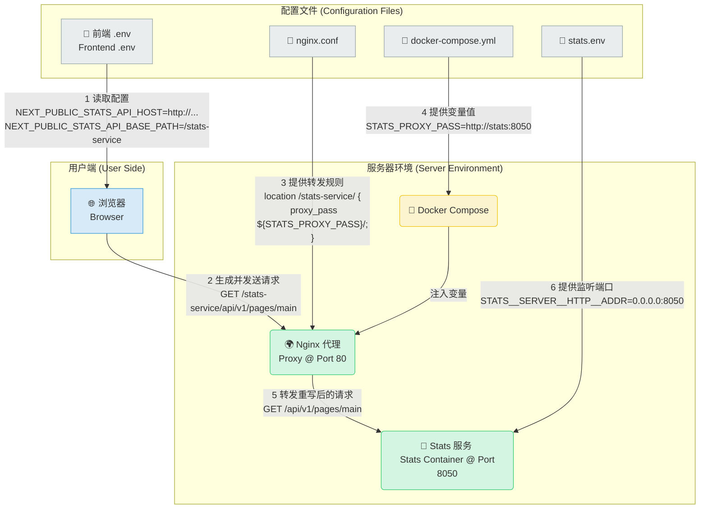

+++
title = "Blockscout实战：从零到一的Docker化部署与故障排查终极指南"
description = "Blockscout实战：从零到一的Docker化部署与故障排查终极指南"
date = 2025-08-01T08:29:47Z
draft = true
[taxonomies]
categories = ["Web3", "Blockscout"]
tags = ["Web3", "Blockscout"]
+++

<!-- more -->

# Blockscout实战：从零到一的Docker化部署与故障排查终极指南

对于任何区块链项目而言，拥有一个稳定、可靠的区块浏览器是生态发展的关键基础设施。Blockscout 作为业界领先的开源浏览器解决方案，功能强大但配置环节众多，初次部署时往往会遇到各种挑战。本文将完整回溯一次为自定义 OP-Stack Layer2 链部署 Blockscout 的全过程，通过详尽的步骤说明和真实的故障排查记录，为您提供一份从入门到精通的“保姆级”部署手册。

## 1. 摘要 (Abstract)

本文档是一份详尽的实战记录，完整回溯了为一条基于 Optimism (OP-Stack) 的自定义 Layer2 区块链，在独立的 Linux 服务器上成功部署 Blockscout 浏览器的全过程。我们从最初的应用崩溃、页面无法访问开始，采用系统性的分层排错方法，逐一攻克了涉及前端环境变量、Nginx 代理配置、后端服务逻辑、容器间网络通信、以及与区块链节点 RPC 连接等多个层面的复杂问题。本文档的目标是成为一份高质量的“避坑”指南和“最佳实践”范本，为您未来进行新的部署或维护现有系统提供清晰、可靠、可复制的参考。

## 2. 准备工作

### 克隆项目并进入部署目录

首先，我们需要从 GitHub 克隆 Blockscout 的官方代码仓库。所有部署相关的操作都在 `docker-compose` 子目录中进行。

```bash
# 推荐使用官方仓库
git clone https://github.com/blockscout/blockscout.git

# 进入项目根目录
cd blockscout

# 进入 Docker Compose 部署目录
cd docker-compose
```

## 3. 详细部署步骤

Blockscout 支持两种主要的 Nginx 代理模式：**端口路由**和**路径路由**。我们分别介绍部署流程。

## 方式一：端口路由

## （Port-based Routing）

这种方式下，不同的服务（如 `stats` 和 `visualizer`）会通过不同的端口（如 `8080`, `8081`）暴露。这种方式修改的文件相对较少。

### 第1步：创建并切换到新分支 (可选，推荐)

为了不污染主分支，建议为您的修改创建一个新的 `git` 分支。

```bash
blockscout on  master via 💧 v1.17.3-otp-27 on 🐳 v28.2.2 (orbstack)
➜ git checkout -b dev-port-based-routing
切换到一个新分支 'dev-port-based-routing'
```

### **第2步：配置环境变量 (.env 文件)**

进入 `envs` 目录，修改以下三个核心配置文件：

#### 1. 后端配置 (`common-blockscout.env`)

这是最核心的配置，告诉 Blockscout 连接哪个区块链。

```bash
# 节点 RPC 地址 (请替换为您自己的节点地址)
ETHEREUM_JSONRPC_HTTP_URL=http://<YOUR_NODE_IP>:8545/
ETHEREUM_JSONRPC_TRACE_URL=http://<YOUR_NODE_IP>:8545/
ETHEREUM_JSONRPC_WS_URL=ws://<YOUR_NODE_IP>:8546/

# 链类型，对于OP-Stack必须设置
CHAIN_TYPE=optimism

# 以下为可选
COIN_NAME=
CHAIN_ID=
COIN=

TXS_STATS_ENABLED=true
SHOW_PRICE_CHART=true
SHOW_PRICE_CHART_LEGEND=true
SHOW_TXS_CHART=true
```

#### 2. 前端配置 (`common-frontend.env`)

```bash
# API Host 指向 Blockscout 服务器的公网 IP 或域名
# 注意：此变量不带 http:// 前缀
NEXT_PUBLIC_API_HOST=<YOUR_SERVER_IP>

# Stats Host 指向您服务器的公网 IP 和 8080 端口
NEXT_PUBLIC_STATS_API_HOST=http://<YOUR_SERVER_IP>:8080

# Visualizer Host 指向您服务器的公网 IP 和 8081 端口
NEXT_PUBLIC_VISUALIZE_API_HOST=http://<YOUR_SERVER_IP>:8081

# (可选) 更新网站图标
FAVICON_MASTER_URL=https://raw.githubusercontent.com/blockscout/frontend/main/apps/explorer/public/favicon/favicon-192x192.png
```

**注意**：进行本地测试时，`<YOUR_SERVER_IP>` 可替换为 `localhost`。

#### 3. 统计服务配置 (`common-stats.env`)

告诉 `stats` 服务如何连接 `backend`。 确保 stats 服务能通过 Docker 内部服务名找到 backend

```bash
# 这个变量决定 stats 服务去哪里连接 backend 服务。
# backend 服务监听在 4000 端口，所以这里必须是 4000。
# 使用服务名 "backend" 是 Docker 内部通信的最佳实践。
STATS__BLOCKSCOUT_API_URL=http://backend:4000
```

### 第3步：配置 Docker Compose (`docker-compose.yml`)

为 `proxy` 服务定义必要的环境变量，以便 Nginx 知道如何将请求转发给前端和后端。

```yaml
# ... (文件其他部分)
  proxy:
    # ...
    environment:
      - BACK_PROXY_PASS=http://backend:4000
      - FRONT_PROXY_PASS=http://frontend:3000
```

**最佳实践**: 建议删除 `docker-compose.yml` 文件头部的 `version: '3.9'` 字段，并移除 `backend` 服务下所有 `environment` 的硬编码，实现配置与代码的分离。

### **第4步：配置 Nginx 代理 (`proxy/default.conf.template`)**

添加 Docker 的 DNS 解析器，这是确保 Nginx 能在容器启动时正确找到其他服务的关键。

```bash
server {
    listen      80;
    # ...
    # 必填：强制 Nginx 使用 Docker 内置 DNS
    resolver 127.0.0.11 valid=10s;

  # ... 其他 location 配置 ...
}
```

## 启动与验证

### 第1步：验证节点连通性

#### 在启动前，可以先用 `curl` 命令检查节点是否正常工作，以及获取最新的区块高度

```http
curl -X POST http://<YOUR_NODE_IP>:8545 \
  -H "Content-Type: application/json" \
  -d '{"jsonrpc":"2.0","method":"eth_blockNumber","params":[],"id":1}'
{"jsonrpc":"2.0","id":1,"result":"0xff0"}
```

- `result: "0xff0"`：当前区块高度为十六进制 `0xff0`，转换为十进制是 **4,080**。

如果返回类似 `{"jsonrpc":"2.0","id":1,"result":"0xff0"}` 的结果，说明节点正常。

### 第2步：**启动`blockscout`所有服务**

`docker-compose up -d` 是 Docker Compose 的核心命令，用于**根据 `docker-compose.yml` 文件启动所有定义的服务**，并以**后台模式（detached）**运行。

```bash
# 默认使用 docker-compose.yml
docker-compose up -d
```

在 `docker-compose` 目录下，执行以下命令以后台模式启动所有服务。

```bash
blockscout/docker-compose on  dev-port-based-routing [!] on 🐳 v28.2.2 (orbstack)
➜ docker-compose up -d
[+] Running 7/7
 ✔ backend Pulled                                                                                                                                                                                     4.5s
 ✔ frontend Pulled                                                                                                                                                                                    6.6s
 ✔ visualizer Pulled                                                                                                                                                                                  3.3s
 ✔ user-ops-indexer Pulled                                                                                                                                                                            3.8s
 ✔ sig-provider Pulled                                                                                                                                                                                4.5s
 ✔ stats Pulled                                                                                                                                                                                       5.4s
 ✔ nft_media_handler Pulled                                                                                                                                                                           4.6s
[+] Running 14/14
 ✔ Network docker-compose_default            Created                                                                                                                                                  0.1s
 ✔ Container docker-compose-stats-db-init-1  Exited                                                                                                                                                   2.2s
 ✔ Container visualizer                      Started                                                                                                                                                  1.5s
 ✔ Container docker-compose-db-init-1        Exited                                                                                                                                                   2.2s
 ✔ Container redis-db                        Started                                                                                                                                                  1.5s
 ✔ Container sig-provider                    Started                                                                                                                                                  1.5s
 ✔ Container stats-db                        Started                                                                                                                                                  2.1s
 ✔ Container db                              Started                                                                                                                                                  2.1s
 ✔ Container backend                         Started                                                                                                                                                  2.2s
 ✔ Container nft_media_handler               Started                                                                                                                                                  2.5s
 ✔ Container frontend                        Started                                                                                                                                                  2.7s
 ✔ Container user-ops-indexer                Started                                                                                                                                                  2.5s
 ✔ Container stats                           Started                                                                                                                                                  2.7s
 ✔ Container proxy                           Started                                                                                                                                                  3.8s


```


**`docker-compose up -d` 已成功完成所有服务部署**

注意：确保代理配置中启用了 **`TUN 模式`**

### 第3步：检查服务状态

**验证服务健康状态**

```bash
blockscout/docker-compose on  dev-port-based-routing [!] on 🐳 v28.2.2 (orbstack) runs 🐙 BDDDFNPRSSSUV took 11.6s
➜ docker-compose ps -a
NAME                             IMAGE                                        COMMAND                  SERVICE             CREATED         STATUS                          PORTS
backend                          ghcr.io/blockscout/blockscout:latest         "sh -c 'bin/blocksco…"   backend             3 minutes ago   Up 3 minutes
db                               postgres:17                                  "docker-entrypoint.s…"   db                  3 minutes ago   Up 3 minutes (healthy)          0.0.0.0:7432->5432/tcp, [::]:7432->5432/tcp
docker-compose-db-init-1         postgres:17                                  "sh -c 'chown -R 200…"   db-init             3 minutes ago   Exited (0) 3 minutes ago
docker-compose-stats-db-init-1   postgres:17                                  "sh -c 'chown -R 200…"   stats-db-init       3 minutes ago   Exited (0) 3 minutes ago
frontend                         ghcr.io/blockscout/frontend:latest           "./entrypoint.sh nod…"   frontend            3 minutes ago   Up 3 minutes                    3000/tcp
nft_media_handler                ghcr.io/blockscout/blockscout:latest         "sh -c 'bin/blocksco…"   nft_media_handler   3 minutes ago   Up 3 minutes
proxy                            nginx                                        "/docker-entrypoint.…"   proxy               3 minutes ago   Up 3 minutes                    0.0.0.0:80->80/tcp, [::]:80->80/tcp, 0.0.0.0:8080-8081->8080-8081/tcp, [::]:8080-8081->8080-8081/tcp
redis-db                         redis:alpine                                 "docker-entrypoint.s…"   redis-db            3 minutes ago   Up 3 minutes                    6379/tcp
sig-provider                     ghcr.io/blockscout/sig-provider:latest       "./sig-provider-serv…"   sig-provider        3 minutes ago   Up 3 minutes
stats                            ghcr.io/blockscout/stats:latest              "./stats-server"         stats               3 minutes ago   Up 3 minutes
stats-db                         postgres:17                                  "docker-entrypoint.s…"   stats-db            3 minutes ago   Up 3 minutes (healthy)          0.0.0.0:7433->5432/tcp, [::]:7433->5432/tcp
user-ops-indexer                 ghcr.io/blockscout/user-ops-indexer:latest   "./user-ops-indexer-…"   user-ops-indexer    3 minutes ago   Restarting (1) 39 seconds ago
visualizer                       ghcr.io/blockscout/visualizer:latest         "./visualizer-server"    visualizer          3 minutes ago   Up 3 minutes


```


当前 **Blockscout 区块链浏览器服务已成功部署**，但 `user-ops-indexer` 容器处于 **持续重启状态**（`Restarting (1) 39 seconds ago`）。

### **当前服务状态概览**

|      容器名称      |          状态          |                       关键信息                        |
| :----------------: | :--------------------: | :---------------------------------------------------: |
|     `backend`      |      Up 3 minutes      |                 核心后端服务正常运行                  |
|     `frontend`     |      Up 3 minutes      |              前端服务已启动（端口 3000）              |
|  `proxy` (Nginx)   |      Up 3 minutes      | **已暴露端口**：`80`（HTTP）、`8080-8081`（其他服务） |
| `db` (PostgreSQL)  | Up 3 minutes (healthy) |        主数据库健康，端口 `7432` 映射到宿主机         |
|     `stats-db`     | Up 3 minutes (healthy) |       统计数据库健康，端口 `7433` 映射到宿主机        |
| `user-ops-indexer` |     **Restarting**     |          39秒前重启过，可能因崩溃或依赖问题           |
|      其他容器      |       Up/Exited        |            初始化容器已退出，其余服务正常             |

### 第4步：**浏览器访问**

打开浏览器，访问 `http://<您的服务器IP>`，即可看到 Blockscout 浏览器界面。

**前端页面**：`http://localhost`


### 第5步：停止服务

```bash
docker-compose down  # 停止并删除容器、网络

# 实操
blockscout/docker-compose on  dev-port-based-routing [!] on 🐳 v28.2.2 (orbstack) runs 🐙 BDDDFNPRSSSUV took 3m 53.4s
➜ docker-compose down
[+] Running 14/14
 ✔ Container visualizer                      Removed                                                                                                                                                  0.7s
 ✔ Container sig-provider                    Removed                                                                                                                                                  0.9s
 ✔ Container user-ops-indexer                Removed                                                                                                                                                  0.1s
 ✔ Container proxy                           Removed                                                                                                                                                 10.6s
 ✔ Container nft_media_handler               Removed                                                                                                                                                  2.1s
 ✔ Container stats                           Removed                                                                                                                                                  2.0s
 ✔ Container frontend                        Removed                                                                                                                                                  1.4s
 ✔ Container backend                         Removed                                                                                                                                                  2.2s
 ✔ Container stats-db                        Removed                                                                                                                                                  0.5s
 ✔ Container docker-compose-stats-db-init-1  Removed                                                                                                                                                  0.0s
 ✔ Container db                              Removed                                                                                                                                                  0.5s
 ✔ Container redis-db                        Removed                                                                                                                                                  0.5s
 ✔ Container docker-compose-db-init-1        Removed                                                                                                                                                  0.0s
 ✔ Network docker-compose_default            Removed                                                                                                                                                  0.1s


```


### 第6步：查看修改文件

```bash
blockscout on  dev-port-based-routing [!] via 💧 v1.17.3-otp-27 on 🐳 v28.2.2 (orbstack)
➜ git status
位于分支 dev-port-based-routing
尚未暂存以备提交的变更：
  （使用 "git add <文件>..." 更新要提交的内容）
  （使用 "git restore <文件>..." 丢弃工作区的改动）
        修改：     docker-compose/docker-compose.yml
        修改：     docker-compose/envs/common-blockscout.env
        修改：     docker-compose/envs/common-frontend.env
        修改：     docker-compose/envs/common-stats.env
        修改：     docker-compose/proxy/default.conf.template

修改尚未加入提交（使用 "git add" 和/或 "git commit -a"）


```

以上是使用端口路由的基础部署方式。然而，在真实的服务器环境中，我们遇到了 502 等顽固问题，最终通过更稳定、更推荐的 **“路径路由”** 方案才得以解决。

## 方式二：路径路由

## （Path-based Routing）

这是**更稳定、更推荐**的方案。所有服务都通过主 `80` 端口访问，由 Nginx 根据 URL 路径（如 `/stats-service/`）进行转发。

### 准备工作

在开始部署之前，请先完成基础准备。

### 第一步：**创建新分支并切换**

```bash
# 确保当前在 master 分支
git checkout master

# 创建并切换到路径路由分支
git checkout -b dev-path-based-routing

# 实操
blockscout on  master via 💧 v1.17.3-otp-27 on 🐳 v28.2.2 (orbstack)
➜ git checkout -b dev-path-based-routing
切换到一个新分支 'dev-path-based-routing'
```

### 第二步：**停止当前运行的服务**

```bash
# 停止所有服务（保留数据卷）
docker-compose down
```

### 第三步：更新`docker-compose.yml` 文件

- `version: '3.9'` 删除
- `backend` 下的 `environment` 配置删除
- `proxy` 服务添加环境变量配置

```yaml
  proxy:
    depends_on:
      - backend
      - frontend
      - stats
    extends:
      file: ./services/nginx.yml
      service: proxy
    environment:
      - BACK_PROXY_PASS=http://backend:4000
      - FRONT_PROXY_PASS=http://frontend:3000
      - STATS_PROXY_PASS=http://stats:8050
```

### 第四步：更新`envs/common-frontend.env` 文件

```bash
NEXT_PUBLIC_STATS_API_HOST=http://localhost # 去掉 :8080。
NEXT_PUBLIC_STATS_API_BASE_PATH=/stats-service
FAVICON_MASTER_URL=https://raw.githubusercontent.com/blockscout/frontend/main/apps/explorer/public/favicon/favicon-192x192.png

```

### 第五步：更新`envs/common-stats.env`文件

```bash
STATS__BLOCKSCOUT_API_URL=http://backend:4000
```

### 第六步：更新`envs/common-blockscout.env` 文件

```bash
ETHEREUM_JSONRPC_HTTP_URL=http://<YOUR_NODE_IP>:8545/
ETHEREUM_JSONRPC_TRACE_URL=hhttp://<YOUR_NODE_IP>:8545/
ETHEREUM_JSONRPC_WS_URL=ws://<YOUR_NODE_IP>:8546/
CHAIN_TYPE=optimism

# 以下可选
COIN_NAME=
COIN=
CHAIN_ID=
TXS_STATS_ENABLED=true
SHOW_PRICE_CHART=true
SHOW_PRICE_CHART_LEGEND=true
SHOW_TXS_CHART=true
```

### 第七步：更新`proxy/default.conf.template`文件

```bash
# 必填：使用 Docker DNS 并设置缓存有效期
resolver 127.0.0.11 valid=10s;

# listen 80 server 下添加
# 规则2：代理 Stats (仪表盘) 服务
location /stats-service/ {
    # 使用 docker-compose.yml 中定义的变量转发到 stats:8050
    proxy_pass            ${STATS_PROXY_PASS}/;
    proxy_set_header      Host $host;
    proxy_set_header      X-Real-IP $remote_addr;
    proxy_set_header      X-Forwarded-For $proxy_add_x_forwarded_for;
}

# 删除 listen 8080 server
```

#### Blockscout“路径路由”模式下仪表盘请求处理流程图




#### Blockscout“路径路由”请求处理流程

```bash
【您的 .env (前端) 文件】
                                NEXT_PUBLIC_STATS_API_HOST=http://xxx.xxx.xx.xx
                                NEXT_PUBLIC_STATS_API_BASE_PATH=/stats-service
                                          │
                                          ▼
┌───────────────────┐        (1. 前端根据配置, 生成请求 URL)
│ 浏览器 (Browser)  │─────────────────────────────────────────────────────────┐
└───────────────────┘                                                         │
                                                                              │
                                       (2. 发送到您服务器的公网 IP 和 80 端口)
                                  http://xxx.xxx.xx.xx/stats-service/api/v1/pages/main
                                                                              │
                                                                              ▼
┌─────────────────────────────────────────────────────────────────────────────┴──┐
│                                                                                 │
│  服务器 Docker 环境                                                               │
│ ┌─────────────────────────────────────────────────────────────────────────────┐ │
│ │ Nginx 代理容器 (proxy) @ 80 端口                                            │ │
│ │                                                                             │ │
│ │      【您的 nginx.conf 文件】                                                │ │
│ │       location /stats-service/ {                                            │ │
│ │           proxy_pass ${STATS_PROXY_PASS}/;                                  │ │
│ │       }                                                                     │ │
│ │                 │                                                           │ │
│ │                 ▼                                                           │ │
│ │     (3. Nginx 匹配到 /stats-service/ 路径, 准备使用变量转发)                    │ │
│ │                 │                                                           │ │
│ │                 ▼                                                           │ │
│ │      【您的 docker-compose.yml 文件】                                        │ │
│ │       proxy:                                                                │ │
│ │         environment:                                                        │ │
│ │           - STATS_PROXY_PASS=http://stats:8050                              │ │
│ │                 │                                                           │ │
│ │                 ▼                                                           │ │
│ │     (4. Docker 将变量替换进去, 最终执行: proxy_pass http://stats:8050/;)      │ │
│ │                 │                                                           │ │
│ └───────────┬─────┴─────────────────────────────────────────────────────────────┘ │
│             │                                                                     │
│             └───────────(5. Docker 内部网络转发)────────────────────────┐        │
│                                                                         │        │
│          请求路径被 Nginx 重写:                                           │        │
│          /stats-service/api/v1/pages/main  ->  /api/v1/pages/main       │        │
│                                                                         ▼        │
│                                           ┌─────────────────────────────┴───────┐  │
│                                           │  Stats 服务容器 (stats) @ 8050 端口 │  │
│                                           │                                     │  │
│                                           │   【您的 stats 配置文件】            │  │
│                                           │    STATS__SERVER__HTTP__ADDR=0.0.0.0:8050 │  │
│                                           │               ▲                       │  │
│                                           │               │                       │  │
│                                           │ (6. Stats 服务正在此端口监听,         │  │
│                                           │      成功接收到请求)                  │  │
│                                           └─────────────────────────────────────┘  │
└────────────────────────────────────────────────────────────────────────────────────┘
```

前端 -> NGINX -> docker-compose.yml -> **`stats` 服务本身** -> `backend`

## 启动与验证

### 第一步：启动服务

```bash
blockscout on  dev-path-based-routing via 💧 v1.17.3-otp-27 on 🐳 v28.2.2 (orbstack)
➜ cd docker-compose

blockscout/docker-compose on  dev-path-based-routing [!] on 🐳 v28.2.2 (orbstack)
➜ docker-compose up -d
[+] Running 7/7
 ✔ frontend Pulled                                                                                                                                                                                    2.7s
 ✔ nft_media_handler Pulled                                                                                                                                                                           2.4s
 ✔ stats Pulled                                                                                                                                                                                       3.1s
 ✔ backend Pulled                                                                                                                                                                                     3.6s
 ✔ user-ops-indexer Pulled                                                                                                                                                                            2.7s
 ✔ sig-provider Pulled                                                                                                                                                                                3.2s
 ✔ visualizer Pulled                                                                                                                                                                                  2.9s
[+] Running 14/14
 ✔ Network docker-compose_default            Created                                                                                                                                                  0.1s
 ✔ Container docker-compose-stats-db-init-1  Exited                                                                                                                                                   1.5s
 ✔ Container visualizer                      Started                                                                                                                                                  0.9s
 ✔ Container sig-provider                    Started                                                                                                                                                  0.9s
 ✔ Container docker-compose-db-init-1        Exited                                                                                                                                                   1.5s
 ✔ Container redis-db                        Started                                                                                                                                                  1.0s
 ✔ Container stats-db                        Started                                                                                                                                                  1.5s
 ✔ Container db                              Started                                                                                                                                                  1.5s
 ✔ Container backend                         Started                                                                                                                                                  1.6s
 ✔ Container frontend                        Started                                                                                                                                                  2.0s
 ✔ Container nft_media_handler               Started                                                                                                                                                  2.0s
 ✔ Container user-ops-indexer                Started                                                                                                                                                  2.0s
 ✔ Container stats                           Started                                                                                                                                                  2.0s
 ✔ Container proxy                           Started                                                                                                                                                  2.6s


```


### 第二步：查看服务状态

查看当前运行的 Docker 容器状态

`docker-compose ps -a` - 显示与当前 docker-compose 项目相关的所有容器状态（包括运行中和已停止的）

```bash
blockscout/docker-compose on  dev-path-based-routing [!] on 🐳 v28.2.2 (orbstack) runs 🐙 BDDDFNPRSSSUV took 7.2s
➜ docker-compose ps -a
NAME                             IMAGE                                        COMMAND                  SERVICE             CREATED              STATUS                          PORTS
backend                          ghcr.io/blockscout/blockscout:latest         "sh -c 'bin/blocksco…"   backend             About a minute ago   Up About a minute
db                               postgres:17                                  "docker-entrypoint.s…"   db                  About a minute ago   Up About a minute (healthy)     0.0.0.0:7432->5432/tcp, [::]:7432->5432/tcp
docker-compose-db-init-1         postgres:17                                  "sh -c 'chown -R 200…"   db-init             About a minute ago   Exited (0) About a minute ago
docker-compose-stats-db-init-1   postgres:17                                  "sh -c 'chown -R 200…"   stats-db-init       About a minute ago   Exited (0) About a minute ago
frontend                         ghcr.io/blockscout/frontend:latest           "./entrypoint.sh nod…"   frontend            About a minute ago   Up About a minute               3000/tcp
nft_media_handler                ghcr.io/blockscout/blockscout:latest         "sh -c 'bin/blocksco…"   nft_media_handler   About a minute ago   Up About a minute
proxy                            nginx                                        "/docker-entrypoint.…"   proxy               About a minute ago   Up About a minute               0.0.0.0:80->80/tcp, [::]:80->80/tcp, 0.0.0.0:8080-8081->8080-8081/tcp, [::]:8080-8081->8080-8081/tcp
redis-db                         redis:alpine                                 "docker-entrypoint.s…"   redis-db            About a minute ago   Up About a minute               6379/tcp
sig-provider                     ghcr.io/blockscout/sig-provider:latest       "./sig-provider-serv…"   sig-provider        About a minute ago   Up About a minute
stats                            ghcr.io/blockscout/stats:latest              "./stats-server"         stats               About a minute ago   Up About a minute
stats-db                         postgres:17                                  "docker-entrypoint.s…"   stats-db            About a minute ago   Up About a minute (healthy)     0.0.0.0:7433->5432/tcp, [::]:7433->5432/tcp
user-ops-indexer                 ghcr.io/blockscout/user-ops-indexer:latest   "./user-ops-indexer-…"   user-ops-indexer    About a minute ago   Restarting (1) 5 seconds ago
visualizer                       ghcr.io/blockscout/visualizer:latest         "./visualizer-server"    visualizer          About a minute ago   Up About a minute


```


### 第三步：浏览器访问 `localhost` 查看验证


### 第四步：查看修改的文件

```bash
blockscout on  dev-path-based-routing [!] via 💧 v1.17.3-otp-27 on 🐳 v28.2.2 (orbstack)
➜ git status
位于分支 dev-path-based-routing
尚未暂存以备提交的变更：
  （使用 "git add <文件>..." 更新要提交的内容）
  （使用 "git restore <文件>..." 丢弃工作区的改动）
        修改：     docker-compose/docker-compose.yml
        修改：     docker-compose/envs/common-blockscout.env
        修改：     docker-compose/envs/common-frontend.env
        修改：     docker-compose/envs/common-stats.env
        修改：     docker-compose/proxy/default.conf.template

修改尚未加入提交（使用 "git add" 和/或 "git commit -a"）


```

## 4. 常见故障排查指南

在部署过程中，我们遇到并解决了一系列问题，以下是快速回顾：

| 问题现象                   | 诊断结果                            | 解决方案                                                     |
| -------------------------- | ----------------------------------- | ------------------------------------------------------------ |
| **图表不显示 (502/404)**   | 前端请求的 API 地址错误             | 修改前端 `.env` 文件，使用 `HOST` + `BASE_PATH` 拼接正确 URL |
| **访问白屏 (502)**         | `proxy` 和 `frontend` 容器崩溃      | 1. Nginx 添加 `resolver` 指令。<br>2. 修正 `frontend` 的 `.env` 变量格式。 |
| **页面数据全部为“0”**      | `backend` 索引器未工作              | 查看 `backend` 日志，排查其依赖。                            |
| **`backend` 连接节点失败** | `backend` 无法连接节点 RPC          | 最终发现是**节点服务 (op-geth) 本身未启动**。启动节点后解决。 |
| **服务器仪表盘 502**       | `stats` 与 `backend` 间歇性网络中断 | 这是服务器环境特有的问题。最终通过切换到更稳定的“**路径路由**”方案解决。 |

## 总结与核心经验

本次成功的部署深刻地揭示了，一个看似简单的“无法访问”问题，其根源可能分布在从前端、网络代理到后端服务、再到最底层依赖（区块链节点）的任何一个环节。通过系统性的分层排查、对日志的仔细分析以及对配置项的精确理解，我们最终定位并解决了所有问题。最宝贵的经验是建立了一套科学的排错思维：**分层验证、日志为王、理解网络、配置为本**。这次实践不仅成功搭建了浏览器，也形成了一套未来可以反复使用的、宝贵的排错经验。

## 参考

- **Blockscout 官网**: <https://www.blockscout.com/>
- **Blockscout GitHub**: <https://github.com/blockscout/blockscout>
- **Blockscout 部署文档**: <https://docs.blockscout.com/setup/deployment/docker-compose-deployment>
