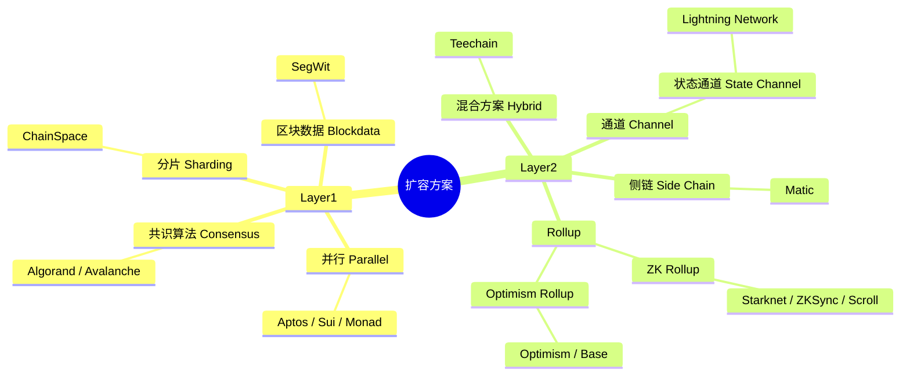
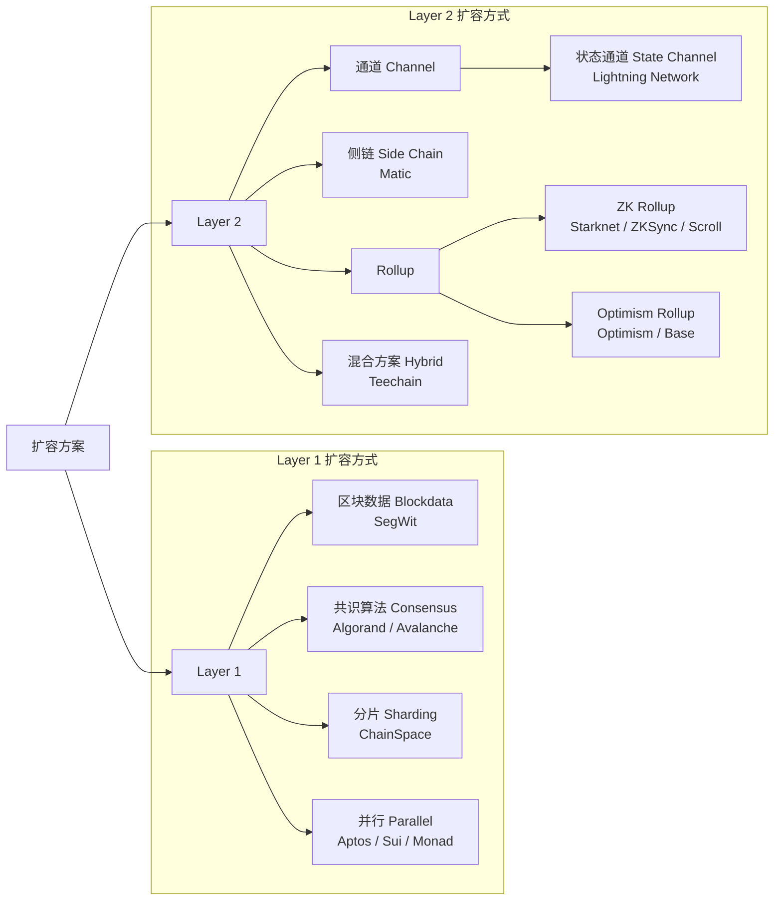
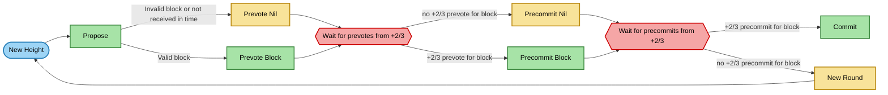
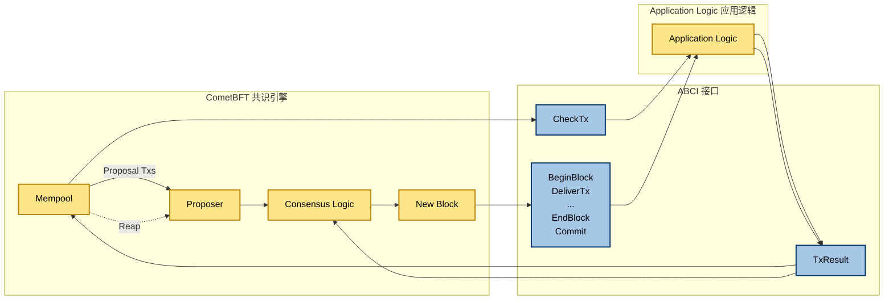
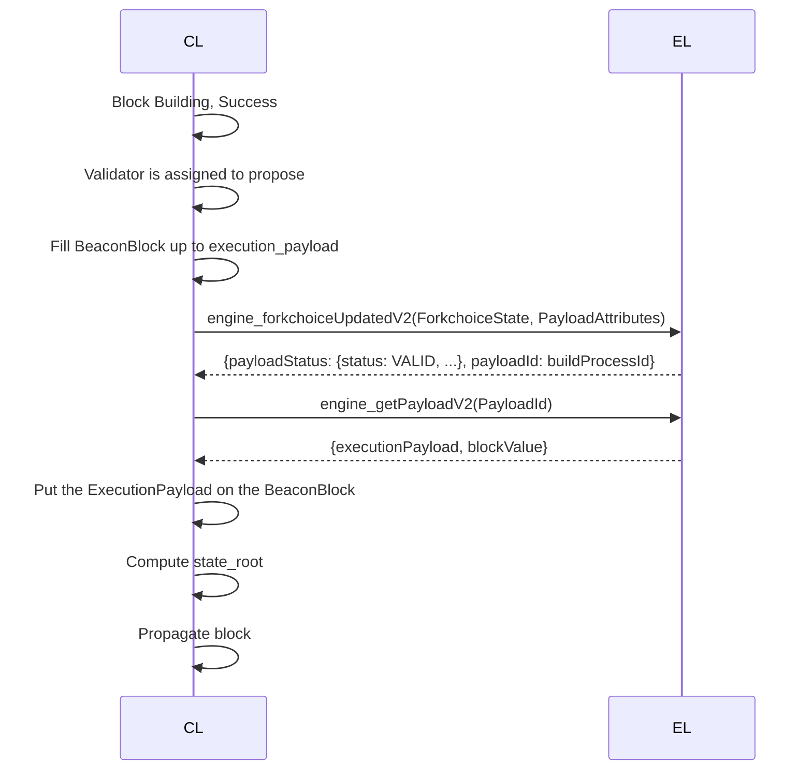
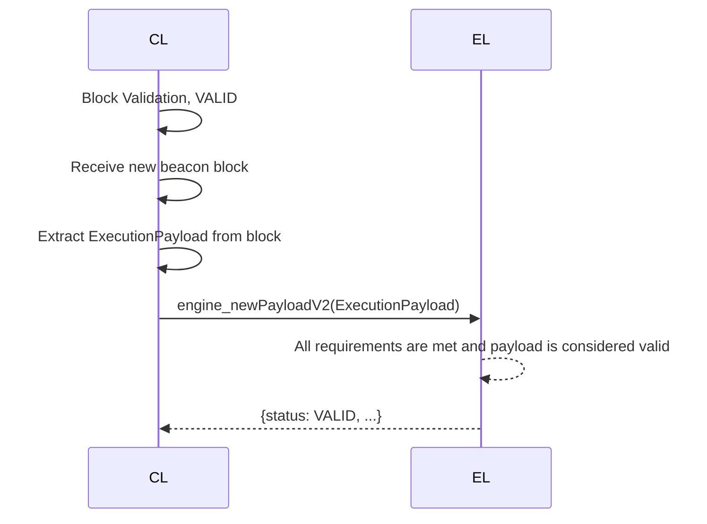

+++
title = "为AI而生！0G Chain：如何突破以太坊扩容瓶颈，实现无限可扩展的 Layer1"
description = "为AI而生！0G Chain：如何突破以太坊扩容瓶颈，实现无限可扩展的 Layer1"
date = 2025-11-11T12:47:12Z
[taxonomies]
categories = ["Web3", "0G"]
tags = ["Web3", "0G"]
+++

<!-- more -->

# 为AI而生！0G Chain：如何突破以太坊扩容瓶颈，实现无限可扩展的 Layer1

在区块链迈向 **AI 原生时代**的今天，数据处理和计算吞吐量成为衡量基础设施的关键指标。传统 Layer1 如以太坊面临着**出块慢、确认时间长、交易费浮动大**等扩容挑战，难以支撑大规模 AI 工作负载。

**0G Infinite Scalable Chain** 正是针对这一挑战而生的解决方案。它作为一条专为人工智能优化的 EVM 兼容公链，正在重新定义高性能区块链的架构范式。本文将带您系统了解区块链扩容的核心难题，并深入解析 0G Chain 如何基于 **CometBFT 共识**与 **Reth 执行层**构建出高吞吐、低延迟的链上系统。

0G Chain 是一条面向 **AI 定制化**的高性能 EVM 兼容 Layer1 区块链。它旨在解决传统区块链的扩容难题，采用 **CometBFT** 共识和基于 **Reth** 的执行客户端。0G Chain 通过**模块化、流水线和状态数据分片**等架构创新，实现了单区块快速最终确认和高吞吐量，为大规模 AI 应用提供了高性能、低延迟的底层基础设施。

## 0G Infinite Scalable Chain

0G 是一条 AI 定制化的 EVM 兼容高性能 Layer1。

0G 的共识客户端基于 CometBFT。

 0G 的执行客户端基于 Reth。

0G Chain 是一条专为人工智能应用而构建的区块链。您可以将其理解为以太坊，但针对人工智能工作负载进行了优化，吞吐量显著更高。

1. 区块链扩容难题
2. CometBFT
3. 0G Chain 架构

## 为什么区块链扩容很难？

### 以太坊扩容问题

- 出块速度慢
- 交易确认时间长
- 交易费浮动

区块链扩容方案全景图（Layer1 & Layer2）

**Web3 扩容架构图：Layer1 与 Layer2 技术路线**

### 共识

- 单区块共识慢
- 最终确认慢

### 计算

- 区块间串行
- 区块内交易间串行（并行执行交易）

### 存储

- 读写放大问题

## 如何解决这些问题？优化方向

### CometBFT 共识

基于 CometBFT 的 POS，确保在每台机器上以相同的顺序记录相同的交易，并且在一个区块达到最终确认性。

### 模块化

基于 ABCI（Application Blockchain Interface）通过一个标准的接口连接共识层和应用层，允许开发者用任何编程语言构建应用层，无需修改共识引擎本身。

### 流水线

将区块执行流程切分为若干个流水线阶段，各个阶段之间可并行执行，最终效果是单个区块执行时间约等于最长阶段。

### 状态数据分片

将状态树拆解为若干小树，这些小树按照硬件配置聚合为若干数据库，这些数据库可独享磁盘，充分利用多盘IOPS。

## CometBFT

- 20 世纪 80 年代 **拜占庭共识** 以学术研究为主，缺少落地的场景
- 2014年**Tendermint** 将学术 BFT 与区块链融合，成为POS先驱
- 2016年 **Ethermint** 将 Tendermint 共识协议的特性引入以太坊和EVM应用
- 2023年 **CometBFT** 长期愿景是成为可靠、安全、大规模、特定应用区块链复制引擎的首选（区块链构建工具）
- 2024年 **0G Chain** 选择基于 CometBFT 开发

### CometBFT - 共识引擎

CometBFT 共识决定节点如何提议、投票和最终确定新交易区块的底层规则集。该引擎类似于严格的规则手册，迫使所有诚实的节点做同样的事情并得出相同的结论。

CometBFT 共识是一个单区块就能达成的共识。

 **CometBFT 共识流程（类似 Tendermint）** 的状态流转图

### CometBFT - ABCI

ABCI 是连接应用程序和 CometBFT 共识引擎的接口，在 CometBFT 框架下，应用程序是特定于应用程序的区块链的逻辑程序。开发者不是在主流区块链上编写 dApp，而是使用 CometBFT 和 ABCI 构建一个完整的区块链，该区块链针对其特定应用程序（例如 AI）进行了定制。

**ABCI（Application Blockchain Interface）在 CometBFT 架构中的工作流程** 的图

### 🧩 图解逻辑说明

- **左侧黄色方框** 表示 CometBFT 的核心组件：
  - Mempool：交易池
  - Proposer：提出区块的节点
  - Consensus Logic：共识逻辑
  - New Block：新区块生成
- **右侧黄色方框** 表示用户定义的 **Application Logic（应用逻辑）**。
- **中间蓝色部分（ABCI）** 是连接二者的接口层，负责交易验证和状态更新。

### CometBFT 优势

为什么选择 CometBFT

- 安全性
- 可扩展性
- 快速确认性
- 模块化

## 0G Chain 的架构

### Ethereum node 架构图

### 💡 图解说明

- **Web3 Library** 是应用层访问入口，包括：
  - `web3.beacon` → 连接 **Consensus Client（共识层）**
  - `web3.eth` → 连接 **Execution Client（执行层）**
- **Ethereum node** 内部结构：
  - **Consensus client**：负责区块验证、共识与 p2p 网络
  - **Execution client**：负责交易执行、状态管理与 p2p 网络
  - 两者之间通过 **Engine API** 通信
- 外部的箭头表示与其他节点的 **p2p 网络交互**

### 0G Chain 的架构

### 💡 图解说明

- **0G Library**：提供访问接口（`0g-chain` 与 `0g-reth`）
- **Node（0g Chain 节点）**：
  - **Consensus client**：基于 **CometBFT** 共识
  - **Execution client**：执行交易逻辑
  - 通过 **Engine API** 进行协调
- **p2p** 通信：每个客户端都与网络中其他节点通信

### 0g Chain Block Proposal Flow（区块提议流程）

0g Chain 中 **CL（共识层）与 EL（执行层）** 之间通过 **Engine API** 交互的过程

### 💡 图解说明

- **CL (Consensus Layer)**：执行区块提议与组装。
- **EL (Execution Layer)**：根据 Engine API 请求，构建并返回 execution payload。
- 流程：
  1. 验证者被分配到提议区块。
  2. 通过 `engine_forkchoiceUpdatedV2` 通知执行层构建 block payload （Build execution_payload）。
  3. 执行层返回 `payloadId`。
  4. 共识层调用 `engine_getPayloadV2` 获取最终的 `executionPayload`。
  5. 将其放入 BeaconBlock，计算 `state_root`，最后广播区块。

### 0g Chain Block Validation Flow（区块验证流程）

区块验证（Block Validation）阶段

### 💡 图解说明

- **阶段**：这是区块验证阶段（Validation Phase）。
- **流程描述**：
  1. CL 收到新的 **Beacon Block**；
  2. 从中提取 **ExecutionPayload**；
  3. 通过 `engine_newPayloadV2` 向 EL 提交该 Payload；
  4. EL 验证 Payload，若符合要求则返回 `{status: VALID, ...}`；
  5. 最终确认该区块在执行层和共识层都被视为有效。

以太坊分为两类客户端：

### 以太坊的执行客户端

#### ⚙️ 执行层（Execution Layer, EL）客户端

负责执行 EVM 交易、状态更新。常见的有：

- **Reth**
- **Geth**
- **Nethermind**
- **Besu**
- **Erigon**

### Reth 为什么性能更好

- Rust 语言
- 状态压缩技术
- 分阶段同步区块

## 以太坊的共识客户端

#### 🧠 共识层（Consensus Layer, CL）客户端

负责区块提议、验证、出块与共识。常见的有：

- **Prysm**
- **Teku**
- **Lighthouse**
- **Nimbus**
- **Lodestar**

## 📝 总结

0G Chain 成功将传统区块链架构的瓶颈作为主要优化方向。它通过结合 CometBFT 的**单区块快速确认**特性与 Reth 客户端的**高性能执行**，实现了 CL（共识层）和 EL（执行层）的解耦与高效协作。其引入的**模块化、流水线处理和状态数据分片**等创新架构，显著提升了系统的吞吐量和处理效率。

0G Chain 的出现，不仅是一条新公链的诞生，更是一次面向 AI 计算时代的底层系统革新。它以模块化、可扩展的设计理念，为未来 AI 与区块链融合的基础设施提供了强有力的支撑，标志着高性能 EVM Layer1 架构进入了一个新的阶段。

## 参考

- <https://docs.0g.ai/run-a-node/overview>
- <https://faucet.0g.ai/>
- <https://ethereum.org/zh/developers/docs/apis/json-rpc/>
- <https://hub.0g.ai/portfolio/tokens?network=mainnet>
- <https://github.com/0gfoundation>
- <https://github.com/paradigmxyz/reth>
- <https://0g.ai/blog>
- <https://docs.0g.ai/concepts/chain>
