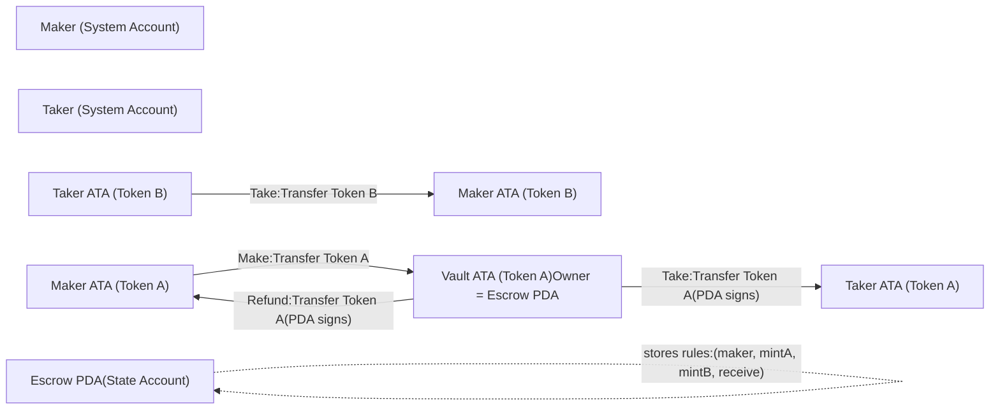
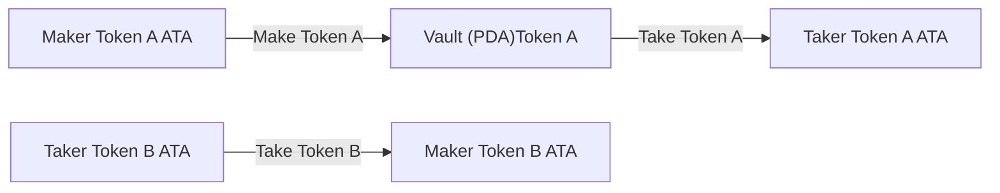

+++
title = "从核心逻辑到上链部署：Solana Anchor 托管程序实战全记录"
description = "从核心逻辑到上链部署：Solana Anchor 托管程序实战全记录"
date = 2026-01-24T13:45:31Z
[taxonomies]
categories = ["Web3", "Rust", "Solana", "Anchor"]
tags = ["Web3", "Rust", "Solana", "Anchor"]
+++

<!-- more -->

# **从核心逻辑到上链部署：Solana Anchor 托管程序实战全记录**

托管（Escrow）是去中心化金融的基石。在 Solana 这种基于账户模型的链上，如何安全地管理互不信任的资产交换？答案在于对 **PDA（程序派生地址）权限**与**交易原子性**的深度掌握。

本文是一份完整的工程实战记录。我们将从 Mermaid 逻辑架构图出发，深度拆解 Anchor 框架下托管合约的底层实现——从状态账户定义到 `Make`、`Take`、`Refund` 三大指令的权限约束，再到本地与 Devnet 开发网的自动化部署验证。这不仅是代码的堆砌，更是一次完整的链上资产管理方案闭环。

本文记录了基于 Anchor 构建 Solana 托管程序的完整闭环。深度解析 PDA 权限管理、代币原子交换及状态清理机制。涵盖核心指令实现、Mocha 自动化测试及 Devnet 上链部署实操，助你从底层逻辑到工程实践全面掌握 Solana 合约开发。

------

## 🧩 Escrow 全流程 Mermaid 图




## 🧠 场景说明

- **Maker**：先出 Token A
- **Taker**：后出 Token B
- **Vault**：PDA 控制的 Token A 保险箱
- **真正收钱的地方永远是 ATA，不是钱包地址**

## 🚀 实操

### 创建项目

```bash
anchor init blueshift_anchor_escrow

cd blueshift_anchor_escrow
```

### 添加依赖

```bash
cargo add anchor-lang --features init-if-needed
cargo add anchor-spl
```

### 查看项目目录结构

```bash
blueshift_anchor_escrow on  master [?] via 🦀 1.89.0 took 18.0s
➜ tree . -L 6 -I "docs|target|node_modules"
.
├── Anchor.toml
├── Cargo.lock
├── Cargo.toml
├── Makefile
├── app
├── cliff.toml
├── deny.toml
├── deploy_out
│   └── blueshift_anchor_escrow.so
├── migrations
│   └── deploy.ts
├── package.json
├── pnpm-lock.yaml
├── programs
│   └── blueshift_anchor_escrow
│       ├── Cargo.toml
│       └── src
│           ├── errors.rs
│           ├── instructions
│           │   ├── make.rs
│           │   ├── mod.rs
│           │   ├── refund.rs
│           │   └── take.rs
│           ├── lib.rs
│           └── state.rs
├── rust-toolchain.toml
├── tests
│   └── blueshift_anchor_escrow.ts
└── tsconfig.json

9 directories, 21 files
```

### 实现程序

#### `lib.rs` 文件

```rust
use anchor_lang::prelude::*;
mod errors;
mod instructions;
mod state;
use instructions::*;

declare_id!("22222222222222222222222222222222222222222222");

#[program]
pub mod blueshift_anchor_escrow {
    use super::*;

    #[instruction(discriminator = 0)]
    pub fn make(ctx: Context<Make>, seed: u64, receive: u64, amount: u64) -> Result<()> {
        instructions::make::handler(ctx, seed, receive, amount)
    }

    #[instruction(discriminator = 1)]
    pub fn take(ctx: Context<Take>) -> Result<()> {
        instructions::take::handler(ctx)
    }

    #[instruction(discriminator = 2)]
    pub fn refund(ctx: Context<Refund>) -> Result<()> {
        instructions::refund::handler(ctx)
    }
}

```

#### `state.rs` 文件

```rust
use anchor_lang::prelude::*;

pub const ESCROW_SEED: &[u8] = b"escrow";

#[derive(InitSpace)]
#[account(discriminator = 1)]
pub struct Escrow {
    pub seed: u64,
    pub maker: Pubkey,
    pub mint_a: Pubkey,
    pub mint_b: Pubkey,
    pub receive: u64,
    pub bump: u8,
}

```

#### `errors.rs` 文件

```rust
use anchor_lang::prelude::*;

#[error_code]
pub enum EscrowError {
    #[msg("Invalid amount")]
    InvalidAmount,
    #[msg("Invalid maker")]
    InvalidMaker,
    #[msg("Invalid mint a")]
    InvalidMintA,
    #[msg("Invalid mint b")]
    InvalidMintB,
}

```

#### `instructions/mod.rs` 文件

```rust
pub mod make;
pub mod refund;
pub mod take;

pub use make::*;
pub use refund::*;
pub use take::*;
```

#### `instructions/make.rs` 文件

```rust
use anchor_lang::prelude::*;
use anchor_spl::{
    associated_token::AssociatedToken,
    token_interface::{transfer_checked, Mint, TokenAccount, TokenInterface, TransferChecked},
};

use crate::{
    errors::EscrowError,
    state::{Escrow, ESCROW_SEED},
};

/// 1. 初始化托管记录并存储所有条款。
/// 2. 创建金库（一个由 escrow 拥有的 mint_a 的关联代币账户 (ATA)）。
/// 3. 使用 CPI 调用 SPL-Token 程序，将创建者的 Token A 转移到该金库中。

#[derive(Accounts)]
#[instruction(seed: u64)]
pub struct Make<'info> {
    #[account(mut)]
    pub maker: Signer<'info>,

    #[account(
        init,
        payer = maker,
        space = Escrow::INIT_SPACE + Escrow::DISCRIMINATOR.len(),
        seeds = [ESCROW_SEED, maker.key().as_ref(), seed.to_le_bytes().as_ref()],
        bump,
    )]
    pub escrow: Account<'info, Escrow>,

    /// Token Accounts
    #[account(
        mint::token_program = token_program
    )]
    pub mint_a: InterfaceAccount<'info, Mint>,

    #[account(
        mint::token_program = token_program
    )]
    pub mint_b: InterfaceAccount<'info, Mint>,

    #[account(
        mut,
        associated_token::mint = mint_a,
        associated_token::authority = maker,
        associated_token::token_program = token_program
    )]
    pub maker_ata_a: InterfaceAccount<'info, TokenAccount>,
    #[account(
        init,
        payer = maker,
        associated_token::mint = mint_a,
        associated_token::authority = escrow,
        associated_token::token_program = token_program
    )]
    pub vault: InterfaceAccount<'info, TokenAccount>,
    /// Programs
    pub associated_token_program: Program<'info, AssociatedToken>,
    pub token_program: Interface<'info, TokenInterface>,
    pub system_program: Program<'info, System>,
}

impl<'info> Make<'info> {
    /// Create the Escrow
    pub(crate) fn populate_escrow(&mut self, seed: u64, amount: u64, bump: u8) -> Result<()> {
        self.escrow.set_inner(Escrow {
            seed,
            maker: self.maker.key(),
            mint_a: self.mint_a.key(),
            mint_b: self.mint_b.key(),
            receive: amount,
            bump,
        });
        Ok(())
    }

    ///  Deposit the tokens
    pub(crate) fn deposit_tokens(&self, amount: u64) -> Result<()> {
        let cpi_accounts = TransferChecked {
            from: self.maker_ata_a.to_account_info(),
            to: self.vault.to_account_info(),
            mint: self.mint_a.to_account_info(),
            authority: self.maker.to_account_info(),
        };

        let cpi_ctx = CpiContext::new(self.token_program.to_account_info(), cpi_accounts);

        transfer_checked(cpi_ctx, amount, self.mint_a.decimals)
    }
}

pub fn handler(ctx: Context<Make>, seed: u64, receive: u64, amount: u64) -> Result<()> {
    // Validate the amount
    require_gt!(receive, 0, EscrowError::InvalidAmount);
    require_gt!(amount, 0, EscrowError::InvalidAmount);
    // Save the Escrow Data
    ctx.accounts
        .populate_escrow(seed, receive, ctx.bumps.escrow)?;
    // Deposit Tokens
    ctx.accounts.deposit_tokens(amount)?;
    Ok(())
}

```

这段代码实现了 Escrow 合约中 `make` 指令的完整创建流程：首先通过 PDA（由 `ESCROW_SEED + maker + seed` 派生）初始化并存储一份托管协议数据，明确交易双方将使用的 `mint_a`、`mint_b` 以及期望接收的数量；随后为该 escrow 创建一个由其自身控制的 Token A 金库（vault，对应 escrow 作为 authority 的 ATA）；最后通过 CPI 调用 SPL Token Program 的 `transfer_checked`，将创建者（maker）账户中的 Token A 安全转入金库中。整个过程在账户约束层完成权限与一致性校验，在逻辑层完成状态写入与资产托管，确保 escrow 在创建阶段即具备完整、可信的交易条件。

#### `instructions/take.rs` 文件

```rust
use anchor_lang::prelude::*;
use anchor_spl::{
    associated_token::AssociatedToken,
    token_interface::{
        close_account, transfer_checked, CloseAccount, Mint, TokenAccount, TokenInterface,
        TransferChecked,
    },
};

use crate::{
    errors::EscrowError,
    state::{Escrow, ESCROW_SEED},
};

/// 1. 关闭托管记录，将其租金 lamports 返还给创建者。
/// 2. 将 Token A 从保管库转移到接受者，然后关闭保管库。
/// 3. 将约定数量的 Token B 从接受者转移到创建者。

#[derive(Accounts)]
pub struct Take<'info> {
    #[account(mut)]
    pub taker: Signer<'info>,

    #[account(mut)]
    pub maker: SystemAccount<'info>,

    #[account(
        mut,
        close = maker,
        seeds = [ESCROW_SEED, maker.key().as_ref(), escrow.seed.to_le_bytes().as_ref()],
        bump = escrow.bump,
        has_one = maker @ EscrowError::InvalidMaker,
        has_one = mint_a @ EscrowError::InvalidMintA,
        has_one = mint_b @ EscrowError::InvalidMintB,
    )]
    pub escrow: Box<Account<'info, Escrow>>,
    /// Token Accounts
    pub mint_a: Box<InterfaceAccount<'info, Mint>>,
    pub mint_b: Box<InterfaceAccount<'info, Mint>>,
    #[account(
        mut,
        associated_token::mint = mint_a,
        associated_token::authority = escrow,
        associated_token::token_program = token_program
    )]
    pub vault: Box<InterfaceAccount<'info, TokenAccount>>,
    #[account(
        init_if_needed,
        payer = taker,
        associated_token::mint = mint_a,
        associated_token::authority = taker,
        associated_token::token_program = token_program
    )]
    pub taker_ata_a: Box<InterfaceAccount<'info, TokenAccount>>,
    #[account(
        mut,
        associated_token::mint = mint_b,
        associated_token::authority = taker,
        associated_token::token_program = token_program
    )]
    pub taker_ata_b: Box<InterfaceAccount<'info, TokenAccount>>,
    #[account(
        init_if_needed,
        payer = taker,
        associated_token::mint = mint_b,
        associated_token::authority = maker,
        associated_token::token_program = token_program
    )]
    pub maker_ata_b: Box<InterfaceAccount<'info, TokenAccount>>,
    /// Programs
    pub associated_token_program: Program<'info, AssociatedToken>,
    pub token_program: Interface<'info, TokenInterface>,
    pub system_program: Program<'info, System>,
}

impl<'info> Take<'info> {
    fn transfer_to_maker(&mut self) -> Result<()> {
        transfer_checked(
            CpiContext::new(
                self.token_program.to_account_info(),
                TransferChecked {
                    from: self.taker_ata_b.to_account_info(),
                    to: self.maker_ata_b.to_account_info(),
                    mint: self.mint_b.to_account_info(),
                    authority: self.taker.to_account_info(),
                },
            ),
            self.escrow.receive,
            self.mint_b.decimals,
        )?;
        Ok(())
    }

    fn withdraw_and_close_vault(&mut self) -> Result<()> {
        let binding = self.maker.to_account_info().key();
        // Create the signer seeds for the vault
        let signer_seeds: [&[&[u8]]; 1] = [&[
            b"escrow",
            binding.as_ref(),
            &self.escrow.seed.to_le_bytes()[..],
            &[self.escrow.bump],
        ]];

        let amount = self.vault.amount;
        require!(amount > 0, EscrowError::InvalidAmount);

        // Transfer Token A (Vault -> Taker)
        transfer_checked(
            CpiContext::new_with_signer(
                self.token_program.to_account_info(),
                TransferChecked {
                    from: self.vault.to_account_info(),
                    to: self.taker_ata_a.to_account_info(),
                    mint: self.mint_a.to_account_info(),
                    authority: self.escrow.to_account_info(),
                },
                &signer_seeds,
            ),
            amount,
            self.mint_a.decimals,
        )?;
        // Close the vault
        close_account(CpiContext::new_with_signer(
            self.token_program.to_account_info(),
            CloseAccount {
                account: self.vault.to_account_info(),
                authority: self.escrow.to_account_info(),
                destination: self.maker.to_account_info(),
            },
            &signer_seeds,
        ))?;
        Ok(())
    }
}

pub fn handler(ctx: Context<Take>) -> Result<()> {
    // Transfer Token B to Maker
    ctx.accounts.transfer_to_maker()?;
    // Withdraw and close the Vault
    ctx.accounts.withdraw_and_close_vault()?;
    Ok(())
}

```

这段代码实现了 Escrow 合约中的 `take` 指令，用于完成托管交易的最终成交与清算流程：在账户约束层首先校验 escrow 的 PDA、创建者、以及参与的两种 Mint 的一致性；在执行逻辑中，先由接受者（taker）将约定数量的 Token B 转移给创建者（maker），随后通过 PDA 签名将托管金库（vault）中的全部 Token A 转移给 taker，并在转移完成后关闭 vault，将其剩余租金返还给 maker；同时 escrow 账户本身也在指令结束时被自动关闭，从而保证资产与状态一次性结算、无残留账户，完成一个完整、原子化的 escrow 成交流程。

#### `instructions/refund.rs` 文件

```rust
use anchor_lang::prelude::*;
use anchor_spl::{
    associated_token::AssociatedToken,
    token_interface::{
        close_account, transfer_checked, CloseAccount, Mint, TokenAccount, TokenInterface,
        TransferChecked,
    },
};

use crate::{
    errors::EscrowError,
    state::{Escrow, ESCROW_SEED},
};

/// 1. 关闭托管 PDA，并将其租金 lamports 返还给创建者。
/// 2. 将金库中的全部 Token A 余额转回创建者，然后关闭金库账户。
/// 只有 Maker 能在没人 Take 的情况下，
/// 把 Vault 里的 Token A 原路拿回，并彻底销毁 Escrow。
/// 它解决的是这个问题：
/// ❓ 如果一直没人来换，我的 Token A 会不会被锁死？
/// 答案：不会，Refund 就是逃生门。

#[derive(Accounts)]
pub struct Refund<'info> {
    #[account(mut)]
    pub maker: Signer<'info>,

    #[account(
        mut,
        close = maker,
        seeds = [ESCROW_SEED, maker.key().as_ref(), escrow.seed.to_le_bytes().as_ref()],
        bump = escrow.bump,
        has_one = maker @ EscrowError::InvalidMaker, // 校验 maker 与 escrow 一致。
        has_one = mint_a @ EscrowError::InvalidMintA
    )]
    pub escrow: Account<'info, Escrow>,

    /// Token Accounts
    #[account(mint::token_program = token_program)]
    pub mint_a: InterfaceAccount<'info, Mint>,

    /// Vault holding Token A
    #[account(
        mut,
        associated_token::mint = mint_a,
        associated_token::authority = escrow,
        associated_token::token_program = token_program
    )]
    pub vault: InterfaceAccount<'info, TokenAccount>,

    #[account(
        init_if_needed,
        payer = maker,
        associated_token::mint = mint_a,
        associated_token::authority = maker,
        associated_token::token_program = token_program
    )]
    pub maker_ata_a: InterfaceAccount<'info, TokenAccount>,

    /// Programs
    pub associated_token_program: Program<'info, AssociatedToken>,
    pub token_program: Interface<'info, TokenInterface>,
    pub system_program: Program<'info, System>,
}

impl<'info> Refund<'info> {
    pub fn refund(&mut self) -> Result<()> {
        self.withdraw_and_close_vault()?;
        Ok(())
    }

    fn withdraw_and_close_vault(&self) -> Result<()> {
        let escrow = &self.escrow;
        let seed_bytes = escrow.seed.to_le_bytes();
        let signer_seeds: [&[&[u8]]; 1] = [&[
            ESCROW_SEED,
            escrow.maker.as_ref(),
            seed_bytes.as_ref(),
            &[escrow.bump],
        ]];

        let amount = self.vault.amount;
        if amount == 0 {
            return Ok(());
        }

        // if amount > 0 {
        // 1️⃣ Transfer all Token A from vault → maker
        // // Vault -> Maker (Token A)
        transfer_checked(
            CpiContext::new_with_signer(
                self.token_program.to_account_info(),
                TransferChecked {
                    from: self.vault.to_account_info(),
                    to: self.maker_ata_a.to_account_info(),
                    mint: self.mint_a.to_account_info(),
                    authority: self.escrow.to_account_info(),
                },
                &signer_seeds,
            ),
            amount,
            self.mint_a.decimals,
        )?;
        // }

        // 2️⃣ Close vault account, refund rent → maker
        close_account(CpiContext::new_with_signer(
            self.token_program.to_account_info(),
            CloseAccount {
                account: self.vault.to_account_info(),
                authority: self.escrow.to_account_info(),
                destination: self.maker.to_account_info(),
            },
            &signer_seeds,
        ))?;

        // 3️⃣ Escrow PDA will be closed automatically (close = maker)
        Ok(())
    }
}

pub fn handler(ctx: Context<Refund>) -> Result<()> {
    ctx.accounts.refund()?;
    Ok(())
}

```

### Refund 和 Take 的“本质区别”

| 指令   | Token A 去向  | Token B 去向  | 谁能调用       |
| ------ | ------------- | ------------- | -------------- |
| Take   | Vault → Taker | Taker → Maker | 任意 Taker     |
| Refund | Vault → Maker | ❌ 不存在      | **只有 Maker** |

👉 Refund **不涉及 Token B**
👉 Refund **只关心 Token A + 权限**

### Refund 的安全目标（非常重要）

Refund 必须保证 3 件事：

1️⃣ **只有 Maker 能退**
 2️⃣ **Token A 只能退回 Maker**
 3️⃣ **Escrow 和 Vault 只能被关闭一次**

> 这段代码实现了 Escrow 合约中的 `refund` 指令，用来处理“无人成交时的安全退出”场景：只有创建者（maker）才能调用该指令，通过 PDA 签名从 escrow 控制的 vault 中将全部 Token A 原路转回自己的关联代币账户，并在转移完成后关闭 vault，将其租金返还给 maker；与此同时，`close = maker` 约束会在指令结束时自动销毁 escrow PDA，本次托管状态被彻底清理，从而保证即使一直没有 taker 出现，创建者的资产也不会被锁死，Escrow 始终具备可回退、可清算的“逃生门”机制。

### 构建一个 Anchor 托管（Escrow）程序




- **上面一条线**：
   👉 `Maker Token A → Vault → Taker Token A`
- **下面一条线**：
   👉 `Taker Token B → Maker Token B`

✔️ Vault **只碰 Token A**
 ✔️ Token B **永远直接给 Maker**
 ✔️ 两条线在一次 `take` 里 **原子完成**

> **Token B 给 Maker 的前提是：
> 在同一个 `take` 指令里，
> Token A 必须“同时”从 Vault 转给 Taker。**

否则：

- **Token B 转不出去**
- **整笔交易回滚**
- **状态不变，谁都拿不到东西**

## 测试

### 编写测试

```ts
import * as anchor from "@coral-xyz/anchor"
import { Program } from "@coral-xyz/anchor"
import type { BlueshiftAnchorEscrow } from "../target/types/blueshift_anchor_escrow.js"
import {
    getOrCreateAssociatedTokenAccount,
    createMint,
    mintTo,
    getAssociatedTokenAddressSync,
    getAccount,
    TOKEN_PROGRAM_ID,
    ASSOCIATED_TOKEN_PROGRAM_ID
} from "@solana/spl-token"
import { expect } from "chai"

describe("blueshift_anchor_escrow", () => {
    // Configure the client to use the local cluster.
    const provider = anchor.AnchorProvider.env()
    anchor.setProvider(provider)

    const program = anchor.workspace.blueshiftAnchorEscrow as Program<BlueshiftAnchorEscrow>

    const maker = provider.wallet
    const seed = new anchor.BN(42)
    const deposit = new anchor.BN(1_000_000) // 1 token (6 decimals)
    const receive = new anchor.BN(500_000)

    let mintA: anchor.web3.PublicKey
    let mintB: anchor.web3.PublicKey
    let makerAtaA: anchor.web3.PublicKey
    let makerAtaB: anchor.web3.PublicKey
    let escrowPda: anchor.web3.PublicKey
    let vaultAta: anchor.web3.PublicKey

    // Taker (different wallet for take test)
    let taker: anchor.web3.Keypair
    let takerAtaA: anchor.web3.PublicKey
    let takerAtaB: anchor.web3.PublicKey

    before(async () => {
        // 0️⃣ Ensure program is deployed
        const programInfo = await provider.connection.getAccountInfo(program.programId)
        if (!programInfo || !programInfo.executable) {
            throw new Error(`Program ${program.programId.toString()} is not deployed or not executable`)
        }

        // 1️⃣ Create Mint A
        mintA = await createMint(
            provider.connection,
            maker.payer,
            maker.publicKey,
            null,
            6
        )

        // 1️⃣ Create Mint B
        mintB = await createMint(
            provider.connection,
            maker.payer,
            maker.publicKey,
            null,
            6
        )

        // 2️⃣ Maker ATA for Mint A
        const makerAta = await getOrCreateAssociatedTokenAccount(
            provider.connection,
            maker.payer,
            mintA,
            maker.publicKey,

        )
        makerAtaA = makerAta.address

        // 2️⃣ Maker ATA for Mint B
        const makerAtaBAccount = await getOrCreateAssociatedTokenAccount(
            provider.connection,
            maker.payer,
            mintB,
            maker.publicKey
        )
        makerAtaB = makerAtaBAccount.address


        // 3️⃣ Mint tokens to maker (Mint A)
        // Ensure account is confirmed before minting
        let retries = 0
        while (retries < 5) {
            try {
                await getAccount(provider.connection, makerAtaA)
                break // Account exists, proceed
            } catch {
                retries++
                if (retries >= 5) throw new Error("Failed to create maker ATA")
                await new Promise(resolve => setTimeout(resolve, 200))
            }
        }
        await mintTo(
            provider.connection,
            maker.payer,
            mintA,
            makerAtaA,
            maker.publicKey,
            2_000_000
        )

        // 4️⃣ Create taker keypair and airdrop SOL
        taker = anchor.web3.Keypair.generate()
        const airdropSignature = await provider.connection.requestAirdrop(
            taker.publicKey,
            2 * anchor.web3.LAMPORTS_PER_SOL
        )
        await provider.connection.confirmTransaction(airdropSignature)

        // 5️⃣ Taker ATAs
        const takerAtaAAccount = await getOrCreateAssociatedTokenAccount(
            provider.connection,
            taker,
            mintA,
            taker.publicKey
        )
        takerAtaA = takerAtaAAccount.address

        // 6️⃣ Mint tokens to taker (Mint B) - taker needs tokens to exchange
        const takerAtaBAccount = await getOrCreateAssociatedTokenAccount(
            provider.connection,
            taker,
            mintB,
            taker.publicKey
        )
        takerAtaB = takerAtaBAccount.address
        // Ensure account is confirmed before minting
        retries = 0
        while (retries < 5) {
            try {
                await getAccount(provider.connection, takerAtaB)
                break // Account exists, proceed
            } catch {
                retries++
                if (retries >= 5) throw new Error("Failed to create taker ATA B")
                await new Promise(resolve => setTimeout(resolve, 200))
            }
        }
        await mintTo(
            provider.connection,
            maker.payer,
            mintB,
            takerAtaB,
            maker.publicKey,
            1_000_000 // Enough for the exchange
        )

        // 7️⃣ Derive escrow PDA
        const [escrowPdaAddress] = anchor.web3.PublicKey.findProgramAddressSync(
            [
                Buffer.from("escrow"),
                maker.publicKey.toBuffer(),
                seed.toArrayLike(Buffer, "le", 8),
            ],
            program.programId
        )
        escrowPda = escrowPdaAddress

        // 8️⃣ Vault ATA (owned by escrow PDA)
        vaultAta = getAssociatedTokenAddressSync(
            mintA,
            escrowPda,
            true,
            TOKEN_PROGRAM_ID,
            ASSOCIATED_TOKEN_PROGRAM_ID
        )
    })


    it("make escrow", async () => {
        await program.methods
            .make(seed, receive, deposit)
            .accounts({
                maker: maker.publicKey,
                mintA,
                mintB,
                makerAtaA,
                escrow: escrowPda,
                vault: vaultAta,
                tokenProgram: TOKEN_PROGRAM_ID,
                associatedTokenProgram: ASSOCIATED_TOKEN_PROGRAM_ID,
                systemProgram: anchor.web3.SystemProgram.programId,
            } as any)
            .rpc()

        const vaultAccount = await getAccount(provider.connection, vaultAta)
        expect(Number(vaultAccount.amount)).to.equal(deposit.toNumber())

        // Verify escrow account exists
        const escrowAccount = await program.account.escrow.fetch(escrowPda)
        expect(escrowAccount.maker.toString()).to.equal(maker.publicKey.toString())
        expect(escrowAccount.mintA.toString()).to.equal(mintA.toString())
        expect(escrowAccount.mintB.toString()).to.equal(mintB.toString())
        expect(escrowAccount.receive.toString()).to.equal(receive.toString())
    })

    it("take escrow", async () => {
        // Get initial balances
        const initialTakerAtaA = await getAccount(provider.connection, takerAtaA).catch(() => null)
        const initialTakerAtaB = await getAccount(provider.connection, takerAtaB).catch(() => null)
        const initialMakerAtaB = await getAccount(provider.connection, makerAtaB).catch(() => null)

        const initialTakerBalanceA = initialTakerAtaA ? Number(initialTakerAtaA.amount) : 0
        const initialTakerBalanceB = initialTakerAtaB ? Number(initialTakerAtaB.amount) : 0
        const initialMakerBalanceB = initialMakerAtaB ? Number(initialMakerAtaB.amount) : 0

        await program.methods
            .take()
            .accounts({
                taker: taker.publicKey,
                maker: maker.publicKey,
                escrow: escrowPda,
                mintA,
                mintB,
                vault: vaultAta,
                takerAtaA,
                takerAtaB,
                makerAtaB,
                tokenProgram: TOKEN_PROGRAM_ID,
                associatedTokenProgram: ASSOCIATED_TOKEN_PROGRAM_ID,
                systemProgram: anchor.web3.SystemProgram.programId,
            } as any)
            .signers([taker])
            .rpc()

        // Taker should receive Token A from vault
        const takerAtaAAccount = await getAccount(provider.connection, takerAtaA)
        expect(Number(takerAtaAAccount.amount)).to.equal(initialTakerBalanceA + deposit.toNumber())

        // Maker should receive Token B from taker
        const makerAtaBAccount = await getAccount(provider.connection, makerAtaB)
        expect(Number(makerAtaBAccount.amount)).to.equal(initialMakerBalanceB + receive.toNumber())

        // Taker should have less Token B
        const takerAtaBAccount = await getAccount(provider.connection, takerAtaB)
        expect(Number(takerAtaBAccount.amount)).to.equal(initialTakerBalanceB - receive.toNumber())

        // Vault should be closed
        try {
            await getAccount(provider.connection, vaultAta)
            expect.fail("Vault should be closed")
        } catch (err: any) {
            // Account should not exist (closed)
            expect(err).to.exist
        }

        // Escrow should be closed
        const escrowInfo = await provider.connection.getAccountInfo(escrowPda)
        expect(escrowInfo).to.be.null
    })

    it("refund escrow", async () => {
        // Create a new escrow for refund test
        const refundSeed = new anchor.BN(100)
        const [refundEscrowPda] = anchor.web3.PublicKey.findProgramAddressSync(
            [
                Buffer.from("escrow"),
                maker.publicKey.toBuffer(),
                refundSeed.toArrayLike(Buffer, "le", 8),
            ],
            program.programId
        )

        const refundVaultAta = getAssociatedTokenAddressSync(
            mintA,
            refundEscrowPda,
            true,
            TOKEN_PROGRAM_ID,
            ASSOCIATED_TOKEN_PROGRAM_ID
        )

        // Make escrow first
        await program.methods
            .make(refundSeed, receive, deposit)
            .accounts({
                maker: maker.publicKey,
                mintA,
                mintB,
                makerAtaA,
                escrow: refundEscrowPda,
                vault: refundVaultAta,
                tokenProgram: TOKEN_PROGRAM_ID,
                associatedTokenProgram: ASSOCIATED_TOKEN_PROGRAM_ID,
                systemProgram: anchor.web3.SystemProgram.programId,
            } as any)
            .rpc()

        // Get initial maker balance
        const initialMakerBalance = Number((await getAccount(provider.connection, makerAtaA)).amount)

        // Refund
        await program.methods
            .refund()
            .accounts({
                maker: maker.publicKey,
                escrow: refundEscrowPda,
                mintA,
                vault: refundVaultAta,
                makerAtaA,
                tokenProgram: TOKEN_PROGRAM_ID,
                associatedTokenProgram: ASSOCIATED_TOKEN_PROGRAM_ID,
                systemProgram: anchor.web3.SystemProgram.programId,
            } as any)
            .rpc()

        // Maker should get tokens back
        const makerAccount = await getAccount(provider.connection, makerAtaA)
        expect(Number(makerAccount.amount)).to.equal(initialMakerBalance + deposit.toNumber())

        // Vault should be closed
        try {
            await getAccount(provider.connection, refundVaultAta)
            expect.fail("Vault should be closed")
        } catch (err: any) {
            // Account should not exist (closed)
            expect(err).to.exist
        }

        // Escrow should be closed
        const escrowInfo = await provider.connection.getAccountInfo(refundEscrowPda)
        expect(escrowInfo).to.be.null
    })
})

```

这是一套完整的 Anchor 集成测试，用于验证一个 SPL Token Escrow 的完整生命周期。测试在 localnet 上创建两种代币（Mint A / Mint B），为 maker 和 taker 分别初始化并铸造 ATA，然后通过 PDA 派生 escrow 账户和由其控制的 vault ATA。测试覆盖 `make`、`take`、`refund` 三条核心路径，分别验证代币转移是否正确、vault 与 escrow 是否按预期关闭，以及账户余额和状态是否一致，确保 escrow 在创建、成交和退款场景下都能安全、原子地执行。

### 运行测试

```bash
blueshift_anchor_escrow on  master [?] via 🦀 1.89.0 took 10.3s
➜ make test
Formatting Rust code...
Building program 'blueshift_anchor_escrow'...
    Finished `release` profile [optimized] target(s) in 0.39s
    Finished `test` profile [unoptimized + debuginfo] target(s) in 0.44s
     Running unittests src/lib.rs (/Users/qiaopengjun/Code/Solana/blueshift_anchor_escrow/target/debug/deps/blueshift_anchor_escrow-1385f0fe91624e67)
Running tests on localnet...
# Anchor test automatically starts the local validator if not running.
    Finished `release` profile [optimized] target(s) in 0.12s
    Finished `test` profile [unoptimized + debuginfo] target(s) in 0.13s
     Running unittests src/lib.rs (/Users/qiaopengjun/Code/Solana/blueshift_anchor_escrow/target/debug/deps/blueshift_anchor_escrow-1385f0fe91624e67)

Found a 'test' script in the Anchor.toml. Running it as a test suite!

Running test suite: "/Users/qiaopengjun/Code/Solana/blueshift_anchor_escrow/Anchor.toml"

bigint: Failed to load bindings, pure JS will be used (try npm run rebuild?)


  blueshift_anchor_escrow
    ✔ make escrow (457ms)
    ✔ take escrow (477ms)
    ✔ refund escrow (920ms)


  3 passing (6s)

[mochawesome] Report JSON saved to /Users/qiaopengjun/Code/Solana/blueshift_anchor_escrow/mochawesome-report/mochawesome.json

[mochawesome] Report HTML saved to /Users/qiaopengjun/Code/Solana/blueshift_anchor_escrow/mochawesome-report/mochawesome.html

```

本次 `make test` 在 Anchor 自动启动的 localnet 上运行，成功完成了 `blueshift_anchor_escrow` 程序的完整集成测试流程。测试依次验证了 `make escrow`、`take escrow` 和 `refund escrow` 三个核心指令，分别覆盖托管创建、成交交换和退款关闭三种关键场景，所有用例均顺利通过，表明 escrow 账户、PDA 控制的 vault 以及 SPL Token 的转账与账户关闭逻辑均按预期工作，程序在整个生命周期内行为正确且状态一致。


## 部署

### 本地部署

#### 启动本地节点

```bash
blueshift_anchor_escrow on  master [?] via 🦀 1.89.0
➜ anchor localnet
    Finished `release` profile [optimized] target(s) in 0.39s
    Finished `test` profile [unoptimized + debuginfo] target(s) in 0.44s
     Running unittests src/lib.rs (/Users/qiaopengjun/Code/Solana/blueshift_anchor_escrow/target/debug/deps/blueshift_anchor_escrow-1385f0fe91624e67)
Ledger location: .anchor/test-ledger
Log: .anchor/test-ledger/validator.log
⠒ Initializing...                                                                                                                          Waiting for fees to stabilize 1...
⠄ Initializing...                                                                                                                          Waiting for fees to stabilize 2...
Identity: 7rffBPPCeB6Q1em6Lf2N4YjLRDbtQxTPiZvqYVZrRBm7
Genesis Hash: 3t6wn5BxyUg69f8ApqotzBbrzphhmDt25yKYBmap71xE
Version: 3.0.13
Shred Version: 40609
Gossip Address: 127.0.0.1:8000
TPU Address: 127.0.0.1:8003
JSON RPC URL: http://127.0.0.1:8899
WebSocket PubSub URL: ws://127.0.0.1:8900
⠈ 00:02:15 | Processed Slot: 287 | Confirmed Slot: 287 | Finalized Slot: 256 | Full Snapshot Slot: 200 | Incremental Snapshot Slot: - | Trans
```

#### 执行部署

```bash
blueshift_anchor_escrow on  master [?] via 🦀 1.89.0 took 9.1s
➜ make deploy CLUSTER=localnet
Formatting Rust code...
Building program 'blueshift_anchor_escrow'...
   Compiling blueshift_anchor_escrow v0.1.0 (/Users/qiaopengjun/Code/Solana/blueshift_anchor_escrow/programs/blueshift_anchor_escrow)
    Finished `release` profile [optimized] target(s) in 2.20s
   Compiling blueshift_anchor_escrow v0.1.0 (/Users/qiaopengjun/Code/Solana/blueshift_anchor_escrow/programs/blueshift_anchor_escrow)
    Finished `test` profile [unoptimized + debuginfo] target(s) in 1.82s
     Running unittests src/lib.rs (/Users/qiaopengjun/Code/Solana/blueshift_anchor_escrow/target/debug/deps/blueshift_anchor_escrow-1385f0fe91624e67)
Deploying to cluster: localnet...
Deploying cluster: http://localhost:8899
Upgrade authority: /Users/qiaopengjun/.config/solana/id.json
Deploying program "blueshift_anchor_escrow"...
Program path: /Users/qiaopengjun/Code/Solana/blueshift_anchor_escrow/target/deploy/blueshift_anchor_escrow.so...
Program Id: FiHSUbeohukhvNH4HdNgmNb8WecbzNYTPTjKYDncjwYp

Signature: 2jfftKAYjgWq546nFJTnuv2Krg9DT1KkHoyHJVZ3sQajnTefpionWZgNBeBEboRad6hnM2V4QK66s7gxWeZUVMQo

Waiting for program FiHSUbeohukhvNH4HdNgmNb8WecbzNYTPTjKYDncjwYp to be confirmed...
Program confirmed on-chain
Idl data length: 811 bytes
Step 0/811
Step 600/811
Idl account created: 6r5bTU7MpsjXtErojorA3pVcuMK7bgpX5QsPTkfdkWJ8
Deploy success
```

### 开发网部署

```bash
blueshift_anchor_escrow on  master [?] via 🦀 1.89.0
➜ make deploy CLUSTER=devnet

Formatting Rust code...
Building program 'blueshift_anchor_escrow'...
    Finished `release` profile [optimized] target(s) in 0.45s
    Finished `test` profile [unoptimized + debuginfo] target(s) in 0.46s
     Running unittests src/lib.rs (/Users/qiaopengjun/Code/Solana/blueshift_anchor_escrow/target/debug/deps/blueshift_anchor_escrow-1385f0fe91624e67)
Deploying to cluster: devnet...
Deploying cluster: https://devnet.helius-rpc.com/?api-key=5f3eaea5-07fc-461f-b5f3-caaa53f34e8c
Upgrade authority: /Users/qiaopengjun/.config/solana/id.json
Deploying program "blueshift_anchor_escrow"...
Program path: /Users/qiaopengjun/Code/Solana/blueshift_anchor_escrow/target/deploy/blueshift_anchor_escrow.so...
Program Id: FiHSUbeohukhvNH4HdNgmNb8WecbzNYTPTjKYDncjwYp

Signature: 2eaGQnqB6MKo7jLXjj2Zfx7zxvcpAywjgKxRhL5Ty9wBkGYirFQQWtgciyjvVX74UAJhyxZ3W2h8YbK76WYD96Yi

Waiting for program FiHSUbeohukhvNH4HdNgmNb8WecbzNYTPTjKYDncjwYp to be confirmed...
Program confirmed on-chain
Idl data length: 811 bytes
Step 0/811
Step 600/811
Idl account created: 6r5bTU7MpsjXtErojorA3pVcuMK7bgpX5QsPTkfdkWJ8
Deploy success
```

Program Id: FiHSUbeohukhvNH4HdNgmNb8WecbzNYTPTjKYDncjwYp

`solscan 程序地址`：<https://solscan.io/account/FiHSUbeohukhvNH4HdNgmNb8WecbzNYTPTjKYDncjwYp?cluster=devnet>


solana.fm 程序地址：<https://solana.fm/address/FiHSUbeohukhvNH4HdNgmNb8WecbzNYTPTjKYDncjwYp?cluster=devnet-solana>


### IDL 归档

```bash
blueshift_anchor_escrow on  master [?] via 🦀 1.89.0 took 36.0s
➜ make archive-idl
Formatting Rust code...
Building program 'blueshift_anchor_escrow'...
    Finished `release` profile [optimized] target(s) in 0.39s
    Finished `test` profile [unoptimized + debuginfo] target(s) in 0.46s
     Running unittests src/lib.rs (/Users/qiaopengjun/Code/Solana/blueshift_anchor_escrow/target/debug/deps/blueshift_anchor_escrow-1385f0fe91624e67)
Archiving current IDL...
IDL successfully archived to idls/blueshift_anchor_escrow-2026-01-24-172310.json
```

## 🎯 总结

通过本次 Escrow 程序的实战，我们不仅收获了一套可运行的代码，更建立起对 Solana 开发的底层认知：

- **PDA 权限派生**：理解了如何通过程序派生地址让合约安全地控制资产，实现“无私钥”托管。
- **指令原子性**：通过单笔交易逻辑确保资产交换“要么全成，要么全撤”，锁死安全底线。
- **生命周期管理**：走通了从代码编写、自动化测试到上链部署、IDL 归档的工业级流程。

掌握了托管程序的逻辑，你就已经拿到了构建复杂 DeFi 协议（如 DEX、借贷、NFT 市场）的入场券。

## 💡 参考

- <https://github.com/metaplex-foundation/shank/tree/master/shank>
- <https://github.com/solana-program/token/blob/main/pinocchio/program/src/processor/initialize_account3.rs>
- <https://github.com/exo-tech-xyz/pinocchio-project>
- <https://x.com/trendsdotfun/status/2013571042988695990?s=46>
- <https://solana.com/docs/clients/official/rust>
- <https://github.com/Solana-ZH/Solana-bootcamp-2026-s1>
- <https://docs.rs/solana-system-program/latest/solana_system_program/>
- <https://learn.blueshift.gg/zh-CN/challenges>
