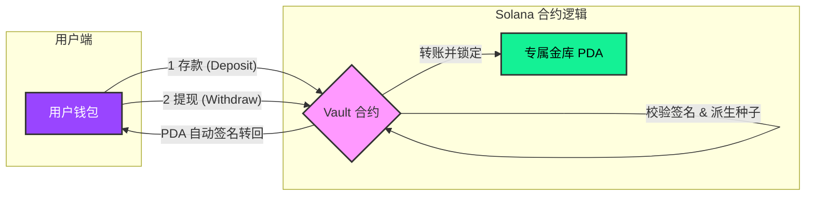

+++
title = "仅 0.6 秒编译！用 Pinocchio 打造极致轻量化 Solana Vault 合约全记录"
description = "仅 0.6 秒编译！用 Pinocchio 打造极致轻量化 Solana Vault 合约全记录"
date = 2026-01-26T10:13:58Z
[taxonomies]
categories = ["Web3", "Rust", "Rust", "Solana", "Pinocchio", "Codama", "Shank"]
tags = ["Web3", "Rust", "Solana", "Pinocchio", "Codama", "Shank"]
+++

<!-- more -->

# **仅 0.6 秒编译！用 Pinocchio 打造极致轻量化 Solana Vault 合约全记录**

在 Solana 开发世界中，性能和效率是永远的关键词。你是否厌倦了臃肿的框架依赖？想尝试更纯粹、更快速的原生 Rust 开发吗？本文将带你走进 **Pinocchio** 的世界——一个无外部依赖、极致零拷贝的库。我们将从创建一个简单的 Vault 存款与取款程序开始，利用 **Shank** 和 **Codama** 构建一套自动化的客户端 SDK，并最终完成从 Rust 到 TypeScript 的全链路自动化测试。

Pinocchio 是一个无外部依赖的库，用于在 Rust 中创建 Solana 程序。唯一的依赖是Solana SDK中专门为链上程序设计的类型。这缓解了依赖问题，并提供了一个高效的零拷贝库来编写程序，同时在计算单元消耗和二进制大小方面都得到了优化。

本文实战演示了利用 Pinocchio 库构建高性能 Solana 原生合约的全流程。涵盖合约实现、嵌套校验架构、PDA 签名机制，并详细讲解如何通过 Shank 与 Codama 自动化生成多语言客户端 SDK，实现从合约逻辑到前端调用的无缝闭环。



## 实操

### 创建项目

```bash
cargo new blueshift_vault --lib --edition 2021

    Creating library `blueshift_vault` package
note: see more `Cargo.toml` keys and their definitions at https://doc.rust-lang.org/cargo/reference/manifest.htm

# 切换项目目录
cd blueshift_vault
```

### 添加依赖

```bash
cargo add pinocchio pinocchio-system
```

### 查看项目目录结构

```bash
blueshift_vault on  master [?] is 📦 0.1.0 via 🦀 1.92.0
➜ tree . -L 6 -I "docs|target"
.
├── Cargo.lock
├── Cargo.toml
├── _typos.toml
├── cliff.toml
├── deny.toml
├── deploy_out
│   └── blueshift_vault.so
└── src
    ├── instructions
    │   ├── deposit.rs
    │   ├── mod.rs
    │   └── withdraw.rs
    └── lib.rs

4 directories, 10 files

```

## 程序实现

### `lib.rs` 文件

```rust
#![no_std]
use pinocchio::{
    address::address, entrypoint, error::ProgramError, nostd_panic_handler, AccountView, Address,
    ProgramResult,
};
use solana_program_log::log;

nostd_panic_handler!();
entrypoint!(process_instruction);

pub mod instructions;
pub use instructions::*;

// 22222222222222222222222222222222222222222222
pub const ID: Address = address!("22222222222222222222222222222222222222222222");

fn process_instruction(
    _program_id: &Address,
    accounts: &[AccountView],
    instruction_data: &[u8],
) -> ProgramResult {
    log("Hello from my pinocchio program!");

    match instruction_data.split_first() {
        Some((Deposit::DISCRIMINATOR, data)) => Deposit::try_from((data, accounts))?.process(),
        Some((Withdraw::DISCRIMINATOR, _)) => Withdraw::try_from(accounts)?.process(),
        _ => Err(ProgramError::InvalidInstructionData),
    }
}

```

这段代码是一个基于 **Pinocchio** 库实现的轻量级 Solana 智能合约入口，它采用了 `#![no_std]` 模式来禁用 Rust 标准库，从而追求极小的二进制体积和极高的执行性能。代码通过 `entrypoint!` 宏定义了合约与 Solana 运行时的交互接口，并在主函数 `process_instruction` 中利用“指令判别码（Discriminator）”机制，根据传入数据的首字节将交易请求精确路由至 `Deposit`（存款）或 `Withdraw`（取款）业务逻辑，是该合约的核心调度中枢。

### `instructions/mod.rs` 文件

```rust
pub mod deposit;
pub mod withdraw;
pub use deposit::*;
pub use withdraw::*;
```

### `instructions/deposit.rs` 文件

```rust
use pinocchio::{error::ProgramError, AccountView, Address, ProgramResult};
use pinocchio_system::instructions::Transfer;

pub struct DepositAccounts<'a> {
    pub owner: &'a AccountView,
    pub vault: &'a AccountView,
}

impl<'a> TryFrom<&'a [AccountView]> for DepositAccounts<'a> {
    type Error = ProgramError;
    fn try_from(accounts: &'a [AccountView]) -> Result<Self, Self::Error> {
        let [owner, vault, _] = accounts else {
            return Err(ProgramError::NotEnoughAccountKeys);
        };

        // Accounts CHecks
        if !owner.is_signer() {
            return Err(ProgramError::InvalidAccountOwner);
        }

        if !vault.owned_by(&pinocchio_system::ID) {
            return Err(ProgramError::InvalidAccountOwner);
        }

        if vault.lamports().ne(&0) {
            return Err(ProgramError::InvalidAccountData);
        }

        let (vault_key, _) =
            Address::find_program_address(&[b"vault", owner.address().as_ref()], &crate::ID);
        if vault.address().ne(&vault_key) {
            return Err(ProgramError::InvalidAccountOwner);
        }

        // Return the accounts
        Ok(Self { owner, vault })
    }
}

pub struct DepositInstructionData {
    pub amount: u64,
}

impl<'a> TryFrom<&'a [u8]> for DepositInstructionData {
    type Error = ProgramError;
    fn try_from(data: &'a [u8]) -> Result<Self, Self::Error> {
        if data.len() != size_of::<u64>() {
            return Err(ProgramError::InvalidInstructionData);
        }

        let amount = u64::from_le_bytes(data.try_into().unwrap());

        // Instruction CHecks
        if amount.eq(&0) {
            return Err(ProgramError::InvalidInstructionData);
        }

        Ok(Self { amount })
    }
}

pub struct Deposit<'a> {
    pub accounts: DepositAccounts<'a>,
    pub instruction_data: DepositInstructionData,
}

impl<'a> TryFrom<(&'a [u8], &'a [AccountView])> for Deposit<'a> {
    type Error = ProgramError;
    fn try_from((data, accounts): (&'a [u8], &'a [AccountView])) -> Result<Self, Self::Error> {
        let accounts = DepositAccounts::try_from(accounts)?;
        let instruction_data = DepositInstructionData::try_from(data)?;
        Ok(Self {
            accounts,
            instruction_data,
        })
    }
}

impl<'a> Deposit<'a> {
    pub const DISCRIMINATOR: &'a u8 = &0;
    pub fn process(&self) -> ProgramResult {
        Transfer {
            from: self.accounts.owner,
            to: self.accounts.vault,
            lamports: self.instruction_data.amount,
        }
        .invoke()?;

        Ok(())
    }
}

```

这段代码基于 Pinocchio 框架定义了 Solana 合约的存款（Deposit）逻辑，通过结构化组件实现了严谨的账户校验、数据解析与业务执行。在账户层面，它严格校验了所有者（owner）的签名权限，并利用 `find_program_address` 验证金库（vault）账户是否为根据所有者地址派生的合法程序派生地址（PDA），同时确保其属于系统程序且初始状态为空；在数据层面，它将传入的字节流解析为 `u64` 类型的存款金额并进行非零校验；最终，通过 `process` 函数发起跨程序调用（CPI），驱动系统程序完成从所有者到金库账户的 SOL 转移操作。

这段代码采用了**分层验证、递归组合**的架构模式：它通过为专门负责账户校验的 `DepositAccounts` 和负责参数解析的 `DepositInstructionData` 分别实现 `TryFrom` trait，将复杂的安全检查拆解为独立的原子操作，最终在顶层 `Deposit` 结构体中通过“套娃”式的组合完成整体验证，从而实现从原始字节流到安全、强类型指令对象的全自动化、类型安全的转换流程。

这种设计的妙处在于：

- **职责分离**：账户归账户，数据归数据，互不干扰。
- **安全防御**：每一层 `TryFrom` 都是一道防火墙，任何一环验证失败都会立即通过 `ProgramError` 熔断交易。
- **代码复用**：如果其他指令也需要相同的账户组合，可以直接复用 `DepositAccounts` 结构体及其验证逻辑。

### `instructions/withdraw.rs` 文件

```rust
use pinocchio::{
    cpi::{Seed, Signer},
    error::ProgramError,
    AccountView, Address, ProgramResult,
};
use pinocchio_system::instructions::Transfer;

pub struct WithdrawAccounts<'a> {
    pub owner: &'a AccountView,
    pub vault: &'a AccountView,
    pub bumps: [u8; 1],
}

impl<'a> TryFrom<&'a [AccountView]> for WithdrawAccounts<'a> {
    type Error = ProgramError;
    fn try_from(accounts: &'a [AccountView]) -> Result<Self, Self::Error> {
        let [owner, vault, _] = accounts else {
            return Err(ProgramError::NotEnoughAccountKeys);
        };

        // Basic Accounts Checks
        if !owner.is_signer() {
            return Err(ProgramError::InvalidAccountOwner);
        }

        if !vault.owned_by(&pinocchio_system::ID) {
            return Err(ProgramError::InvalidAccountOwner);
        }

        if vault.lamports().eq(&0) {
            return Err(ProgramError::InvalidAccountData);
        }

        let (vault_key, bump) =
            Address::find_program_address(&[b"vault", owner.address().as_ref()], &crate::ID);
        if vault.address() != &vault_key {
            return Err(ProgramError::InvalidAccountOwner);
        }

        Ok(Self {
            owner,
            vault,
            bumps: [bump],
        })
    }
}

pub struct Withdraw<'a> {
    pub accounts: WithdrawAccounts<'a>,
}

impl<'a> TryFrom<&'a [AccountView]> for Withdraw<'a> {
    type Error = ProgramError;
    fn try_from(accounts: &'a [AccountView]) -> Result<Self, Self::Error> {
        let accounts = WithdrawAccounts::try_from(accounts)?;
        Ok(Self { accounts })
    }
}

impl<'a> Withdraw<'a> {
    pub const DISCRIMINATOR: &'a u8 = &1;
    pub fn process(&mut self) -> ProgramResult {
        // Create PDA signer seeds
        let seeds = [
            Seed::from(b"vault"),
            Seed::from(self.accounts.owner.address().as_ref()),
            Seed::from(&self.accounts.bumps),
        ];

        let signers = [Signer::from(&seeds)];

        // Transfer all lamports from vault to owner
        Transfer {
            from: self.accounts.vault,
            to: self.accounts.owner,
            lamports: self.accounts.vault.lamports(),
        }
        .invoke_signed(&signers)?;

        Ok(())
    }
}

```

这段代码实现了 Solana 合约的提现（Withdraw）逻辑，它延续了“嵌套校验”模式，通过 `WithdrawAccounts` 结构体严格验证提现者（owner）的签名权限、金库（vault）的 PDA 合法性以及账户余额，并在校验过程中捕获并存储了用于后续签名的 **Bump** 值。其核心业务逻辑位于 `process` 函数中：它利用所有者地址和存储的 Bump 值重新构造 PDA 种子，并通过 `invoke_signed` 发起带有 **PDA 签名** 的跨程序调用（CPI），将金库账户中的所有 SOL 余额全额划转回所有者账户，从而实现了一个安全且完全由程序逻辑控制的资金提取流程。

### 核心逻辑解析

- **权限与地址双重校验**：在 `try_from` 中，不仅检查了 `owner` 是否签名，还通过 `find_program_address` 重新计算 PDA，确保传入的 `vault` 账户正是由当前 `owner` 派生的那个唯一金库地址。
- **全额提现**：不同于 `Deposit` 需要传入金额，`Withdraw` 直接通过 `self.accounts.vault.lamports()` 获取金库当前所有余额并进行转账。
- **PDA 签名机制**：由于金库（vault）是一个 PDA 账户，它没有私钥，因此必须在调用系统程序的 `Transfer` 指令时，使用 `invoke_signed` 并传入正确的种子（Seeds）和 Bump，由 Solana 运行时（Runtime）代为验证签名。

**至此，你已经完成了这个 Vault 合约最核心的两个功能：存入和完整取出。**

### 编译构建

```bash
blueshift_vault on  master [?] is 📦 0.1.0 via 🦀 1.92.0
➜ cargo build-sbf

   Compiling blueshift_vault v0.1.0 (/Users/qiaopengjun/Code/Solana/blueshift_vault)
    Finished `release` profile [optimized] target(s) in 0.68s
```

这段运行结果表明你已成功使用 `cargo build-sbf` 工具，在极短的时间内（0.68秒）将 `blueshift_vault` 合约编译成了优化后的、可直接部署至 Solana 链上的 SBF 二进制文件。

## 🛠 自动化代码生成：Shank + Codama

## Shank 生成IDL文件

### 1. **安装工具** (Shank CLI)

```bash
cargo install shank-cli
```

查看版本信息确认安装成功

```bash
shank --version
shank-cli 0.4.6
```

### 2. 定义合约功能清单 (Instruction Schema) (让工具读懂你的业务)

#### 基于枚举的指令分发 (Enum-based Dispatching)

基于枚举的指令分发，就是给合约里的每个功能编个号，然后根据用户发来的编号，自动把任务派发给正确的处理函数。

简单来说，这一步就是**给合约写一份“说明书”**。通过定义一个枚举类，我们告诉工具（Shank）这个合约有哪些功能、每个功能需要哪些账户以及什么参数。

```rust
// 只有在开启 idl-build 时才引入和编译这段
#[cfg(feature = "idl-build")]
use {
    borsh::{BorshDeserialize, BorshSerialize},
    shank::ShankInstruction,
};

#[cfg(feature = "idl-build")]
#[derive(Debug, Clone, ShankInstruction, BorshSerialize, BorshDeserialize)]
#[rustfmt::skip]
pub enum VaultInstruction {
    /// 指令 0: 向 Vault 存入 SOL
    /// 账户顺序必须对应 DepositAccounts 的 try_from 逻辑
    #[account(0, signer, writable, name = "owner", desc = "存款人和支付者")]
    #[account(1, writable, name = "vault", desc = "派生的 Vault PDA 账户")]
    #[account(2, name = "system_program", desc = "System Program")]
    Deposit(DepositArgs), // Deposit { amount: u64 }, // 直接写成 struct 风格更直观

    /// 指令 1: 从 Vault 提取所有 SOL
    /// 账户顺序必须对应 WithdrawAccounts 的 try_from 逻辑
    #[account(0, signer, writable, name = "owner", desc = "提款人/所有者")]
    #[account(1, writable, name = "vault", desc = "派生的 Vault PDA 账户")]
    #[account(2, name = "system_program", desc = "System Program")]
    Withdraw,
}

#[cfg(feature = "idl-build")]
/// 定义 Deposit 指令接收的参数
#[derive(Debug, Clone, BorshSerialize, BorshDeserialize)]
pub struct DepositArgs {
    pub amount: u64,
}
```

注意：另一种方式是在合约中添加宏标记即基于结构体的指令定义 (Struct-based Instructions)。

### 3. 生成并导出 IDL 文件 (生成标准说明书)

```bash
blueshift_vault on  master [?] is 📦 0.1.0 via 🦀 1.92.0
➜ shank idl -o idl -r .
shank DEBUG crate_root is relative, resolving from current dir
shank DEBUG out_dir is relative, resolving from current dir
shank INFO Writing IDL to /Users/qiaopengjun/Code/Solana/blueshift_vault/idl/blueshift_vault.json
```

注意：运行的时候需要打开`default = ["idl-build"]`注释 ，执行完毕后要继续注释或者删除！

## codama 生成客户端代码

### 创建客户端项目并初始化

```bash
➜ mkdir clients

➜ cd clients

➜ pnpm init

➜ tsc --init
```

### 查看项目目录

```bash
blueshift_vault/clients on  main [!] is 📦 1.0.0 via 🍞 v1.2.17 via 🦀 1.92.0 took 11.6s
➜ tree . -L 6 -I "docs|target|node_modules"
.
├── bun.lock
├── codama.json
├── codegen.ts
├── package.json
├── pnpm-lock.yaml
├── src
│   └── generated
│       ├── js
│       │   ├── index.ts
│       │   ├── instructions
│       │   │   ├── deposit.ts
│       │   │   ├── index.ts
│       │   │   └── withdraw.ts
│       │   ├── programs
│       │   │   ├── blueshiftVault.ts
│       │   │   └── index.ts
│       │   └── shared
│       │       └── index.ts
│       └── rust
│           ├── Cargo.lock
│           ├── Cargo.toml
│           ├── README.md
│           └── src
│               ├── generated
│               │   ├── errors
│               │   ├── instructions
│               │   ├── mod.rs
│               │   └── programs.rs
│               ├── lib.rs
│               └── main.rs
├── test_vault.ts
└── tsconfig.json

12 directories, 21 files
```

### 方式一：脚本生成 程序化脚本 (Scripting / Programmatic API)

#### 实现`codegen.ts` 文件

```ts
import { createFromRoot } from 'codama'
import { rootNodeFromAnchor } from "@codama/nodes-from-anchor"
import { renderVisitor as renderJavaScriptVisitor } from "@codama/renderers-js"
import { renderVisitor as renderRustVisitor } from "@codama/renderers-rust"
import * as fs from "fs"
import * as path from "path"
import { fileURLToPath } from 'url'

// 兼容性处理
const __filename = fileURLToPath(import.meta.url)
const __dirname = path.dirname(__filename)
async function main() {
    const projectRoot = path.resolve(__dirname, "..")
    const idlPath = path.join(projectRoot, "idl", "blueshift_vault.json")
    // 统一输出路径
    const outputBaseDir = path.join(__dirname, "src", "generated")
    const outputTsPath = path.join(outputBaseDir, "js")
    const outputRsPath = path.join(outputBaseDir, "rust")

    console.log(`🚀 正在从 Shank IDL 生成 SDK...`)

    try {
        // 1. 读取 Shank 生成的 IDL
        if (!fs.existsSync(idlPath)) {
            throw new Error(`找不到 IDL 文件: ${idlPath}。请先运行 shank idl。`)
        }
        const idl = JSON.parse(fs.readFileSync(idlPath, "utf-8"))

        // 2. 转换 IDL
        console.log(`🚀 正在解析 IDL...`)
        const codama = createFromRoot(rootNodeFromAnchor(idl))

        // 确保目录存在
        if (!fs.existsSync(outputBaseDir)) {
            fs.mkdirSync(outputBaseDir, { recursive: true })
        }

        // 3. 生成 TypeScript 客户端
        console.log(`📦 生成 TypeScript 客户端...`)
        codama.accept(
            renderJavaScriptVisitor(outputTsPath, {
                formatCode: true,
                deleteFolderBeforeRendering: true,
            })
        )
        console.log(`✅ TypeScript SDK 已生成: ${outputTsPath}`)

        // 4. 生成 Rust 客户端
        console.log(`🦀 生成 Rust 客户端...`)
        codama.accept(renderRustVisitor(outputRsPath, {
            formatCode: true,
            anchorTraits: false,
            deleteFolderBeforeRendering: true,
        }))

        console.log(`\n✨ 全部生成成功！位置: ${outputBaseDir}`)
    } catch (error) {
        console.error(`❌ 生成失败:`, error)
        process.exit(1)
    }
}

main()

```

#### 通过`codegen.ts`脚本生成客户端代码

你通过调用 Codama 提供的 JS 库函数（如 `createFromRoot`, `renderVisitor` 等），手动控制 IDL 的读取、转换和写入过程。

```bash
blueshift_vault/clients on  master [?] is 📦 1.0.0 via 🦀 1.92.0
➜ bun run codegen.ts
🚀 正在从 Shank IDL 生成 SDK...
🚀 正在解析 IDL...
📦 生成 TypeScript 客户端...
✅ TypeScript SDK 已生成: /Users/qiaopengjun/Code/Solana/blueshift_vault/clients/src/generated/js
🦀 生成 Rust 客户端...
No crate folder specified, skipping formatting.

✨ 全部生成成功！位置: /Users/qiaopengjun/Code/Solana/blueshift_vault/clients/src/generated
```

### 方式二：声明式配置 (Configuration-driven / CLI-first)

#### `codama init` 生成 `codama.json` 的方式

你不再编写“如何做”的代码，而是编写一个“要做什么”的 **配置文件 (Configuration File)**。Codama CLI 会根据这个 JSON 文件自动运行内部的指令。

#### Codama 初始化：构建自动化 SDK 生成器的配置文件

```bash
blueshift_vault/clients on  master [?] is 📦 1.0.0 via 🦀 1.92.0
➜ bunx codama init
Welcome to Codama!
✔ Where is your IDL located? (Supports Codama and Anchor IDLs). … ../idl/blueshift_vault.json
✔ Which script preset would you like to use? › Generate JavaScript client, Generate Rust client
✔ [js] Where should the JavaScript code be generated? … ./src/generated/js
✔ [rust] Where is the Rust client crate located? … ./src/generated/rust
✔ [rust] Where should the Rust code be generated? … ./src/generated/rust/src/generated

✔ Configuration file created.
  └─ Path: /Users/qiaopengjun/Code/Solana/blueshift_vault/clients/codama.json
```

这段运行结果显示你成功执行了 **Codama 的交互式初始化命令**。它的核心作用是根据你对项目结构的偏好（如 IDL 位置、SDK 输出路径等），在 `clients` 目录下生成一个名为 **`codama.json`** 的声明式配置文件。这个文件就像是 SDK 生成任务的“导航图”，此后你只需运行一次命令，Codama 就会根据该配置自动完成从解析合约 IDL 到产出 TypeScript 和 Rust 客户端代码的全过程，无需再手动编写复杂的生成脚本。

#### 查看生成的`codama.json`文件

```json
{
    "idl": "../idl/blueshift_vault.json",
    "before": [],
    "scripts": {
        "js": {
            "from": "@codama/renderers-js",
            "args": [
                "./src/generated/js"
            ]
        },
        "rust": {
            "from": "@codama/renderers-rust",
            "args": [
                "./src/generated/rust/src/generated",
                {
                    "crateFolder": "./src/generated/rust",
                    "formatCode": true
                }
            ]
        }
    }
}
```

虽然 `codama init` 生成的默认配置可以跑通，但为了让生成的 SDK 更好用、更干净，通常需要根据需求微调。

```json
{
    "idl": "../idl/blueshift_vault.json",
    "before": [],
    "scripts": {
        "js": {
            "from": "@codama/renderers-js",
            "args": [
                "./src/generated/js"
            ],
            "options": {
                "formatCode": true,
                "deleteFolderBeforeRendering": true
            }
        },
        "rust": {
            "from": "@codama/renderers-rust",
            "args": [
                "./src/generated/rust/src/generated",
                {
                    "crateFolder": "./src/generated/rust",
                    "formatCode": true,
                    "deleteFolderBeforeRendering": true,
                    "anchorTraits": false
                }
            ]
        }
    }
}
```

### 全方位 SDK 自动化：从客户端环境初始化到代码生成的完整闭环

```bash
blueshift_vault on  master [?] is 📦 0.1.0 via 🦀 1.92.0
➜ make sdk
📜 Extracting IDL with Shank...
shank DEBUG crate_root is relative, resolving from current dir
shank DEBUG out_dir is relative, resolving from current dir
shank INFO Writing IDL to /Users/qiaopengjun/Code/Solana/blueshift_vault/./idl/blueshift_vault.json
📦 Initializing Rust Client Crate...
    Creating library package
note: see more `Cargo.toml` keys and their definitions at https://doc.rust-lang.org/cargo/reference/manifest.html
✅ Rust crate initialized with dependencies.
🚀 Generating SDKs (TS & Rust) with Codama...
→ Running script "js" with 1 visitor...
✔ Executed script "js" with 1 visitor!
→ Running script "rust" with 1 visitor...
(cargo-fmt) Warning: can't set `wrap_comments = true`, unstable features are only available in nightly channel.
Warning: can't set `format_code_in_doc_comments = true`, unstable features are only available in nightly channel.
Warning: can't set `normalize_comments = true`, unstable features are only available in nightly channel.
Warning: can't set `imports_granularity = Crate`, unstable features are only available in nightly channel.
Warning: can't set `group_imports = StdExternalCrate`, unstable features are only available in nightly channel.

✔ Executed script "rust" with 1 visitor!

```

这段运行结果标志着你完成了一次**全自动化的 SDK 构建过程**：它不仅通过 Shank 从合约中提取了 IDL（真理来源），还自动创建并配置了一个完整的 Rust 客户端项目（包含 `Cargo.toml` 及其依赖），最后利用 Codama 生成了用于前端调用的 TypeScript 代码和用于跨合约调用的 Rust 代码。这不仅仅是生成几个代码文件，而是**一键搭建了一套完整的、可编译的客户端开发环境**，解决了 Rust 客户端依赖缺失和跨语言代码同步的痛点，虽然由于 Rust 版本原因出现了微小的格式化警告，但整个 SDK 的逻辑骨架和工程结构已经完全就绪。

### **核心步骤拆解：它到底做了什么？**

1. **IDL 提取 (`Shank`)**： 扫描你的合约源码（`src/`），提取业务逻辑并将其结构化为 `idl/blueshift_vault.json`。这是后续所有自动化操作的基础。
2. **客户端项目初始化 (`Rust Client Crate`)**： 这是你之前遇到报错的地方。现在的运行结果显示，它成功在 `clients/src/generated/rust` 目录下运行了 `cargo init`。它不仅生成了文件夹，还**正确写入了依赖项**，将一个空白文件夹变成了一个正规的 Rust 项目（Crate）。
3. **多语言代码生成 (`Codama`)**：
   - **JS 脚本**：生成了 TypeScript 代码，让你可以直接在网页或测试脚本中以对象的形式调用合约。
   - **Rust 脚本**：生成了 Rust 客户端代码，包含指令（Instructions）和账户（Accounts）的结构体。

### 总结对比表

| **特性**     | **脚本方式 (Scripting)** | **配置方式 (codama.json)** |
| ------------ | ------------------------ | -------------------------- |
| **术语**     | 程序化 / API 调用        | 声明式 / 配置驱动          |
| **核心命令** | `ts-node codegen.ts`     | `codama run <script_name>` |
| **上手难度** | 较高（需了解 API）       | 较低（填 JSON 即可）       |
| **维护性**   | 随着逻辑增加会变得复杂   | 始终保持整洁               |
| **推荐度**   | 适合高度自定义的复杂项目 | **推荐给大多数标准项目**   |

Solana 开发中的 **“真理循环”**：合约逻辑 -> 生成 SDK -> 部署合约 -> 脚本测试。

## 部署

#### 本地部署

```bash
blueshift_vault on  master [?] is 📦 0.1.0 via 🦀 1.92.0 took 23.9s
➜ make deploy CLUSTER=localnet
🦀 Building Rust program for Solana...
    Finished `release` profile [optimized] target(s) in 0.18s
✅ Build complete: target/deploy/blueshift_vault.so
🚀 Deploying to localnet...
Program Id: A11gcDm7e8Pit4RiunfhtrK1BKU4oYAa3nx54R4YnFgS

blueshift_vault on  master [?] is 📦 0.1.0 via 🦀 1.92.0
➜ make build
🦀 Building Rust program for Solana...
   Compiling blueshift_vault v0.1.0 (/Users/qiaopengjun/Code/Solana/blueshift_vault)
    Finished `release` profile [optimized] target(s) in 0.63s
✅ Build complete: target/deploy/blueshift_vault.so

blueshift_vault on  master [?] is 📦 0.1.0 via 🦀 1.92.0
➜ make deploy CLUSTER=localnet
🦀 Building Rust program for Solana...
    Finished `release` profile [optimized] target(s) in 0.17s
✅ Build complete: target/deploy/blueshift_vault.so
🚀 Deploying to localnet...
Program Id: A11gcDm7e8Pit4RiunfhtrK1BKU4oYAa3nx54R4YnFgS

Signature: 5p6vX7rYdxNCToo95WVuPvy2ERKd475nUPX3SUpyoLrasJF8jqaC9wxsJKSASqwBVhXmhNcyqJAuPJLdVE1qyDZL

```


### 测试网部署

```bash
blueshift_vault on  main is 📦 0.1.0 via 🦀 1.92.0
➜ make deploy CLUSTER=devnet

🦀 Building Rust program for Solana...
   Compiling blueshift_vault v0.1.0 (/Users/qiaopengjun/Code/Solana/blueshift_vault)
    Finished `release` profile [optimized] target(s) in 0.74s
✅ Build complete: target/deploy/blueshift_vault.so
🚀 Deploying to devnet...
Program Id: A11gcDm7e8Pit4RiunfhtrK1BKU4oYAa3nx54R4YnFgS

Signature: 2Kf1hkprT52HWyMbSkwe68fvtubNfB6ocJFtpyqRzDCaibieZ3aEpcFR759ESZQsFiRyurDfJVx75AusxCfC1Tjn

```

Explorer 浏览器地址:<https://explorer.solana.com/address/A11gcDm7e8Pit4RiunfhtrK1BKU4oYAa3nx54R4YnFgS?cluster=devnet>

Solscan 浏览器地址：<https://solscan.io/account/A11gcDm7e8Pit4RiunfhtrK1BKU4oYAa3nx54R4YnFgS?cluster=devnet>


Solana.fm 浏览器地址：<https://solana.fm/address/A11gcDm7e8Pit4RiunfhtrK1BKU4oYAa3nx54R4YnFgS?cluster=devnet-solana>


## 测试

### 实现`test_vault.ts`测试脚本

```ts
import {
    createSolanaClient,
    createTransaction,
    signTransactionMessageWithSigners,
    address,
    getSignatureFromTransaction,
    getProgramDerivedAddress,
    getAddressEncoder
} from "gill"
import { loadKeypairSignerFromFile } from "gill/node"
import { getDepositInstruction } from "./src/generated/js/instructions/deposit.js"
import { getWithdrawInstruction } from "./src/generated/js/instructions/withdraw.js"
import { BLUESHIFT_VAULT_PROGRAM_ADDRESS } from "./src/generated/js/programs/blueshiftVault.js"
import path from "path"

// --- 1. 配置 ---
const RPC_URL = "http://127.0.0.1:8899"
const WALLET_PATH = path.join(process.env.HOME!, ".config/solana/id.json")
// 填入你 make deploy 得到的真实 Program ID
const MY_PROGRAM_ID = address("A11gcDm7e8Pit4RiunfhtrK1BKU4oYAa3nx54R4YnFgS")

async function main() {
    console.log("🚀 Starting Blueshift Vault Test...")

    // 2. 初始化客户端
    const { rpc, sendAndConfirmTransaction } = createSolanaClient({
        urlOrMoniker: RPC_URL,
    })

    // 3. 加载钱包 (Depositor/Owner)
    const signer = await loadKeypairSignerFromFile(WALLET_PATH)
    console.log("🔑 Payer loaded:", signer.address)

    // 4. 正确推导 Vault PDA
    console.log("🔍 Deriving Vault PDA...")

    // 注意：seeds 必须是 Uint8Array 数组
    const [vaultAddress] = await getProgramDerivedAddress({
        programAddress: MY_PROGRAM_ID,
        seeds: [
            new TextEncoder().encode("vault"),          // 字符串种子
            getAddressEncoder().encode(signer.address), // 地址种子（必须先 encode）
        ],
    })

    console.log("📍 Vault PDA Address:", vaultAddress)

    // 5. 获取最新 Blockhash
    const { value: latestBlockhash } = await rpc.getLatestBlockhash().send()

    // 6. 构建 Deposit 指令
    console.log("📦 Creating Deposit Instruction...")
    const depositAmount = 500_000_000n // 0.5 SOL

    const depositIx = getDepositInstruction({
        owner: signer,
        vault: vaultAddress,
        amount: depositAmount,
    }, { programAddress: MY_PROGRAM_ID })

    // 7. 构建 Withdraw 指令
    const withdrawIx = getWithdrawInstruction({
        owner: signer,
        vault: vaultAddress,
    }, { programAddress: MY_PROGRAM_ID })

    // --- 8. 发送 Deposit 交易 ---
    const depositTx = createTransaction({
        feePayer: signer,
        latestBlockhash: (await rpc.getLatestBlockhash().send()).value,
        instructions: [depositIx],
        version: "legacy",
    })
    try {
        console.log("⏳ Sending Deposit...")
        const signedDeposit = await signTransactionMessageWithSigners(depositTx)
        const signature = getSignatureFromTransaction(signedDeposit)

        await sendAndConfirmTransaction(signedDeposit)
        console.log("✅ Deposit OK!")
        console.log(`🔗 Transaction: https://explorer.solana.com/tx/${signature}?cluster=custom&customUrl=${RPC_URL}`)


        // --- 9. 发送 Withdraw 交易 ---
        // 重新获取 Blockhash 保证交易新鲜
        const withdrawTx = createTransaction({
            feePayer: signer,
            latestBlockhash: (await rpc.getLatestBlockhash().send()).value,
            instructions: [withdrawIx],
            version: "legacy",
        })

        // 10. 签名并发送
        console.log("⏳ Sending Withdraw...")
        const signedWithdraw = await signTransactionMessageWithSigners(withdrawTx)
        const withdrawSig = getSignatureFromTransaction(signedWithdraw)


        await sendAndConfirmTransaction(signedWithdraw)
        console.log("✅ Withdraw OK!")
        console.log(`🔗 Transaction: https://explorer.solana.com/tx/${withdrawSig}?cluster=custom&customUrl=${RPC_URL}`)
    } catch (err) {
        console.error("❌ Transaction failed:", err)
    }
}

main().catch(console.error)
```

这段测试代码利用 **Solana Web3.js v2 (Gill)** 框架实现了对 Blueshift Vault 合约的自动化集成测试，它首先通过加载本地文件系统钱包并结合程序 ID 与种子（"vault" 和用户地址）**异步派生出金库的 PDA 地址**，接着利用 Codama 生成的指令构建器分别创建了存款与取款指令，最后通过**串行发送两个独立的交易**（每个交易都包含最新的 Blockhash 确认与签名过程），实现了将 0.5 SOL 存入金库并随即利用合约 PDA 签名授权将其全额取回的完整业务逻辑验证。

### 存款测试

```bash
blueshift_vault/clients on  master [?] is 📦 1.0.0 via 🍞 v1.2.17 via 🦀 1.92.0 took 2.6s
➜ bun run test_vault.ts
🚀 Starting Blueshift Vault Test...
🔑 Payer loaded: 6MZDRo5v8K2NfdohdD76QNpSgk3GH3Aup53BeMaRAEpd
🔍 Deriving Vault PDA...
📍 Vault PDA Address: GbLNULHLykpyzFTBf5mYsAksoxqvD6UB6sofZjj1LQah
📦 Creating Deposit Instruction...
✅ Deposit successful!
🔗 Transaction: https://explorer.solana.com/tx/5xhKAmAdsAejYS4oMRMhqtPFf2M5gvnTK3Y9CHecrtgTbBToaLbENEogUJaHkuBxjy1VoVye93z2jKQLHxTiRYBP?cluster=custom&customUrl=http://127.0.0.1:8899
```

#### 查看余额

```bash
blueshift_vault on  master [?] is 📦 0.1.0 via 🦀 1.92.0
➜ solana balance GbLNULHLykpyzFTBf5mYsAksoxqvD6UB6sofZjj1LQah -u localhost
0.5 SOL
```

### 取款测试

```bash
blueshift_vault/clients on  master [?] is 📦 1.0.0 via 🍞 v1.2.17 via 🦀 1.92.0
➜ bun run test_vault.ts
🚀 Starting Blueshift Vault Test...
🔑 Payer loaded: 6MZDRo5v8K2NfdohdD76QNpSgk3GH3Aup53BeMaRAEpd
🔍 Deriving Vault PDA...
📍 Vault PDA Address: GbLNULHLykpyzFTBf5mYsAksoxqvD6UB6sofZjj1LQah
📦 Creating Deposit Instruction...
⏳ Sending Withdraw...
✅ Withdraw OK!
🔗 Transaction: https://explorer.solana.com/tx/4zkNAaciFWSkzLF4sSa9oHoAtjre1p9nYBSSCXnwdVVLZhPmMjhZz8joj68mzMr4xC9H5xc8JkYDmY1fNanqrQwA?cluster=custom&customUrl=http://127.0.0.1:8899
```

恭喜你！**`Withdraw OK!`** 意味着你已经攻克了 Solana 开发中最具挑战性的部分：**PDA 签名（Signing with PDA seeds）**。

当提现成功时，说明你的 Pinocchio 合约不仅能正确计算 PDA 地址，还能在 `invoke_signed` 过程中正确地应用 **Seeds** 和 **Bump** 来授权资金划转。

#### 查看余额

```bash
blueshift_vault on  master [?] is 📦 0.1.0 via 🦀 1.92.0
➜ solana balance GbLNULHLykpyzFTBf5mYsAksoxqvD6UB6sofZjj1LQah -u localhost
0 SOL
```

太完美了！现在余额回到了 **0 SOL**，这意味着你已经亲手完成了一个完整的 **生命周期测试**。

现在的状态是：

1. **合约层**：`Withdraw` 逻辑通过了最关键的 `invoke_signed` 考验（PDA 签名成功）。
2. **状态层**：账户已清空，扫清了之前 `Deposit` 报错的障碍。
3. **工具层**：你已经熟练掌握了如何利用 `solana balance` 配合 `gill` 脚本进行调试。

### 🚀 终极测试：连续运行

```bash
blueshift_vault/clients on  master [?] is 📦 1.0.0 via 🍞 v1.2.17 via 🦀 1.92.0
➜ bun run test_vault.ts
🚀 Starting Blueshift Vault Test...
🔑 Payer loaded: 6MZDRo5v8K2NfdohdD76QNpSgk3GH3Aup53BeMaRAEpd
🔍 Deriving Vault PDA...
📍 Vault PDA Address: GbLNULHLykpyzFTBf5mYsAksoxqvD6UB6sofZjj1LQah
📦 Creating Deposit Instruction...
⏳ Sending Deposit...
✅ Deposit OK!
🔗 Transaction: https://explorer.solana.com/tx/1x9yy5VWuYrdjgtbAxxqRqABLG2HfXNgawkNEHfkmXZ9XF3FGhfic2SRgiCDD46FdEsUzX9RW7YeofHQa8Ba8Ew?cluster=custom&customUrl=http://127.0.0.1:8899
⏳ Sending Withdraw...
✅ Withdraw OK!
🔗 Transaction: https://explorer.solana.com/tx/5oy4CTty9DLLnPtub9zR8Kw71mMPDyfhTsfyyGVQUTNYatcTMVzDkyf9YRY6rJ1z3AvNxz415BkkttnTtBwfd2rG?cluster=custom&customUrl=http://127.0.0.1:8899
```

这段运行结果标志着你完整打通了 Solana 开发的核心全链路：测试脚本成功加载了签名者钱包并**异步推导出与合约匹配的 PDA 地址**（`GbLNU...`），随后分步执行并确认了两个关键交易——首先通过 `Deposit` 指令向金库注资，紧接着通过 `Withdraw` 指令利用**合约内部的 PDA 签名授权**将资金全额取回，整个过程证明了你的 Pinocchio 原生合约在账户校验、权限控制及跨程序调用（CPI）逻辑上均运行准确无误。

## Rust 实现测试

根据生成的Rust客户端代码编写测试

### `main.rs` 文件

```rust
use solana_commitment_config::CommitmentConfig;
use solana_rpc_client::rpc_client::RpcClient;
use solana_sdk::pubkey::Pubkey;
use solana_sdk::signature::{Signer, read_keypair_file};
use solana_system_interface::program as system_program;
use solana_transaction::Transaction;

// 导入你生成的代码
use blueshift_vault_client::generated::instructions::{DepositBuilder, WithdrawBuilder};
fn main() -> anyhow::Result<()> {
    // 1. 初始化 RPC 客户端 (Localnet)
    let rpc_url = "http://127.0.0.1:8899";
    let client = RpcClient::new_with_commitment(rpc_url, CommitmentConfig::confirmed());

    // 2. 加载本地钱包
    let payer = read_keypair_file(format!("{}/.config/solana/id.json", env!("HOME")))
        .expect("需要本地 Solana 钱包文件");

    let program_id = solana_sdk::pubkey!("A11gcDm7e8Pit4RiunfhtrK1BKU4oYAa3nx54R4YnFgS");

    println!("🔑 Payer: {}", payer.pubkey());

    // 3. 派生 Vault PDA
    let (vault_pda, _) =
        Pubkey::find_program_address(&[b"vault", payer.pubkey().as_ref()], &program_id);
    println!("📍 Vault PDA: {}", vault_pda);

    // --- 4. 执行 Deposit ---
    println!("📦 构建 Deposit 指令...");
    let deposit_amount = 500_000_000; // 0.5 SOL

    let system_prog_id = system_program::id();
    // 使用生成的 DepositBuilder
    let deposit_ix = DepositBuilder::new()
        .owner(payer.pubkey())
        .vault(vault_pda)
        .system_program(system_prog_id)
        .amount(deposit_amount)
        .instruction();

    let latest_blockhash = client.get_latest_blockhash()?;
    let deposit_tx = Transaction::new_signed_with_payer(
        &[deposit_ix],
        Some(&payer.pubkey()),
        &[&payer],
        latest_blockhash,
    );

    let sig = client.send_and_confirm_transaction(&deposit_tx)?;
    println!("✅ Deposit 成功! 签名: {}", sig);

    // --- 5. 执行 Withdraw ---
    println!("💸 构建 Withdraw 指令...");

    // 使用生成的 WithdrawBuilder
    let withdraw_ix = WithdrawBuilder::new()
        .owner(payer.pubkey())
        .vault(vault_pda)
        .system_program(system_prog_id)
        .instruction();

    let latest_blockhash = client.get_latest_blockhash()?;
    let withdraw_tx = Transaction::new_signed_with_payer(
        &[withdraw_ix],
        Some(&payer.pubkey()),
        &[&payer],
        latest_blockhash,
    );

    let sig = client.send_and_confirm_transaction(&withdraw_tx)?;
    println!("✅ Withdraw 成功! 签名: {}", sig);

    Ok(())
}

```

这段代码是一个完整的 Solana Rust 客户端脚本，它通过加载本地环境的钱包私钥并连接到本地开发节点（Localnet），利用 **Codama** 自动生成的指令构建器（`DepositBuilder` 和 `WithdrawBuilder`）以及种子派生的程序地址（PDA），先后构造、签名并发送了两笔交易，分别实现了将 **0.5 SOL** 存入合约金库（Vault）以及随后将其全部提现回原钱包的自动化测试流程。

### 执行测试

```bash
blueshift_vault/clients/src/generated/rust on  master [?] is 📦 1.0.0 via 🍞 v1.2.17 via 🦀 1.92.0
➜ cargo run
   Compiling blueshift_vault_client v0.1.0 (/Users/qiaopengjun/Code/Solana/blueshift_vault/clients/src/generated/rust)
    Finished `dev` profile [unoptimized + debuginfo] target(s) in 2.14s
     Running `target/debug/blueshift_test`
🔑 Payer: 6MZDRo5v8K2NfdohdD76QNpSgk3GH3Aup53BeMaRAEpd
📍 Vault PDA: GbLNULHLykpyzFTBf5mYsAksoxqvD6UB6sofZjj1LQah
📦 构建 Deposit 指令...
✅ Deposit 成功! 签名: 2fL3dUcrWSWvg1BPvF68fNYKVcj5bXW7sv7YKVFAEZeZteCd4f4wM8jUjRa2qzCNuzQstaBikkFmUsitdfRNdVxu
💸 构建 Withdraw 指令...
✅ Withdraw 成功! 签名: 3w4Pi8yUxYMnRtrJbTa3V8f1mzpxgmpHJMSeDbJoRM9sQiR6Zz91bLnSkgJ3wG9FvwQEEs87FeeFQocGVyEm8Puo
```

🎉 **恭喜！这标志着你已经成功打通了从合约开发到 Rust 客户端调用的全链路。**

看到这两个交易签名意味着：

1. **指令编码正确**：你的 Rust 客户端正确序列化了 `amount` 且附带了正确的指令判别码（Discriminator）。
2. **PDA 派生一致**：客户端生成的 `vault_pda` 与合约内部通过种子派生的地址完全匹配。
3. **权限校验通过**：`payer` 的签名成功触发了合约逻辑，且系统程序（System Program）正确处理了 SOL 的划转。

## 知识拓展

- 在 Solana 中，一个 **PDA（你的 Vault）** 在被任何程序“拥有”之前，必须符合以下两个条件，它的 Owner 才是 `System Program`：
  - **没有任何数据**。
  - **没有任何余额（0 Lamports）**。

- Anchor 就像 Django：全家桶、约定多、开发快
- Pinocchio 更像 Flask / FastAPI：轻、自由、但责任全在你

## 总结

通过本次实战，我们不仅成功打通了 Solana 合约的“存款”与“取款”核心逻辑，更深入理解了以下核心要点：

1. **极简主义开发**：Pinocchio 证明了在不牺牲安全性的前提下，通过 `no_std` 模式可以获得极小的二进制体积和极高的性能。
2. **安全嵌套架构**：利用 Rust 的 `TryFrom` trait 进行分层验证，确保了每一个账户和每一段指令数据在处理前都经过了严格的防火墙检测。
3. **自动化即生产力**：手动编写客户端代码既乏味又易错。引入 **Shank + Codama** 工具链后，我们将“合约逻辑”视作唯一的真理来源（SSOT），一键生成的 SDK 让前端与后端的类型同步变得轻而易举。
4. **全链路验证**：从本地环境测试到 Devnet 部署，再到 Rust 和 TypeScript 双端客户端验证，确保了业务逻辑在真实运行环境下依然坚如磐石。

Solana 的开发门槛正在通过这些优秀的工具链不断降低。掌握这套“原生合约 + 自动化 SDK”的开发组合拳，将为你构建更复杂、更高效的链上应用打下坚实的基础。

## 参考

- <https://github.com/Solana-ZH/Solana-bootcamp-2026-s1>
- <https://github.com/anza-xyz/pinocchio>
- <https://learn.blueshift.gg/zh-CN/challenges/pinocchio-vault>
- <https://docs.rs/pinocchio/latest/pinocchio/>
- <https://docs.rs/solana-address/2.0.0/solana_address/struct.Address.html>
- <https://github.com/anza-xyz/solana-sdk>
- <https://github.com/metaplex-foundation/shank/blob/master/shank-cli/README.md>
- <https://www.helius.dev/blog/pinocchio>
- <https://github.com/solana-program/token/tree/main/pinocchio/program>
- <https://docs.rs/crate/shank_macro/latest>
- <https://github.com/exo-tech-xyz/pinocchio-project>
- <https://solana.com/developers/templates>
- <https://blog.colosseum.com/announcing-the-winners-of-the-solana-cypherpunk-hackathon/>
- <https://github.com/qiaopengjun5162/pinocchio_vault>
