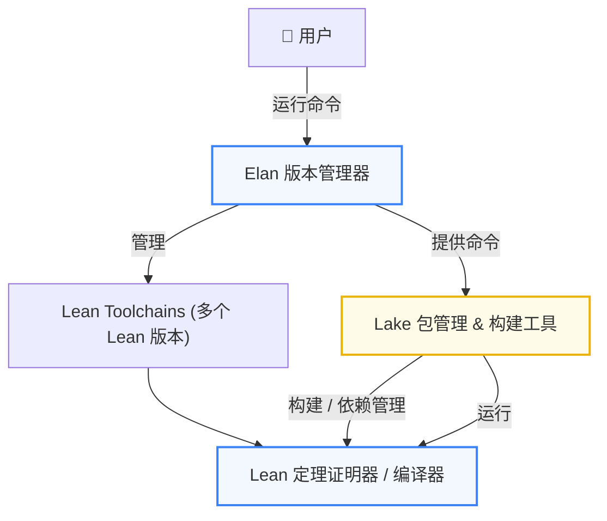

+++
title = "Lean 4 工程化入门：Elan 工具链配置与 Lake 包管理实战"
description = "Lean 4 工程化入门：Elan 工具链配置与 Lake 包管理实战"
date = 2026-02-02T13:47:50Z
[taxonomies]
categories = ["ZKP", "Lean 4"]
tags = ["ZKP", "Lean 4"]
+++

<!-- more -->

# **Lean 4 工程化入门：Elan 工具链配置与 Lake 包管理实战**

Lean 4 不仅仅是数学家的证明助手，更是一门兼顾严谨逻辑与高性能的现代编程语言。要真正驾驭 Lean 4，理解其背后的工程化逻辑比记忆语法更重要。本文将越过理论，直击底层，详解如何通过 Elan 管理版本工具链，并利用 Lake 构建系统实现从“初始化”到“生成可执行文件”的全流程，带你快速构建起稳固的 Lean 4 本地开发环境。

Lean 是微软研究院推出的定理证明器和依赖类型函数式编程语言；Lean 4 是其最新一代实现，兼顾形式化证明与高性能程序开发。

💡 **Lean = 可以写程序的证明系统，也是可以写证明的编程语言**

本文深度解析 Lean 4 生产环境的搭建与包管理逻辑。重点介绍版本管理工具 Elan 的安装与环境验证，对比阐述 Lake 包管理器与 Rust Cargo 的哲学相似性，并演示如何初始化 Package 及理解构建产物 Facet。旨在帮助开发者理清工具链关系，快速开启形式化证明与高性能编程实践。

## 实操

### Lean 学习目录初始化

> 一切严肃的形式化证明之旅，都是从一个 `mkdir Lean` 开始的。

```bash
pwd
/Users/qiaopengjun/Code
mkdir Lean

cd Lean
```

### 安装环境

使用 Lean 有两种方式：
 一种是通过在线工具或云端环境快速体验，无需本地安装；另一种是在本地安装 Lean，获得完整、流畅的交互式证明体验。
 对于希望系统学习 Lean、进行实操并记录过程的开发者来说，本地安装是更推荐的选择。

[elan](https://github.com/leanprover/elan)：Lean 的版本管理工具。Elan 是 Lean 官方提供的版本管理工具，类似 Rust 的 rustup，用来管理 Lean 及其工具链。

#### 安装 `Elan`

```bash
curl https://elan.lean-lang.org/elan-init.sh -sSf | sh
```

#### 实操安装

```bash
curl https://elan.lean-lang.org/elan-init.sh -sSf | sh
info: downloading installer

Welcome to Lean!

This will download and install Elan, a tool for managing different Lean
versions used in packages you create or download. It will also install a
default version of Lean and its package manager, lake, for editing files not
belonging to any package.

It will add the lake, lean, and elan commands to Elan's bin directory, located
at:

  /Users/qiaopengjun/.elan/bin

This path will then be added to your PATH environment variable by modifying the
profile files located at:

  /Users/qiaopengjun/.profile
  /Users/qiaopengjun/.zprofile
  /Users/qiaopengjun/.bash_profile

You can uninstall at any time with elan self uninstall and these changes will
be reverted.

Current installation options:

     default toolchain: stable
  modify PATH variable: yes

1) Proceed with installation (default)
2) Customize installation
3) Cancel installation

info: default toolchain set to 'stable'

Elan is installed now. Great!

To get started you need Elan's bin directory ($HOME/.elan/bin) in your PATH
environment variable. Next time you log in this will be done automatically.

To configure your current shell run source $HOME/.elan/env
```

完美 👍，**已经安装成功了**，而且信息非常干净，没有任何异常。

------

#### ✅ 当前状态总结（很重要）

你现在已经 **成功完成了 3 件事**：

1. **Elan 已安装**

   ```bash
   Elan is installed now. Great!
   ```

2. **Lean 4 的默认工具链已设置为 stable**

   ```bash
   info: default toolchain set to 'stable'
   ```

3. **Lean / lake / elan 已放到**

   ```bash
   /Users/qiaopengjun/.elan/bin
   ```

因为你是**当前 shell**，PATH 还没刷新。

##### 👉 直接复制执行这一行

```bash
source $HOME/.elan/env
```

这一步 **不用重开终端**，立刻生效。

------

#### 🔍 验证是否真的装好了（必须做）

依次执行：

```bash
elan --version
lean --version
lake --version
```

你应该能看到类似：

```bash
elan --version
lean --version
lake --version
elan 4.1.2 (58e8d545e 2025-05-26)
info: downloading https://releases.lean-lang.org/lean4/v4.27.0/lean-4.27.0-darwin_aarch64.tar.zst
Total: 469.1 MiB Speed:  20.2 MiB/s
info: installing /Users/qiaopengjun/.elan/toolchains/leanprover--lean4---v4.27.0
Lean (version 4.27.0, arm64-apple-darwin24.6.0, commit db93fe1608548721853390a10cd40580fe7d22ae, Release)
Lake version 5.0.0-src+db93fe1 (Lean version 4.27.0)

# 再次运行
elan --version
lean --version
lake --version
elan 4.1.2 (58e8d545e 2025-05-26)
Lean (version 4.27.0, arm64-apple-darwin24.6.0, commit db93fe1608548721853390a10cd40580fe7d22ae, Release)
Lake version 5.0.0-src+db93fe1 (Lean version 4.27.0)
```

只要 **三个都有输出**，说明你已经：

> 🎉 正式进入 Lean 4 世界

------

### ✅ 当前环境确认（一次性总结）

你现在拥有的是：

- **elan** `4.1.2`（最新版）
- **Lean 4** `v4.27.0`（当前主线稳定版）
- **Lake** `5.0.0`（Lean 官方构建工具）
- **Apple Silicon 原生 arm64**（性能最好）

👉 结论一句话：

> **你已经拥有了“写正式数学 + 写可执行程序”的完整 Lean 4 工程环境**

### 检查与确认 Lean 4 工具链状态（Elan）

```bash
elan --version
elan 4.1.2 (58e8d545e 2025-05-26)
elan self update

elan show
leanprover/lean4:v4.27.0 (resolved from default 'stable')
Lean (version 4.27.0, arm64-apple-darwin24.6.0, commit db93fe1608548721853390a10cd40580fe7d22ae, Release)
```

通过 `elan --version` 可以确认当前安装的 Elan 版本；`elan self update` 用于将 Elan 自身更新到最新版本；而 `elan show` 则用于查看当前正在使用的 Lean 工具链配置。从输出可以看到，我当前使用的是 Elan 4.1.2，并且默认工具链指向官方 `stable` 通道，对应的 Lean 版本为 **Lean 4.27.0（Release）**，运行在 **Apple Silicon（arm64）macOS** 平台上。这说明本地 Lean 4 环境已正确安装，并处于官方推荐的稳定状态，可以直接用于后续的项目开发与学习。

### Elan 目录结构说明（~/.elan）

```bash
tree ~/.elan -L 2
/Users/qiaopengjun/.elan
├── bin
│   ├── elan
│   ├── lake
│   ├── lean
│   ├── leanc
│   ├── leanchecker
│   ├── leanmake
│   └── leanpkg
├── env
├── settings.toml
├── tmp
└── toolchains
    └── leanprover--lean4---v4.27.0

5 directories, 9 files
```

- `~/.elan` 是 Elan 在本地的管理目录，用于统一管理 Lean 4 的工具链、配置以及相关可执行文件。

- `toolchains/` 目录存放通过 Elan 下载的各个 Lean 版本（例如当前使用的 `leanprover--lean4---v4.27.0`）。

- `bin/` 目录包含常用的命令行工具，如 `lean`、`lake`、`elan` 等，这个目录会被加入到 `PATH` 中以便全局使用。
- `settings.toml` 是 Elan 的核心配置文件，记录默认工具链等配置信息。
- `env` 用于设置当前 shell 的环境变量。

- `tmp/` 则用于临时文件。

## 📌 Elan / Lean / Lake 关系示意图（Mermaid）

Elan / Lean / Lake Relationship Diagram




**Elan 负责管理 Lean 的版本，Lake 负责管理 Lean 项目的构建与依赖，而 Lean 本身才是真正执行证明和程序的核心。**

> 可以类比为：
> **Elan ≈ rustup / nvm**
> **Lake ≈ cargo / npm**
> **Lean ≈ rustc / node**

## 🚀 创建并构建一个包

[lake](https://github.com/leanprover/lake) 全称 Lean Make，是 Lean 4 的包管理器，用于创建 Lean 项目，构建 Lean 包和编译 Lean 可执行文件。

Lake 里说“创建包（package）”是准确的；说“创建项目（project）只是口语化、不严谨的说法。

在 **Lake 的官方语义中，根本就没有“project”这个一等概念**。

### Lake 的世界观里，核心只有一个东西：**Package（包）**

在 Lake 看来：

- 一个 **Lean 工程 = 一个 Lake package**
- 所有的构建、依赖、编译、发布，**都是围绕 package 进行的**

当你运行：

```bash
lake init hello
```

或

```bash
lake new hello
```

你做的事情是：

> **创建一个 Lake package**

而不是：

> 创建一个 IDE 意义上的“项目”

**Lake 明确选择了 `package` 这个词**，避免歧义。

### 和 Rust 对比（你应该秒懂）

| Rust       | Lean            |
| ---------- | --------------- |
| crate      | package         |
| Cargo.toml | lakefile.lean   |
| cargo new  | lake new        |
| workspace  | 多 package 仓库 |

Rust 也**不强调 project**，而是：

> everything is a crate

Lean / Lake 的哲学是：

> **everything is a package**

在 Lake 中，**构建和依赖管理的基本单位是包（package）**。
 使用 `lake init` 或 `lake new` 可以创建一个新的包。

> Lake 并没有“项目（project）”这一概念，所有构建与依赖管理都以包（package）为核心，因此官方文档统一使用“创建包”而不是“创建项目”。

要创建一个新的 Lake 包，可以使用 `lake init` 在当前目录中初始化包，
 也可以使用 `lake new` 在新建的目录中创建并初始化一个包。

### 创建一个新的 Lake 包 `hello`

```bash
lake new hello

ls
hello
cd hello/

```

### 项目目录结构说明

```bash
ls
Hello          Hello.lean     Main.lean      README.md      lakefile.toml  lean-toolchain

tree -a -L 2
.
├── .git
│   ├── HEAD
│   ├── config
│   ├── description
│   ├── hooks
│   ├── info
│   ├── objects
│   └── refs
├── .github
│   └── workflows
├── .gitignore
├── Hello # 库的源文件目录; 通过 `import Hello.*` 导入
│   └── Basic.lean # 一个示例库模块文件
├── Hello.lean # 库的根文件; 从 Hello 导入标准模块
├── Main.lean # 可执行文件的主文件 (含 `def main`)
├── README.md
├── lakefile.toml # Lake 的包配置文件
└── lean-toolchain # 包所使用的 Lean 版本

9 directories, 10 files
```

其中 `lakefile.toml` 是当前项目的配置文件，`lean-toolchain` 是当前项目使用的 Lean 版本。

### 示例源码说明

#### `Hello/Basic.lean` 文件

```haskell
def hello := "world"
```

#### `Hello.lean` 文件

```haskell
-- This module serves as the root of the `Hello` library.
-- Import modules here that should be built as part of the library.
import Hello.Basic
```

#### `Main.lean` 文件

```haskell
import Hello

def main : IO Unit :=
  IO.println s!"Hello, {hello}!"
```

#### `lakefile.toml` 文件

```toml
name = "hello"
version = "0.1.0"
defaultTargets = ["hello"]

[[lean_lib]]
name = "Hello"

[[lean_exe]]
name = "hello"
root = "Main"
```

#### `lean-toolchain` 文件

```haskell
leanprover/lean4:v4.27.0
```

### 构建

`lake build` 不仅编译 Lean 代码，还会解析依赖、生成中间产物并构建可执行文件，因此更准确地称为“构建”。

```bash
hello on  master [?]
➜ lake build
Build completed successfully (8 jobs).
```

### 运行

运行生成的可执行文件

```bash
hello on  master [?] took 5.8s
➜ .lake/build/bin/hello
Hello, world!
```

### Facet 知识扩展

- Facet 是 Lake 中用于描述“同一个包 / 库 / 模块的不同构建产物”的概念。
  比如一个 Lean 模块在构建时，会生成 `.olean`、`.ilean`、`.o` 等多个产物，每一个产物就是该模块的一个 facet。
- **facet 让 Lake 能精确到「产物级别」管理依赖**
- 复杂类型（如包、库、模块）具有多个 facet，每个 facet 都算作独立的可构建目标

#### 用一个极度直观的比喻（你肯定秒懂）

> **对象 = 原材料
> facet = 成品形态**

- 木头 → 桌子 / 椅子 / 木板
- Lean 模块 → olean / ilean / o / so

#### 一句话说明

> Facet 是 Lake 中对“构建产物”的抽象：
> 同一个包 / 库 / 模块，可以有多个 facet，每个 facet 对应一种具体的构建输出。

### 工程经验谈

> **真正做过工程的人，不会轻易说“这很容易”。**

## 总结

掌握了 Elan 和 Lake，就等于拿到了进入 Lean 4 世界的通行证。正如文中所言，Lean 的力量不仅在于证明，更在于其严谨的工程化体系。通过理顺“版本管理、包构建、产物定义”这一套逻辑，你已经为后续复杂的数学形式化或程序开发打下了最坚实的基础。

## 参考

- <https://live.lean-lang.org/>
- <https://www.leanprover.cn/references/lake-doc/>
- <https://github.com/leanprover/elan/releases>
- <https://github.com/leanprover/elan>
- <https://www.leanprover.cn/GlimpseOfLean/>
- <https://github.com/onriv/lean4ij>
- <https://leanprover-community.github.io/get_started.html>
- <https://lean-lang.org/install/>
- <https://marketplace.visualstudio.com/items?itemName=leanprover.lean4>
- <https://github.com/leanprover/lean4/releases>
- <https://github.com/leanprover/lake>
